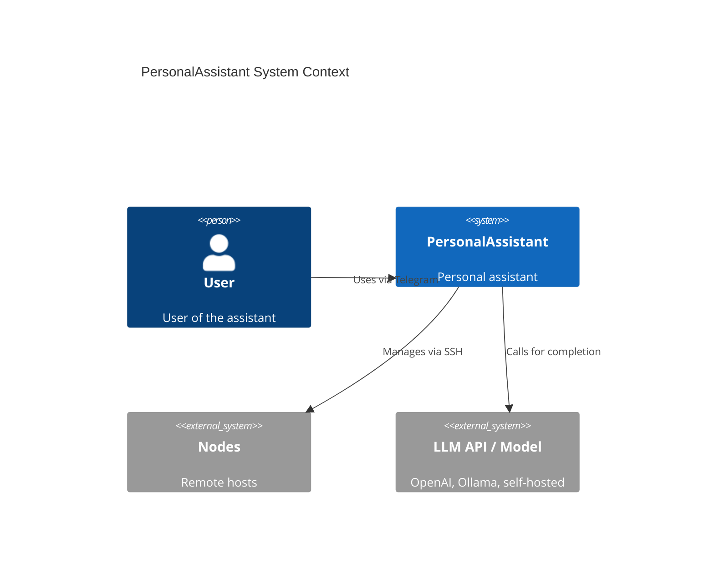
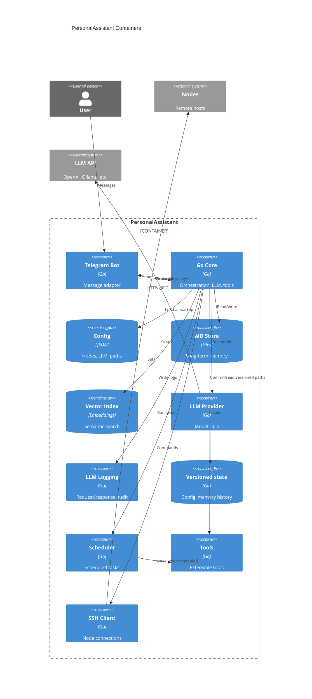

# PersonalAssistant MVP — Requirements (EARS / INCOSE)

**Document:** Requirements specification  
**Project:** PersonalAssistant  
**Version:** 1.0  
**Language:** English

This document contains the product requirements for the PersonalAssistant MVP in EARS (Easy Approach to Requirements Syntax) form, aligned with INCOSE semantic quality rules (active voice, one thought per requirement, explicit and measurable criteria, defined terminology, no solution-free where applicable).

**Related:** [Technical research (EP-104)](docs/EP-104/research.md) — technology choices, MVI, iteration plan, risks. [System design (EP-104)](docs/EP-104/system-design.md) — architecture, components, data models, error handling, testing.

---

## Introduction

PersonalAssistant is a minimal MVP of a personal assistant, inspired by systems like [OpenClaw](https://github.com/openclaw/openclaw), with a focus on **reliability and security**. The target platform is Synology DS220+ (Docker). The user interacts via a Telegram bot; a Go core running in a container manages nodes over SSH under a validated security model, stores long-term memory as markdown files, indexes it for vector search, supports swappable LLM backends (including self-hosted), includes a task scheduler, and offers extensible tools. Deployment and adding new nodes or tools are kept simple, and the architecture is designed to evolve without radical redesign.

**MVP scope in brief:**

- Telegram bot for conversation.
- Go core in Docker (target hardware: Synology DS220+).
- SSH interaction with nodes under a clear, validated security model.
- Long-term memory in markdown files.
- Vector indexing for semantic retrieval.
- No vendor lock-in: support for multiple LLMs, including self-hosted.
- Scheduler for time- or interval-based tasks.
- Extensible tools with a single contract.
- Simple deployment and addition of nodes and tools.
- Architecture that allows future evolution without fundamental change.
- Dedicated user account on each node for PersonalAssistant only.
- Logging subsystem for LLM requests and responses (for analysis and audit).
- Version control via an internal git repository for configuration, memory files, and other designated artifacts (exact scope TBD by research).

---

## Glossary

Terms used in the requirements.

| Term | Definition |
|------|------------|
| **PersonalAssistant (System)** | The set of components: core (Go), Telegram adapter, memory store, vector index, scheduler, LLM providers, and tools. Deployed in Docker, target platform Synology DS220+. |
| **Core** | The main Go service: orchestration of conversations, LLM calls, tool execution, access to memory and scheduler, and SSH-based node management. |
| **Node** | A remote host (e.g. NAS, server) that the core connects to over SSH to run actions; has a defined capability set and credentials in configuration. |
| **Security model** | Explicit definition of which nodes are allowed, which commands/tools are permitted on each node, and how inputs and outputs are validated; validated at load and on configuration change. |
| **Long-term memory** | The assistant’s memory: a single store of facts and context held as markdown files in a defined directory structure; read/write by the core and indexer. It is not subdivided by interlocutor; the assistant has access to the full store regardless of who it is currently conversing with. |
| **Vector store** | Index of embeddings from long-term memory (and optionally conversations) for semantic search; provider (e.g. in-memory, file, DB) is pluggable. |
| **LLM provider** | Abstraction for calling a language model (OpenAI-compatible API, Ollama, self-hosted); configuration specifies endpoint and parameters without vendor lock-in in code. |
| **Tool** | Extensible module: name, description, validated input schema, and implementation; registered with the core and invoked via a single contract. |
| **Scheduler** | Component that runs tasks on a schedule (cron-like or intervals); tasks are defined in configuration or API and run in the core context (tools, memory, optional Telegram notification). |
| **User** | A person interacting with PersonalAssistant via the Telegram bot; identified by Telegram user ID. |
| **Deployment** | The process of running the stack (core and any separate services) via Docker Compose on DS220+; adding a new node or tool does not require rebuilding the core image when designed via config/plugins. |
| **Dedicated PA user** | A dedicated user account on each node used only for PersonalAssistant access. All SSH connections to that node use this identity; no other user identity is used for that node. |
| **Logging subsystem** | Component that records LLM interaction events: requests (input messages, call parameters, request ID) and responses (model output, token counts, metadata, duration) for analysis, debugging, and audit. |
| **Versioned state** | Configuration, memory files, and other designated artifacts under version control in a git repository within the deployment or data directory; exact set of tracked paths is defined following research. |

---

## C4 Diagrams

Rendered diagrams (when PNGs are present in `docs/`):

### C1 — System Context

### C2 — Containers

---

## EARS patterns used

- **Ubiquitous:** THE \<system\> SHALL \<response\>
- **Event-driven:** WHEN \<trigger\>, THE \<system\> SHALL \<response\>
- **State-driven:** WHILE \<condition\>, THE \<system\> SHALL \<response\>
- **Optional feature:** WHERE \<option\>, THE \<system\> SHALL \<response\>
- **Complex:** [WHERE] [WHILE] [WHEN/IF] THE \<system\> SHALL \<response\>

In the following, *System* = PersonalAssistant (or the relevant component as stated).

---

## Requirements

### Interface and deployment

**REQ-001** (Ubiquitous)  
THE PersonalAssistant SHALL provide a Telegram bot interface through which the user sends text messages and receives text replies from the assistant.

**REQ-002** (Ubiquitous)  
THE PersonalAssistant core SHALL be implemented in Go and SHALL be deployable as a Docker container targeting Synology DS220+ (x86_64).

---

### Nodes and SSH

**REQ-003** (Event-driven)  
WHEN the operator adds or updates node configuration (host, SSH user, authentication method), THE PersonalAssistant SHALL validate the configuration at startup and SHALL refuse to start or SHALL report a clear error if the configuration is invalid or incomplete.

**REQ-004** (State-driven)  
WHILE the PersonalAssistant is running, THE PersonalAssistant SHALL communicate with nodes only over SSH using credentials and hosts defined in the validated node configuration.

**REQ-005** (Ubiquitous)  
THE PersonalAssistant SHALL enforce a documented security model that defines, per node, which commands or tools are allowed; execution on a node SHALL be limited to that allow list.

**REQ-013** (State-driven)  
WHILE the PersonalAssistant connects to a node over SSH, THE PersonalAssistant SHALL use exactly one dedicated user identity per node defined in the node configuration; THE PersonalAssistant SHALL NOT use any other user identity or shared account for that node.

---

### Memory and indexing

**REQ-006** (Event-driven)  
WHEN the assistant reads or writes long-term memory, THE PersonalAssistant SHALL use a designated directory and SHALL store and read content as markdown files in a defined structure (e.g. by topic or date).

**REQ-018** (Ubiquitous)  
THE PersonalAssistant long-term memory SHALL be the assistant’s single memory store. THE PersonalAssistant SHALL NOT subdivide memory into non-overlapping blocks per interlocutor. THE PersonalAssistant SHALL give the assistant access to the full memory store regardless of which user or channel the assistant is currently conversing with.

**REQ-007** (Ubiquitous)  
THE PersonalAssistant SHALL maintain a vector index of content from the long-term memory store and SHALL support semantic search over that index to retrieve relevant context for user queries.

---

### LLM and logging

**REQ-008** (Ubiquitous)  
THE PersonalAssistant SHALL support pluggable LLM providers (e.g. OpenAI-compatible API, Ollama, self-hosted); the active provider and its parameters SHALL be selected via configuration without code changes.

**REQ-014** (Ubiquitous)  
THE PersonalAssistant SHALL provide a logging subsystem that records, for each call to an LLM provider: the request (input messages, model parameters, and a request identifier) and the response (model output, token counts when available, and response metadata such as duration and model identifier).

**REQ-015** (Event-driven)  
WHEN the operator configures the logging subsystem, THE PersonalAssistant SHALL accept a configurable log destination (e.g. file path or directory) and SHALL write LLM request/response log entries to that destination in a defined, parseable format so that the operator can analyze and retain logs according to local policy.

---

### Scheduler and tools

**REQ-009** (Event-driven)  
WHEN the scheduled time or interval for a configured task is reached, THE PersonalAssistant scheduler SHALL execute the task (invoking the defined action, e.g. tool or notification) within the constraints of the security model.

**REQ-010** (Ubiquitous)  
THE PersonalAssistant SHALL support extensible tools: each tool SHALL have a name, a description, and a validated input schema; tools SHALL be registered with the core and invoked by the core according to a single contract.

---

### Extensibility and architecture

**REQ-011** (Event-driven)  
WHEN the operator adds a new node or a new tool via the designated configuration or extension mechanism, THE PersonalAssistant SHALL load and use the new node or tool after restart or hot-reload without requiring a rebuild of the core image (where hot-reload is supported).

**REQ-012** (Ubiquitous)  
THE PersonalAssistant architecture SHALL separate clearly: ingestion adapters (e.g. Telegram), core orchestration, memory store, vector index, LLM provider abstraction, scheduler, and tools; so that replacing or extending one of these parts does not require a full redesign.

---

### Version control and audit

**REQ-016** (Ubiquitous)  
THE PersonalAssistant SHALL use a git repository (within the deployment or data directory) to track version history of configuration, memory files, and other designated artifacts; the exact scope of tracked paths (e.g. config, memory directory, other state) SHALL be defined and documented following further research.

---

### Secret protection (prompt injection / exfiltration)

**REQ-017** (Ubiquitous)  
THE PersonalAssistant SHALL NOT include secret values (tokens, API keys, SSH private keys, or other credentials) in the data sent to the LLM as context (system prompt, message history, or retrieved memory), in user-facing responses in a way that could expose them, or in log output. The implementation SHALL be verified by tests that inject known fake secrets and prompt-injection style user messages and assert that the assistant’s reply and log output do not contain those secrets.

---

## Requirement index

| Id       | Summary |
|----------|--------|
| REQ-001  | Telegram bot interface for messages and replies |
| REQ-002  | Go core, Docker, target DS220+ |
| REQ-003  | Validate node config at startup; fail or report error if invalid |
| REQ-004  | Communicate with nodes only over SSH per validated config |
| REQ-005  | Security model: per-node allow list for commands/tools |
| REQ-006  | Long-term memory in designated directory as markdown files |
| REQ-007  | Vector index and semantic search over memory |
| REQ-008  | Pluggable LLM providers via configuration |
| REQ-009  | Scheduler runs tasks at scheduled time/interval within security model |
| REQ-010  | Extensible tools: name, description, validated schema, single contract |
| REQ-011  | New nodes/tools loadable via config without core image rebuild |
| REQ-012  | Clear separation: adapters, core, memory, vector, LLM, scheduler, tools |
| REQ-013  | One dedicated SSH user per node; no other identity for that node |
| REQ-014  | Logging subsystem records LLM requests and responses |
| REQ-015  | Configurable log destination and parseable log format |
| REQ-016  | Git repository for version history of config, memory, and designated artifacts (scope TBD) |
| REQ-017  | No secrets in LLM context, user-facing response, or logs; verified by prompt-injection tests |
| REQ-018  | Memory is assistant’s single store; not partitioned by interlocutor; full access regardless of current conversation partner |

---

## Requirement–User Story traceability

| REQ       | User Story (Spexus) | Summary |
|-----------|---------------------|--------|
| REQ-001   | US-402              | Telegram bot interface |
| REQ-002   | US-403              | Docker deploy DS220+ |
| REQ-003   | US-404              | Node config validation |
| REQ-004   | US-404              | SSH per validated config |
| REQ-005   | US-405              | Per-node security model (allowlist) |
| REQ-006   | US-407              | Long-term memory in markdown files |
| REQ-007   | US-408              | Vector index and semantic search |
| REQ-008   | US-409              | Pluggable LLM provider |
| REQ-009   | US-412              | Scheduled tasks |
| REQ-010   | US-413              | Extensible tools contract |
| REQ-011   | US-414              | Add nodes/tools without image rebuild |
| REQ-012   | US-415              | Clear architecture boundaries |
| REQ-013   | US-406              | Dedicated PA user per node |
| REQ-014   | US-410              | LLM request/response logging |
| REQ-015   | US-411              | Configurable log destination and format |
| REQ-016   | US-416              | Git-backed version control for config and memory |
| REQ-017   | US-417 (Spexus)     | Secret leakage protection; tests for prompt-injection exfiltration (Spexus: REQ-658, AC-1301–AC-1303) |
| REQ-018   | US-407              | Memory is assistant’s single store; not partitioned by interlocutor |

| User Story | Requirements |
|------------|--------------|
| US-402     | REQ-001      |
| US-403     | REQ-002      |
| US-404     | REQ-003, REQ-004 |
| US-405     | REQ-005      |
| US-406     | REQ-013      |
| US-407     | REQ-006, REQ-018 |
| US-408     | REQ-007      |
| US-409     | REQ-008      |
| US-410     | REQ-014      |
| US-411     | REQ-015      |
| US-412     | REQ-009      |
| US-413     | REQ-010      |
| US-414     | REQ-011      |
| US-415     | REQ-012      |
| US-416     | REQ-016      |
| US-417     | REQ-017      |
