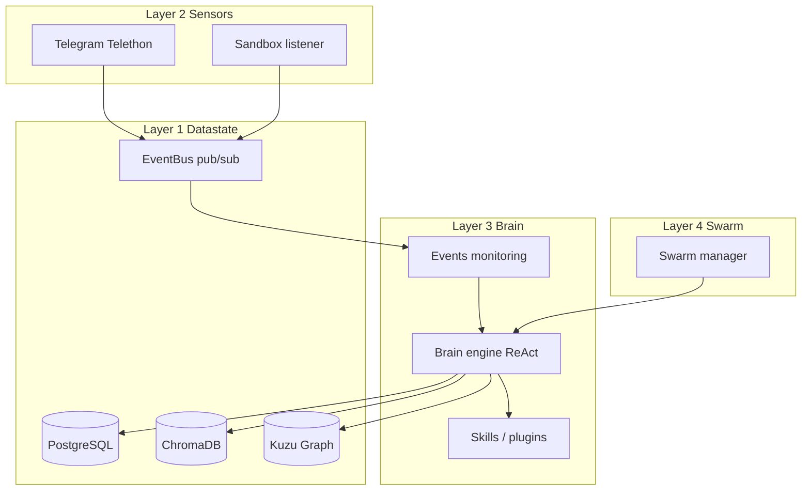
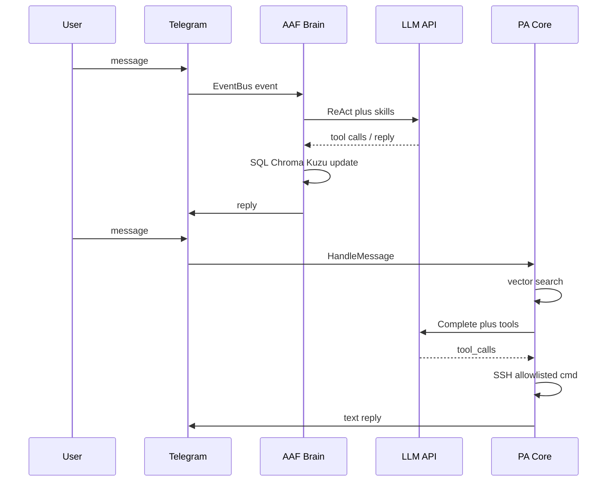

# AAF (Autonomous Agent Framework): Analysis and Comparison with PersonalAssistant

**Date of analysis:** 2026-03-18  
**AAF repository:** [github.com/th0r3nt/AAF-Autonomous-Agent-Framework-](https://github.com/th0r3nt/AAF-Autonomous-Agent-Framework-)  
**AAF revision analysed:** [main @ 138226ae](https://github.com/th0r3nt/AAF-Autonomous-Agent-Framework-/commit/138226ae8a8769f87b0d1b200716819d97a213f7) (commit `138226ae8a8769f87b0d1b200716819d97a213f7`)  
**PersonalAssistant revision analysed:** commit `aea7f6f06807d77f4c03ca4b4e81eb8cca51706a`

**Purpose:** Analyse AAF (architecture, security, reliability, engineering practices) and compare with PersonalAssistant design (EP-001) and implementation in this workspace.  
**Note:** Epic folder EP-104 is not present in this repo; baseline is **EP-001**.  
**PA design reference:** [ep-scope.md](../../epics/EP-001/ep-scope.md), [ep-requirements.md](../../epics/EP-001/ep-requirements.md), [ep-system-design.md](../../epics/EP-001/ep-system-design.md).

---

## Table of contents

1. [High-level architecture](#1-high-level-architecture)
2. [Package layout and module boundaries](#2-package-layout-and-module-boundaries)
3. [Message processing / main flow](#3-message-processing--main-flow)
4. [Security](#4-security)
5. [Reliability and error handling](#5-reliability-and-error-handling)
6. [Component comparison table](#6-component-comparison-table)
7. [Flow comparison (Mermaid)](#7-flow-comparison-mermaid)
8. [Security analysis](#8-security-analysis)
9. [Summary](#9-summary)
10. [Engineering culture comparison](#10-engineering-culture-comparison)
11. [Recommendations for PA](#11-recommendations-for-pa)

---

## 1. High-level architecture

AAF is a **Python 3.11+ async stack** packaged for **Docker**: one logical agent runs as a **Gateway** that wires four layers—**data state** (PostgreSQL, ChromaDB, Kuzu graph), **sensors** (Telegram via Telethon MTProto user account, sandbox file listener), **brain** (LLM ReAct loop, skills registry, event monitoring), **swarm** (multi-agent orchestration). The CLI `aaf.py` generates per-agent folders under `Agents/<NAME>/` and Docker Compose profiles.

Entry flow (`src/main.py`): initialise workspace → setup SQL/vector/graph DBs → start Telegram + sandbox listener → start brain loops + swarm → publish `START_SYSTEM` on a global **EventBus**.

**PA (design + code):** Single-process **Go** service: Telegram **bot** adapter → **core** (`internal/core`) → vector search, LLM, tools (SSH to allowlisted commands on nodes), markdown memory. No microservices; databases are SQLite + sqlite-vec for vectors, not Postgres/Chroma/Kuzu.

---

## 2. Package layout and module boundaries

| AAF | PA (implemented) |
|-----|------------------|
| `src/layer00_utils` — config, workspace, sandbox Docker exec, logging | `internal/config`, `internal/core`, shared utils |
| `src/layer01_datastate` — EventBus, SQL/vector/graph | `internal/vector`, `internal/memory`, embedding |
| `src/layer02_sensors` — Telegram user client, sandbox | `cmd/pa` + Telegram adapter |
| `src/layer03_brain` — LLM client, key rotation, ReAct, skills | `internal/llm`, `internal/core/handler.go`, `internal/toolcatalog` |
| `src/layer04_swarm` — multi-agent | N/A in PA MVP |
| Root `aaf.py` — agent lifecycle / Compose generation | `cmd/pa` entrypoint |

AAF enforces layering by directory naming; PA uses flat `internal/*` packages with explicit interfaces (`core.Adapter`, `NodeRunner`).

---

## 3. Message processing / main flow

**AAF:** Sensors (e.g. Telegram) publish events on **EventBus**; brain **events_monitoring** and **brain_engine** run async loops. **ReAct** (`react.py`) drives LLM calls with **configurable `MAX_REACT_STEPS`** (from config), skill registry (tools), JSON repair heuristics for malformed model output. Dialogue and actions persist to SQL.

**PA:** Adapter receives Telegram update → `conversationHandler.HandleMessage`: trim/validate → **vector context** → build messages → optional **tool pre-selection** via embedding index → `Complete` → **tool result loop** (max 10 rounds, `maxToolRounds` in `handler.go`) → index turn, LLM JSONL log with redaction.

---

## 4. Security

| Topic | AAF | PA |
|-------|-----|-----|
| **Telegram model** | **User account** (MTProto); broader blast radius if session compromised | **Bot** + allowlisted user IDs |
| **Arbitrary code** | **Sandbox:** agent-written scripts run in **disposable Docker** (`python:3.11-slim`), memory/CPU/pids limits; only paths under `sandbox/` | No LLM-generated local/Python exec; **SSH** only with **per-node allowlists** |
| **Plugins** | Human-written `@llm_skill` — **full core access** (documented trade-off) | Declarative tool templates + validation |
| **Sandbox network** | Sandbox containers use **`--network=host`** in `executor.py` — scripts see host network namespace | SSH is explicit; no DinD |
| **Secrets** | `.env` per agent (keys, Telegram API) | File-based secrets + paths in config; redaction in logs (REQ-01.026) |

---

## 5. Reliability and error handling

**AAF:** EventBus handlers use `asyncio.gather(..., return_exceptions=True)` and log handler errors so one failure does not crash the bus. ReAct has step limits and JSON “rescue” for brittle LLM output. CI runs **create agent** + **Compose file check** + **`docker compose build`** (smoke/build), not unit tests on brain logic.

**PA:** Config validation at startup; bounded tool rounds; integration tests (Docker SSH). `make check` (fmt, vet, lint, test). No `.github/workflows` in workspace snapshot at time of analysis.

---

## 6. Component comparison table

| Aspect | AAF | PA (EP-001 + code) |
|--------|-----|---------------------|
| Language / runtime | Python async | Go |
| Deployment unit | Multi-container Compose per agent | Single container / binary |
| Memory | SQL + Chroma + GraphRAG (Kuzu) | Markdown calendar + sqlite-vec |
| Telegram | User (Telethon) | Bot API |
| Code execution | DinD sandbox + plugins | Allowlisted SSH commands |
| Multi-agent | Swarm layer | Single assistant |
| API keys | Round-robin; retry on HTTP 429 | Single provider entry per call path (config) |
| Proactivity | Brain loops + swarm | Scheduler / summarization (cron) |

---

## 7. Flow comparison (Mermaid)

See section 3.

---

## 8. Security analysis

**Assets:** AAF: DB contents, Telegram account, host Docker (for DinD), LLM keys. PA: node access, user messages, memory files, API keys.

**Trust boundaries:** AAF expands trust to **host Docker** and **Telegram user session**; sandbox mitigates script execution but **`--network=host`** weakens isolation for malicious sandbox code. PA shrinks remote execution to **explicit allowlists** per node.

**Fit:** PA’s threat model (bot, SSH allowlist, redacted LLM logs) is **smaller surface** than AAF’s user-bot + DinD + plugins; AAF targets **maximum capability and isolation for untrusted generated code**, not minimal NAS footprint.

---

## 9. Summary

- **Architecture:** AAF = event-driven, multi-DB, multi-layer Python in Docker; PA = monolithic Go pipeline adapter → core → LLM/tools.
- **Security:** AAF prioritises **isolated execution** for agent-written code; PA prioritises **no arbitrary exec** and **SSH policy**. AAF plugins and Telegram-user model are higher-risk for a “personal NAS assistant” unless tightly controlled.
- **Reliability:** Both cap agent loops; PA has richer automated tests on core paths; AAF CI is **smoke/build** oriented.
- **Fit for PA:** AAF is a **different product class** (heavy platform, user Telegram, graph memory); optional ideas (API key rotation on rate limit, DinD for future untrusted code) do not require adopting the full stack.

---

## 10. Engineering culture comparison

| Dimension | AAF | PA |
|-----------|-----|-----|
| Docs | Extensive RU docs in `docs/` | Epic artefacts + README |
| CI | Create agent + Compose + image build | Local `make check` |
| Tests | No pytest in CI path observed | Unit + integration (SSH Docker) |
| Code comments / logs | Russian in parts of upstream | English per project rules |

---

## 11. Recommendations for PA

1. **API resilience:** If PA supports **multiple LLM API keys**, consider **key rotation / fallback on HTTP 429** (see glossary below). Keep secrets in files; do not log keys.
2. **Loop safety:** PA already caps tool rounds; documenting parity with configurable max agent steps (like AAF `max_react_steps`) helps operators.
3. **Optional future:** If PA ever runs **LLM-generated code**, a **container sandbox** with **isolated network** (not host network) would align better with PA’s security bar.
4. **What not to adopt without redesign:** Telegram **user** account as default; **plugins with full core access** for untrusted prompts; full **Postgres+Chroma+Kuzu** on DS220+-class targets unless requirements change.

### Glossary: key rotation and fallback on 429

- **HTTP 429:** “Too Many Requests” — the provider is **rate-limiting** (per minute/hour/day or burst). The client should **back off** or **use another quota**.
- **Key rotation (in this sense):** Maintaining **several valid API keys** (e.g. `LLM_API_KEY_1`, `LLM_API_KEY_2`) and **switching which key is used** when the current one is exhausted or returns 429. AAF describes a **round-robin key manager** that moves to the next key on 429.
- **Fallback on 429:** On 429 from key A, **retry the same request with key B** (or after delay), instead of failing the user request immediately. This improves **uptime** when limits are per-key; it does **not** remove provider-wide outages or shared-account limits.

---

*Report produced per [project-comparison-report.skill.md](../../../ai-sdlc/specification/skills/project-comparison-report.skill.md).*
