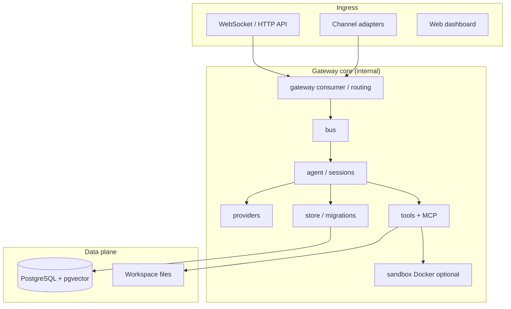
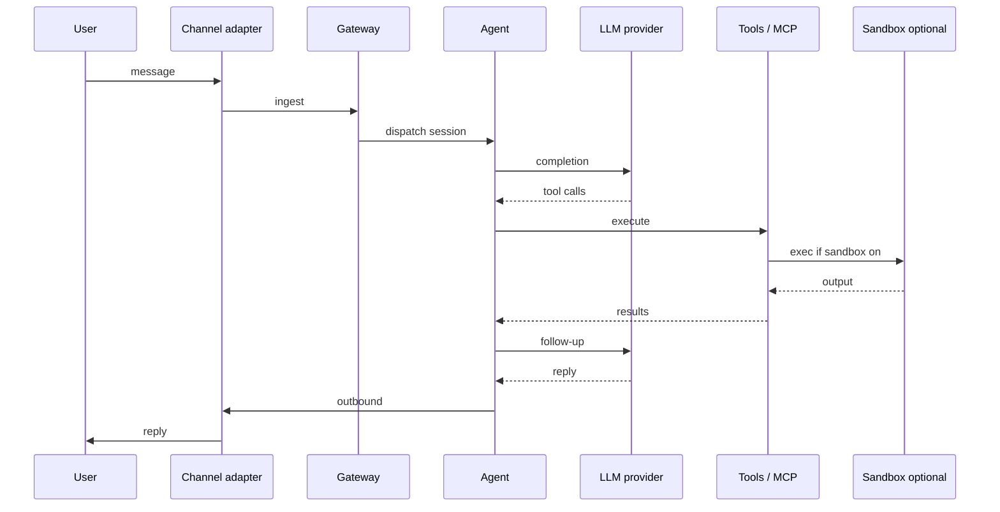
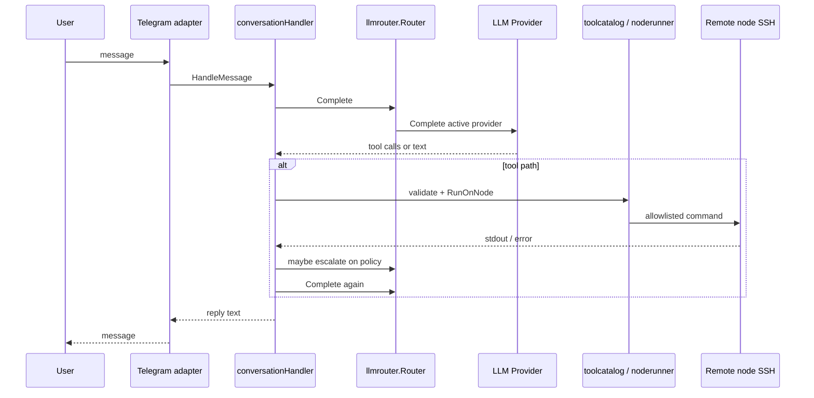

# GoClaw: Architecture Analysis and Comparison with PersonalAssistant

**Date of analysis:** 2026-03-20  
**Last updated (PA baseline):** 2026-03-20 — comparison reframed on **current PA code**, not epic EP-104 (that epic does not exist in this repository).  
**GoClaw repository:** [github.com/nextlevelbuilder/goclaw](https://github.com/nextlevelbuilder/goclaw)  
**GoClaw revision analysed:** [main @ 66a8029](https://github.com/nextlevelbuilder/goclaw/commit/66a8029d267bfd947a7b83a32348c9b6aaac9cb4) (commit `66a8029d267bfd947a7b83a32348c9b6aaac9cb4`)  
**PersonalAssistant revision analysed:** commit `5fa2de4a92d816a51530f3bde76efa89b4c99b77` (short `5fa2de4`)

**Purpose:** Analyse GoClaw from its repository and docs, and compare with **PA as implemented in this workspace** (source of truth: entrypoint, packages, config, tests, operator docs).

**PA baseline (implementation-first):**

| Source | Role in this report |
|--------|---------------------|
| [README.md](../../../README.md) | Product scope, env vars, Docker, `make check`. |
| [cmd/pa/main.go](../../../cmd/pa/main.go) | Wiring: config load, Telegram adapter, `core.Run`, LLM provider slice + labels, scheduler, tool index, **`noderunner.New` + `SetLogRedactor(core.BuildLogRedactor(cfg))`** for SSH runners. |
| [internal/core/run.go](../../../internal/core/run.go) | `Run`: builds `llmrouter.Router` with escalation config from `cfg.ToolsLLMEscalation()`, constructs `conversationHandler`. **`BuildLogRedactor`** for log redaction. |
| [internal/core/handler.go](../../../internal/core/handler.go) | Message flow, tool rounds, **`appendToolRound`** (redacted INFO logs), escalation via **`maybeEscalate`** + router. |
| [internal/llmrouter/](../../../internal/llmrouter/) | Transport fallback + **`OnQualifyingFailure`** policy escalation. |
| [internal/config/](../../../internal/config/) | JSON config, **`validate` / `validateLLMEscalation`**, path resolution (`PA_*`). |
| [internal/noderunner/](../../../internal/noderunner/) | SSH exec, allowlist outcomes, truncated streams, optional log redactor (errors to LLM unredacted by design). |
| [Makefile](../../../Makefile) | **`make check`**: fmt, vet, golangci-lint, integration tests, coverage, module boundaries. |

**Optional traceability (not the comparison baseline):** epic artefacts such as [EP-001](../../epics/EP-001/ep-scope.md) and [EP-006](../../epics/EP-006/ep-scope.md) document historical intent; any drift is resolved in favour of **code + README**.

**Note on naming:** “GoClaw” is an established product name for the external project; PA uses module path `pa` and binary `pa`.

---

## Table of contents

1. [GoClaw: High-Level Architecture](#1-goclaw-high-level-architecture)
2. [Package Layout and Module Boundaries](#2-package-layout-and-module-boundaries)
3. [Message Processing / Main Flow](#3-message-processing--main-flow)
4. [Security](#4-security)
5. [Reliability and Error Handling](#5-reliability-and-error-handling)
6. [Component Comparison Table](#6-component-comparison-table)
7. [Flow Comparison (Mermaid)](#7-flow-comparison-mermaid)
8. [Security Analysis](#8-security-analysis)
9. [Summary](#9-summary)
10. [Engineering Culture Comparison](#10-engineering-culture-comparison)
11. [Recommendations for PA](#11-recommendations-for-pa)

---

## 1. GoClaw: High-Level Architecture

GoClaw is a **multi-agent AI gateway** in Go: a single binary (`main.go` delegates to `github.com/nextlevelbuilder/goclaw/cmd`) that can run **gateway** mode (HTTP/WebSocket, channels, orchestration), **CLI** subcommands (`onboard`, `doctor`, etc.), and optional **UI** (`ui/`). The README positions it as an **OpenClaw port** with **multi-tenant PostgreSQL**, **20+ LLM providers**, **7 messaging channels**, **MCP**, **agent teams**, **Docker-based sandbox** for tool execution, **OpenTelemetry**, and **lane-based scheduling**.

**Simplified data flow (inbound message):** channel or API receives user input → gateway validates auth / permissions → bus or internal dispatch → agent session → LLM provider(s) → tool loop (optional **sandboxed** exec) → persistence (Postgres, encrypted keys per README) → outbound to channel.

---

## 2. Package Layout and Module Boundaries

### GoClaw

| Area | Role |
|------|------|
| `cmd/` | CLI entry (`Execute`), many subcommands. |
| `internal/agent`, `internal/gateway`, `internal/bus` | Orchestration, consumption, routing. |
| `internal/channels` | Multi-channel adapters (Telegram, Discord, …). |
| `internal/providers` | LLM providers, caching, streaming. |
| `internal/tools`, `internal/mcp` | Tool execution, MCP integration. |
| `internal/sandbox` | **Docker** isolation for exec/shell tools (`sandbox.go` documents modes: off / non-main / all). |
| `internal/store`, `migrations/` | PostgreSQL schema and persistence. |
| `internal/config`, `internal/permissions`, `internal/crypto` | Configuration, layered auth, encryption helpers. |
| `internal/skills`, `internal/knowledgegraph`, `internal/memory` | Higher-level agent capabilities. |
| `pkg/` | Limited public surface (small vs `internal/`). |

### PA (implemented)

| Area | Role |
|------|------|
| `cmd/pa/` | Single app: server, `-summarize`, `-verify-nodes`, etc. |
| `internal/core/` | Conversation handler, `Run`, LLM/tool loop, **llmrouter** (transport + policy escalation). |
| `internal/telegram/` | Primary **Telegram** adapter. |
| `internal/llm/`, `internal/llmrouter/` | Providers and unified router (replaces legacy fallback chain for conversation path). |
| `internal/noderunner/`, `internal/ssh/` | **SSH** execution on configured nodes (no in-process Docker sandbox). |
| `internal/allowlist/`, `internal/cmdsafe/` | Command allowlists and shell-metacharacter rejection. |
| `internal/toolcatalog/`, `internal/toolindex/` | YAML catalog, vector pre-selection. |
| `internal/memory/`, `internal/vector/sqlite/` | Markdown memory + **sqlite-vec** embedding store. |
| `internal/config/` | JSON config, **strict validation**, path resolution (`PA_*` env bases). |
| `internal/logredact/`, `internal/llmlog/` | Redaction and optional JSONL LLM logs. |
| `internal/escalationpolicy/`, `internal/core/toolfailure/` | Typed tool/node outcomes (`errors.As`), mapping for escalation policy ([`escalationpolicy`](../../../internal/escalationpolicy/), [`toolfailure`](../../../internal/core/toolfailure/failure.go)). |

**Module boundaries:** enforced by **`make check-boundaries`** (see [Makefile](../../../Makefile)); GoClaw does not use this repo’s boundary rules.

**Comparison:** GoClaw is **modular around a gateway, bus, and multi-tenant store**. PA is **layered around a single conversation core and one primary channel**, with **SQLite** and **file-backed secrets**, not PostgreSQL tenancy.

---

## 3. Message Processing / Main Flow

**GoClaw:** Messages enter via **channels** or **gateway HTTP/WebSocket**; **permissions** and **agent routing** select an agent/workspace; the **agent** runs an LLM iteration loop with **tools** (filesystem, web, spawn, MCP, etc.) and optional **sandbox**. Sessions and state persist in **PostgreSQL** (per README and `migrations/`).

**PA (code path):** [cmd/pa/main.go](../../../cmd/pa/main.go) `runServer` calls [core.Run](../../../internal/core/run.go) with the Telegram adapter and provider slice; `Run` builds [llmrouter.New](../../../internal/llmrouter/router.go) with `Escalation: cfg.ToolsLLMEscalation()` and a [conversationHandler](../../../internal/core/handler.go), then **`return adapter.Run(ctx, handler)`**. [telegram.Adapter.Run](../../../internal/telegram/adapter.go) starts long polling and dispatches to **`core.MessageHandler`** ([HandleMessage](../../../internal/core/handler.go)). Per message: [HandleMessage](../../../internal/core/handler.go) initializes turn state from [Router.NewState](../../../internal/llmrouter/router.go) when the router is non-nil, runs [completeAt](../../../internal/core/handler.go) → [Router.Complete](../../../internal/llmrouter/router.go) (transport switch via [ClassifyCompleteError](../../../internal/llmrouter/classifier.go)), then the tool loop: [appendToolRound](../../../internal/core/handler.go) → [executeOneToolCall](../../../internal/core/handler.go) → [noderunner.RunOnNode](../../../internal/noderunner/runner.go) or catalog validation; qualifying failures trigger [maybeEscalate](../../../internal/core/handler.go) → [OnQualifyingFailure](../../../internal/llmrouter/router.go). Each new user message builds fresh state from `NewState` (baseline at turn boundary).

---

## 4. Security

| Topic | GoClaw (from README + `internal/sandbox`) | PA (this repo) |
|-------|---------------------------------------------|---------------------|
| **Exec / shell** | Optional **Docker sandbox** with workspace mount modes, caps, network toggles, output limits (`internal/sandbox`). README claims **shell deny patterns**, SSRF protection, injection detection. | **No Docker sandbox** for tools: remote commands are **allowlisted** per node + **cmdsafe** rejects shell metacharacters; execution is **SSH to dedicated user** on configured nodes. |
| **Multi-tenancy** | **PostgreSQL RLS**, per-user workspaces, **AES-256-GCM** for API keys in DB (README). | **Single-operator** model; no RLS; secrets are **files** under `PA_SECRETS_DIR`. |
| **Surface area** | Many **channels**, **MCP**, **web** tools, **browser** compose overlays — large attack surface by design. | **Telegram**-centric in README; tools are **catalog-defined** SSH templates; narrower feature set. |
| **Logging** | OTel, LLM tracing (README). | **slog** + optional **LLM JSONL** ([llmlog](../../../internal/llmlog/)); [logredact](../../../internal/logredact/) + [BuildLogRedactor](../../../internal/core/run.go); [appendToolRound](../../../internal/core/handler.go) uses redactor on tool args/results/errors; [noderunner.SetLogRedactor](../../../internal/noderunner/runner.go) redacts **log** attrs for remote streams (returned errors keep raw truncated output for tool diagnostics). |
| **Identity** | Gateway auth, layered tool policies (README). | Telegram user allowlist via config; node **dedicated_user** + SSH keys from paths. |

---

## 5. Reliability and Error Handling

**GoClaw:** Migrations, health endpoints (`README` quick start), cron/scheduler lanes, retries mentioned for heartbeat; provider list and production hardening in marketing copy. **CI** runs `go build ./...`, `go test -race ./...`, `go vet ./...` (`.github/workflows/ci.yaml`).

**PA:** [config.Load / validate](../../../internal/config/load.go) including **`validateLLMEscalation`**. [llmrouter.Router.Complete](../../../internal/llmrouter/router.go) caps attempts via `maxAttempts()`. Typed errors: [toolfailure](../../../internal/core/toolfailure/failure.go), [escalationpolicy](../../../internal/escalationpolicy/). Tests: `go test -tags=integration` (e.g. [tests/integration/ep006_escalation_run_test.go](../../../tests/integration/ep006_escalation_run_test.go), SSH/memory/telegram flows). **`make check`**: fmt, vet, **golangci-lint** (includes revive, gocritic, unparam, forbidigo per [.golangci.yml](../../../.golangci.yml)), coverage, **check-boundaries**.

---

## 6. Component Comparison Table

| Aspect | GoClaw | PA (this repo) |
|--------|--------|------------------------------|
| **Primary use** | Enterprise multi-agent gateway, multi-channel | Personal Telegram assistant, optional nodes |
| **Persistence** | PostgreSQL 18, migrations | SQLite (vectors), markdown memory files |
| **LLM routing** | Provider abstraction + platform features (README) | **[llmrouter](../../../internal/llmrouter/)**: transport fallback ([DecideCompleteError](../../../internal/llmrouter/policy.go)) + policy escalation when `tools.llm_escalation` enabled ([DecideToolFailure](../../../internal/llmrouter/policy.go)); non-conversation code paths use [NewProviderAdapter](../../../internal/llmrouter/provider_adapter.go) with summarize routing config ([cmd/pa/main.go](../../../cmd/pa/main.go) `buildAppLLM`). |
| **Tools** | Broad built-ins, MCP, sandboxed exec | YAML catalog, SSH to nodes, Hermes text path |
| **Channels** | 7+ (README) | Telegram (README); adapter pattern in `core` |
| **Sandbox** | Docker-based (`internal/sandbox`) | Allowlist + cmdsafe + dedicated SSH user |
| **Secrets** | Encrypted in DB (README) + env onboarding | Files + Docker secrets paths in docs |
| **Observability** | OpenTelemetry optional build | slog, optional LLM log dir |
| **Web UI** | Yes (`ui/`) | No first-party UI |
| **MCP** | Yes (README) | No |

---

## 7. Flow Comparison (Mermaid)

**GoClaw (simplified inbound):**

**PA (as implemented):**

---

## 8. Security Analysis

### 8.1 Assets and trust boundaries

- **GoClaw:** Central assets are **tenant data in Postgres**, **workspace files**, **API keys**, and **tool execution** on host or in containers. Trust boundaries include **gateway authentication**, **per-agent tool policies**, and **sandbox** when enabled.
- **PA:** Assets are **operator config**, **SSH keys**, **Telegram token**, **memory and sqlite** on disk. Trust boundary: **Telegram user** → **core** → **LLM APIs** → **nodes** (SSH as dedicated user).

### 8.2 Gaps and contrasts (neutral)

- GoClaw’s **breadth** (web, MCP, many channels) implies **more controls** (and more configuration) to stay safe; PA achieves a **smaller default surface** by **omitting** those subsystems.
- PA’s **SSH tool path** is strong when **allowlists** and **cmdsafe** are maintained; it is **not equivalent** to GoClaw’s **optional Docker sandbox** for arbitrary exec.
- Neither project’s security should be compared as “better” without a **defined threat model**; they target **different deployment scales**.

---

## 9. Summary

- **Architecture:** GoClaw is a **gateway-centric, Postgres-backed, multi-channel platform** with **agent teams** and **MCP**. PA is a **single-service conversation core** with **Telegram**, **SQLite vector memory**, and **SSH tools**.
- **Security:** GoClaw emphasizes **layered permissions**, **DB encryption**, and **Docker sandboxing** for tools. PA emphasizes **allowlists**, **command validation**, **file-based secrets**, **log redaction**, and **narrow tool contract**.
- **Reliability:** Both use Go tooling and tests; PA’s gate is **`make check`** (lint + integration + boundaries); escalation and typed failures are implemented in **`internal/llmrouter`**, **`internal/core`**, **`internal/escalationpolicy`**. GoClaw documents **migrations**, **health checks**, and **race tests in CI**.
- **Fit:** PA is **not a feature subset of GoClaw** in the sense of shared codebase; overlap is **conceptual** (LLM + tools + channels). PA’s **security-by-narrow-scope** story remains distinct from GoClaw’s **security-by-enterprise-controls** story.

---

## 10. Engineering Culture Comparison

| Topic | GoClaw | PA |
|-------|--------|-----|
| **Docs** | Large README, `docs/`, multilingual `_readmes/`, external docs site | `docs/`, README, **ai-sdlc** process and epic artefacts |
| **CI** | `go build`, `go test -race`, `go vet`; separate **web** job | **`make check`** (fmt, vet, golangci-lint, integration tests, coverage, boundaries) |
| **Migrations** | SQL migrations in repo | Schema via sqlite-vec usage in code / stores |
| **Onboarding** | `./goclaw onboard`, `prepare-env.sh`, compose stacks | Copy `config.example.json`, `.secrets`, env vars |
| **Code quality** | Race detector in CI | **golangci-lint** (revive, gocritic, unparam, forbidigo, …), **AGENTS.md**, **`make check`** |

---

## 11. Recommendations for PA

Additive suggestions only; each should be weighed against **KISS** and PA’s **narrow threat model**.

1. **Optional health/metrics endpoint** (if operators ask): GoClaw exposes `/health`; PA could add a minimal **readiness** hook for Docker/K8s **without** opening a large HTTP surface.
2. **Document threat model explicitly:** GoClaw’s README lists defensive layers; PA could add a short **“SSH tools trust model”** section (already partly in docs) linking **allowlist + cmdsafe + dedicated user**.
3. **Race detector in CI:** Consider periodic `go test -race` for packages with concurrency (GoClaw runs it in CI); balance runtime cost vs signal.
4. **What not to adopt without redesign:** **Multi-tenant Postgres**, **MCP**, and **browser automation** would **expand** PA’s attack surface and operational burden; adopt only if **product scope** and threat-model docs explicitly require them.

---

## Reference

- GoClaw: [repository](https://github.com/nextlevelbuilder/goclaw), [commit analysed](https://github.com/nextlevelbuilder/goclaw/commit/66a8029d267bfd947a7b83a32348c9b6aaac9cb4).  
- PA (implementation): [README.md](../../../README.md), [cmd/pa/main.go](../../../cmd/pa/main.go), [internal/core/run.go](../../../internal/core/run.go), [internal/core/handler.go](../../../internal/core/handler.go), [docs/docker.md](../../../docs/docker.md).  
- PA (optional epic traceability): [EP-001](../../epics/EP-001/ep-scope.md), [EP-006](../../epics/EP-006/ep-scope.md).  
- Example report format: [picoclaw-analysis.md](../picoclaw/picoclaw-analysis.md).  
- Project rules: [AGENTS.md](../../../AGENTS.md).
