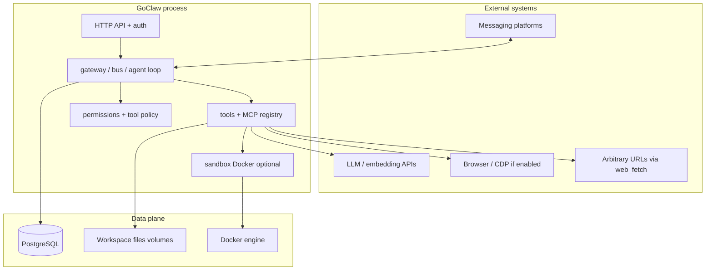

# GoClaw — Threat model (code-grounded, external repo)

**Document type:** Design-time threat model derived from **public** GoClaw source and documentation — **not** a penetration test, not an endorsement, and **not** maintained by the PersonalAssistant maintainers.  
**Date:** 2026-03-20  
**Repository:** [github.com/nextlevelbuilder/goclaw](https://github.com/nextlevelbuilder/goclaw)  
**Revision analysed:** `66a8029d267bfd947a7b83a32348c9b6aaac9cb4` ([commit link](https://github.com/nextlevelbuilder/goclaw/commit/66a8029d267bfd947a7b83a32348c9b6aaac9cb4))  
**Scope:** Whole product as reflected in `main` at that revision (`cmd/`, `internal/`, `README.md`).  
**Related PA artefact:** [goclaw-analysis.md](goclaw-analysis.md) · **Skill:** [threat-model-report.skill.md](../../../ai-sdlc/specification/skills/threat-model-report.skill.md) · **PA threat model (contrast):** [../../threat-model.md](../../threat-model.md)

---

## 1. System overview

GoClaw is a **Go** implementation of an **enterprise-oriented multi-agent AI gateway** (positioned as an OpenClaw-class port). It ships as a **single binary** with a large `internal/` tree: **gateway** (HTTP/WebSocket consumers), **channels** (e.g. Telegram, Discord, Slack, WhatsApp, Feishu/Lark, Zalo), **agents** and **sessions**, **LLM providers**, **tools** (filesystem, exec, web fetch, browser, cron, messaging, MCP, etc.), optional **Docker sandbox** for tool execution, **PostgreSQL** persistence (multi-tenant narrative in README), **AES-256-GCM** helpers for sensitive fields (`internal/crypto`), **RBAC/scoped API keys** (`internal/permissions`), and optional **web UI** and **OpenTelemetry**. Configuration and onboarding are documented for Docker Compose overlays (Postgres, Redis, sandbox, browser, etc.).

---

## 2. Architecture and trust boundaries

**Trust zones**

1. **End-users on channels** — Identities vary by platform; policy can restrict tools per channel/group and **owner-only** tools (`internal/permissions/policy.go`).  
2. **Gateway / HTTP callers** — Authenticated via **gateway token or API key** with **scopes** (admin/read/write/approvals/pairing); HTTP handlers use `requireAuth` / `authMiddleware` patterns (`internal/http/*`).  
3. **Tool execution** — Can run **on host** or inside **Docker sandbox** (`internal/sandbox`); default sandbox config uses **read-only root**, **cap drop ALL**, optional **network off**, output caps.  
4. **Operator / host** — Controls Postgres, Docker socket, env secrets (`GOCLAW_*`), compose files.  
5. **Third parties** — LLM providers, fetched URLs, MCP servers, external messaging APIs.

---

## 3. Assets

| Asset | Location / flow | Sensitivity |
|-------|-----------------|-------------|
| Gateway token / API keys | Env, DB (encrypted fields per README) | Critical |
| Per-tenant workspace & sessions | PostgreSQL | High |
| LLM provider keys | Stored with AES-GCM helpers (`internal/crypto/aes.go`) | Critical |
| Docker socket access | When sandbox enabled | Critical — container escape class risks |
| Channel OAuth / session tokens | Channel implementations | High |
| Tool outputs / traces | DB, optional OTel | High — may contain user data |
| Web dashboard | `ui/` + HTTP API | Medium–High |

---

## 4. Threat actors

| Actor | Reach | Typical goal |
|-------|-------|--------------|
| **Unauthenticated HTTP client** | Public gateway port if exposed | Abuse API, exfiltration if misconfigured |
| **Scoped API key holder** | Limited by role/scopes (`permissions`) | Lateral move within allowed methods |
| **Channel user** | Send messages; trigger agent + tools per policy | Prompt injection → tool abuse within allowlists |
| **Malicious MCP server or URL** | If MCP/web_fetch enabled | Data exfiltration, SSRF-class issues (README claims SSRF protection — verify per deployment) |
| **Container breakout** | If sandbox compromised | Host compromise |
| **DB insider / SQL injection** | Should be mitigated by ORM/RLS (README claims RLS — verify in `migrations/`) | Cross-tenant data access |

---

## 5. STRIDE analysis

| Category | Representative threats | Evidence in tree / README | Gaps / notes |
|----------|-------------------------|---------------------------|--------------|
| **Spoofing** | Fake gateway admin | API key + scope checks (`internal/http`, `internal/permissions`) | Leaked admin key = full control |
| **Tampering** | Alter another tenant’s data | README: PostgreSQL RLS | Requires verification in schema/migrations for each release |
| **Repudiation** | Deny administrative action | Tracing / audit not fully traced in this pass | Operator should enable logging retention |
| **Information disclosure** | Secrets in logs, traces | Encryption at rest for keys; OTel may leak prompts | Harden exporter and trace redaction per org policy |
| **Denial of service** | Agent loops, cron lanes, heavy tools | README: rate limiting | Exact limits not enumerated in this shallow review |
| **Elevation of privilege** | **exec** / **browser** / **web_fetch** | **5-layer** model: gateway auth → global tool allow/deny → per-agent → per-channel → owner-only (`permissions/policy.go`, `tools/policy.go`) | **Sandbox mode off** or **full tool profile** increases host risk |

---

## 6. Security controls (evidence-based)

- **Layered tool governance:** `internal/permissions/policy.go` documents gateway auth + owner checks; `internal/tools/policy.go` defines **tool groups**, **profiles** (minimal/coding/messaging/full), **subagent deny lists** (e.g. subagents denied `exec`).  
- **HTTP API auth:** Multiple handlers require authentication and minimum role (e.g. operator for sensitive routes — see `internal/http/tools_invoke.go`, `wake.go`, `usage.go`).  
- **Encryption helper:** `internal/crypto/aes.go` — AES-256-GCM with `aes-gcm:` prefix; backward compatibility with plaintext when key empty (documented in code).  
- **Docker sandbox:** `internal/sandbox/sandbox.go` — configurable mode (off / non-main / all), workspace mount RO/RW/NONE, network toggle, resource limits, output cap.  
- **CI:** `.github/workflows/ci.yaml` — `go build`, `go test -race`, `go vet` (no golangci-lint in sampled file).  
- **Marketing claims (README):** prompt-injection detection, SSRF protection, shell deny patterns — **treat as product claims**; map to specific packages in a deeper audit before relying on them in a compliance argument.

---

## 7. Gaps and residual risks

1. **Large attack surface by design** — MCP, browser, web fetch, multi-channel, exec: misconfiguration (e.g. sandbox off, `full` profile) dominates risk.  
2. **Dependency on Docker** for sandbox — misconfigured socket mount or outdated sandbox image class of issues.  
3. **Multi-tenancy correctness** — RLS and isolation must be **release-tested**; not verified in this document.  
4. **Third-party extensions** — MCP servers and channel plugins expand trust; supply-chain and runtime review required.  
5. **Operational complexity** — Many compose overlays (Postgres, Redis, browser, Tailscale) increase chances of **exposed ports** or **weak default secrets** if operators skip hardening guides.

---

## 8. Recommendations (for readers comparing with PA)

- **Operators of GoClaw:** Follow upstream deployment guides; enable **sandbox** for untrusted workloads; restrict tool profiles; rotate API keys; do not expose gateway HTTP without TLS and network ACLs.  
- **PA stakeholders:** Use this document **together with** [goclaw-analysis.md](goclaw-analysis.md) and [../../threat-model.md](../../threat-model.md) — PA intentionally **narrows** surface (e.g. Telegram-centric, SSH allowlists, no MCP/browser in-tree) at the cost of breadth.

---

## 9. References

| Resource | URL / path |
|----------|------------|
| GoClaw repository | https://github.com/nextlevelbuilder/goclaw |
| Revision analysed | https://github.com/nextlevelbuilder/goclaw/commit/66a8029d267bfd947a7b83a32348c9b6aaac9cb4 |
| PA comparison report | [goclaw-analysis.md](goclaw-analysis.md) |
| PA threat model | [../../threat-model.md](../../threat-model.md) |

---

*Shallow clone analysis; re-run when upgrading GoClaw or for production adoption decisions. Upstream may change behaviour after this commit.*
