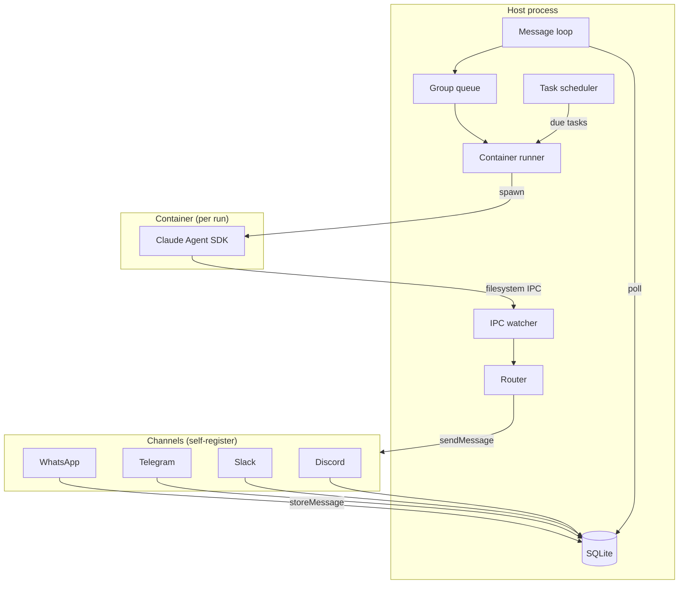
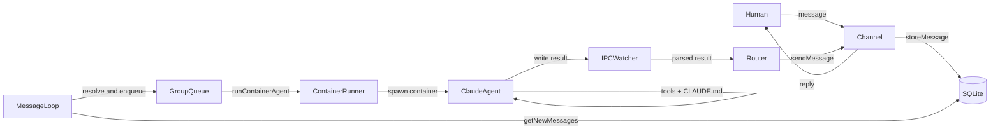
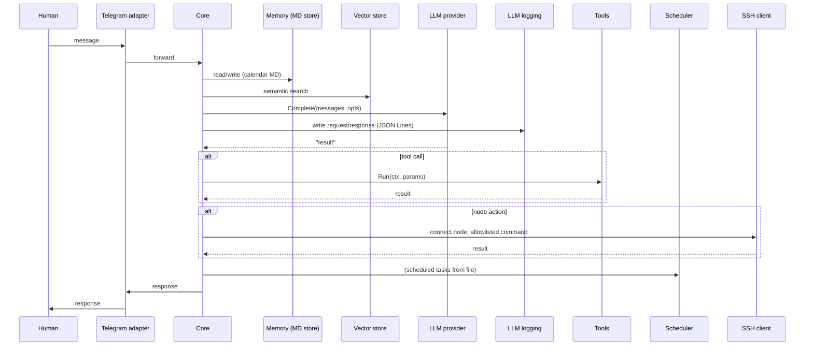
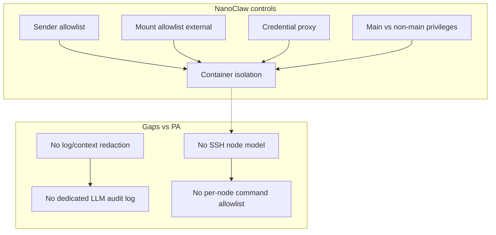

# NanoClaw: Internal Architecture Analysis and Comparison with PersonalAssistant

**Date of analysis:** 2026-03-15  
**NanoClaw repository:** [github.com/qwibitai/nanoclaw](https://github.com/qwibitai/nanoclaw)  
**NanoClaw revision analysed:** [main @ fb66428](https://github.com/qwibitai/nanoclaw/commit/fb66428eeb7561b663128d7712837a333a6c0b0d) (commit `fb66428eeb7561b663128d7712837a333a6c0b0d`)  
**PersonalAssistant revision analysed:** commit `e435df43c011105d79580c32cb1773bb3b2e046b` (short `e435df4`)

**Purpose:** Analyse NanoClaw source code (structure, architecture, security, reliability, engineering culture) and compare with EP-104 PersonalAssistant design.  
**PA design reference:** [ep-scope.md](../../epics/EP-104/ep-scope.md), [ep-requirements.md](../../epics/EP-104/ep-requirements.md), [ep-system-design.md](../../epics/EP-104/ep-system-design.md).

---

## Table of contents

1. [High-level architecture](#1-high-level-architecture)
2. [Package layout and module boundaries](#2-package-layout-and-module-boundaries)
3. [Message processing / main flow](#3-message-processing--main-flow)
4. [Security](#4-security)
5. [Reliability and error handling](#5-reliability-and-error-handling)
6. [Component comparison table](#6-component-comparison-table)
7. [Flow comparison (Mermaid)](#7-flow-comparison-mermaid)
8. [Security analysis](#8-security-analysis)
9. [Summary](#9-summary)
10. [Engineering culture comparison](#10-engineering-culture-comparison)
11. [Recommendations for PA](#11-recommendations-for-pa)

---

## 1. High-level architecture

NanoClaw is a **single Node.js process** (TypeScript). There is no message bus in the Go sense; channels write messages to **SQLite**, and a **polling loop** reads new messages, routes them by group, and invokes the **Claude Agent SDK** inside **isolated containers** (Docker or Apple Container). Each agent run is a separate container; IPC back to the host is file-based (IPC watcher). Scheduler and message loop run in the same process.

**Data flow (simplified):**

1. Channel receives message → stores in SQLite (`storeMessage`).
2. Message loop polls SQLite (`getNewMessages`), loads state (sessions, registered groups).
3. Router: trigger check, sender allowlist, group resolution; fetch messages since last agent run; format prompt.
4. Group queue limits concurrency; container runner spawns a container with the group folder mounted; agent runs with Claude Agent SDK, tools (bash, file ops, web, MCP).
5. Agent writes results to IPC dir; IPC watcher picks them up; router sends reply via the owning channel.
6. Scheduler loop polls `scheduled_tasks`, spawns container for due tasks, same IPC path for results.

**Comparison with PA:** PA is a single **Go** binary with Telegram → core → memory/vector/LLM/tools/scheduler/SSH. NanoClaw is **Node.js**, **multi-channel** via skills, **no SSH nodes**, **no vector store**, **no calendar memory**; isolation is **container-based** (OS-level) rather than PA’s **SSH + allowlist** model.

---

## 2. Package layout and module boundaries

NanoClaw has a **flat `src/`** layout; there is no `internal/` convention or formal dependency layers.

| NanoClaw `src/` | Responsibility |
|-----------------|----------------|
| **index.ts** | Orchestrator: load state, connect channels, message loop (poll SQLite → group queue → container runner), scheduler loop, IPC watcher, remote control. |
| **channels/registry.ts** | Channel factory registry; `registerChannel(name, factory)`; barrel `index.ts` imports channel modules so they self-register. |
| **channels/index.ts** | Barrel that imports channel implementations (each skill adds a channel file and an import). |
| **db.ts** | SQLite (better-sqlite3): messages, chats, scheduled_tasks, task_run_logs, router_state, sessions, registered_groups; init and queries. |
| **router.ts** | Find channel by JID, format messages for agent, format outbound, escape XML. |
| **group-queue.ts** | Per-group queue with global concurrency limit. |
| **container-runner.ts** | Spawn agent containers (streaming), write group/task snapshots, read IPC results. |
| **container-runtime.ts** | Ensure Docker/Apple Container is running, proxy bind host, cleanup orphans. |
| **ipc.ts** | IPC watcher: watch filesystem for agent output (messages, task results); auth by group. |
| **task-scheduler.ts** | Poll scheduled_tasks, run due tasks via container runner. |
| **config.ts** | Constants from env (ASSISTANT_NAME, paths, timeouts, trigger pattern, etc.). |
| **types.ts** | Channel, NewMessage, RegisteredGroup, ScheduledTask, etc. |
| **sender-allowlist.ts** | Load allowlist, `isSenderAllowed`, `isTriggerAllowed`, `shouldDropMessage`. |
| **group-folder.ts** | Resolve group folder path, validate. |
| **mount-security.ts** | Mount allowlist (external file), validation for container mounts (blocked patterns, symlink resolution). |
| **credential-proxy.ts** | HTTP proxy that injects real API credentials; containers use placeholder key and talk to proxy. |
| **remote-control.ts** | Start/stop/restore remote control (e.g. for debugging). |
| **logger.ts**, **env.ts** | Logging and env helpers. |

**Wiring:** No DI container. `index.ts` imports config, channels (side-effect registration), db, container-runner, ipc, router, group-queue, task-scheduler, sender-allowlist; builds channel list from registry and starts loops.

**Comparison with PA (EP-104):**

- **PA** has strict layers: `internal/telegram` → `internal/core`; core depends only on interfaces (`llm`, `memory`, `vector`, etc.); concrete impls wired in `cmd/pa`. **NanoClaw** has no `internal` boundary and no interface-only rule; everything is in `src/` with direct imports.
- **PA** separates memory (calendar MD store, summarization) and vector (pluggable index). **NanoClaw** has no vector store; memory is **CLAUDE.md** files per group and global, loaded by the Claude Agent SDK from the workspace; no calendar structure or hierarchical summarization.

---

## 3. Message processing / main flow

**Inbound:**

1. Channel receives message → `onMessage` callback → `storeMessage(chat_jid, sender, content, ...)` into SQLite.
2. Message loop (poll interval e.g. 2s): `getNewMessages(lastTimestamp)` → for each message, `shouldDropMessage` (trigger, allowlist) → resolve group → enqueue on `GroupQueue`.
3. Group queue: concurrency limit; dequeue group → `runContainerAgent(group, prompt, ...)`.
4. Container runner: build mount list (group folder, global, sessions, IPC, env; mount-security validates paths), run container with Claude Agent SDK; agent reads CLAUDE.md (global + group), runs tools; writes output to IPC dir.
5. IPC watcher sees new files → parses result → router `formatOutbound` → channel `sendMessage(jid, text)`.

**Scheduled tasks:** Scheduler loop polls `scheduled_tasks` for `next_run`; due tasks are run via the same container runner; task result written to IPC and logged; optional message back to user.

**Session:** Session ID per group in SQLite; passed to Claude Agent SDK `resume`; transcripts in `data/sessions/{group}/.claude/`.

**Comparison with PA:**

- **PA** core: message → read/write long-term memory (calendar MD), vector search, LLM, tools, scheduler, optional SSH to nodes. **NanoClaw** has no long-term calendar memory, no vector search, no SSH; agent runs in containers with file-based memory (CLAUDE.md) and host-managed scheduler/DB.
- **PA** scheduler: tasks from a file, cron-like + notify to Telegram. **NanoClaw** scheduler: tasks in SQLite, container run per due task, optional reply via channel.

---

## 4. Security

**Container isolation (primary boundary):**

- Agents run in containers (Docker or Apple Container); process and filesystem isolation.
- Only explicitly mounted directories are visible; non-root user in container.
- Ephemeral containers (`--rm`) per invocation.

**Mount security:**

- External allowlist at `~/.config/nanoclaw/mount-allowlist.json` (outside project, not mounted).
- Blocked patterns: `.ssh`, `.gnupg`, `.aws`, credentials, `.env`, etc.; symlink resolution before validation; container path validation (no `..` or absolute escape).
- Main group project root mounted read-only; writable mounts (group folder, IPC, `.claude/`) separate.

**Session isolation:** Per-group session dirs; groups cannot see other groups’ conversation data.

**IPC authorization:** Main group can send to any chat, schedule for others, manage groups; non-main can only send to own chat and schedule for self.

**Credential isolation:** Real API credentials never enter containers; host runs credential proxy; containers use placeholder key and proxy injects auth. `.env` shadowed in project root mount.

**Sender allowlist:** `sender-allowlist.ts` loads allowlist; `isSenderAllowed`, `isTriggerAllowed`, `shouldDropMessage` gate which messages are processed.

**Comparison with PA:**

- **PA** security: SSH to nodes, one dedicated user per node, per-node command allowlist, exec-style only, no secrets in context/logs, redaction (REQ-017, REQ-026–REQ-029). **NanoClaw** has no SSH; security is container isolation + mount allowlist + credential proxy + sender allowlist; no dedicated log redaction or LLM audit subsystem.
- **NanoClaw** does not run arbitrary host shell; bash runs inside the container. **PA** does not run local shell from remote; it runs allowlisted commands on nodes via SSH.

---

## 5. Reliability and error handling

**NanoClaw:**

- Config: constants from env; no separate config file validation; missing credentials cause channel to be skipped at startup.
- DB: SQLite; schema created on init; queries in db.ts.
- Message loop: sequential processing per group via queue; errors in container run logged; state (last_timestamp, sessions) persisted in SQLite.
- Container: timeout configurable; container runtime checked (ensureContainerRuntimeRunning); orphan cleanup.
- No LLM fallback chain (single Claude Agent SDK endpoint); credential proxy forwards to one API.

**PA design:**

- Config validated at startup; invalid node/LLM/allowlist → refuse to start (REQ-003, REQ-024).
- LLM: ordered list, fallback on failure (REQ-008, REQ-025).
- Vector store: optional empty index on load failure or fail startup.
- SSH: only allowlisted commands; on failure log and report to core.

**Comparison:** NanoClaw has no SSH or vector store. Its reliability is single-process, DB-backed state, container timeouts, and queue concurrency. PA adds explicit requirements for node verification, LLM logging, and versioned state, which NanoClaw does not implement.

---

## 6. Component comparison table

| Aspect | NanoClaw | PersonalAssistant (EP-104) |
|--------|----------|----------------------------|
| **Entry** | Single Node process (index.ts): channels, message loop, scheduler, IPC | Single Go binary: cmd/pa, Telegram adapter → core |
| **Ingestion** | Multi-channel (WhatsApp, Telegram, Slack, Discord, Gmail via skills); channels self-register; store to SQLite | Telegram only (MVP); go-telegram/bot, polling |
| **Orchestration** | Poll SQLite → group queue → container runner → Claude Agent SDK in container; IPC back to host | Core: message → memory + vector + LLM + tools + scheduler; optional SSH |
| **Module boundaries** | Flat src/; no internal/; no formal layers | internal/*; core only interfaces; wiring in cmd/pa |
| **LLM** | Claude Agent SDK (single endpoint); credential proxy for auth | Pluggable provider interface; ordered list, fallback |
| **Memory (long-term)** | CLAUDE.md per group + global; no calendar structure | Markdown store, calendar year/month/day, hierarchical summarization |
| **Session** | SQLite sessions table + data/sessions/{group}/.claude/ (JSONL); session ID passed to SDK | Conversation history in core (design) |
| **Vector store** | None | Pluggable interface; default SQLite+sqlite-vec or alternatives |
| **Tools** | In-container: bash, file ops, web search/fetch, MCP (e.g. scheduler), agent-browser | Extensible registry; name, description, params, Run(); config |
| **Exec** | Bash inside container only; no host exec; no SSH | SSH to nodes; dedicated user per node; per-node allowlist; exec-style only |
| **Scheduler** | SQLite scheduled_tasks; scheduler loop spawns container for due tasks | Scheduler component; tasks from file; cron-like + notify to Telegram |
| **LLM logging** | Not a dedicated audit stream | Dedicated subsystem; JSON Lines to configurable path |
| **Isolation** | Container (OS-level); mount allowlist; credential proxy | SSH + allowlist per node; no secrets in context/logs; redaction |
| **Security (identity)** | Sender allowlist; main vs non-main group privileges | Telegram users file (user_id, role); single channel (MVP) |

---

## 7. Flow comparison (Mermaid)

**NanoClaw (simplified):**

**PA (intended, from design):**

---

## 8. Security analysis

**Assets and trust boundaries:**

| Asset | Location | Trust boundary |
|-------|----------|----------------|
| Credentials (API, channel tokens) | Host .env / credential proxy | Host only; never mounted into container |
| Mount allowlist | ~/.config/nanoclaw/mount-allowlist.json | Host only; not mounted |
| Group folders, CLAUDE.md | groups/* | Per-group; main can write global |
| Session data | data/sessions/{group}/ | Per-group; isolated |
| SQLite (messages, tasks) | store/messages.db | Host process |

**Access control:** Sender allowlist gates which messages are processed; main group has admin privileges (manage groups, schedule for others, write global memory); non-main restricted to own chat and own tasks.

**Container and exec:** No host shell execution; all agent execution is inside the container. Bash and tools are sandboxed by container boundaries and mount list. No SSH or remote-node model.

**Secrets and logging (gaps vs PA):** No dedicated log redaction or LLM audit stream. PA requires no secrets in context/logs (REQ-017) and configurable redaction (REQ-026–REQ-029); NanoClaw does not implement these.

**Summary diagram:**

---

## 9. Summary

- **Architecture:** NanoClaw is a single Node.js process: channels → SQLite → polling message loop → group queue → container runner (Claude Agent SDK). No message bus; no formal core/adapter boundary; memory is CLAUDE.md and session files; no vector store or calendar summarization.
- **Security:** Container isolation and mount allowlist are the main boundaries; credential proxy keeps secrets off containers; sender allowlist and main/non-main privileges. No SSH nodes, no per-node allowlist, no redaction or LLM audit.
- **Reliability:** DB-backed state, queue concurrency, container timeouts. No LLM fallback chain, no node health check, no LLM audit log.
- **Fit for PA:** NanoClaw is a good reference for “multi-channel, container-isolated agent, skills-based extension,” but it does not implement PA’s SSH nodes, calendar memory, vector search, LLM logging, or redaction. Adopting it as a base would require adding those and aligning with PA’s module boundaries if strict separation is required.

---

## 10. Engineering culture comparison

| Aspect | NanoClaw | PersonalAssistant (PA) |
|--------|----------|------------------------|
| **Process model** | OSS; CONTRIBUTING: only bug/security/simplification in core; features as skills (Claude Code skills that modify the fork). No formal requirements doc in repo; REQUIREMENTS.md is philosophy and vision. | Agentic SDLC: pipeline, epic scope/requirements/design, implementation plan, verification per step. Single source of truth in ai-sdlc-artefacts. |
| **Requirements & design** | README, SPEC.md, REQUIREMENTS.md (vision, philosophy), SECURITY.md. No EARS or traceability matrix. | Explicit: ep-scope, ep-requirements, ep-system-design; traceability REQ → US → AC → implementation plan. |
| **Codebase size** | Deliberately small (“one process, a handful of files”); customization = code changes; skills add features without bloating core. | Single binary, layered internal packages; strict boundaries. |
| **Quality gates** | CI: format check, TypeScript, vitest. No coverage gate in repo. | make check: fmt, vet, lint, coverage, check-boundaries (module-boundaries script). |
| **Testing** | Unit/integration tests (vitest); channel and component tests. Skills can ship tests. | Unit + integration (build tag); tests tied to AC where applicable; check-boundaries. |
| **Security in process** | SECURITY.md describes model; CONTRIBUTING emphasizes security fixes. No mandatory redaction or LLM audit. | REQ-017, REQ-026–REQ-029 (redaction, no secrets in logs); node allowlist, dedicated user. |
| **Documentation** | README, SPEC.md, REQUIREMENTS.md, SECURITY.md, CONTRIBUTING; docs for architecture and skills. | scope, strategy, ep-* and st-* artefacts; AGENTS.md for cooperation. |
| **Extension model** | Skills (Claude Code): merge-based or skill instructions; add channels/features without PRs to core. | Config-driven tools and scheduler; future extensibility in design (REQ-011). |

---

## 11. Recommendations for PA

Features or practices from NanoClaw that PA could consider **without reducing reliability or security**:

**Isolation and credentials**

- **Credential proxy pattern:** NanoClaw never puts real API keys in the agent environment; a host-side proxy injects auth. If PA ever runs an agent in a separate process or sandbox, a similar pattern would keep secrets out of the agent environment.
- **External allowlist for sensitive paths:** Mount allowlist stored outside project root and never mounted into execution context is a clear trust boundary; PA could use a similar idea for any “allowed paths” that must not be tampered with by the process.

**Channels and ingestion (post-MVP)**

- **Channel registry / self-registration:** NanoClaw’s channel factory registry and barrel-import pattern keep the core agnostic of channel implementations. PA could introduce a small registry for future multi-channel support while keeping Telegram-only for MVP.
- **Storage-backed queue:** Using a DB (e.g. SQLite) as the queue backing store can aid durability and replay; PA could consider this for scheduler or message durability if needed later, without changing the security model.

**Operations and observability**

- **Structured startup summary:** NanoClaw’s philosophy of “ask Claude what’s happening” aligns with PA’s observability; a one-time startup log listing nodes, users, LLM order, redaction/LLM-log status (without secrets) would support operations and audit.

**What not to adopt**

- **Do not replace SSH node model with local or container exec from remote:** PA’s model is exec only on nodes via SSH with allowlist. Do not add a local or in-container shell callable from Telegram in the style of NanoClaw’s in-container bash; that would change the security model.
- **Do not drop or relax redaction or LLM audit:** Keep REQ-017, REQ-026–REQ-029 and the dedicated LLM log.
- **Do not relax node model:** Keep one dedicated user per node and per-node command allowlist.

---

**Verification note:**  
- Report path: `ai-sdlc-artefacts/analytics/nanoclaw/nanoclaw-analysis.md`.  
- PA revision: `e435df43c011105d79580c32cb1773bb3b2e046b`.  
- NanoClaw revision: `fb66428eeb7561b663128d7712837a333a6c0b0d`.  
- No edits were made to the cloned NanoClaw repo (read-only analysis).  
- Section 8 (Security analysis) is slightly shorter than the PicoClaw report’s equivalent (no SSRF subsection: NanoClaw’s web tools run inside the container; SSRF is still a concern but the comparison is already covered under container isolation and “gaps vs PA”).  
- EP-104 `ep-requirements.md` is linked as the PA design reference; that file may not exist at that path in all branches (requirements are also reflected in [ep-system-design.md](../../epics/EP-104/ep-system-design.md) and [implementation-plan.md](../../epics/EP-104/implementation-plan.md)).
