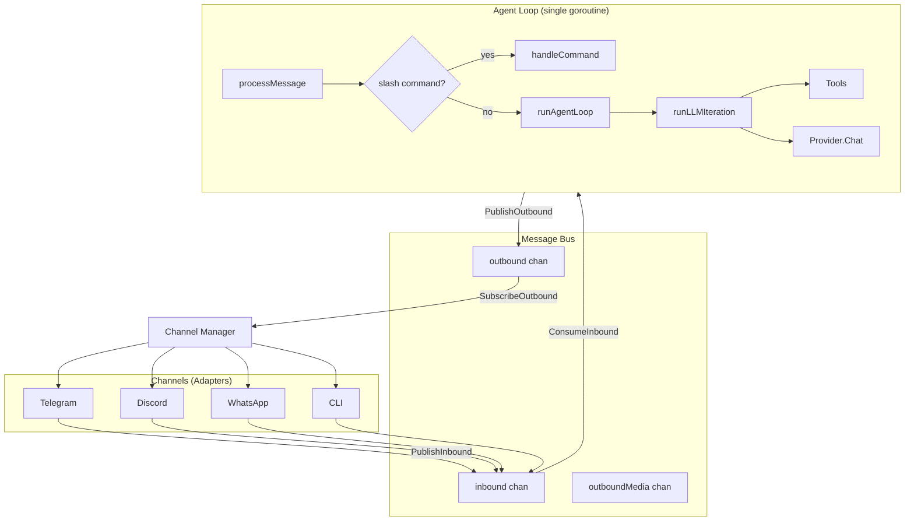
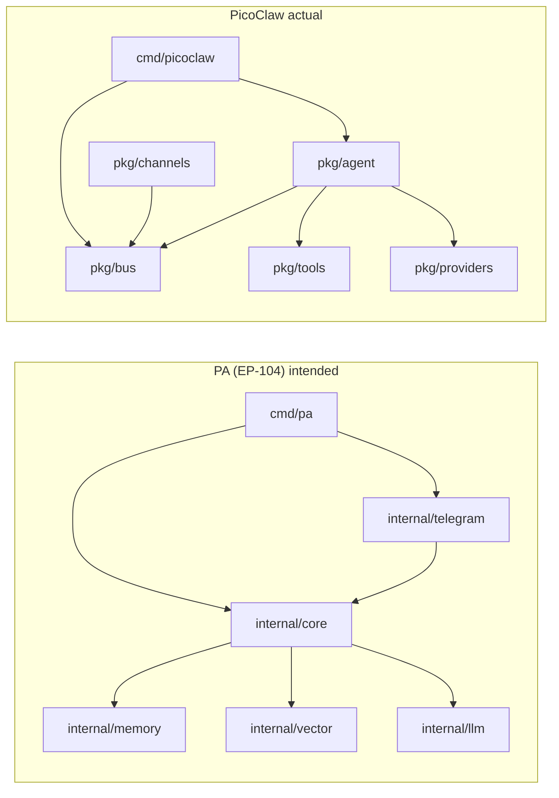
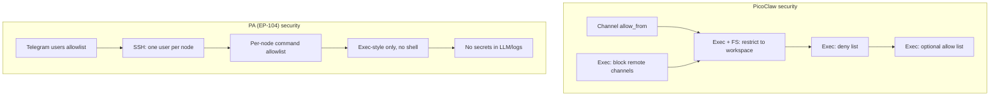
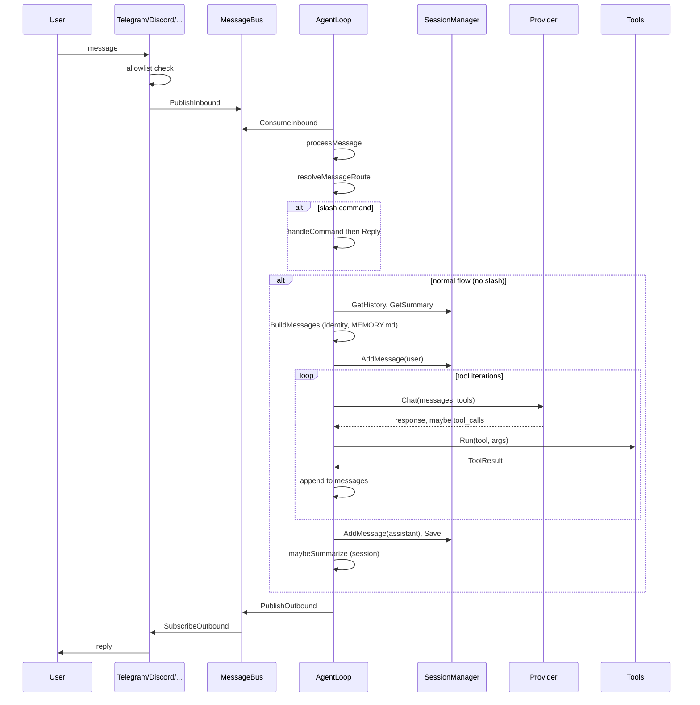
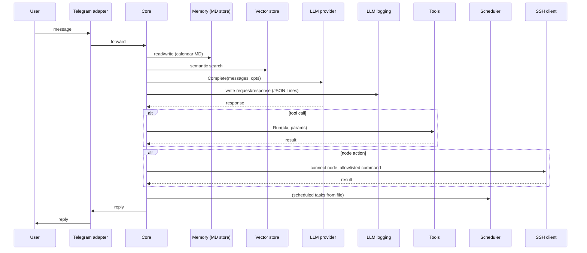
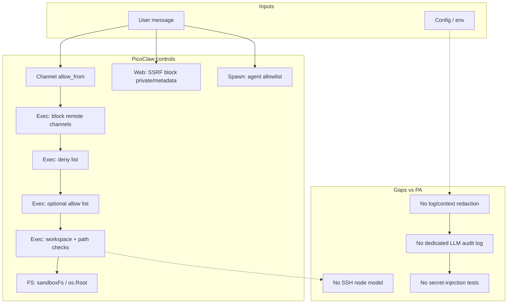

# PicoClaw: Internal Architecture Analysis and Comparison with PersonalAssistant

**Date of analysis:** 2026-03-14  
**PicoClaw repository:** [github.com/sipeed/picoclaw](https://github.com/sipeed/picoclaw)  
**PicoClaw revision analysed:** [main @ 5a251b4](https://github.com/sipeed/picoclaw/commit/5a251b46af8b51fb144ad63bea99fc1535b6244b) (commit `5a251b46af8b51fb144ad63bea99fc1535b6244b`)  
**PersonalAssistant revision analysed:** commit `e435df43c011105d79580c32cb1773bb3b2e046b` (short `e435df4`)

**Purpose:** Analyse PicoClaw source code (structure, architecture, security, reliability) and compare with EP-104 PersonalAssistant design.  
**PA design reference:** [ep-system-design.md](../../epics/EP-104/ep-system-design.md), [ep-requirements.md](../../epics/EP-104/ep-requirements.md).

---

## Table of contents

1. [PicoClaw: High-Level Architecture](#1-picoclaw-high-level-architecture)
2. [Package Layout and Module Boundaries](#2-package-layout-and-module-boundaries)
3. [Message Processing and Agent Loop](#3-message-processing-and-agent-loop)
4. [Security: Sandbox and Exec](#4-security-sandbox-and-exec)
5. [Reliability and Error Handling](#5-reliability-and-error-handling)
6. [Component Comparison Table](#6-component-comparison-table)
   - [6.1 Remote computer management](#61-remote-computer-management)
7. [Mermaid: End-to-End Flow Comparison](#7-mermaid-end-to-end-flow-comparison)
8. [Security analysis](#8-security-analysis)
   - [8.1 Assets and trust boundaries](#81-assets-and-trust-boundaries)
   - [8.2 Access control (who can use the assistant)](#82-access-control-who-can-use-the-assistant)
   - [8.3 Exec and local shell safety](#83-exec-and-local-shell-safety)
   - [8.4 Filesystem sandbox](#84-filesystem-sandbox)
   - [8.5 Web fetch and SSRF](#85-web-fetch-and-ssrf)
   - [8.6 Secrets and logging (gaps vs PA)](#86-secrets-and-logging-gaps-vs-pa)
   - [8.7 Security summary diagram](#87-security-summary-diagram)
   - [8.8 Recommendations if reusing PicoClaw for a PA-like system](#88-recommendations-if-reusing-picoclaw-for-a-pa-like-system)
9. [Summary](#9-summary)
10. [Engineering culture comparison](#10-engineering-culture-comparison)
    - [10.1 Comparative table](#101-comparative-table)
    - [10.2 Code quality (how it is ensured)](#102-code-quality-how-it-is-ensured)
    - [10.3 Summary](#103-summary)
11. [Recommendations for PA: features to consider (without reducing reliability or security)](#11-recommendations-for-pa-features-to-consider-without-reducing-reliability-or-security)
    - [11.1 Identity and allowlist](#111-identity-and-allowlist)
    - [11.2 Resilience and LLM usage](#112-resilience-and-llm-usage)
    - [11.3 Channels and ingestion (post-MVP)](#113-channels-and-ingestion-post-mvp)
    - [11.4 Scheduler and periodic tasks](#114-scheduler-and-periodic-tasks)
    - [11.5 Observability and operations](#115-observability-and-operations)
    - [11.6 Web and outbound network (if ever added)](#116-web-and-outbound-network-if-ever-added)
    - [11.7 What not to adopt (without weakening security/reliability)](#117-what-not-to-adopt-without-weakening-securityreliability)

---

## 1. PicoClaw: High-Level Architecture

PicoClaw is a single-process Go application. Entry points: **gateway** (multi-channel server), **agent** (CLI one-shot or interactive). The gateway creates a **MessageBus**, an **AgentLoop** that consumes from the bus, and a **Channel Manager** that starts adapters (Telegram, Discord, etc.); each adapter publishes inbound messages to the bus and subscribes to outbound. The agent loop runs in a goroutine; there is no separate “core” binary — orchestration, LLM, tools, and session state live in the same process.

**Data flow (simplified):**

1. Channel receives user message → checks allowlist → `bus.PublishInbound(ctx, InboundMessage{...})`.
2. Agent loop: `bus.ConsumeInbound(ctx)` → `processMessage` → route to agent → if slash command → `handleCommand` (commands.Executor); else → `runAgentLoop` (history, context build, LLM + tools loop) → optional summarization → `bus.PublishOutbound`.
3. Channel Manager subscribes to outbound, routes by `msg.Channel` to the right channel worker, which sends to the user (with splitting, rate limit, retry).

---

## 2. Package Layout and Module Boundaries

PicoClaw does **not** use `internal/` for the main library: almost everything lives under **`pkg/`**. Boundaries are by feature, not by strict “adapter / core / storage” layers.

| PicoClaw `pkg/` | Responsibility |
|-----------------|----------------|
| **agent** | AgentLoop, AgentRegistry, AgentInstance; processMessage, runAgentLoop, runLLMIteration; tool registration, command handling, summarization. |
| **bus** | MessageBus (inbound / outbound / outboundMedia channels); Publish/Consume/Subscribe. |
| **channels** | BaseChannel, Manager; per-channel impls (telegram, discord, …); allowlist, PublishInbound, outbound dispatch. |
| **commands** | Registry, Executor; slash-command parsing and execution (BuiltinDefinitions). |
| **config** | Config struct, load from file/env; Agents, ModelList, Channels, Tools, Gateway, Heartbeat. |
| **providers** | LLMProvider interface, CreateProvider, FallbackChain; per-vendor impls (openai, anthropic, openrouter, …). |
| **tools** | Tool interface, ExecTool, filesystem (read_file, write_file, …), web search, cron, spawn, message; sandbox via restrictToWorkspace and guardCommand. |
| **session** | SessionManager, JSONL backend; in-memory sessions + optional persistence. |
| **memory** | Store interface (AddMessage, GetHistory, GetSummary, …); used for session backend, not “long-term memory” files. |
| **identity** | Canonical sender ID (platform:id), allowlist matching. |
| **heartbeat** | Periodic read of HEARTBEAT.md, dispatch to agent (ProcessHeartbeat). |
| **cron** | CronService; job storage and scheduling. |
| **state** | Last channel/chatID per workspace. |
| **routing** | ResolveRoute (which agent handles this channel/peer). |
| **skills** | Load SKILL.md from workspace/skills, register as tools. |

**Wiring:** Done in **`cmd/picoclaw/internal/gateway/helpers.go`**: load config → CreateProvider → NewMessageBus → NewAgentLoop → setupAndStartServices (channels, heartbeat, cron, media, health). Agent loop is started as `go agentLoop.Run(ctx)`. There is no dependency-injection container; concrete types are constructed at startup.

**Comparison with PA (EP-104):**

- **PA** defines strict layers: adapter (`internal/telegram`) → `internal/core` → interfaces only (`llm`, `memory`, `vector`, `embedding`); concrete impls wired only in `cmd/pa`. **PicoClaw** has no `internal` boundary: `pkg/agent` imports `pkg/providers`, `pkg/tools`, `pkg/config` directly; there is no “core depends only on interfaces” rule and no script to enforce it.
- **PA** separates **memory** (markdown store, calendar layout, summarization) from **vector** (pluggable index). **PicoClaw** has no vector store; “memory” in `pkg/memory` is the session Store interface (history + summary for conversations), and long-term context is file-based (MEMORY.md, IDENTITY.md, etc.) read via identity/context builders, not a dedicated memory component with calendar structure.

---

## 3. Message Processing and Agent Loop

**processMessage (simplified):**

- Transcribe audio if present (media refs → transcriber → replace in content).
- If channel == `"system"` → processSystemMessage (e.g. subagent result).
- **resolveMessageRoute(msg)** → pick agent from registry (by channel, peer, guild/team).
- Reset “message tool” round state.
- **handleCommand**: if text has slash prefix, run commands.Executor; if OutcomeHandled, return command reply.
- Otherwise **runAgentLoop(agent, opts)**.

**runAgentLoop:**

1. Record last channel/chatID (state).
2. Build messages: session history + summary + identity/workspace context (MEMORY.md, IDENTITY.md, etc.) + user message; resolve media refs to base64 or paths.
3. Save user message to session.
4. **runLLMIteration** in a loop (until no tool calls or max iterations): build tool defs → call provider (with optional fallback chain) → if tool calls, execute tools, append results to messages, repeat.
5. Save assistant message; optional **maybeSummarize** (session summarization when history is long).
6. If SendResponse, PublishOutbound.

**runLLMIteration:** One loop per “turn”; within the turn, model choice is sticky (selectCandidates once). Tools are invoked in the same process; ExecTool, filesystem tools, cron, spawn, etc. all run in agent’s context. There is no separate “scheduler” process — cron and heartbeat are services that push into the same bus or call ProcessDirect / ProcessHeartbeat.

**Comparison with PA:**

- **PA** core is specified to: read/write long-term memory (calendar MD), run semantic search (vector), call LLM, invoke tools, run scheduler tasks, and (when needed) run allowlisted commands on **nodes via SSH**. **PicoClaw** has no SSH node layer, no vector search, no calendar memory, no dedicated LLM request/response logging, and no internal git for versioned state.
- **PA** scheduler: tasks from a separate file, cron-like + “notify” to Telegram. **PicoClaw** has heartbeat (HEARTBEAT.md) and a cron **tool** (user can add reminders); both ultimately call into the same agent (ProcessHeartbeat or bus message).

---

## 4. Security: Sandbox and Exec

**Workspace restriction (`restrict_to_workspace`):**

- **Config:** `config.Config.Agents.Defaults.RestrictToWorkspace` (default true).
- **Filesystem:** `pkg/tools/filesystem.go` uses a **sandboxFs** built on `os.Root(workspace)`: all read/write/list/open are done under a single root; path traversal and symlink escapes are blocked. Optional **whitelistFs** can allow specific extra paths.
- **Exec:** `pkg/tools/shell.go` (ExecTool):
  - **allowRemote:** exec is blocked for non-internal channels unless explicitly enabled (GHSA fix: fail-closed for Telegram etc.).
  - **restrictToWorkspace:** working dir must resolve inside workspace; symlinks re-resolved before exec to limit TOCTOU; path traversal in command string blocked; absolute path patterns in command checked against workspace (with exemptions for http/https/ftp etc. to allow `curl https://...`).
  - **guardCommand:** deny list (e.g. `rm -rf`, `format`, `shutdown`, fork bomb); optional allow list (regex); if allow list is set, command must match one of them.

**Blocked patterns (examples):** `rm -rf`, `del /f`, `mkfs`, `dd if=`, writing to `/dev/sd*`, `shutdown`/`reboot`, `:(){ :|:& };:`.

**Channels:** Each channel has an **allowlist** (e.g. `allow_from`); only allowed senders get past BaseChannel and publish to the bus. Identity matching supports platform:id, numeric ID, @username, compound id|username.

**Comparison with PA:**

- **PA** security model: **SSH to nodes** with **one dedicated user per node**, **per-node command allowlist** (pattern/regex), exec-style only (no shell with untrusted input). **PicoClaw** has no SSH: exec is **local** only, inside the host process, restricted by workspace + deny/allow lists. So PicoClaw does not implement “remote node” security; it implements “local exec + file access” sandbox.
- **PA** explicitly requires no secrets in prompts or logs (REQ-017) and a redaction subsystem (REQ-026–REQ-029); **PicoClaw** has no dedicated log-redaction or LLM-audit subsystem.
- **Channel allowlist and identity (who can talk to the bot):** Both systems restrict which users can interact with the assistant via an allowlist; PicoClaw’s implementation is more flexible in the formats it accepts and in multi-channel support.

  **PicoClaw** (`pkg/identity`, `pkg/channels/base.go`):
  - **Per-channel list:** Each channel (Telegram, Discord, etc.) has its own `allow_from` (FlexibleStringSlice: JSON array or env with comma-separated values). Empty list means “allow all” for that channel.
  - **Structured sender:** Inbound messages carry `SenderInfo`: `Platform`, `PlatformID`, `CanonicalID` (canonical `"platform:id"`), `Username`, `DisplayName`. Channels call `IsAllowedSender(sender)` which uses `identity.MatchAllowed(sender, allowed)` for each entry.
  - **Supported allowlist entry formats (backward-compatible):**
    - `"123456"` → match by `PlatformID`
    - `"@alice"` → match by `Username`
    - `"123456|alice"` → match by `PlatformID` or `Username` (compound)
    - `"telegram:123456"` → exact match on canonical `platform:id` (case-insensitive)
  - **Canonical ID:** `identity.BuildCanonicalID(platform, id)` produces a single string (e.g. `telegram:123456`) so the same user can be referenced consistently across channels and configs. `ParseCanonicalID` splits it back; matching treats a pure-numeric “platform” as legacy compound ID, not canonical.
  - So one config can mix numeric IDs, usernames, compound forms, and canonical platform:id; multi-channel setups can use canonical IDs to allow the same person on Telegram and Discord with one entry per platform or one canonical entry.

  **PA (EP-104):**
  - **Single channel (MVP):** Telegram only; allowlist comes from a **users file** at `telegram.users_path` (e.g. `telegram_users.json`).
  - **User file format:** JSON array of objects with `user_id` (Telegram user ID), `role` (e.g. `user` | `admin`), and optional display name. Only users listed there are allowed to talk to the bot.
  - **Use of the list:** (1) Decide whether to accept the incoming message; (2) for scheduler “notify” tasks, if `notify_chat_id` is not set, the first allowed user’s ID is used as the notification destination (REQ-023).
  - **No canonical “platform:id”:** There is only one ingestion channel, so identity is effectively “Telegram user ID” (+ role). No generic SenderInfo or multi-format matching; the adapter loads the users file and checks the incoming Telegram user ID against it.

  **Summary:** Both use allowlists to decide who can talk to the bot. PA keeps it minimal (one channel, user_id + role from a file). PicoClaw supports many channels and a unified identity layer: canonical `platform:id`, numeric ID, @username, and compound `id|username` in one allowlist, with empty list meaning “allow all” per channel.

---

## 5. Reliability and Error Handling

**PicoClaw:**

- **Config load:** On failure, gateway returns error and exits (no start with bad config).
- **Provider:** FallbackChain: try primary model, on failure try next candidate with cooldown.
- **Agent loop:** One message at a time (sequential ConsumeInbound); if processMessage returns error, response text is set to "Error processing message: ..." and still published.
- **Tools:** Tool errors returned as ToolResult (ForLLM, ForUser, IsError); LLM sees the error and can retry or reply. Exec timeouts and kill of process tree on context cancel.
- **Channels:** Manager runs workers per channel; outbound queue, rate limit, retry; placeholder and typing indicators.
- **Hot reload:** Config file watcher can reload config and provider; agent loop’s registry and config swapped under lock; old provider closed after a short delay.

**PA design:**

- **Config:** Validated at startup; invalid node/LLM/allowlist → refuse to start or clear error (REQ-003, REQ-024).
- **LLM/embedding errors:** Handled without crash (4xx, empty, network, context canceled) (REQ-025).
- **Vector store:** Optional start with empty index on load failure, or fail startup if required.
- **SSH:** Only allowlisted commands; on connection/exec failure, log and report to core; no fallback to other users.

**Comparison:** PicoClaw does not have SSH or vector store, so those failure modes don’t apply. Its “reliability” is process-scoped (single binary, one agent loop, hot reload). PA adds explicit requirements for node verification (e.g. CLI check that runs one allowlisted command per node and exits), LLM logging, and versioned state — none of which PicoClaw implements.

---

## 6. Component Comparison Table

| Aspect | PicoClaw | PersonalAssistant (EP-104) |
|--------|----------|----------------------------|
| **Entry** | gateway (bus + agent loop + channels), agent (CLI) | Single binary, Telegram adapter → core |
| **Ingestion** | Many channels → MessageBus (inbound chan) | Telegram only (MVP); go-telegram/bot, polling |
| **Orchestration** | AgentLoop: processMessage → route → handleCommand or runAgentLoop → runLLMIteration | Core: message → memory + vector + LLM + tools + scheduler; optional SSH |
| **Module boundaries** | pkg/*, no internal; core imports concrete providers/tools | internal/*, core only interfaces; wiring in cmd/pa |
| **LLM** | providers.LLMProvider, model_list, FallbackChain | Pluggable provider interface; ordered list, fallback |
| **Memory (long-term)** | MEMORY.md, IDENTITY.md, etc. in workspace; no calendar structure | Markdown store, calendar year/month/day, hierarchical summarization from LLM logs + tools + scheduler |
| **Session** | SessionManager (in-memory + JSONL), session key by channel/peer | Not specified in same way; conversation history in core |
| **Vector store** | None | Pluggable interface; default SQLite+sqlite-vec or vecgo/chromem-go |
| **Tools** | skills + built-in (exec, read_file, write_file, web, cron, spawn, message, …) | Extensible registry: name, description, params, Run(); config enable/disable |
| **Exec** | Local only; workspace sandbox, deny/allow list, block remote channels | SSH to nodes; dedicated user per node; per-node allowlist; exec-style only |
| **Scheduler** | Heartbeat (HEARTBEAT.md), cron tool (reminders) | Scheduler component; tasks from file; cron-like + notify to Telegram |
| **LLM logging** | Debug log level for full request/response; no dedicated audit file | Dedicated subsystem; JSON Lines to configurable path; PA_LOG_LEVEL |
| **Version control** | None | Internal git for config, memory, designated artifacts |
| **Security (exec)** | restrict_to_workspace, deny/allow patterns, no SSH | SSH + allowlist per node, dedicated user, no secrets in context/logs |

### 6.1 Remote computer management

PicoClaw **does not provide built-in remote computer management**. There is no concept of “nodes,” no SSH client, and no configuration for remote hosts (host, user, keys, or per-node command allowlist).

- **Exec is local only:** The only way to run commands is the **exec** tool, which runs a shell on the **same host** where PicoClaw is running. Working directory and path checks are scoped to the workspace; there is no “run this on host X” abstraction.
- **SSH is blocked by default:** In `pkg/tools/shell.go`, the exec deny list includes the pattern `\bssh\b.*@`, so commands like `ssh user@host` are **blocked** by the safety guard. The agent cannot use exec to open SSH sessions to other machines unless the operator disables the deny list or adds a custom allow pattern.
- **No managed-nodes model:** Even if SSH were allowed via config, the result would be ad-hoc SSH from the shell (credentials and commands fully under the LLM’s control), not a “managed nodes” model with:
  - a dedicated user per node,
  - a per-node command allowlist,
  - or a startup check that verifies node reachability and allowlisted command execution.

**Summary:**

| Question | Answer |
|----------|--------|
| Does PicoClaw support managing remote computers? | **No.** No nodes, no SSH abstraction, no remote-exec model. |
| Can the agent run SSH via exec by default? | **No.** The pattern `ssh ...@` is in the deny list and is blocked. |
| Can SSH be allowed via config? | Yes (e.g. disable deny list or add a custom allow pattern), but that only permits raw `ssh` in the shell; it does not add a PA-style “nodes + allowlist” model. |

For PA-style remote management (SSH to nodes, one dedicated user per node, per-node command allowlist), PicoClaw does not offer this; it would need to be implemented separately (e.g. as in the PA design: SSH client, node config, allowlist loader, dedicated user per node).

---

## 7. Mermaid: End-to-End Flow Comparison

**PicoClaw (simplified):**

**PA (intended, from design):**

---

## 8. Security analysis

This section provides a structured security analysis of PicoClaw and a direct mapping to PA security requirements (REQ-017, REQ-023, REQ-026–REQ-029, and node/exec requirements).

### 8.1 Assets and trust boundaries

| Asset | Location | Trust boundary |
|-------|----------|----------------|
| Config (tokens, API keys, node credentials) | File / env | Operator only; not sent to LLM in PicoClaw by design, but no redaction in logs |
| Workspace files (memory, sessions, skills) | FS under workspace | Agent + tools; sandboxed when `restrict_to_workspace` is true |
| Process execution | Host OS | Agent can run shell commands when exec tool is used; restricted by deny/allow and workspace |
| Outbound network | Web tool, providers | Web tool: SSRF mitigations; providers: direct API calls |
| User/channel identity | Channel adapters | Allowlist per channel; only allowed senders publish to bus |

PicoClaw does **not** have a separate “node” boundary: there are no remote SSH hosts under a dedicated security model. The only remote boundary is “this process” vs “channel users” and “files/exec on the host.”

### 8.2 Access control (who can use the assistant)

- **Channel allowlist:** Each channel (Telegram, Discord, etc.) has an `allow_from` list (e.g. user IDs, `platform:id`, `@username`, compound `id|username`). `pkg/identity` normalises and matches sender to this list. Empty allowlist is treated as “allow all” for that channel.
- **Exec from remote channels:** By default, the **exec** tool is **disabled for non-internal channels** (e.g. Telegram, Discord). So a remote user cannot trigger shell execution unless the operator sets `tools.exec.allow_remote: true`. This is fail-closed (GHSA-pv8c-p6jf-3fpp).
- **Spawn tool:** Subagent spawn can be restricted by an allowlist of agent IDs; the loop injects an allowlist checker so only permitted targets are spawnable.
- **Cron tool:** Scheduling of commands can be restricted to “internal” channels so remote users cannot add cron jobs that run exec.

**PA comparison:** PA has a single ingestion channel (Telegram) with an allowlist (e.g. users file). PA does not have “internal vs remote channel” for exec because **exec is not local** — it runs on nodes via SSH with a per-node command allowlist. So PA’s access control for execution is “which node + which allowlisted command,” not “which channel can call exec.”

### 8.3 Exec and local shell safety

- **Deny list (default):** Many dangerous patterns are blocked in the exec command string (e.g. `rm -rf`, `del /f`, `mkfs`, `dd if=`, writes to `/dev/sd*`, `shutdown`/`reboot`, fork bomb, `sudo`, `chmod`/`chown`, `pkill`/`kill`/`killall`, `curl|sh`, `docker run`/`exec`, `git push`, `ssh ...@`, `eval`, `source *.sh`). Config can add custom deny patterns or disable deny list (with a warning).
- **Allow list (optional):** If `tools.exec.allow_patterns` is set, the command must match one of these regexes; otherwise it is blocked (“not in allowlist”).
- **Custom allow patterns:** Some regexes can exempt a command from the deny list (e.g. allow `git push origin main` but still block other `git push`).
- **Workspace restriction:** When `restrict_to_workspace` is true:
  - Working directory must resolve (including symlinks) inside the workspace; symlinks are re-resolved before exec to reduce TOCTOU.
  - Path traversal in the command string (`../`, `..\`) is blocked.
  - Absolute path patterns in the command are checked; paths must be under workspace or match a small “safe” set (e.g. `/dev/null`). URL-like paths (http/https/ftp/git/etc.) are exempt so `curl https://...` works; `file://` paths are still validated against the workspace so `file:///etc/passwd` is blocked.
  - Bypass attempts (e.g. `echo https://x && cat //etc/passwd`) are intended to be blocked by checking each path occurrence.
- **Block devices:** Writes to block devices (e.g. `> /dev/sda`) are explicitly blocked.
- **Timeout:** Exec has a configurable timeout; on expiry the process tree is terminated.

**PA comparison:** PA does not run arbitrary shell on the host; it runs **allowlisted commands on nodes via SSH** with a dedicated user per node. So PA avoids “local shell with deny/allow list” and instead uses “remote exec with strict allowlist and identity.” PicoClaw has no SSH; its exec is the main attack surface on the host.

### 8.4 Filesystem sandbox

- **sandboxFs (`pkg/tools/filesystem.go`):** Uses `os.Root(workspace)` so all read/write/list/open are under one root. Path traversal and symlink escapes outside the root are blocked. Tests explicitly assert that symlink escapes (e.g. link inside workspace pointing to a dir outside) are denied.
- **whitelistFs (optional):** Can allow specific additional paths outside the workspace via regex patterns; non-matching paths remain blocked.
- **Empty workspace:** If workspace is empty, access is blocked (tests assert “Security Regression: Empty workspace allowed access!”).
- **Atomic writes:** Write operations use a temp file, sync, rename pattern for durability and to avoid partial writes.

Same sandbox is used by read_file, write_file, list_dir, edit_file, append_file when `restrict_to_workspace` is true. So file access by the agent is confined to the workspace (plus whitelist if configured).

**PA comparison:** PA does not specify an `os.Root`-style sandbox in the same way; it specifies a “designated directory” for long-term memory and a security model focused on nodes and SSH. File access on the host running the core is not detailed in the same granularity as PicoClaw’s sandboxFs.

### 8.5 Web fetch and SSRF

- **Private/local targets:** The web_fetch tool blocks requests to private/local addresses unless explicitly enabled. `isPrivateOrRestrictedIP` covers: RFC 1918, loopback (127.x), link-local (169.254.x.x, including cloud metadata), carrier-grade NAT, IPv6 unique-local (fc00::/7), 6to4 with private embedded IPv4, Teredo with private client IP.
- **Hostname resolution:** A custom dial context re-resolves at connect time and skips any resolved IP that is private/restricted, then connects only to public IPs. This mitigates DNS rebinding (TOCTOU where hostname resolves to public at check time and private at connect time).
- **Redirects:** Redirects to private IPs are blocked (tests: “RedirectToPrivateBlocked”).
- **Override:** Tests can set `allowPrivateWebFetchHosts` to allow private hosts; normal runtime keeps it false.

So outbound web from the agent cannot be used to hit cloud metadata or internal services unless the operator explicitly enables it.

**PA comparison:** PA does not define a “web tool” or SSRF in the current requirements; if PA adds a web-fetch capability, similar SSRF and redaction concerns would apply.

### 8.6 Secrets and logging (gaps vs PA)

- **No redaction subsystem:** PicoClaw does not have a dedicated log-redaction layer. Config and provider responses may be logged at debug level without stripping tokens or API keys. There is no “built-in + additional patterns” redaction as in PA REQ-026–REQ-029.
- **No LLM audit stream:** There is no dedicated, parseable LLM request/response log (e.g. JSON Lines to a file) with guaranteed redaction. Debug level can log “full request/response” in the handler, which increases secret leakage risk if enabled in production.
- **Context sent to LLM:** System prompt and context builders include workspace files (e.g. MEMORY.md, IDENTITY.md). If the operator puts secrets in those files, they would be sent to the LLM; there is no automatic redaction of “secret patterns” from context or logs.

**PA requirements (not met by PicoClaw):**

| PA requirement | PicoClaw |
|----------------|----------|
| REQ-017: No secrets in context, responses, or logs; verified by tests | No systematic redaction; no tests that inject fake secrets and assert absence in reply/logs |
| REQ-026: Configurable redaction for LLM log and app log | Not implemented |
| REQ-027: Built-in redaction patterns, not overridable by config | Not implemented |
| REQ-028: Additional redaction patterns from config | Not implemented |
| REQ-029: Validate redaction config at startup | Not applicable (no redaction config) |

### 8.7 Security summary diagram

### 8.8 Recommendations if reusing PicoClaw for a PA-like system

1. **Add a redaction layer** before any log or context sent to LLM or written to disk: built-in patterns (tokens, API keys, SSH keys, etc.) plus configurable additional patterns, with validation at startup (PA REQ-026–REQ-029).
2. **Introduce a dedicated LLM audit log** (e.g. JSON Lines) that receives only redacted payloads, and keep debug “full request/response” out of production or behind a separate, controlled path.
3. **Add tests** that inject known fake secrets and prompt-injection style inputs and assert they do not appear in assistant replies or log output (PA REQ-017).
4. **Keep exec disabled for remote channels** (or equivalent) and do not rely on PicoClaw’s exec as the primary “node” mechanism; implement SSH with a dedicated user and per-node allowlist as in PA.
5. **Treat MEMORY.md / IDENTITY.md and any user-editable context as untrusted for secrets** until redaction or policy prevents sensitive content from being included in prompts or logs.

---

## 9. Summary

- **Architecture:** PicoClaw is a single-process, bus-based design with a single agent loop and many channel adapters; no formal “core vs adapters” boundary and no interface-only dependency rule like in PA. Long-term “memory” is file-based (MEMORY.md, etc.) plus session history; there is no vector store or calendar-based summarization pipeline.
- **Security:** Strong local sandbox (workspace + exec deny/allow, no exec from remote channels by default). No SSH nodes, no per-node allowlist, no dedicated secret redaction or LLM audit.
- **Reliability:** Config fail-fast, provider fallback, sequential message processing, hot reload. No node health check, no LLM audit log, no versioned state.
- **Fit for PA:** PicoClaw is a good reference for “Go agent with bus + multi-channel + tools + skills”, but it does not implement PA’s SSH nodes, calendar memory, vector search, LLM logging subsystem, or internal git. Using it as a base would require adding those subsystems and likely refactoring toward PA’s module boundaries if strict separation is required.

---

## 10. Engineering culture comparison

Below is a comparison of how the two projects approach process, quality, collaboration, and documentation. The goal is to characterise each project’s engineering culture, not to rank one as “better”; the table is descriptive.

### 10.1 Comparative table

| Aspect | PicoClaw | PersonalAssistant (PA) |
|--------|----------|------------------------|
| **Process model** | Open-source community: CONTRIBUTING.md, PR template, branch strategy, code review. Feature discussion in issues before code. | Agentic SDLC: pipeline (scope → strategy → epic → requirements → AC → design → stories → implementation plan → task execution → audit). Single source of truth in ai-sdlc-artefacts; process in ai-sdlc/specification (skills, pipeline). |
| **Requirements & design** | README, ROADMAP (vision, themes), docs. No formal EARS/INCOSE or traceability matrix in repo. | Explicit: ep-requirements (EARS, REQ-xxx), ep-system-design, ep-scope, ep-acceptance-criteria. Traceability: REQ → US → AC → implementation-plan tasks. |
| **Planning & tasks** | Issues, PRs, branch-per-feature. No single “implementation plan” document; work is issue/PR-driven. | Implementation plan per epic: ordered tasks with dependencies, verification steps, checkpoint “run all tests”. Task execution skill: one task at a time, confirm with user before marking done. |
| **Code ownership & roles** | Maintainers merge; reviewers by area (Provider, Channel, Agent, Tools, Security, etc.) listed in CONTRIBUTING. Community invited to Discord/WeChat after first merged PR. | Single owner (user). AGENTS.md: agent works in cooperation with user; no autonomous commits or file changes without approval. Subagent workflow: plan → one step per subagent → review → stop on failure. |
| **AI in development** | Explicitly AI-assisted; CONTRIBUTING has “AI-Assisted Contributions”: disclosure required (fully / mostly AI / mostly human), responsibility for security and correctness, same quality bar. PR template: “AI Code Generation” checklist. | AI used for pipeline execution (skills drive scope, requirements, design, implementation). AGENTS.md: plan first, verify per step, no commit without user approval. No formal “AI disclosure” in commits; human approves every change. |
| **Quality gates** | `make check` = deps + fmt + vet + test. CI (PR): go generate, golangci-lint, govulncheck, go test. All must pass before merge. | `make check` = fmt + vet + lint + coverage + check-boundaries (module-boundaries script). Implementation plan: verification per task; checkpoint “all tests pass”. Strategy: test pyramid (unit → integration → E2E → manual), security tests (allowlist, secrets, prompt injection). |
| **Linting & static analysis** | golangci-lint (many linters disabled via config; some marked “fix and enable later”). Govulncheck in CI. | golangci-lint with integration build tag. Script check-module-boundaries.sh to enforce internal/ layering (adapters → core → interfaces only). |
| **Testing** | Unit and integration tests in tree; `make test`, benchmarks. PR template: “Test Environment” (hardware, OS, model, channels). No formal AC→test traceability in CONTRIBUTING. | Tests tied to acceptance criteria (comment: Covers AC-xxx). Strategy: traceability “every AC covered by at least one test level”. Unit / integration / E2E / manual defined; security scenarios explicit. |
| **Security in process** | CONTRIBUTING: security review for AI-generated code (paths, sandbox, credentials, exec). ROADMAP: “Security Hardening” (prompt injection, tool abuse, SSRF, redaction). No mandatory redaction or LLM-audit in current release. | Built into requirements: REQ-017 (no secrets in context/logs), REQ-026–REQ-029 (redaction), node allowlist, dedicated user. Implementation plan and strategy call out allowlist tests, secret-injection tests, prompt-injection/exfiltration. |
| **Documentation** | README (multi-language), CONTRIBUTING, ROADMAP, docs/. Inline comments and docstrings. | scope.md, strategy.md, ep-* and st-* artefacts. Pipeline and skills are the “how”; artefacts are the “what”. AGENTS.md for agent–user cooperation. |
| **Releases & branches** | main (development), release/x.y (stable); squash merge to main. New features not backported; security/critical fixes cherry-picked. Release workflow and goreleaser for binaries. | No formal release/branch policy in repo yet; strategy defines increments (e.g. MVP 0.01). Delivery and test strategy in strategy.md. |
| **Collaboration** | Issues, Discussions, PRs. “When in doubt, open an issue before writing code.” Reviewer list by domain. | User and agent; optional subagents. Choices (design, naming, approach) presented as options; user chooses. No community contribution process yet. |
| **Language & locale** | English in CONTRIBUTING and code; README and docs in several languages (EN, ZH, JA, etc.). | AGENTS.md: all code comments, UI messages, commit messages in English. Artefacts in English. |

### 10.2 Code quality (how it is ensured)

**PicoClaw**

- **Local:** `make check` runs deps, `go generate`, `make fmt`, `make vet`, `make test`. Contributors are expected to run it before pushing. Separate targets: `make fmt`, `make vet`, `make lint` (golangci-lint).
- **CI (on every PR):** `go generate ./...`, golangci-lint (v2.10.1), govulncheck (vulnerabilities in dependencies), `go test ./...`. Merge is allowed only when CI is green, at least one maintainer has approved, and the PR template is complete (including AI disclosure and Test Environment).
- **Review:** CONTRIBUTING lists what reviewers look for: correctness, security (especially for AI-generated code), architecture fit, simplicity, and adequate tests. Prefer small, focused PRs.

**PersonalAssistant (PA)**

- **Local:** `make check` runs fmt → vet → lint → coverage → check-boundaries. `make lint` runs golangci-lint with the integration build tag. `make coverage` runs tests and produces a coverage report (unit + integration by test pyramid). `make check-boundaries` runs `scripts/check-module-boundaries.sh`, which enforces module boundaries (no cycles, no forbidden edges: e.g. adapters must not import memory/vector/llm).
- **Process, not only CI:** Strategy and implementation plan require that every acceptance criterion is covered by at least one test level; tests should reference the AC (e.g. comment “Covers AC-xxx”). Each implementation-plan task has a verification block; checkpoints require “run all tests.” The task-execution skill instructs the agent to run the relevant checks (lint/test/build) before considering a task done; the user confirms before the task is marked complete.
- **Test strategy:** Pyramid (many unit → fewer integration → few E2E → manual); explicit security scenarios (allowlist, secrets, prompt injection / exfiltration).

**Comparison table**

| Mechanism | PicoClaw | PersonalAssistant (PA) |
|-----------|----------|-------------------------|
| Formatting | `make fmt`, enforced in CI | `make fmt`, part of `make check` |
| Static analysis | `go vet`, golangci-lint in CI | `go vet`, golangci-lint (with build tags) in `make check` |
| Dependency/vuln check | **govulncheck** in CI | Not mentioned in current process |
| Tests | `go test` in CI; PR template “Test Environment” | Unit/integration/E2E by pyramid; **coverage** in `make check` |
| Coverage | Not required in CI | **Coverage** is part of `make check` |
| Architecture / boundaries | Review “consistent with design” | **check-module-boundaries.sh** (no cycles, forbidden imports) |
| Code review | Mandatory before merge | Human reviews each step before approving (no PR merge gate) |
| Traceability to requirements | No formal trace in repo | AC → tests (Covers AC-xxx); verification per task in plan |

### 10.3 Summary

- **PicoClaw** is run as a **community OSS project**: public CONTRIBUTING, PR/issue workflow, CI, branch/release policy, and explicit AI-contribution rules. Design and roadmap are documented at a high level; detailed behaviour lives in code and tests. Quality is enforced by CI and review; many linters are currently disabled with the intention to re-enable later.
- **PA** is run as a **single-owner, process-heavy project**: requirements and design are first-class artefacts with traceability; an agentic pipeline (skills + pipeline.spec) drives scope, requirements, design, stories, and implementation plans. The human retains control (no commit or broad changes without approval); verification and boundaries are built into the plan and the test strategy. There is no public contribution or release process yet; the culture is “design and verify before coding,” with security and reliability baked into requirements and checks.

---

## 11. Recommendations for PA: features to consider (without reducing reliability or security)

Based on the PicoClaw analysis, the following features could strengthen or extend PersonalAssistant while preserving its focus on reliability and security (SSH node model, allowlists, redaction, LLM audit, versioned state). Items are grouped by theme; each assumes existing PA requirements (REQ-017, REQ-026–REQ-029, node allowlist, dedicated user, etc.) remain in place.

### 11.1 Identity and allowlist

- **Canonical identity and multiple allowlist formats (optional):** PicoClaw’s `pkg/identity` supports a canonical `platform:id` and several entry formats (numeric ID, `@username`, compound `id|username`). PA could, in a later iteration, allow the users file to accept similar formats (e.g. `telegram:123456` or `123456|alice`) and normalise to a single internal ID. This improves operator UX and future multi-channel alignment without relaxing access control: the same allowlist semantics (only listed users can talk to the bot) are preserved.
- **Environment or comma-separated overrides for allowlist:** Allowing the list of allowed user IDs (or a subset) to be overridden via environment variables (e.g. for containers) can simplify deployment. Validation at startup and the rule “only these users” stay unchanged; redaction and logging remain as per REQ-026–REQ-029.

### 11.2 Resilience and LLM usage

- **Provider fallback with cooldown:** PA already specifies an ordered list of LLM providers with fallback on failure. PicoClaw adds a cooldown before retrying a failed provider. PA could adopt a similar cooldown (configurable duration) so that a repeatedly failing provider is not retried immediately, reducing load and improving stability without changing the security model.
- **Session summarisation / context compression:** When conversation history exceeds a token budget, PicoClaw compresses it via a summary and keeps a sliding window. PA could add an optional “summarise when history exceeds N messages or tokens” step before each LLM call. This preserves reliability (staying within context limits) and does not require sending more data to the LLM than today; the summary should be produced and stored under the same redaction and logging rules as other LLM traffic.

### 11.3 Channels and ingestion (post-MVP)

- **Message-bus style abstraction for ingestion:** PicoClaw decouples channels from the agent with an inbound/outbound bus. PA could introduce a small internal “message bus” or queue between the Telegram adapter and the core so that adding a second channel (e.g. CLI or a future adapter) does not require core changes. Adapters would still enforce allowlists and only forward allowed users; core stays the single place for memory, vector, LLM, tools, and SSH.
- **Multi-channel allowlist per channel:** If PA later supports several channels (e.g. Telegram + Discord), each channel can have its own allowlist (e.g. `telegram.allow_from`, `discord.allow_from`) loaded and validated at startup. This mirrors PicoClaw’s per-channel `allow_from` without weakening security: each channel still restricts who can talk to the bot.

### 11.4 Scheduler and periodic tasks

- **Heartbeat-style periodic task list (optional):** PicoClaw’s heartbeat reads a file (e.g. HEARTBEAT.md) on an interval and runs listed tasks. PA could add an optional “periodic task list” path: a file listing natural-language tasks (or references to scheduled_tasks) that the assistant runs on a fixed interval (e.g. every 30 minutes), without changing the existing scheduler or notify semantics. Execution would remain within the same security and tool model (e.g. no exec from remote channels; if tools run on nodes, only allowlisted commands). This is an additive feature; existing scheduler and REQ-023 behaviour stay as-is.
- **User-facing reminders via tool (optional):** PicoClaw’s cron tool lets users say “remind me in 10 minutes” and stores a one-shot or recurring job. PA could add a “remind” tool that creates a scheduler job with a single allowed action (e.g. “send a Telegram message to the user”) and a time/interval. Access control: only the requesting (allowed) user receives the reminder; no new exec or node access.

### 11.5 Observability and operations

- **Structured startup summary:** PicoClaw prints a short startup summary (tools loaded, skills available, etc.). PA could emit a one-time startup log (or console line) listing: config version, number of nodes, number of allowed users, LLM provider order, and whether redaction/LLM log are enabled. This aids operations and audit without exposing secrets.
- **Health endpoint (optional):** A minimal HTTP health endpoint (e.g. `/health` or `/ready`) can signal that the process is up and config is loaded, for use by orchestrators or load balancers. It should not return config or secrets; only status and maybe version.

### 11.6 Web and outbound network (if ever added)

- **Web search or fetch with SSRF protection:** If PA later adds a “web search” or “fetch URL” tool, it should follow PicoClaw-style SSRF mitigations: block private/local IP ranges (RFC 1918, loopback, link-local, cloud metadata), re-resolve at connect time to mitigate DNS rebinding, and block redirects to private IPs. This keeps outbound network use safe without changing the rest of the security model.
- **Explicit allowlist for outbound hosts (optional):** For maximum control, a future web/fetch tool could support an optional allowlist of hostnames or IP ranges; if set, only those targets are allowed. Default remains “no web tool” or “block private/metadata” as above.

### 11.7 What not to adopt (without weakening security/reliability)

- **Do not add local exec from remote channels:** PA’s model is “exec only on nodes via SSH with allowlist.” Do not introduce a local shell/exec callable from Telegram (or other remote channels) in the style of PicoClaw’s exec tool; that would enlarge the attack surface on the host.
- **Do not drop or relax redaction or LLM audit:** REQ-017, REQ-026–REQ-029 and the dedicated LLM request/response log are core to PA; keep them and extend them to any new context (e.g. summaries, heartbeat tasks) that is sent to the LLM or written to logs.
- **Do not relax node model:** Keep one dedicated user per node, per-node command allowlist, and startup verification (e.g. REQ-022); do not replace them with “run anything over SSH” or shared accounts.

---

The list above is additive and conditional: each item can be evaluated and prioritised in the PA roadmap while keeping reliability and security requirements as the baseline.
