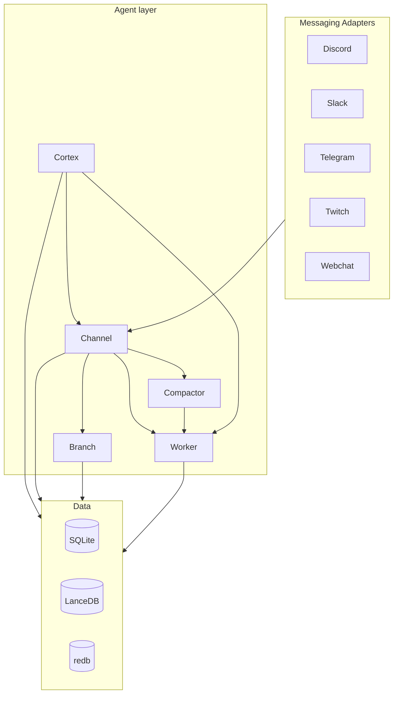
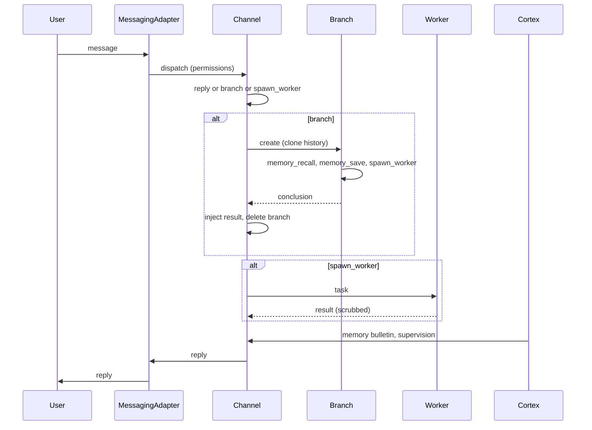
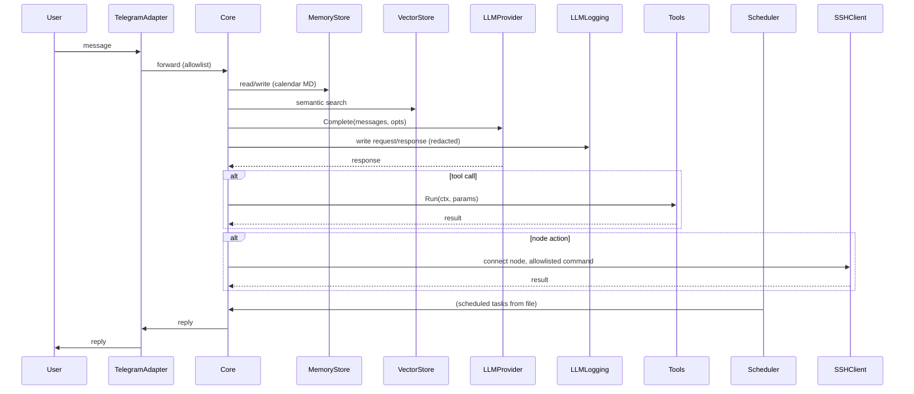

# Spacebot: Internal Architecture Analysis and Comparison with PersonalAssistant

**Date of analysis:** 2026-03-15  
**Spacebot repository:** [github.com/spacedriveapp/spacebot](https://github.com/spacedriveapp/spacebot)  
**Spacebot revision analysed:** [main @ ed3aebe](https://github.com/spacedriveapp/spacebot/commit/ed3aebe921c7c09c03933a66c07113d0ea45128b) (commit `ed3aebe921c7c09c03933a66c07113d0ea45128b`)  
**PersonalAssistant revision analysed:** commit `e435df43c011105d79580c32cb1773bb3b2e046b` (short `e435df4`)

**Purpose:** Analyse Spacebot source code (structure, architecture, channels, branches, workers, cortex, compactor, security, reliability) and compare with EP-104 PersonalAssistant design and implementation.  
**PA design reference:** [ep-scope.md](../../epics/EP-104/ep-scope.md), [ep-requirements.md](../../epics/EP-104/ep-requirements.md) (see also [implementation-plan.md](../../epics/EP-104/implementation-plan.md) for detailed REQ-*), [ep-system-design.md](../../epics/EP-104/ep-system-design.md).

---

## Table of contents

1. [High-level architecture](#1-high-level-architecture)
2. [Package layout and module boundaries](#2-package-layout-and-module-boundaries)
3. [Message processing and main flow](#3-message-processing-and-main-flow)
4. [Security](#4-security)
5. [Reliability and error handling](#5-reliability-and-error-handling)
6. [Component comparison table](#6-component-comparison-table)
7. [Flow comparison (Mermaid)](#7-flow-comparison-mermaid)
8. [Security analysis](#8-security-analysis)
9. [Summary](#9-summary)
10. [Engineering culture comparison](#10-engineering-culture-comparison)
11. [Recommendations for PA](#11-recommendations-for-pa)

---

## 1. High-level architecture

Spacebot is a **single Rust binary** (Tokio async runtime). It runs as a daemon (background or foreground). Entry point: `src/main.rs`; CLI via Clap. No separate “gateway” vs “agent” binaries — one process hosts all agents, each with its own workspace, databases, identity files, cortex, and messaging bindings.

**Five process types** (all within the same binary; each is a Rig `Agent<SpacebotModel, SpacebotHook>` with different prompts, tools, and lifecycle):

- **Channels** — User-facing LLM process; one per conversation (Discord thread, Slack channel, Telegram DM, etc.). Has soul, identity, personality. Delegates thinking to branches and work to workers. Never blocked by compaction (compactor runs in background).
- **Branches** — Fork of a channel’s context that “goes off to think”; has the channel’s full history; operates independently; returns a conclusion then is deleted. Multiple branches can run concurrently per channel.
- **Workers** — Independent processes that do jobs: fire-and-forget (summarization, one-shot tasks) or interactive (coding sessions, multi-step). Get a task and task-appropriate tools; no channel context. Built-in (shell, file, exec, browser) or OpenCode.
- **Compactor** — Programmatic (no LLM). Per-channel monitor that watches context size; at 80%/85%/95% triggers compaction workers to summarize or truncate. Compaction workers run alongside the channel without blocking it.
- **Cortex** — The only process that sees across all channels, workers, and branches. Generates the **memory bulletin** (periodically refreshed, LLM-curated briefing injected into every conversation). Supervises processes (kill hanging workers, clean stale branches). Maintains memory graph (decay, pruning, merging). Provides admin chat with full tool access.

**Tech stack (from README):** Rust (edition 2024), Tokio, Rig (agentic loop), SQLite (sqlx), LanceDB (vector + FTS, hybrid RRF), redb (settings, encrypted secrets), FastEmbed (local embeddings), AES-256-GCM (secret encryption). Messaging: Serenity (Discord), slack-morphism (Slack), teloxide (Telegram), twitch-irc (Twitch). Browser: Chromiumoxide. Single binary; all data in embedded DBs in a local directory.

---

## 2. Package layout and module boundaries

Spacebot uses a **flat `src/` layout** (Rust crate). No `internal/` convention; modules are feature-based.

| Spacebot `src/` | Responsibility |
|-----------------|----------------|
| **agent/** | channel, branch, worker, compactor, cortex; channel_dispatch, channel_history, channel_prompt, ingestion; process_control, status. |
| **api/** | HTTP API: agents, bindings, channels, config, cortex, messaging, projects, secrets, settings, system, tasks, webchat, workers; server. |
| **config** | Load and validate config (TOML); types, runtime, watcher, permissions, onboarding. |
| **conversation** | history, context, channels; worker_transcript. |
| **cron** | Scheduler for recurring jobs (SQLite-backed). |
| **factory** | Agent creation; presets. |
| **identity** | Identity files (SOUL.md, IDENTITY.md, USER.md); protection against writes. |
| **llm** | Routing (process-type, task-type, prompt complexity), model resolution, fallbacks. |
| **memory** | Typed memory store (Fact, Preference, Decision, etc.); graph edges; hybrid search (LanceDB + Tantivy); maintenance. |
| **messaging** | Adapters: discord, slack, telegram, twitch, webchat, webhook, email, signal; manager, traits, target. |
| **mcp** | MCP (Model Context Protocol) server integration; tool discovery. |
| **opencode** | OpenCode worker backend. |
| **prompts** | Prompt engine; fragments; adapter-specific. |
| **projects** | Workspace/project store; git integration. |
| **sandbox** | OS-level containment: bubblewrap (Linux), sandbox-exec (macOS); writable paths, env sanitization. |
| **secrets** | Store (redb), keystore (encryption), scrub (output redaction, leak detection). |
| **skills** | skills.sh integration; install, list, worker injection. |
| **tasks** | Task store. |
| **telemetry** | Registry. |
| **tools** | LLM tools: shell, file, exec, browser, branch_tool, spawn_worker, memory_*, cron, reply, route, etc. |

**Binary:** `src/bin/cargo-bump.rs` is a small utility; main binary is the library’s default target (e.g. `cargo build --release` produces `spacebot`).

**Comparison with PA:** PA uses **strict layers**: `internal/telegram` (adapter) → `internal/core` → interfaces only (`llm`, `memory`, `vector`, `embedding`); concrete impls wired only in `cmd/pa`. Spacebot has no formal “adapter / core / storage” boundary; agent, messaging, memory, and tools are in one crate with direct dependencies. PA has a single entrypoint `cmd/pa`; Spacebot has one Rust binary with daemon/CLI modes.

---

## 3. Message processing and main flow

**Spacebot:**

1. **Ingestion:** Messaging adapters receive events (Discord, Slack, Telegram, etc.). Bindings map (guild/channel/adapter) → agent. Permissions (per-channel, hot-reloadable) control who can interact.
2. **Channel:** Receives user message. Can reply directly, **branch** to think (clone history, run branch agent with memory_recall, memory_save, spawn_worker, etc.), or **spawn_worker** for heavy work. Branch result is injected into channel history as a message; branch is then deleted.
3. **Compactor:** Monitors channel context size; at thresholds (80% / 85% / 95%) spawns compaction workers to summarize or truncate. Summaries stack at top of context; channel is never blocked.
4. **Cortex:** Periodically refreshes memory bulletin; maintains memory graph; supervises workers/branches; admin chat.

Message coalescing (README): rapid-fire messages are batched into a single LLM turn with timing context. Cron jobs get a fresh short-lived channel with full branching and worker capabilities.

**PA (design and code):**

1. **Ingestion:** Telegram adapter (go-telegram/bot, polling) only. Users file (allowlist) validated at startup.
2. **Core:** Single handler per message: load config, read/write long-term memory (calendar MD), semantic search (vector), LLM call (one provider for now; fallback TBD), tools (including run_on_node via SSH), optional scheduler. LLM logging (JSON Lines) and log redaction applied.
3. **No branches or workers:** One sequential flow per message. No compactor; no cortex; no memory bulletin.

**Comparison:** Spacebot’s delegation (channel → branch → worker) and non-blocking compaction have no direct equivalent in PA. PA is single-threaded per message with a single core path; Spacebot is multi-process-type with concurrent branches and workers.

---

## 4. Security

**Spacebot:**

- **Credential isolation:** Secrets in redb (not in config). Config references by alias (`anthropic_key = "secret:ANTHROPIC_API_KEY"`). System vs tool categories: system secrets never in subprocesses; tool secrets (e.g. GH_TOKEN) injected into workers. Optional AES-256-GCM encryption at rest; master key in OS credential store (Keychain / keyring). Keyring isolation on Linux (workers get empty session keyring).
- **Process containment:** Sandbox (bubblewrap on Linux, sandbox-exec on macOS): read-only FS except workspace and writable_paths. Env sanitization: `--clearenv`; only PATH, HOME, LANG, tool secrets, passthrough_env. Library injection blocked (LD_PRELOAD, DYLD_INSERT_LIBRARIES, NODE_OPTIONS, etc.).
- **Workspace isolation:** File tools canonicalize paths; reject outside agent workspace; symlinks that escape blocked.
- **Output scrubbing:** Tool secret values redacted from worker output before channels/LLM ([REDACTED]); rolling buffer for chunked streams. Leak detection: regex patterns for API keys at channel egress; blocked if match.
- **SSRF:** Browser tool blocks cloud metadata, private IPs, loopback, link-local.
- **Identity file protection:** Writes to SOUL.md, IDENTITY.md, USER.md blocked at application level.
- **Permissions:** Per-channel (guild, channel, DM) access control; hot-reloadable.

**PA (design and code):**

- **Nodes:** SSH to nodes as **dedicated user per node**; **per-node command allowlist** (pattern/regex); exec-style only (no shell with untrusted input). No local exec from Telegram.
- **Secrets:** No secrets in prompts or logs (REQ-017); redaction subsystem with built-in + additional patterns (REQ-026–REQ-029). LLM log writer uses redactor before writing.
- **Allowlist:** Telegram users file (user_id, role); only listed users can talk to the bot.

**Comparison:** Spacebot focuses on **local process and credential isolation** (sandbox, secret store, scrub). PA focuses on **remote node security** (SSH, allowlist, dedicated user) and **log/context redaction**. Spacebot has no SSH “node” model; PA has no local shell/exec from the adapter.

---

## 5. Reliability and error handling

**Spacebot:**

- **Config:** TOML load and validate; watcher for hot reload. Invalid config prevents correct operation until fixed.
- **Model routing:** Four-level (process-type, task-type, prompt complexity, per-agent profile); fallback chains on 429/502; rate-limit cooldown across agents.
- **Cron:** Circuit breaker (auto-disable after 3 consecutive failures); per-job timeout_secs; active hours.
- **Workers:** Timeouts; process tree kill on cancel. Warmup readiness: branch/worker/cron dispatch checks ready_for_work (warm state, embedding ready, bulletin).
- **MCP:** Retry with exponential backoff for failed connections; broken server does not block startup.
- **Migration safety:** AGENTS.md and justfile: never edit committed migrations; new migration for schema changes.

**PA (design and code):**

- **Config:** Validated at startup; invalid node/LLM/allowlist → refuse to start (REQ-003, REQ-024). Paths from env (PA_CONFIG_DIR, PA_DATA_DIR, PA_SECRETS_DIR).
- **LLM/embedding:** Handled without crash (4xx, empty, network, context canceled) (REQ-025). Single provider used; fallback to next TBD.
- **Vector store:** Optional start with empty index on load failure, or fail startup if required.
- **SSH:** Only allowlisted commands; on failure log and report to core; no fallback to other users. `-verify-nodes` runs one allowlisted command per node and exits.
- **Scheduler:** Tasks from file; cron + notify to Telegram.

**Comparison:** Both fail-fast on bad config. Spacebot adds routing/fallback and circuit breakers for cron; PA adds node verification and explicit LLM logging. PA does not yet have provider fallback cooldown or compaction.

---

## 6. Component comparison table

| Aspect | Spacebot | PersonalAssistant (EP-104 design / implementation) |
|--------|----------|-----------------------------------------------------|
| **Entry** | Single Rust binary; daemon or foreground; CLI (start/stop/status/auth) | Single Go binary `cmd/pa`; Telegram only |
| **Ingestion** | Discord, Slack, Telegram, Twitch, Webchat, webhook; bindings → agent | Telegram only; go-telegram/bot, polling; users file allowlist |
| **Orchestration** | Channels → branches (think) / workers (work); compactor (context); cortex (bulletin, supervision) | Core: message → memory + vector + LLM + tools + scheduler; optional SSH |
| **Module boundaries** | Single crate `src/*`; no internal/; agent/messaging/memory/tools | internal/*; core only interfaces; wiring in cmd/pa; check-module-boundaries.sh |
| **LLM** | Rig; routing (process/task/prompt); fallback chains; rate-limit cooldown | Pluggable provider interface; ordered list; fallback TBD |
| **Memory (long-term)** | Typed graph (Fact, Preference, Decision, …); LanceDB + Tantivy; RRF; memory bulletin from cortex | Markdown store, calendar year/month/day; hierarchical summarization from LLM logs + tools + scheduler |
| **Session / context** | Per-channel history; compaction workers summarize; branch = clone of channel history | Conversation in core; no compaction; vector for semantic search |
| **Vector store** | LanceDB (HNSW + FTS, RRF) | Pluggable interface; default SQLite+sqlite-vec or vecgo/chromem-go |
| **Tools** | reply, branch, spawn_worker, memory_*, shell, file, exec, browser, cron, MCP, … | Registry: name, description, params, Run(); run_on_node (SSH) |
| **Exec** | Local shell/exec in sandbox (bubblewrap/sandbox-exec); workspace + writable_paths; env sanitization; output scrub | No local exec from adapter; SSH to nodes only; per-node allowlist; dedicated user |
| **Scheduler** | Cron in SQLite; cron expressions; circuit breaker; active hours; full agent per job | Scheduler from file; robfig/cron/v3; notify to Telegram; tasks file |
| **Secrets** | redb store; system vs tool; encryption at rest; keyring isolation; output scrub + leak detection | No secrets in context/logs; redaction (built-in + config); LLM log redacted |
| **Security (exec)** | Sandbox, scrub, SSRF protection in browser, identity file protection | SSH + allowlist per node; no secrets in context/logs |

---

## 7. Flow comparison (Mermaid)

**Spacebot (simplified):**

**PA (intended, from design and code):**

---

## 8. Security analysis

**Assets and trust boundaries (Spacebot):**

| Asset | Location | Trust boundary |
|-------|----------|----------------|
| Config (tokens referenced as secret:alias) | File / env | Operator; secrets not in config file |
| Secret store (redb) | Instance dir | Process; keyring isolation for workers |
| Workspace, writable_paths | FS | Sandbox: read-only except workspace + writable_paths |
| Worker subprocesses | OS | Clearenv; tool secrets only; sandbox; no system secrets |
| Channel egress | Reply / plaintext | Scrubbing + leak detection (regex) |

**PA comparison:** PA has no local worker subprocesses; its main boundary is “core + adapter” vs “nodes” (SSH, dedicated user, allowlist). PA emphasizes no secrets in context or logs and redaction (REQ-017, REQ-026–REQ-029); Spacebot emphasizes credential isolation and output scrubbing for workers.

**Gaps vs PA (Spacebot):** No SSH node model; no per-node command allowlist. PA has no local exec from the ingestion channel; Spacebot runs shell/exec in sandboxed workers.

**Gaps vs Spacebot (PA):** No process sandbox (bubblewrap/sandbox-exec); no dedicated secret store with encryption at rest; no leak-detection at egress (PA uses redaction before logging). No multi-channel or per-channel permissions (PA is single-channel Telegram).

---

## 9. Summary

- **Architecture:** Spacebot is a single Rust binary with five process types (channel, branch, worker, compactor, cortex). Channels stay responsive by delegating thinking to branches and work to workers; compactor manages context size without blocking; cortex maintains memory bulletin and supervision. PA is a single Go binary with one core path: Telegram → core → memory/vector/LLM/tools/scheduler and optional SSH to nodes.
- **Security:** Spacebot: credential isolation (redb, system vs tool), sandbox (bubblewrap/sandbox-exec), output scrubbing and leak detection, SSRF protection in browser tool. PA: SSH nodes with dedicated user and per-node allowlist, no secrets in context/logs, redaction and LLM audit logging.
- **Reliability:** Both validate config at startup. Spacebot adds model routing, fallback chains, cron circuit breaker, and warmup readiness. PA adds node verification (`-verify-nodes`) and explicit LLM logging.
- **Fit for PA:** Spacebot is a strong reference for multi-channel ingestion, delegation (branch/worker), compaction, typed memory graph, and credential/sandbox design. It does not implement PA’s SSH node model, calendar memory, or redaction/LLM-audit requirements. PA does not implement branches, workers, compactor, or cortex.

---

## 10. Engineering culture comparison

| Aspect | Spacebot | PersonalAssistant (PA) |
|--------|----------|------------------------|
| **Process model** | OSS: CONTRIBUTING (fork, branch, just preflight/gate-pr, PR). AGENTS.md: implementation guide for coding agents; RUST_STYLE_GUIDE; migration safety; delivery gates. | Agentic SDLC: pipeline and artefacts (ep-scope, requirements, system design, implementation plan); AGENTS.md: cooperate with user, plan first, verify per step, no commit without approval. |
| **Requirements & design** | README, docs (config, agents, memory, compaction, cortex, etc.). No formal REQ-xxx traceability in repo. | Explicit: ep-scope, ep-requirements (implementation-plan), ep-system-design; traceability REQ → US → AC → tasks. |
| **Quality gates** | `just preflight`, `just gate-pr` (format, compile, migration safety, lib tests, integration compile). Scripts: preflight.sh, gate-pr.sh. Pre-commit hook: cargo fmt. | `make check`: fmt, vet, lint, coverage, check-boundaries. check-module-boundaries.sh enforces internal/ layering. |
| **Testing** | `just test-lib`; gate-pr runs tests. Integration tests in `tests/`. | Unit + integration (build tag); coverage in make check; tests tied to AC where applicable. |
| **Docs** | README, AGENTS.md, RUST_STYLE_GUIDE.md, docs/ (quickstart, config, agents, memory, tools, sandbox, secrets, etc.). | scope, strategy, ep-*, st-* artefacts; pipeline and skills in ai-sdlc/specification. |
| **Tooling** | justfile (preflight, gate-pr, fmt-check, check-all, clippy-all, test-lib). JavaScript: bun only in interface. | Makefile (fmt, test, vet, lint, coverage, check-boundaries). Scripts: check-module-boundaries.sh, entrypoint.sh. |

Spacebot is contributor-oriented with just-based gates and clear AGENTS.md for AI-assisted work. PA is artefact- and pipeline-oriented with strict module boundaries and human approval for commits.

---

## 11. Recommendations for PA

Features or practices from Spacebot worth considering for PA **without reducing reliability or security**:

**Delegation and responsiveness (post-MVP):**

- **Branch-like “think” path:** Optional separate “thinking” path that clones context and returns a conclusion without blocking the main reply path. Would require defining what “conclusion” is (e.g. structured summary or tool results) and how it is merged back; keeps PA’s single-channel and security model.
- **Compaction before context limit:** When conversation or context approaches a token limit, run summarization (or use existing day summarization) and replace oldest messages with a summary. Spacebot’s compactor is programmatic (thresholds + worker); PA could do in-process or scheduled summarization without adding workers.

**Credentials and output safety:**

- **Secret store and aliases in config:** Storing credentials in a dedicated store (e.g. encrypted DB) and referencing them by alias in config keeps config file safe to display. PA could add an optional secret store while keeping redaction and “no secrets in context/logs” (REQ-017, REQ-026–REQ-029).
- **Leak detection at egress:** Optional regex-based check on outbound reply (and logs) for known API key patterns, as a second line of defense after redaction. Do not replace redaction; use in addition.

**Routing and resilience:**

- **Model routing by “complexity”:** Lightweight scoring of user message (e.g. keyword-based) to route simple queries to a cheaper/faster model. Spacebot’s prompt-level routing is <1ms, no external call. PA could adopt without changing security.
- **Fallback cooldown:** When an LLM provider fails (e.g. 429), deprioritize it for a configurable cooldown before retrying. Aligns with PA’s ordered provider list and fallback intent.

**Operations:**

- **Hot-reloadable permissions:** Spacebot’s per-channel permissions are hot-reloadable. PA could support reloading the Telegram users file without restart, with validation and audit logging.

**What not to adopt without preserving PA’s model:**

- **Do not add local exec from Telegram:** PA’s model is exec only on nodes via SSH with allowlist. Do not introduce a local shell/exec callable from the adapter.
- **Do not relax redaction or LLM audit:** Keep REQ-017, REQ-026–REQ-029 and the dedicated LLM log; extend to any new context (e.g. summaries) sent to the LLM or written to logs.
- **Do not relax node model:** Keep one dedicated user per node and per-node command allowlist; keep startup verification (e.g. -verify-nodes).
