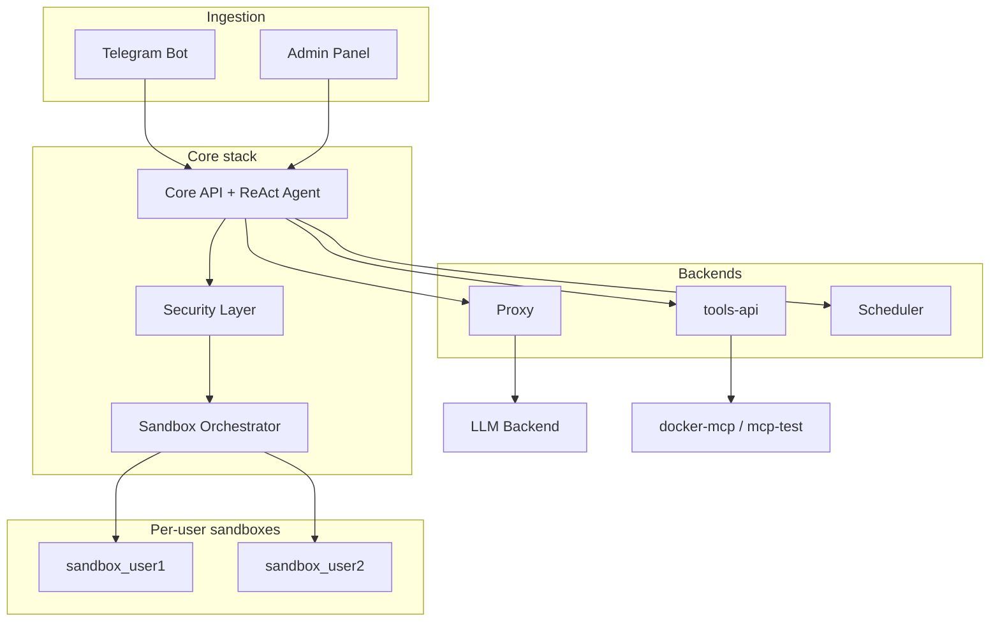
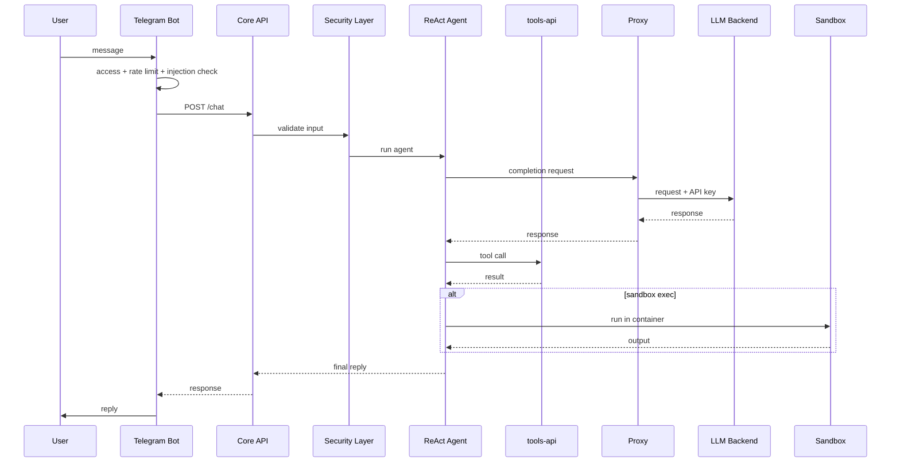
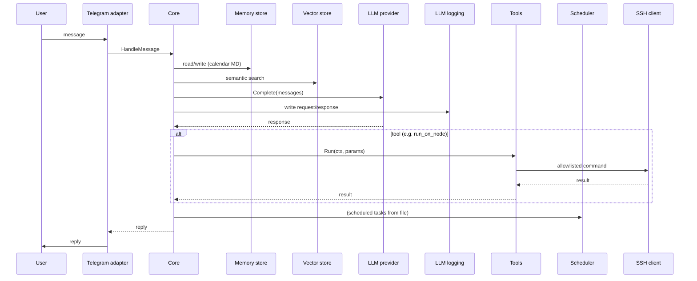
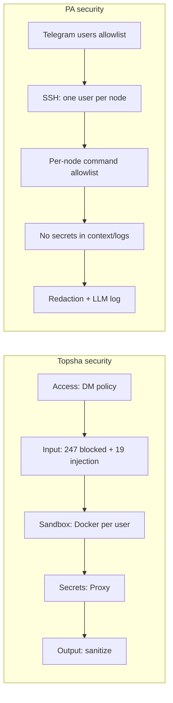

# Topsha (LocalTopSH): Internal Architecture Analysis and Comparison with PersonalAssistant

**Date of analysis:** 2026-03-15  
**Topsha repository:** [github.com/vakovalskii/topsha](https://github.com/vakovalskii/topsha)  
**Topsha revision analysed:** [main @ 74de2a0](https://github.com/vakovalskii/topsha/commit/74de2a062c50e95cf23c7b6e2a6505666b423fe9) (commit `74de2a062c50e95cf23c7b6e2a6505666b423fe9`)  
**PersonalAssistant revision analysed:** commit `e435df43c011105d79580c32cb1773bb3b2e046b` (short `e435df4`)

**Purpose:** Analyse Topsha (LocalTopSH) source code (structure, architecture, security, reliability, engineering culture) and compare with EP-104 PersonalAssistant design and implementation.  
**PA design reference:** [ep-scope.md](../../epics/EP-104/ep-scope.md), [ep-requirements.md](../../epics/EP-104/ep-requirements.md), [ep-system-design.md](../../epics/EP-104/ep-system-design.md).

---

## Table of contents

1. [High-level architecture](#1-high-level-architecture)
2. [Package layout and module boundaries](#2-package-layout-and-module-boundaries)
3. [Message processing / main flow](#3-message-processing--main-flow)
4. [Security](#4-security)
5. [Reliability and error handling](#5-reliability-and-error-handling)
6. [Component comparison table](#6-component-comparison-table)
7. [Flow comparison (Mermaid)](#7-flow-comparison-mermaid)
8. [Security analysis](#8-security-analysis)
9. [Summary](#9-summary)
10. [Engineering culture comparison](#10-engineering-culture-comparison)
11. [Recommendations for PA](#11-recommendations-for-pa)

---

## 1. High-level architecture

Topsha (marketed as LocalTopSH) is a **multi-service Python stack** for a self-hosted AI agent. It is **not** a single binary: it runs as several containers (core, bot, proxy, tools-api, admin, scheduler, optional MCP servers and per-user sandboxes). Entry points: **bot** (Telegram, aiogram), **core** (FastAPI + ReAct agent), **proxy** (LLM API + secrets), **tools-api** (tool registry, MCP, skills), **admin** (React SPA), **scheduler** (persistent tasks). The agent loop lives in **core**: ReAct (think → act → observe) with a security layer (blocked patterns, prompt-injection checks) and a sandbox orchestrator that spawns **per-user Docker containers** for tool execution.

**Data flow (simplified):**

1. **Bot:** Receives Telegram message → access control (admin/allowlist/pairing/public) → rate limit → prompt-injection check → HTTP POST to core `/chat`.
2. **Core:** Validates input (blocked patterns, injection) → runs ReAct agent (max iterations) → for each tool call, routes to tools-api or runs in per-user sandbox → proxy for LLM calls (agent never sees API keys).
3. **tools-api:** Serves tool definitions, MCP tools, skills; core calls it to list/execute tools.
4. **Scheduler:** Persistent JSON store; triggers tasks and calls core or sends messages via bot/userbot.

---

## 2. Package layout and module boundaries

Topsha is organized by **service (directory)**, not by Go-style `internal/` packages. There is no single repo-wide module-boundary script; each service has its own dependencies and layout.

| Topsha directory | Responsibility |
|------------------|----------------|
| **core/** | ReAct agent (`agent.py`), FastAPI API (`api.py`), config, security (blocked patterns, validation), sandbox orchestrator, tool execution; system prompt and approvals under `core/src/`. |
| **bot/** | Telegram bot (aiogram): `main.py`, handlers, access control (`access.py`), rate limiter, prompt-injection patterns, state, HTTP server for webhooks/callbacks. |
| **proxy/** | Single-purpose: LLM API proxy; injects API key from Docker secrets; agent talks to proxy, never to LLM directly. |
| **tools-api/** | FastAPI app: tool definitions, MCP client, skills discovery; routes for tools, MCP, skills. |
| **admin/** | React SPA (Vite): dashboard, config, MCP, skills; Basic Auth; talks to core admin API. |
| **scheduler/** | Persistent task scheduler (JSON storage); callbacks to core/bot/userbot. |
| **docker-mcp/, mcp-test/** | MCP servers (Docker management, test tools). |
| **scripts/** | `doctor.py` (security audit), `e2e_test.py`, `run_tests.py`. |

**Comparison with PA (EP-104):**

- **PA** uses a single binary with strict layers: `internal/telegram` → `internal/core` → interfaces only (`llm`, `memory`, `vector`, `embedding`); concrete impls wired in `cmd/pa`. **Topsha** has no `internal` boundary: multiple processes, each with its own codebase; core imports and calls tools-api and proxy over HTTP; there is no “core depends only on interfaces” rule or boundary checker.
- **PA** separates long-term **memory** (markdown store, calendar layout, summarization) and **vector** store. **Topsha** has a “memory” tool (persistent notes in workspace) and file-based workspace per user; no calendar memory, no vector store, no hierarchical summarization.

---

## 3. Message processing / main flow

**Bot → Core:**

- Bot: `handlers.py` → access control → prompt-injection check → `call_core(CORE_URL, /chat, {user_id, chat_id, message, ...})`.
- Core: `api.py` receives `ChatRequest` → `run_agent(user_id, chat_id, message, ...)`.

**run_agent (core/agent.py):**

1. Load tool definitions (from tools-api, cached).
2. Filter tools by session type (DM, group, sandbox, userbot) and permissions.
3. Build messages: system prompt + optional identity/workspace context.
4. ReAct loop (max 30 iterations): call LLM via proxy → parse tool calls → execute via tools-api or in sandbox → append results → repeat until no tool calls or limit.
5. Return final response to bot; bot sends reply to user.

**LLM:** Core sends requests to **proxy**; proxy adds API key and forwards to configured LLM backend (vLLM, Ollama, etc.). Agent never sees secrets.

**Comparison with PA:**

- **PA** core: one message in → read/write memory (calendar MD), vector search, single LLM call (no ReAct loop in current implementation), optional tool run (e.g. run_on_node), scheduler from file, reply out. **Topsha** uses a full ReAct loop with many built-in and MCP tools, per-user Docker sandboxes, and no SSH/node layer.
- **PA** scheduler: tasks from a file, cron-like + notify to Telegram. **Topsha** scheduler: persistent JSON store, callbacks to run agent or send message; different model but similar “scheduled task” idea.

---

## 4. Security

**Topsha:**

- **Access control (bot):** DM policy: admin / allowlist / pairing / public. Allowlist and pairing implemented in `bot/access.py`; rate limiting per user.
- **Input validation (core):** 247 blocked command patterns (`core/src/approvals/blocked-patterns.json`); 19 prompt-injection patterns (`bot/prompt-injection-patterns.json`). Request sanitization before agent run.
- **Sandbox:** Per-user Docker containers (512MB RAM, 50% CPU, 100 PIDs); network isolation; workspace mounted per user. Tool execution (e.g. `run_command`) runs inside sandbox when enabled.
- **Secrets:** Proxy holds API keys; agent talks only to proxy. Docker secrets mounted at `/run/secrets/`. Output sanitization (base64/hex detection) to reduce leakage.
- **Tool permissions:** By session type (main DM, group, sandbox, userbot); e.g. `send_dm`, `manage_message`, `schedule_task` restricted to certain contexts.

**PA (EP-104):**

- **Access control:** Single channel (Telegram); users file (user_id, role); only listed users can talk to the bot.
- **Execution:** No local exec from remote; **SSH to nodes** with dedicated user per node and **per-node command allowlist** (pattern/regex); exec-style only, no shell with untrusted input.
- **Secrets:** No secrets in prompts or logs (REQ-017); redaction subsystem (REQ-026–REQ-029). LLM logging to configurable path.

**Comparison:** Topsha focuses on **local** safety: multi-layer validation, per-user Docker sandbox, proxy for secrets. PA focuses on **remote node** safety: SSH, allowlist per node, no local exec from Telegram. Topsha has no SSH/node model; PA has no per-user sandbox or proxy pattern.

---

## 5. Reliability and error handling

**Topsha:**

- Config: env and files; services fail to start if critical config missing (e.g. token).
- Core: ReAct loop has max iterations; tool errors returned to agent; sandbox init failure disables sandbox (fallback to local execution with warnings).
- Proxy/tools-api: Health checks; errors logged.
- Scheduler: Persistent JSON; survives restarts; callbacks can fail and are logged.
- Scripts: `doctor.py` (security audit), `e2e_test.py` for end-to-end checks.

**PA:**

- Config validated at startup; invalid node/LLM/allowlist → exit non-zero (REQ-003). LLM/embedding errors handled without crash (REQ-025). Vector store optional start with empty index on load failure. SSH: only allowlisted commands; on failure log and report.

**Comparison:** Topsha has no vector store or SSH, so those failure modes do not apply. Its reliability is multi-service (health checks, restarts, sandbox fallback). PA adds explicit startup validation, LLM logging, and node verification (e.g. `-verify-nodes`).

---

## 6. Component comparison table

| Aspect | Topsha (LocalTopSH) | PersonalAssistant (EP-104) |
|--------|---------------------|----------------------------|
| **Entry** | Multi-service: core, bot, proxy, tools-api, admin, scheduler | Single binary `cmd/pa`; Telegram adapter → core |
| **Ingestion** | Telegram bot (aiogram) + Admin panel → core HTTP API | Telegram only (go-telegram/bot, polling) |
| **Orchestration** | ReAct agent in core; tool router → tools-api / sandbox | Core: message → memory + vector + LLM + tools + scheduler; optional SSH |
| **Module boundaries** | By service (directory); no internal/ or boundary script | internal/*; core only interfaces; wiring in cmd/pa; check-boundaries script |
| **LLM** | Proxy (secrets) → backend; agent never sees keys | Pluggable provider; ordered list, fallback; first provider used (TBD fallback chain) |
| **Memory (long-term)** | Memory tool (notes in workspace); per-user workspace; no calendar | Markdown store, calendar year/month/day, hierarchical summarization |
| **Vector store** | None | Pluggable interface; default SQLite+sqlite-vec or vecgo/chromem-go |
| **Tools** | Built-in (19) + MCP + skills; permissions by session type | Extensible registry; run_on_node (SSH); config enable/disable |
| **Exec** | Per-user Docker sandbox; 247 blocked patterns; no SSH | SSH to nodes only; dedicated user per node; per-node allowlist |
| **Scheduler** | Scheduler service; persistent JSON; callbacks to core/bot | Scheduler component; tasks from file; cron + notify to Telegram |
| **LLM logging** | Not a dedicated audit subsystem | Dedicated JSON Lines to configurable path; PA_LOG_LEVEL |
| **Secrets** | Proxy architecture; output sanitization | No secrets in context/logs; redaction (REQ-026–REQ-029) |

---

## 7. Flow comparison (Mermaid)

**Topsha (simplified):**

**PA (from design / implementation):**

---

## 8. Security analysis

**Assets and trust boundaries (Topsha):**

| Asset | Location | Trust boundary |
|-------|----------|----------------|
| API keys, tokens | Proxy; Docker secrets | Proxy only; agent never sees |
| Workspace files | Per-user dirs under /workspace | Sandbox + permissions |
| Tool execution | Per-user Docker container | Sandbox limits (RAM, CPU, PIDs, network) |
| User/channel identity | Bot access layer | admin/allowlist/pairing/public |

**PA:** Config (nodes, tokens) at operator; Telegram users file; node access via SSH with dedicated user and allowlist; no secrets in prompts/logs; redaction for logs.

**Gaps vs PA:**

- Topsha has **no SSH/node model**: no “managed nodes,” no per-node allowlist, no dedicated user per host. Exec is local (in sandbox) or via tools-api/MCP.
- Topsha has **no dedicated LLM audit log** (JSON Lines) like PA’s REQ-014/REQ-015; security is input/output validation and proxy, not request/response logging for audit.
- **Redaction:** PA requires built-in and additional patterns (REQ-026–REQ-029); Topsha has output sanitization (e.g. base64/hex) but not a full log-redaction subsystem.

**Summary diagram:**

---

## 9. Summary

- **Architecture:** Topsha is a multi-service Python stack (core, bot, proxy, tools-api, admin, scheduler) with ReAct agent and per-user Docker sandboxes; PA is a single Go binary with Telegram → core → memory/vector/LLM/tools/SSH/scheduler.
- **Security:** Topsha: access control, 247+19 patterns, sandbox isolation, proxy for secrets, output sanitization. PA: users allowlist, SSH to nodes with per-node allowlist, no secrets in context/logs, redaction and LLM logging.
- **Reliability:** Topsha: health checks, sandbox fallback, persistent scheduler, doctor/e2e scripts. PA: config validation at startup, LLM/vector error handling, node verification flag.
- **Fit for PA:** Topsha is a different product (self-hosted multi-tenant agent with local sandbox and MCP). PA’s focus on SSH nodes, calendar memory, vector search, and single-owner deployment is not mirrored in Topsha; overlap is in “Telegram bot + LLM + tools + scheduler” and in security ideas (allowlists, validation, secrets handling).

---

## 10. Engineering culture comparison

**Topsha:**

- **Docs:** README, ARCHITECTURE.md, SECURITY.md, AGENTS.md, IMPROVEMENTS.md, PROJECT_STATS.md; per-component README in google-workspace-mcp. No CONTRIBUTING in repo root.
- **CI:** No GitHub Actions in repo root; `google-workspace-mcp` has its own `.github/workflows` (ruff, publish). Main project relies on Docker Compose and manual/script testing.
- **Testing:** `core/tests/`, `tools-api/tests/`; scripts: `doctor.py`, `e2e_test.py`, `run_tests.py`, `agent_capabilities_test.py`.
- **Quality:** Security documented in layers; doctor script for audits; no single “make check” for the whole stack.

**PA:**

- **Process:** Agentic SDLC; scope, requirements, system design, implementation plan in ai-sdlc-artefacts; pipeline and skills in ai-sdlc/specification.
- **Code:** `make check` = fmt + vet + lint + coverage + check-boundaries; module-boundary script; tests and AC traceability.
- **No .github in PA root;** no CONTRIBUTING in Topsha root.

| Aspect | Topsha | PersonalAssistant (PA) |
|--------|--------|-------------------------|
| **Process** | README/ARCHITECTURE/SECURITY; no formal requirements/design artefacts in repo | Epic scope, requirements, system design, implementation plan; pipeline and skills |
| **CI (root)** | None | None (Makefile only) |
| **Testing** | Unit/integration in core and tools-api; doctor + e2e scripts | Unit + integration (pyramid); check-boundaries; coverage in make check |
| **Security in process** | SECURITY.md, doctor.py, layered design | REQ-017, REQ-026–REQ-029, allowlist, redaction, implementation-plan tasks |

---

## 11. Recommendations for PA

Features or practices from Topsha that PA could consider **without reducing reliability or security**, grouped by theme.

### 11.1 Access control and identity

- **DM policy modes (optional):** Topsha’s admin/allowlist/pairing/public gives operators a single knob. PA could keep “users file only” for MVP and later add an optional “pairing” mode (e.g. user requests access with code, admin approves) for controlled growth, without relaxing the rule that only allowed users talk to the bot.
- **Rate limiting:** Topsha rate-limits per user. PA could add optional per-user or global rate limits to protect against abuse or runaway usage, without changing allowlist semantics.

### 11.2 Security and validation

- **Structured security layers in docs:** Topsha’s SECURITY.md (access → input → sandbox → secrets → output) is easy to follow. PA could document its own layers (allowlist → node allowlist → no secrets → redaction → LLM log) in a similar one-page view for operators and auditors.
- **Blocked-pattern list for any future local exec:** If PA ever adds a local “run script” or similar (e.g. in a restricted context), maintaining a deny list (and optional allow list) like Topsha’s 247 patterns could reduce risk; today PA correctly avoids local exec from remote.

### 11.3 Observability and operations

- **Health endpoints:** Topsha exposes `/health` per service. PA could add a minimal `/health` or `/ready` (e.g. in a small HTTP server or alongside a future admin API) for orchestrators, without exposing config or secrets.
- **Startup summary:** Topsha prints a short startup summary (ports, model, sandbox status). PA could log a one-time summary (config path, node count, allowed users count, LLM provider, redaction/LLM log enabled) for operations and audit.

### 11.4 Scheduler and tasks

- **Persistent scheduler storage (optional):** Topsha’s scheduler uses persistent JSON so tasks survive restarts. PA’s file-based scheduled tasks already persist; if PA adds “user-created reminders” or dynamic tasks later, a simple persistent store (e.g. JSON or SQLite) could be considered, with the same security model (notify, allowlisted actions only).

### 11.5 What not to adopt

- **Do not add local exec from Telegram:** PA’s model is exec only on nodes via SSH with allowlist. Do not introduce a local shell/exec callable from Telegram in the style of Topsha’s sandbox/run_command; that would increase host attack surface.
- **Do not drop or relax redaction or LLM audit:** REQ-017, REQ-026–REQ-029 and the LLM request/response log are core to PA; keep them for any new context (e.g. future tools or scheduler payloads).
- **Do not relax node model:** Keep one dedicated user per node, per-node command allowlist, and startup verification (e.g. REQ-022).

---

*Report produced by the project-comparison-report skill. No changes were made to the cloned Topsha repository.*
