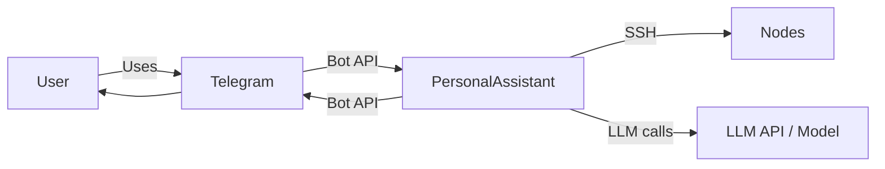

# PersonalAssistant MVP — Requirements (EARS / INCOSE)

**Total: 31 requirements (19 FR , 12 NFR)**

This document contains the product requirements for the PersonalAssistant MVP in EARS (Easy Approach to Requirements Syntax) form, aligned with INCOSE semantic quality rules 
(active voice, one thought per requirement, explicit and measurable criteria, defined terminology, no solution-free where applicable).

**Contents**

- [Introduction](#introduction)
- [Glossary](#glossary)
- [C4 C1 — System Context](#c4-c1--system-context)
- [Flow](#flow)
- [EARS patterns used](#ears-patterns-used)
- [Requirement index](#requirement-index)
- [Requirements](#requirements)
  - [Interface and deployment](#interface-and-deployment)
  - [Configuration paths and environment](#configuration-paths-and-environment)
  - [Nodes and SSH](#nodes-and-ssh)
  - [Memory and indexing](#memory-and-indexing)
  - [LLM and logging](#llm-and-logging)
  - [Scheduler and tools](#scheduler-and-tools)
  - [Extensibility and architecture](#extensibility-and-architecture)
  - [Version control and audit](#version-control-and-audit)
  - [Secret protection (prompt injection / exfiltration)](#secret-protection-prompt-injection--exfiltration)

---

## Introduction

This document is derived from [ep-scope.md](ep-scope.md). PersonalAssistant is a minimal MVP of a personal assistant, inspired by systems like [OpenClaw](https://github.com/openclaw/openclaw), with a focus on **reliability and security**. The target platform is Synology DS220+ (Docker). The user interacts via a Telegram bot; a Go core in a container manages nodes over SSH under a validated security model, stores long-term memory as markdown files, indexes it for vector search, supports swappable LLM backends (including self-hosted), and offers a task scheduler and extensible tools. Deployment and adding new nodes or tools are kept simple; the architecture is designed to evolve without radical redesign.

**MVP scope in brief:**

- Telegram bot for conversation.
- Go core in Docker (target hardware: Synology DS220+).
- SSH interaction with nodes under a clear, validated security model.
- Long-term memory in markdown files.
- Vector indexing for semantic retrieval.
- No vendor lock-in: support for multiple LLMs, including self-hosted.
- Scheduler for time- or interval-based tasks.
- Extensible tools with a single contract.
- Simple deployment and addition of nodes and tools.
- Architecture that allows future evolution without fundamental change.
- Dedicated user account on each node for PersonalAssistant only.
- Logging subsystem for LLM requests and responses (for analysis and audit).

---

## Glossary

Terms used in the requirements.

| Term                           | Definition                                                                                                                                                                                                                                                                                                                                                                                      |
| ------------------------------ | ----------------------------------------------------------------------------------------------------------------------------------------------------------------------------------------------------------------------------------------------------------------------------------------------------------------------------------------------------------------------------------------------- |
| **PersonalAssistant (System)** | The set of components: core (Go), Telegram adapter, memory store, vector index, scheduler, LLM providers, and tools. Deployed in Docker, target platform Synology DS220+.                                                                                                                                                                                                                       |
| **Core**                       | The main Go service: orchestration of conversations, LLM calls, tool execution, access to memory and scheduler, and SSH-based node management.                                                                                                                                                                                                                                                  |
| **Node**                       | A remote host (e.g. NAS, server) that the core connects to over SSH to run actions; has a defined capability set and credentials in configuration.                                                                                                                                                                                                                                              |
| **Security model**             | Explicit definition of which nodes are allowed, which commands/tools are permitted on each node, and how inputs and outputs are validated; validated at load and on configuration change.                                                                                                                                                                                                       |
| **Long-term memory**           | The assistant’s memory: a single store of facts and context held as markdown files in a defined directory structure; read/write by the core and indexer. It is not subdivided by interlocutor; the assistant has access to the full store regardless of who it is currently conversing with. Structure is calendar-based (year/month/day) with hierarchical summarization (day → month → year). |
| **Memory summarization**       | Process by which the assistant produces summary markdown files: at end of day from that day’s activity, at end of month from that month’s day summaries, at end of year from that year’s month summaries. Inputs include LLM logs, tool execution results, and scheduler execution events for the period.                                                                                       |
| **Vector store**               | Index of embeddings from long-term memory (and optionally conversations) for semantic search; provider (e.g. in-memory, file, DB) is pluggable.                                                                                                                                                                                                                                                 |
| **LLM provider**               | Abstraction for calling a language model (OpenAI-compatible API, Ollama, self-hosted); configuration specifies endpoint and parameters without vendor lock-in in code.                                                                                                                                                                                                                          |
| **Tool**                       | Extensible module: name, description, validated input schema, and implementation; registered with the core and invoked via a single contract.                                                                                                                                                                                                                                                   |
| **Scheduler**                  | Component that runs tasks on a schedule (cron-like or intervals); tasks are defined in configuration or API and run in the core context (tools, memory, optional Telegram notification).                                                                                                                                                                                                        |
| **Telegram**                   | External messaging platform and Bot API used as the user-facing interface; User and PersonalAssistant both interact with it.                                                                                                                                                                                                                                                                    |
| **User**                       | A person interacting with PersonalAssistant via the Telegram bot; identified by Telegram user ID.                                                                                                                                                                                                                                                                                               |
| **Operator**                   | The person who deploys, configures, and runs the PersonalAssistant (config file, environment variables, node/tool setup).                                                                                                                                                                                                                                                                        |
| **Deployment**                 | The process of running the stack (core and any separate services) via Docker Compose on DS220+; adding a new node or tool does not require rebuilding the core image when designed via config/plugins.                                                                                                                                                                                          |
| **Dedicated PA user**          | A dedicated user account on each node used only for PersonalAssistant access. All SSH connections to that node use this identity; no other user identity is used for that node.                                                                                                                                                                                                                 |
| **Logging subsystem**          | Component that records LLM interaction events: requests (input messages, call parameters, request ID) and responses (model output, token counts, metadata, duration) for analysis, debugging, and audit.                                                                                                                                                                                        |
| **Versioned state**            | Deferred post-MVP capability for git-backed tracking of PA-owned changes to designated artifacts. It is intentionally excluded from MVP implementation due to operational and security complexity.                                                                                                                                                                                                |

---

## C4 C1 — System Context

**Source:** [c4-context.puml](diagrams/c4-context.puml) (C4-PlantUML). To regenerate PNG: `plantuml -tpng diagrams/c4-context.puml` from this directory.

### Flow

High-level interaction flow at system context level: user messages via Telegram, PersonalAssistant uses LLM and Nodes as needed, replies via Telegram.

---

## EARS patterns used

- **Ubiquitous:** THE \<system\> SHALL \<response\>
- **Event-driven:** WHEN \<trigger\>, THE \<system\> SHALL \<response\>
- **State-driven:** WHILE \<condition\>, THE \<system\> SHALL \<response\>
- **Unwanted event:** IF \<condition\>, THEN THE \<system\> SHALL \<response\>
- **Optional feature:** WHERE \<option\>, THE \<system\> SHALL \<response\>
- **Complex:** Clauses in order WHERE → WHILE → WHEN/IF → THE → SHALL

In the following, *System* = PersonalAssistant (or the relevant component as stated).

---

## Requirement index

| Id      | Type | Section                             | Summary                                                                                                                      |
| ------- | ---- | ----------------------------------- | ---------------------------------------------------------------------------------------------------------------------------- |
| REQ-01.001 | FR   | Interface and deployment            | Telegram bot interface for messages and replies                                                                              |
| REQ-01.002 | NFR  | Interface and deployment            | Go core, Docker, target DS220+                                                                                               |
| REQ-01.003 | NFR  | Nodes and SSH                       | Validate node config at startup; fail or report error if invalid                                                             |
| REQ-01.004 | FR   | Nodes and SSH                       | Communicate with nodes only over SSH per validated config                                                                    |
| REQ-01.005 | NFR  | Nodes and SSH                       | Security model: per-node allow list for commands/tools                                                                       |
| REQ-01.006 | FR   | Memory and indexing                 | Long-term memory in designated directory as markdown files                                                                   |
| REQ-01.007 | FR   | Memory and indexing                 | Vector index and semantic search over memory                                                                                 |
| REQ-01.008 | FR   | LLM and logging                     | Pluggable LLM providers via configuration                                                                                    |
| REQ-01.009 | FR   | Scheduler and tools                 | Scheduler runs tasks at scheduled time/interval within security model                                                        |
| REQ-01.010 | FR   | Scheduler and tools                 | Extensible tools: name, description, validated schema, single contract                                                       |
| REQ-01.011 | FR   | Extensibility and architecture      | New nodes/tools loadable via config without core image rebuild                                                               |
| REQ-01.012 | NFR  | Extensibility and architecture      | Clear separation: adapters, core, memory, vector, LLM, scheduler, tools                                                      |
| REQ-01.013 | NFR  | Nodes and SSH                       | One dedicated SSH user per node; no other identity for that node                                                             |
| REQ-01.014 | NFR  | LLM and logging                     | Logging subsystem records LLM requests and responses                                                                         |
| REQ-01.015 | NFR  | LLM and logging                     | Configurable log destination and parseable log format                                                                        |
| REQ-01.016 | NFR  | Version control and audit           | Deferred post-MVP (git-backed state for PA-owned changes; not implemented in MVP)                                           |
| REQ-01.017 | NFR  | Secret protection                   | No secrets in LLM context, user-facing response, or logs; verified by prompt-injection tests                                 |
| REQ-01.018 | FR   | Memory and indexing                 | Memory is assistant's single store; not partitioned by interlocutor; full access regardless of current conversation partner  |
| REQ-01.019 | FR   | Memory and indexing                 | Memory structure: calendar year/month/day; hierarchical summarization (day → month → year); optional approval before persist |
| REQ-01.020 | FR   | Memory and indexing                 | Day summary inputs: LLM logs, tool execution results, scheduler events (and optionally other sources)                        |
| REQ-01.021 | NFR  | LLM and logging                     | Log level via PA_LOG_LEVEL; default INFO; at DEBUG full LLM request/response in core; at INFO metadata only                  |
| REQ-01.022 | FR   | Nodes and SSH                       | CLI parameter to verify node availability: connect and run one allowlisted command per node; report and exit without serving |
| REQ-01.023 | FR   | Scheduler and tools                 | Scheduler "notify" action: destination chat from telegram.notify_chat_id or first allowed user                               |
| REQ-01.024 | NFR  | Nodes and SSH                       | Startup validation: refuse to start or clear error for invalid/incomplete config (file, Telegram, users, LLM, embedding)     |
| REQ-01.025 | NFR  | LLM and logging                     | LLM/embedding provider errors handled without crash (4xx, empty, network, context canceled)                                  |
| REQ-01.026 | NFR  | Secret protection                   | Redaction applied to LLM log and application log output before writing                                                       |
| REQ-01.027 | NFR  | Secret protection                   | Built-in redaction patterns in code; not overridable by configuration                                                        |
| REQ-01.028 | NFR  | Secret protection                   | Additional redaction patterns from config; ids must not clash with built-in                                                  |
| REQ-01.029 | NFR  | Secret protection                   | Config load validates redaction; refuse start on reserved id or invalid regex                                                |
| REQ-01.030 | NFR  | Configuration paths and environment | Config path from PA_CONFIG_DIR; PA_DATA_DIR/PA_SECRETS_DIR resolution (relative/absolute/unset)                              |
| REQ-01.031 | FR   | LLM and logging                     | On connection/network failure of current LLM provider, try next in llm_providers order; if all fail, return error to caller  |

---

## Requirements

### Interface and deployment

*REQ-01.001, REQ-01.002*

### REQ-01.001 — Telegram bot interface for messages and replies
THE PersonalAssistant SHALL provide a Telegram bot interface through which the user sends text messages and receives text replies from the assistant.

### REQ-01.002 — Go core, Docker, target DS220+
THE PersonalAssistant core SHALL be implemented in Go and SHALL be deployable as a Docker container targeting Synology DS220+ (x86_64).

---

### Configuration paths and environment

*REQ-01.030*

### REQ-01.030 — Config path from PA_CONFIG_DIR; PA_DATA_DIR/PA_SECRETS_DIR resolution (relative/absolute/unset)
WHEN the operator runs the application, THE PersonalAssistant SHALL resolve the main configuration file path from the environment variable `PA_CONFIG_DIR` when set (directory containing the config file or path to the file); when `PA_CONFIG_DIR` is unset or empty, THE system SHALL use a documented default (e.g. current directory or default path). WHEN resolving paths for data and secrets directories (e.g. `PA_DATA_DIR`, `PA_SECRETS_DIR`), THE PersonalAssistant SHALL interpret relative paths relative to a defined base (e.g. current working directory), SHALL leave absolute paths unchanged, and SHALL treat unset or empty environment as a documented default (e.g. ".").

---

### Nodes and SSH

*REQ-01.003, REQ-01.024, REQ-01.004, REQ-01.005, REQ-01.013, REQ-01.022*

### REQ-01.003 — Validate node config at startup; fail or report error if invalid
WHEN the operator adds or updates node configuration (host, SSH user, authentication method), THE PersonalAssistant SHALL validate the configuration at startup and SHALL refuse to start or SHALL report a clear error if the configuration is invalid or incomplete.

### REQ-01.024 — Startup validation: refuse to start or clear error for invalid/incomplete config (file, Telegram, users, LLM, embedding)
WHEN the operator provides invalid or incomplete configuration (e.g. config file missing or invalid JSON, Telegram token_path missing or token file unreadable, users file invalid, LLM or embedding provider type unsupported or API key file missing), THE PersonalAssistant SHALL refuse to start or SHALL report a clear error identifying the failure.

### REQ-01.004 — Communicate with nodes only over SSH per validated config
WHILE the PersonalAssistant is running, THE PersonalAssistant SHALL communicate with nodes only over SSH using credentials and hosts defined in the validated node configuration.

### REQ-01.005 — Security model: per-node allow list for commands/tools
THE PersonalAssistant SHALL enforce a documented security model that defines, per node, which commands or tools are allowed; execution on a node SHALL be limited to that allow list.

### REQ-01.013 — One dedicated SSH user per node; no other identity for that node
WHILE the PersonalAssistant connects to a node over SSH, THE PersonalAssistant SHALL use exactly one dedicated user identity per node defined in the node configuration; THE PersonalAssistant SHALL NOT use any other user identity or shared account for that node.

### REQ-01.022 — CLI parameter to verify node availability: connect and run one allowlisted command per node; report and exit without serving
WHERE the operator invokes the application with a designated parameter to verify node availability, THE PersonalAssistant SHALL load the validated configuration and SHALL attempt to connect to each configured node over SSH using that node’s credentials and SHALL run one allowlisted command (or a documented probe command) per node; THE PersonalAssistant SHALL report success or failure per node and SHALL exit without starting the normal serving mode (e.g. Telegram bot).

---

### Memory and indexing

*REQ-01.006, REQ-01.018, REQ-01.019, REQ-01.020, REQ-01.007*

### REQ-01.006 — Long-term memory in designated directory as markdown files
WHEN the assistant reads or writes long-term memory, THE PersonalAssistant SHALL use a designated directory and SHALL store and read content as markdown files in a defined structure (e.g. by topic or date).

### REQ-01.018 — Memory is assistant's single store; not partitioned by interlocutor; full access regardless of current conversation partner
THE PersonalAssistant long-term memory SHALL be the assistant’s single memory store. THE PersonalAssistant SHALL NOT subdivide memory into non-overlapping blocks per interlocutor. THE PersonalAssistant SHALL give the assistant access to the full memory store regardless of which user or channel the assistant is currently conversing with.

### REQ-01.019 — Memory structure: calendar year/month/day; hierarchical summarization (day → month → year); optional approval before persist
THE PersonalAssistant long-term memory SHALL be organized in a calendar directory structure: year / month / day (e.g. 2026/02/16). THE PersonalAssistant SHALL support hierarchical summarization: at the end of each day the assistant SHALL produce a day-level summary markdown file from that day’s activity; at the end of each month a month-level summary from that month’s day summaries; at the end of each year a year-level summary from that year’s month summaries. The operator MAY configure that each such summary SHALL be persisted only after approval by the owner or admin.

### REQ-01.020 — Day summary inputs: LLM logs, tool execution results, scheduler events (and optionally other sources)
WHEN producing day-level memory summaries, THE PersonalAssistant SHALL use as input at least: (1) LLM request/response logs for that day, (2) results of tool executions that occurred that day, and (3) scheduler task execution events for that day. The implementation MAY include additional sources (e.g. explicit memory writes, errors) as defined in design or configuration.

### REQ-01.007 — Vector index and semantic search over memory
THE PersonalAssistant SHALL maintain a vector index of content from the long-term memory store and SHALL support semantic search over that index to retrieve relevant context for user queries.

---

### LLM and logging

*REQ-01.008, REQ-01.031, REQ-01.025, REQ-01.014, REQ-01.015, REQ-01.021*

### REQ-01.008 — Pluggable LLM providers via configuration
THE PersonalAssistant SHALL support pluggable LLM providers (e.g. OpenAI-compatible API, Ollama, self-hosted); the active provider and its parameters SHALL be selected via configuration without code changes.

### REQ-01.031 — On connection/network failure of current LLM provider, try next in llm_providers order; if all fail, return error to caller
WHEN a request to the current LLM provider fails due to connection or network error (e.g. unreachable host, timeout, or provider returns 5xx), THE PersonalAssistant SHALL attempt the next provider in the `llm_providers` configuration order until one succeeds or all have been tried. WHEN all configured providers have been tried and none succeeded, THE PersonalAssistant SHALL return an error to the caller (e.g. to the user or to the invoking component) and SHALL NOT crash.

### REQ-01.025 — LLM/embedding provider errors handled without crash (4xx, empty, network, context canceled)
WHEN an LLM or embedding provider call fails (e.g. 4xx/5xx, empty response, network error, context canceled), THE PersonalAssistant SHALL handle the error (e.g. propagate to caller or return a safe response) and SHALL NOT crash.

### REQ-01.014 — Logging subsystem records LLM requests and responses
THE PersonalAssistant SHALL provide a logging subsystem that records, for each call to an LLM provider: the request (input messages, model parameters, and a request identifier) and the response (model output, token counts when available, and response metadata such as duration and model identifier).

### REQ-01.015 — Configurable log destination and parseable log format
WHEN the operator configures the logging subsystem, THE PersonalAssistant SHALL accept a configurable log destination (e.g. file path or directory) and SHALL write LLM request/response log entries to that destination in a defined, parseable format so that the operator can analyze and retain logs according to local policy.

### REQ-01.021 — Log level via PA_LOG_LEVEL; default INFO; at DEBUG full LLM request/response in core; at INFO metadata only
WHILE the application is running, THE PersonalAssistant SHALL support a configurable log level for LLM conversation logging. THE default log level SHALL be INFO. WHEN the environment variable `PA_LOG_LEVEL` is set to `debug` (case-insensitive), THE core SHALL log, at the point of each LLM call (in the core handler, so that the full assembled context including memory and vector search is visible), the full request (messages sent to the provider, optionally truncated if exceeding a documented length) and the full response (model output and usage). WHEN the log level is INFO or higher, THE core SHALL log only metadata (e.g. message count, response length, token usage) and SHALL NOT log full request or response bodies.

---

### Scheduler and tools

*REQ-01.009, REQ-01.023, REQ-01.010*

### REQ-01.009 — Scheduler runs tasks at scheduled time/interval within security model
WHEN the scheduled time or interval for a configured task is reached, THE PersonalAssistant scheduler SHALL execute the task (invoking the defined action, e.g. tool or notification) within the constraints of the security model.

### REQ-01.023 — Scheduler "notify" action: destination chat from telegram.notify_chat_id or first allowed user
WHEN a scheduled task has action "notify", THE PersonalAssistant SHALL send the notification message to a Telegram chat determined by configuration. WHEN `telegram.notify_chat_id` is set to a non-zero value, THE PersonalAssistant SHALL use that chat ID as the destination. WHEN `telegram.notify_chat_id` is zero or omitted and the allowed-users list (from `telegram.users_path`) is non-empty, THE PersonalAssistant SHALL use the first allowed user’s ID as the destination chat. WHEN no destination is available (zero or omitted `notify_chat_id` and no allowed users), THE PersonalAssistant SHALL NOT send the message and SHALL log or handle the condition according to implementation.

### REQ-01.010 — Extensible tools: name, description, validated schema, single contract
THE PersonalAssistant SHALL support extensible tools: each tool SHALL have a name, a description, and a validated input schema; tools SHALL be registered with the core and invoked by the core according to a single contract.

---

### Extensibility and architecture

*REQ-01.011, REQ-01.012*

### REQ-01.011 — New nodes/tools loadable via config without core image rebuild
WHEN the operator adds a new node or a new tool via the designated configuration or extension mechanism, THE PersonalAssistant SHALL load and use the new node or tool after restart or hot-reload without requiring a rebuild of the core image (where hot-reload is supported).

### REQ-01.012 — Clear separation: adapters, core, memory, vector, LLM, scheduler, tools
THE PersonalAssistant architecture SHALL separate clearly: ingestion adapters (e.g. Telegram), core orchestration, memory store, vector index, LLM provider abstraction, scheduler, and tools; so that replacing or extending one of these parts does not require a full redesign.

---

### Version control and audit (Deferred — out of MVP scope)

*REQ-01.016*

### REQ-01.016 — Deferred post-MVP (git-backed state for PA-owned changes; not implemented in MVP)
THE PersonalAssistant SHALL support a configurable git-backed versioned state in the PA working directory (inside container, on persistent volume) to track version history of designated artifacts changed by PA itself (e.g. non-secret config, scripts, memory files). The feature SHALL be controlled by configuration (enable/disable, tracked paths, commit periodicity). Automatic tracking of external/manual file edits is out of scope. On commit failure, the system SHALL keep running and notify the operator.  
**MVP status:** Deferred (out of EP-001 implementation scope).  
**Rationale:** Requires additional safe restart/rollback orchestration, security policy hardening for self-modifying flows, and dedicated reliability tests.

---

### Secret protection (prompt injection / exfiltration)

*REQ-01.017, REQ-01.026, REQ-01.027, REQ-01.028, REQ-01.029*

### REQ-01.017 — No secrets in LLM context, user-facing response, or logs; verified by prompt-injection tests
THE PersonalAssistant SHALL NOT include secret values (tokens, API keys, SSH private keys, or other credentials) in the data sent to the LLM as context (system prompt, message history, or retrieved memory), in user-facing responses in a way that could expose them, or in log output. The implementation SHALL be verified by tests that inject known fake secrets and prompt-injection style user messages and assert that the assistant’s reply and log output do not contain those secrets.

### REQ-01.026 — Redaction applied to LLM log and application log output before writing
THE PersonalAssistant SHALL apply configurable redaction to all data written to the LLM request/response log and to application log output so that configured secret patterns are replaced by a non-secret placeholder before writing.

### REQ-01.027 — Built-in redaction patterns in code; not overridable by configuration
THE PersonalAssistant SHALL provide a fixed set of built-in redaction patterns (pattern identifier, regular expression, replacement string) defined in code and SHALL apply these patterns to log output; configuration SHALL NOT override or disable built-in patterns.

### REQ-01.028 — Additional redaction patterns from config; ids must not clash with built-in
WHEN the operator supplies a valid `log_redaction.additional_patterns` configuration, THE PersonalAssistant SHALL apply those patterns in addition to the built-in patterns; each additional pattern SHALL have a unique pattern identifier that SHALL NOT match any built-in pattern identifier.

### REQ-01.029 — Config load validates redaction; refuse start on reserved id or invalid regex
WHEN the application loads configuration, THE PersonalAssistant SHALL validate the redaction configuration: if an additional pattern identifier equals a built-in identifier, or if a pattern regular expression fails to compile, THE PersonalAssistant SHALL refuse to start and SHALL report a clear error message stating the cause (e.g. reserved identifier or invalid regex).