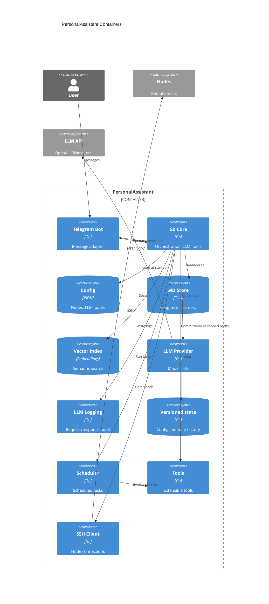
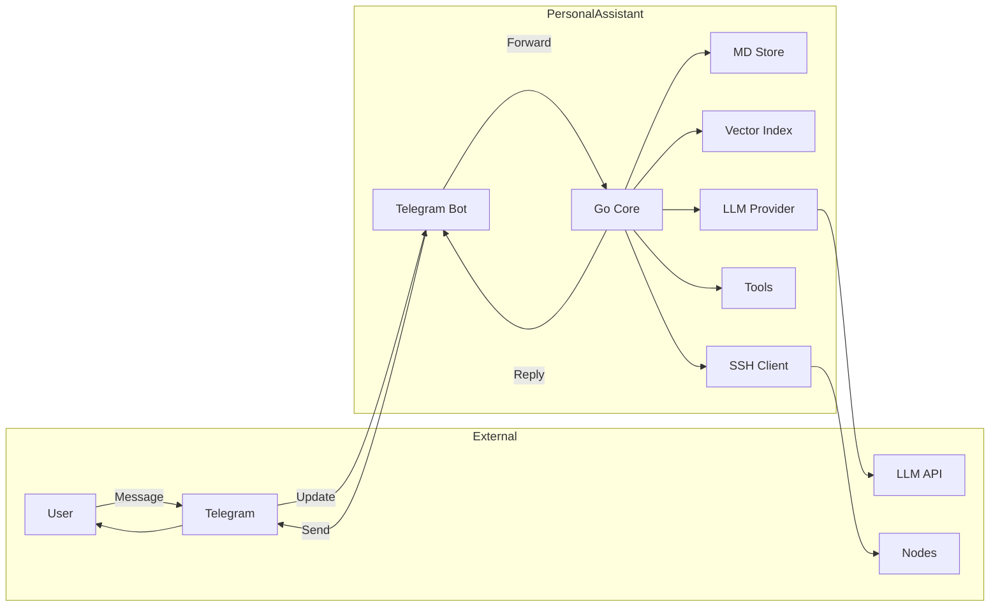
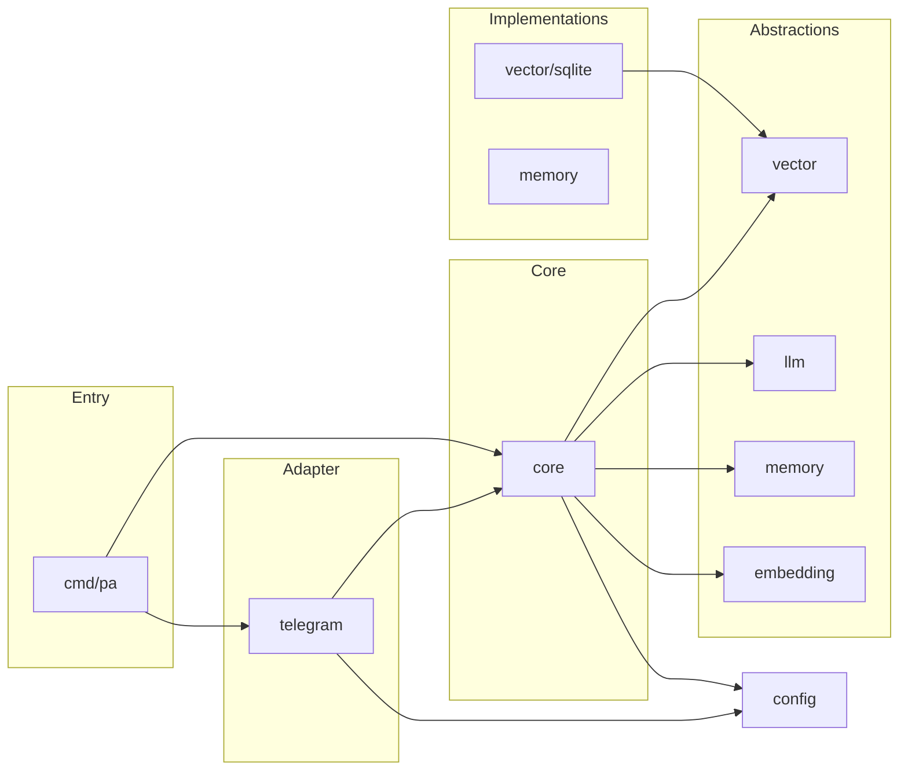

# System Design: EP-001 Personal Assistant MVP

**Purpose:** Define architecture, components, interfaces, data models, error handling, and key technical decisions.  
**Related:** [ep-scope.md](ep-scope.md), [ep-requirements.md](ep-requirements.md), [../../strategy.md](../../strategy.md)  
**Source baseline:** [EP-104 system design](../EP-104/ep-system-design.md) (adapted for EP-001).

---

## Contents

- [Overview](#overview)
- [Architecture](#architecture)
  - [C4 C2 — Containers](#c4-c2--containers)
  - [Request flow](#request-flow)
- [Components and interfaces](#components-and-interfaces)
- [Data models](#data-models)
- [Error handling](#error-handling)
- [Testing strategy](#testing-strategy)

---

## Overview

PersonalAssistant MVP is designed as a single-process Go service deployed in Docker on x86_64 target hardware (including DS220+ class devices). The design keeps clear module boundaries between ingestion, orchestration, storage, retrieval, model providers, scheduling, tools, node access, and logging. Configuration is validated at startup and controls provider selection, storage paths, scheduler inputs, and node execution policy ([REQ-002](ep-requirements.md#interface-and-deployment), [REQ-003](ep-requirements.md#nodes-and-ssh), [REQ-008](ep-requirements.md#llm-and-logging)).

This document reuses the proven EP-104 architecture baseline and maps it to EP-001 requirements.

---

## Architecture

- **Ingestion:** Telegram adapter receives user messages and forwards them to core orchestration ([REQ-001](ep-requirements.md#interface-and-deployment)).
- **Core orchestration:** Core coordinates memory read/write, semantic retrieval, LLM calls, tool execution, scheduler triggers, and node operations ([REQ-006](ep-requirements.md#memory-and-indexing), [REQ-007](ep-requirements.md#memory-and-indexing), [REQ-008](ep-requirements.md#llm-and-logging), [REQ-009](ep-requirements.md#scheduler-and-tools), [REQ-010](ep-requirements.md#scheduler-and-tools)).
- **Storage and retrieval:** Long-term memory is markdown-based and calendar-structured; vector index supports semantic search over memory ([REQ-018](ep-requirements.md#memory-and-indexing), [REQ-019](ep-requirements.md#memory-and-indexing), [REQ-020](ep-requirements.md#memory-and-indexing)).
- **Node access:** SSH execution is constrained by validated node configuration, dedicated per-node identity, and command allowlists ([REQ-004](ep-requirements.md#nodes-and-ssh), [REQ-005](ep-requirements.md#nodes-and-ssh), [REQ-013](ep-requirements.md#nodes-and-ssh)).
- **Observability and safety:** LLM request/response logging, configurable destination and level, plus redaction safeguards for secrets ([REQ-014](ep-requirements.md#llm-and-logging), [REQ-015](ep-requirements.md#llm-and-logging), [REQ-021](ep-requirements.md#llm-and-logging), [REQ-026](ep-requirements.md#secret-protection-prompt-injection--exfiltration)).

**C4 C1 (System Context):** [ep-requirements.md — C4 C1](ep-requirements.md#c4-c1--system-context). **C4 C2 (Containers):** see below ([REQ-012](ep-requirements.md#extensibility-and-architecture)).

### C4 C2 — Containers

System context (who and what external systems) is in [ep-requirements — C4 C1](ep-requirements.md#c4-c1--system-context). This diagram zooms into the containers of PersonalAssistant.

### Request flow

Main path of a user message through the system ([REQ-001](ep-requirements.md#interface-and-deployment), [REQ-006](ep-requirements.md#memory-and-indexing), [REQ-008](ep-requirements.md#llm-and-logging)):

### Module boundaries

Module boundaries keep replacement and extension costs low ([REQ-012](ep-requirements.md#extensibility-and-architecture)).

| Layer | Typical packages | Rules |
|-------|------------------|-------|
| Ingestion adapter | `internal/telegram` | Depends on config + core contracts only. |
| Core | `internal/core` | Depends on interfaces/contracts, not concrete implementations. |
| Storage and retrieval | `internal/memory`, `internal/vector`, optional implementation packages | Implementation packages depend on contracts; wiring done at entrypoint. |
| Model providers | `internal/llm`, provider-specific packages | Core uses provider contracts; config selects provider order/fallback. |
| Scheduler and tools | `internal/scheduler`, `internal/tools` | Scheduler invokes tools by contract and enforces policy. |
| Node access | `internal/ssh`, `internal/allowlist`, runner packages | Enforces dedicated identity and allowlist policy. |
| Infrastructure | `internal/config`, `internal/llmlog`, `internal/logredact` | Handles config loading, logging, and redaction. |

**Dependency direction (allowed flow):**

Wiring principle: the entrypoint (`cmd/...`) composes concrete implementations; core remains implementation-agnostic.

---

## Components and interfaces

| Component | Responsibility | Key contract / traceability |
|-----------|----------------|-----------------------------|
| Config loader and validator | Parse and validate runtime config, users, paths, providers, node policies. | Startup validation and fail-fast behavior ([REQ-003](ep-requirements.md#nodes-and-ssh), [REQ-024](ep-requirements.md#nodes-and-ssh)). |
| Telegram adapter | Receive updates, submit messages to core, return responses. | Message flow and input handling ([REQ-001](ep-requirements.md#interface-and-deployment)). |
| Core orchestrator | Coordinate conversation flow and invoke all subsystems. | End-to-end behavior and modularity ([REQ-012](ep-requirements.md#extensibility-and-architecture)). |
| Memory store | Persist and read markdown memory in calendar structure. | Memory format and summarization inputs ([REQ-006](ep-requirements.md#memory-and-indexing), [REQ-019](ep-requirements.md#memory-and-indexing), [REQ-020](ep-requirements.md#memory-and-indexing)). |
| Vector index | Maintain embeddings index and serve semantic retrieval. | Retrieval quality and provider resilience ([REQ-007](ep-requirements.md#memory-and-indexing), [REQ-025](ep-requirements.md#llm-and-logging)). |
| LLM provider layer | Provide pluggable completion interface with fallback/error handling. | Provider selection and robustness ([REQ-008](ep-requirements.md#llm-and-logging), [REQ-025](ep-requirements.md#llm-and-logging)). |
| Scheduler | Execute scheduled tasks and notifications under policy. | Task timing and notify routing ([REQ-009](ep-requirements.md#scheduler-and-tools), [REQ-023](ep-requirements.md#scheduler-and-tools)). |
| Tools runtime | Register tools and enforce input contract before execution. | Tool contract and validation ([REQ-010](ep-requirements.md#scheduler-and-tools), [REQ-011](ep-requirements.md#extensibility-and-architecture)). |
| SSH node runner | Connect and run allowlisted commands as dedicated user. | Node policy and verification behavior ([REQ-004](ep-requirements.md#nodes-and-ssh), [REQ-005](ep-requirements.md#nodes-and-ssh), [REQ-013](ep-requirements.md#nodes-and-ssh), [REQ-022](ep-requirements.md#nodes-and-ssh)). |
| Logging and redaction | Record LLM interactions and redact sensitive data before write. | Auditability and secret protection ([REQ-014](ep-requirements.md#llm-and-logging), [REQ-015](ep-requirements.md#llm-and-logging), [REQ-017](ep-requirements.md#secret-protection-prompt-injection--exfiltration), [REQ-026](ep-requirements.md#secret-protection-prompt-injection--exfiltration), [REQ-027](ep-requirements.md#secret-protection-prompt-injection--exfiltration), [REQ-028](ep-requirements.md#secret-protection-prompt-injection--exfiltration), [REQ-029](ep-requirements.md#secret-protection-prompt-injection--exfiltration)). |

---

## Data models

- **Configuration model:** Nodes, SSH/auth settings, allowlist references, provider list, memory/log/data path settings, scheduler task source, Telegram settings and notification destination ([REQ-003](ep-requirements.md#nodes-and-ssh), [REQ-023](ep-requirements.md#scheduler-and-tools), [REQ-030](ep-requirements.md#configuration-paths-and-environment)).
- **Memory model:** Markdown files in year/month/day layout; day/month/year summary chain with inputs from logs, tool results, and scheduler events ([REQ-019](ep-requirements.md#memory-and-indexing), [REQ-020](ep-requirements.md#memory-and-indexing)).
- **LLM log model:** Request/response records with identifiers, payload metadata, and usage/duration in parseable format ([REQ-014](ep-requirements.md#llm-and-logging), [REQ-015](ep-requirements.md#llm-and-logging)).
- **Tool invocation model:** Tool metadata and validated parameters before runtime execution ([REQ-010](ep-requirements.md#scheduler-and-tools)).

---

## Error handling

- **Startup fail-fast:** Invalid or incomplete config blocks startup with clear error messages ([REQ-003](ep-requirements.md#nodes-and-ssh), [REQ-024](ep-requirements.md#nodes-and-ssh)).
- **Provider failures:** LLM and embedding provider failures are handled without process crash ([REQ-025](ep-requirements.md#llm-and-logging)).
- **Execution policy violations:** Non-allowlisted actions are denied and reported; no fallback to broader permissions ([REQ-005](ep-requirements.md#nodes-and-ssh), [REQ-013](ep-requirements.md#nodes-and-ssh)).
- **Logging and secrecy violations:** Redaction configuration errors fail startup; log outputs must not expose secrets ([REQ-017](ep-requirements.md#secret-protection-prompt-injection--exfiltration), [REQ-026](ep-requirements.md#secret-protection-prompt-injection--exfiltration), [REQ-027](ep-requirements.md#secret-protection-prompt-injection--exfiltration), [REQ-028](ep-requirements.md#secret-protection-prompt-injection--exfiltration), [REQ-029](ep-requirements.md#secret-protection-prompt-injection--exfiltration)).

---

## Testing strategy

- **Unit tests:** Config validation, allowlist matching, tool input validation, logging/redaction formatting, path resolution.
- **Integration tests:** Core orchestration with provider adapters, vector index behavior, scheduler + tools, SSH runner policy enforcement.
- **End-to-end tests:** Message in → core flow → response out; verify logging, memory write/read, and guarded execution paths.
- **Deployment verification:** Build and run dockerized service on target-compatible x86_64 environment; verify startup validation and one full interaction flow ([REQ-001](ep-requirements.md#interface-and-deployment), [REQ-002](ep-requirements.md#interface-and-deployment)).
