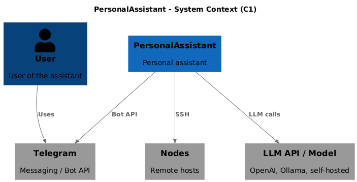
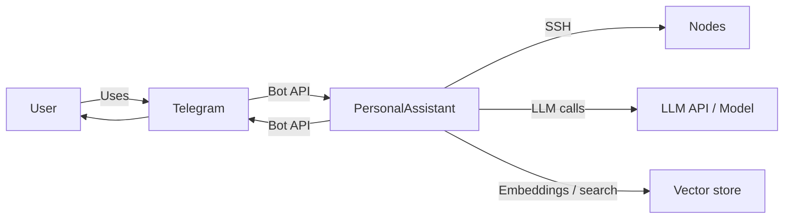

# EP-002 Automatic memory summarization — Requirements (EARS / INCOSE)

This document contains the product requirements for EP-002 (Automatic memory summarization) in EARS form, aligned with INCOSE semantic quality rules (active voice, one thought per requirement, explicit and measurable criteria, defined terminology, solution-free where applicable).

**Total: 16 requirements (12 FR, 4 NFR)**

**Contents**

- [Introduction](#introduction)
- [Glossary](#glossary)
- [C4 C1 — System Context](#c4-c1--system-context)
- [Flow](#flow)
- [EARS patterns used](#ears-patterns-used)
- [Requirement index](#requirement-index)
- [Requirements](#requirements)
  - [Automatic summarization schedule](#automatic-summarization-schedule)
  - [Startup catch-up](#startup-catch-up)
  - [Date and chunk labels in vector memory](#date-and-chunk-labels-in-vector-memory)
  - [Memory retrieval (skill and native tool)](#memory-retrieval-skill-and-native-tool)
  - [Upsert semantics](#upsert-semantics)
  - [Non-functional](#non-functional)

---

## Introduction

This document is derived from [ep-scope.md](ep-scope.md). EP-002 builds on EP-001 (PersonalAssistant MVP). It adds automatic execution of day, month, and year summarization (no user or external cron), startup catch-up for missed runs, calendar-day alignment with **pa_timezone** for scheduling and **memory_dir** paths, date-aware vector storage with **chunk type labels**, and calendar-bound answers via a **memory retrieval runtime skill** plus **native tool(s)** with ISO date arguments (together with semantic vector retrieval). See [ep-scope.md](ep-scope.md) **Design decisions — automatic summarization (runtime)** for scheduling queue priority, persistence order, and package boundary.

**Epic scope in brief:**

- Automatic day summarization for the previous calendar day at a fixed time (e.g. 01:00 in pa_timezone).
- Automatic month and year summarization on schedule (e.g. first day of month/year in pa_timezone).
- Startup catch-up for yesterday and, where applicable, missed month or year summaries.
- Every vector store document includes the calendar date (or month/year) in the stored text; retrieved chunks include type labels (turn, summary:day, summary:month, summary:year).
- Native memory-read tool(s) with structured ISO date or bounded range arguments; memory retrieval policy in a runtime skill (EP-013).
- Upsert for re-runs; hybrid core rule-based date injection deferred (see ep-scope).

---

## Glossary

Terms from the project [scope.md](../../scope.md), from [EP-001 epic scope](../EP-001/ep-scope.md), and from this epic’s [ep-scope.md](ep-scope.md) apply. Epic-specific terms:

| Term | Definition |
|------|------------|
| **Day summary** | A markdown summary of one calendar day's LLM conversation, produced from that day's LLM log entries; stored under memory_dir (YYYY/MM/DD/summary.md) and in the vector store. Calendar components of the path are interpreted in **pa_timezone** per ep-scope. |
| **Month summary** | A markdown summary of one calendar month, produced from that month's day summaries; stored under memory_dir (YYYY/MM/summary.md) and in the vector store. |
| **Year summary** | A markdown summary of one calendar year, produced from that year's month summaries; stored under memory_dir (YYYY/summary.md) and in the vector store. |
| **Upsert (day/month/year)** | When writing a summary for a date (day, month, or year) that already has a summary, the existing summary in the memory store and in the vector store is replaced rather than duplicated. |
| **Startup catch-up** | On server start, running summarization for a past period (e.g. yesterday, previous month, previous year) when that period has source data but no summary exists, so that a missed scheduled run is recovered. |
| **pa_timezone** | IANA timezone (e.g. Europe/Moscow) from config; used for calendar-day boundaries, scheduled run times, and the calendar date encoded in memory_dir paths for new writes. |
| **Memory retrieval tool** | A **native** tool (product code, not operator catalog) that reads long-term memory from memory_dir using structured ISO date arguments only, with validation and bounded output. |
| **Memory retrieval skill** | A runtime skill package whose policy defines when the assistant uses the memory retrieval tool(s) and how ambiguous relative calendar phrases in pa_timezone are handled. |
| **read_memory** | The stable native tool identifier for reading `memory_dir` by ISO date or bounded range; registered on the native tool registry and referenced from runtime skill `tools:` lists (EP-013 validation). |
| **Vector reconciliation** | A background step that embeds and upserts vector index rows from an **existing** summary file when a prior indexing step failed, without re-running the summarization LLM for that period. |

---

## C4 C1 — System Context

**Source:** [c4-context.puml](diagrams/c4-context.puml) (C4-PlantUML). To regenerate PNG: `plantuml -tpng diagrams/c4-context.puml` from this directory.

### Flow

High-level interaction flow: the user messages via Telegram; PersonalAssistant uses the LLM, optional nodes, **semantic vector retrieval**, and **tool calls** (including native memory retrieval). Automatic summarization and catch-up run inside PersonalAssistant on a schedule or at startup. Calendar-bound recall uses the **memory retrieval skill** and **native memory tool(s)** under EP-013; the core message handler does not implement a separate rule-based phrase-to-date map for injection.

---

## EARS patterns used

- **Ubiquitous:** THE \<system\> SHALL \<response\>
- **Event-driven:** WHEN \<trigger\>, THE \<system\> SHALL \<response\>
- **State-driven:** WHILE \<condition\>, THE \<system\> SHALL \<response\>
- **Unwanted event:** IF \<condition\>, THEN THE \<system\> SHALL \<response\>
- **Optional feature:** WHERE \<option\>, THE \<system\> SHALL \<response\>
- **Complex:** Clauses in order WHERE → WHILE → WHEN/IF → THE → SHALL

In the following, *System* = PersonalAssistant (or the relevant component as stated).

---

## Requirement index

| Id | Type | Section | Summary |
|----|------|---------|---------|
| REQ-02.001 | FR | Automatic summarization schedule | Day summarization for previous calendar day at fixed built-in local time (01:00) in pa_timezone |
| REQ-02.002 | FR | Automatic summarization schedule | Month summarization for previous calendar month on first local day at 01:00 in pa_timezone |
| REQ-02.003 | FR | Automatic summarization schedule | Year summarization for previous calendar year on first local day at 01:00 in pa_timezone |
| REQ-02.004 | NFR | Automatic summarization schedule | Schedules built-in in code; no external cron; no JSON for summarization timing |
| REQ-02.005 | FR | Startup catch-up | Day catch-up when previous day has logs and no day summary |
| REQ-02.006 | FR | Startup catch-up | Month catch-up when previous month has day summaries and no month summary |
| REQ-02.007 | FR | Startup catch-up | Year catch-up when previous year has month summaries and no year summary |
| REQ-02.008 | FR | Date and chunk labels | Vector documents include calendar date (or month/year) in stored text |
| REQ-02.009 | FR | Date and chunk labels | Retrieved vector chunks include type label in text passed to LLM |
| REQ-02.010 | FR | Memory retrieval | Native **read_memory** tool; ISO date or bounded range; reject oversized range |
| REQ-02.011 | FR | Memory retrieval | Memory retrieval runtime skill governs tool use and phrase policy |
| REQ-02.012 | FR | Memory retrieval | Semantic vector search remains available independently of memory tool calls |
| REQ-02.013 | FR | Upsert semantics | Re-run replaces existing summary in memory and vector for that period |
| REQ-02.014 | NFR | Non-functional | Automated tests; existing tests pass |
| REQ-02.015 | NFR | Non-functional | Interactive LLM work takes precedence over background summarization |
| REQ-02.016 | NFR | Non-functional | Failed vector step after successful file write completes on a later run |

---

## Requirements

### Automatic summarization schedule

*REQ-02.001, REQ-02.002, REQ-02.003, REQ-02.004*

**REQ-02.001** (Ubiquitous)  
THE system SHALL run day summarization for the **previous calendar day** in **pa_timezone** at a fixed built-in local wall-clock time of **01:00** in **pa_timezone**, without manual or external cron intervention.

**REQ-02.002** (Ubiquitous)  
THE system SHALL run month summarization for the **previous calendar month** in **pa_timezone** on a defined built-in schedule: the **first calendar day** of the new month in **pa_timezone** at **01:00** local in **pa_timezone**, without manual or external cron intervention.

**REQ-02.003** (Ubiquitous)  
THE system SHALL run year summarization for the **previous calendar year** in **pa_timezone** on a defined built-in schedule: the **first calendar day** of the new year in **pa_timezone** at **01:00** local in **pa_timezone**, without manual or external cron intervention.

**REQ-02.004** (NFR)  
The schedules for day, month, and year summarization SHALL be built-in and mandatory; the system SHALL NOT rely on the operator to configure external cron or equivalent to trigger summarization. The wall-clock fire times above, the in-process scheduler tick interval, the per-summarization job timeout, and the bounded vector-reconciliation scan depth SHALL be defined in product code and SHALL NOT require operator JSON configuration for automatic summarization.

---

### Startup catch-up

*REQ-02.005, REQ-02.006, REQ-02.007*

**REQ-02.005** (Event-driven)  
WHEN the server starts AND the **previous calendar day** in **pa_timezone** has at least one LLM log entry AND no day summary exists for that day, THE system SHALL run day summarization for that day once (startup catch-up).

**REQ-02.006** (Event-driven)  
WHEN the server starts AND a **previous calendar month** in **pa_timezone** has at least one day summary AND no month summary exists for that month, THE system SHALL run month summarization for that month once (startup catch-up).

**REQ-02.007** (Event-driven)  
WHEN the server starts AND a **previous calendar year** in **pa_timezone** has at least one month summary AND no year summary exists for that year, THE system SHALL run year summarization for that year once (startup catch-up).

---

### Date and chunk labels in vector memory

*REQ-02.008, REQ-02.009*

**REQ-02.008** (Ubiquitous)  
THE system SHALL store every document in the vector store (conversation turns and day, month, and year summaries) with the calendar date (or month/year) included in the stored text (e.g. "Date: YYYY-MM-DD" or equivalent) so that retrieved context is date-aware.

**REQ-02.009** (Ubiquitous)  
WHEN the system injects vector search results into the LLM context, THE system SHALL prefix or otherwise label each chunk with its type in the text passed to the model using the set **turn**, **summary:day**, **summary:month**, and **summary:year**.

---

### Memory retrieval (skill and native tool)

*REQ-02.010, REQ-02.011, REQ-02.012*

**REQ-02.010** (Ubiquitous)  
THE system SHALL provide a **native** tool identified as **read_memory** that returns long-term memory content from **memory_dir** for **structured ISO 8601 calendar date arguments** (a single date or a bounded **from**–**to** range), rejects arbitrary filesystem paths, and enforces configured maximum span and maximum output size. WHEN the requested range exceeds those limits, THE system SHALL **reject** the tool call with a structured error (no silent truncation of range reads in the baseline product behaviour).

**REQ-02.011** (Ubiquitous)  
THE system SHALL ship or configure a **memory retrieval** runtime skill (per EP-013) whose documented policy states when the assistant invokes **read_memory** and how relative calendar phrases in **pa_timezone** are resolved or clarified with the user. THE skill package frontmatter SHALL list **read_memory** under `tools` so EP-013 tool validation passes against the native allowlist.

**REQ-02.012** (Ubiquitous)  
THE system SHALL retain semantic search over the vector store for user messages regardless of whether the memory retrieval tool is invoked for the same message.

---

### Upsert semantics

*REQ-02.013*

**REQ-02.013** (Event-driven)  
WHEN summarization is run for a calendar day, month, or year that already has a summary in the memory store or vector store, THE system SHALL replace the existing summary (upsert semantics) so that no duplicate summary documents exist for that period.

---

### Non-functional

*REQ-02.014, REQ-02.015, REQ-02.016*

**REQ-02.014** (NFR)  
New or changed behaviour introduced in this epic SHALL be covered by unit and/or integration tests; all existing tests SHALL continue to pass.

**REQ-02.015** (NFR)  
WHEN both an interactive user LLM request and an automatic summarization job are pending, THE system SHALL schedule the interactive work ahead of the summarization job so that user-facing latency is not blocked indefinitely by background summarization.

**REQ-02.016** (NFR)  
IF the system writes a day, month, or year summary file to **memory_dir** and a subsequent vector indexing step for that summary fails, THEN THE system SHALL complete vector indexing for that summary without requiring operator action by running **vector reconciliation** for that calendar period (embed and upsert from the existing file, without a new summarization LLM call). THAT reconciliation SHALL run on a subsequent **process startup** or **background reconciliation cycle** before normal operation continues, in addition to any path that re-runs summarization upsert for the same period.
