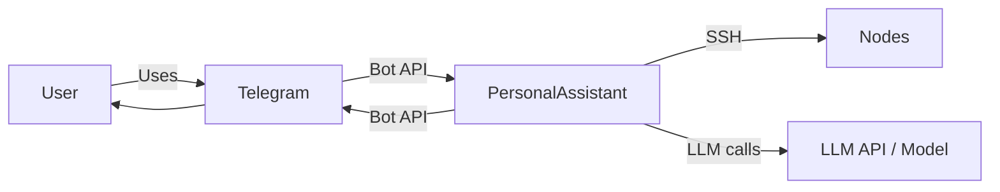

# EP-002 Automatic memory summarization — Requirements (EARS / INCOSE)

This document contains the product requirements for EP-002 (Automatic memory summarization) in EARS form, aligned with INCOSE semantic quality rules (active voice, one thought per requirement, explicit and measurable criteria, defined terminology, solution-free where applicable).

**Total: 13 requirements (11 FR, 2 NFR)**

**Contents**

- [Introduction](#introduction)
- [Glossary](#glossary)
- [C4 C1 — System Context](#c4-c1--system-context)
- [Flow](#flow)
- [EARS patterns used](#ears-patterns-used)
- [Requirement index](#requirement-index)
- [Requirements](#requirements)
  - [Automatic summarization schedule](#automatic-summarization-schedule)
  - [Startup catch-up](#startup-catch-up)
  - [Date in vector memory and context](#date-in-vector-memory-and-context)
  - [Date resolution](#date-resolution)
  - [Upsert semantics](#upsert-semantics)
  - [Non-functional](#non-functional)

---

## Introduction

This document is derived from [ep-scope.md](ep-scope.md). EP-002 builds on EP-001 (PersonalAssistant MVP). It adds automatic execution of day, month, and year summarization (no user or external cron), startup catch-up for missed runs, date-aware vector storage, rule-based date resolution, and injection of a specific day's summary into the LLM context when the user asks about a past date (e.g. "What did we talk about last Thursday?").

**Epic scope in brief:**

- Automatic day summarization for the previous day at a fixed time (e.g. 01:00 in pa_timezone).
- Automatic month and year summarization on schedule (e.g. first day of month/year).
- Startup catch-up: run summarization for yesterday (or missed month/year) when the server starts and summaries are missing.
- Every vector store document includes the calendar date (or month/year) in the stored text.
- When the user message indicates a specific date, resolve it and inject that day's summary into context when it exists.
- Rule-based date resolution (yesterday, last Monday … Sunday, last week) without LLM.
- Upsert: re-running summarization for the same day/month/year replaces the existing summary (no duplicates).

---

## Glossary

Terms from the project [scope.md](../../scope.md) and [EP-001 ep-scope](ep-scope.md) apply. Epic-specific terms:

| Term | Definition |
|------|------------|
| **Day summary** | A markdown summary of one calendar day's LLM conversation, produced from that day's LLM log entries; stored under memory_dir (YYYY/MM/DD/summary.md) and in the vector store. |
| **Month summary** | A markdown summary of one calendar month, produced from that month's day summaries; stored under memory_dir (YYYY/MM/summary.md) and in the vector store. |
| **Year summary** | A markdown summary of one calendar year, produced from that year's month summaries; stored under memory_dir (YYYY/summary.md) and in the vector store. |
| **Date resolution** | The process of interpreting a user phrase (e.g. "last Thursday", "в прошлый четверг") into a concrete calendar date (YYYY-MM-DD) using a reference date and timezone (pa_timezone). |
| **Upsert (day/month/year)** | When writing a summary for a date (day, month, or year) that already has a summary, the existing summary in the memory store and in the vector store is replaced rather than duplicated. |
| **Startup catch-up** | On server start, running summarization for a past period (e.g. yesterday, previous month, previous year) when that period has source data but no summary exists, so that a missed scheduled run is recovered. |
| **pa_timezone** | IANA timezone (e.g. Europe/Moscow) from config; used for calendar-day boundaries and scheduled run times. |

---

## C4 C1 — System Context

**Source:** [c4-context.puml](diagrams/c4-context.puml) (C4-PlantUML). To regenerate PNG: `plantuml -tpng diagrams/c4-context.puml` from this directory.

### Flow

High-level interaction flow at system context level: user messages via Telegram, PersonalAssistant uses LLM and nodes as needed, replies via Telegram. Automatic summarization and catch-up run inside PersonalAssistant on a schedule or at startup; date resolution and date-based context injection occur when processing user messages.

---

## EARS patterns used

- **Ubiquitous:** THE \<system\> SHALL \<response\>
- **Event-driven:** WHEN \<trigger\>, THE \<system\> SHALL \<response\>
- **State-driven:** WHILE \<condition\>, THE \<system\> SHALL \<response\>
- **Unwanted event:** IF \<condition\>, THEN THE \<system\> SHALL \<response\>
- **Optional feature:** WHERE \<option\>, THE \<system\> SHALL \<response\>
- **Complex:** Clauses in order WHERE → WHILE → WHEN/IF → THE → SHALL

In the following, *System* = PersonalAssistant (or the relevant component as stated).

---

## Requirement index

| Id | Type | Section | Summary |
|----|------|---------|---------|
| REQ-02.001 | FR | Automatic summarization schedule | Day summarization for previous day at configured time in pa_timezone |
| REQ-02.002 | FR | Automatic summarization schedule | Month summarization for previous month on schedule (e.g. first day of new month) |
| REQ-02.003 | FR | Automatic summarization schedule | Year summarization for previous year on schedule (e.g. first day of new year) |
| REQ-02.004 | NFR | Automatic summarization schedule | Schedules built-in and mandatory (no external cron) |
| REQ-02.005 | FR | Startup catch-up | Day catch-up when yesterday has logs and no day summary |
| REQ-02.006 | FR | Startup catch-up | Month catch-up when previous month has day summaries and no month summary |
| REQ-02.007 | FR | Startup catch-up | Year catch-up when previous year has month summaries and no year summary |
| REQ-02.008 | FR | Date in vector memory and context | Every vector store document includes calendar date (or month/year) in text |
| REQ-02.009 | FR | Date in vector memory and context | When user message indicates a date and day summary exists, inject it into LLM context |
| REQ-02.010 | FR | Date resolution | Resolve defined relative-date phrases to YYYY-MM-DD using pa_timezone, no LLM |
| REQ-02.011 | FR | Date resolution | When message does not match a date phrase, do not inject date-specific day summary |
| REQ-02.012 | FR | Upsert semantics | Re-run summarization for same day/month/year replaces existing summary (memory and vector) |
| REQ-02.013 | NFR | Non-functional | New or changed behaviour covered by tests; existing tests pass |

---

## Requirements

### Automatic summarization schedule

*REQ-02.001, REQ-02.002, REQ-02.003, REQ-02.004*

**REQ-02.001** (Ubiquitous)  
THE system SHALL run day summarization for the previous calendar day at a configured time (e.g. 01:00) in pa_timezone, without manual or external cron intervention.

**REQ-02.002** (Ubiquitous)  
THE system SHALL run month summarization for the previous calendar month on a defined schedule (e.g. first day of the new month in pa_timezone), without manual or external cron intervention.

**REQ-02.003** (Ubiquitous)  
THE system SHALL run year summarization for the previous calendar year on a defined schedule (e.g. first day of the new year in pa_timezone), without manual or external cron intervention.

**REQ-02.004** (NFR)  
The schedules for day, month, and year summarization SHALL be built-in and mandatory; the system SHALL NOT rely on the operator to configure external cron or equivalent to trigger summarization.

---

### Startup catch-up

*REQ-02.005, REQ-02.006, REQ-02.007*

**REQ-02.005** (Event-driven)  
WHEN the server starts AND the previous calendar day has at least one LLM log entry AND no day summary exists for that day, THE system SHALL run day summarization for that day once (startup catch-up).

**REQ-02.006** (Event-driven)  
WHEN the server starts AND a previous calendar month has at least one day summary AND no month summary exists for that month, THE system SHALL run month summarization for that month once (startup catch-up).

**REQ-02.007** (Event-driven)  
WHEN the server starts AND a previous calendar year has at least one month summary AND no year summary exists for that year, THE system SHALL run year summarization for that year once (startup catch-up).

---

### Date in vector memory and context

*REQ-02.008, REQ-02.009*

**REQ-02.008** (Ubiquitous)  
THE system SHALL store every document in the vector store (conversation turns and day, month, and year summaries) with the calendar date (or month/year) included in the stored text (e.g. "Date: YYYY-MM-DD" or equivalent) so that retrieved context is date-aware.

**REQ-02.009** (Event-driven)  
WHEN the user message indicates a specific date (e.g. "what we talked about last Thursday") AND the system resolves that phrase to a calendar date AND a day summary exists for that date, THE system SHALL inject that day summary explicitly into the LLM context (e.g. with date and optional weekday) so the assistant can answer date-bound questions.

---

### Date resolution

*REQ-02.010, REQ-02.011*

**REQ-02.010** (Ubiquitous)  
THE system SHALL resolve a defined set of relative-date phrases (e.g. yesterday, last Monday through last Sunday, last week) to a calendar date (YYYY-MM-DD) using the current date and pa_timezone, without calling the LLM for date parsing.

**REQ-02.011** (Event-driven)  
WHEN the user message does not match any supported date phrase, THE system SHALL NOT inject a date-specific day summary based on date resolution (semantic search may still return relevant context).

---

### Upsert semantics

*REQ-02.012*

**REQ-02.012** (Event-driven)  
WHEN summarization is run for a calendar day, month, or year that already has a summary in the memory store or vector store, THE system SHALL replace the existing summary (upsert semantics) so that no duplicate summary documents exist for that period.

---

### Non-functional

*REQ-02.013*

**REQ-02.013** (NFR)  
New or changed behaviour introduced in this epic SHALL be covered by unit and/or integration tests; all existing tests SHALL continue to pass.
