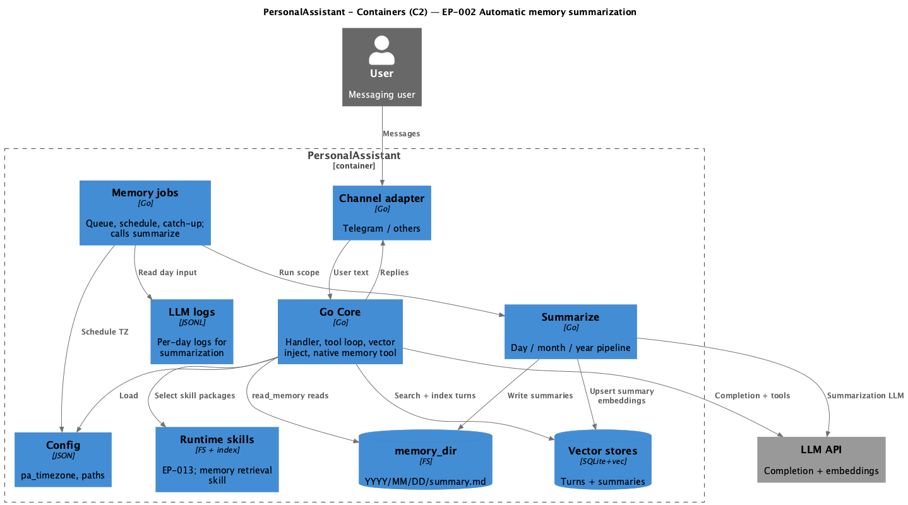

# EP-002 Automatic memory summarization — System design

**Pipeline:** Stage 6.  
**Inputs:** [ep-requirements.md](ep-requirements.md), [ep-acceptance-criteria.md](ep-acceptance-criteria.md), [ep-scope.md](ep-scope.md)

## Contents

- [Overview](#overview)
- [Architecture](#architecture)
- [Components and interfaces](#components-and-interfaces)
- [Data models](#data-models)
- [Error handling](#error-handling)
- [Risks and trade-offs](#risks-and-trade-offs)
- [Testing strategy](#testing-strategy)
- [Requirement traceability](#requirement-traceability)

---

## Overview

EP-002 adds **automatic** day, month, and year summarization aligned to **pa_timezone**, **startup catch-up**, **date + chunk-type** text in vector payloads, a **priority job queue** for background summarization vs interactive LLM work, **vector reconciliation** after failed embedding, and **calendar-bound recall** via the native **`read_memory`** tool plus **memory retrieval runtime skill** (EP-013). Invariants and operator E2E: [ep-scope.md](ep-scope.md). Scheduling and queue logic live in **`internal/memoryjob`** wired from `cmd/pa`; **wall-clock fire times (01:00 local), scheduler tick, job timeout, and reconciliation scan depth are fixed constants in code**—not JSON config keys. [REQ-02.001](ep-requirements.md#automatic-summarization-schedule)–[REQ-02.016](ep-requirements.md#non-functional).

---

## Architecture

**Source:** [diagrams/c4-container.puml](diagrams/c4-container.puml). Regenerate: `plantuml -tpng diagrams/c4-container.puml` from this directory.

### Module boundaries

| Layer | Responsibility |
|-------|----------------|
| **`cmd/pa`** | Starts channel adapter, core handler dependencies, **memory job runner** (queue + timers), graceful shutdown. |
| **`internal/memoryjob` (new)** | Computes next run times in **pa_timezone**, owns a **single priority queue** (lower number runs first). Enqueues day/month/year summarization, catch-up, and **vector reconciliation**; invokes `summarize` with **timeout context**. **Interactive precedence** is not implemented by enqueuing user work at priority **0**—see **Job queue** row and [REQ-02.015](ep-requirements.md#non-functional). [REQ-02.001](ep-requirements.md#automatic-summarization-schedule)–[REQ-02.007](ep-requirements.md#startup-catch-up), [REQ-02.016](ep-requirements.md#non-functional). |
| **`internal/summarize`** | Existing day/month/year pipeline; extended inputs for **tz-aware day boundaries** when reading logs and writing paths. [REQ-02.001](ep-requirements.md#automatic-summarization-schedule)–[REQ-02.003](ep-requirements.md#automatic-summarization-schedule), [REQ-02.013](ep-requirements.md#upsert-semantics). |
| **`internal/memory`** | Filesystem layout under `memory_dir`; unchanged path rules, **calendar components = pa_timezone** per ep-scope. |
| **`internal/core`** | `indexTurn` / retrieval assembly: **Date:** line + **`[turn]`** / **`[summary:*]`** prefixes. Registers native tool **`read_memory`**. [REQ-02.008](ep-requirements.md#date-and-chunk-labels-in-vector-memory)–[REQ-02.012](ep-requirements.md#memory-retrieval-skill-and-native-tool). |
| **`internal/vector`** | Upsert by stable ids for summaries; [REQ-02.013](ep-requirements.md#upsert-semantics), [REQ-02.016](ep-requirements.md#non-functional). |
| **Runtime skills (EP-013)** | Operator-supplied **memory retrieval** package; skill text defines tool usage and phrase policy. [REQ-02.011](ep-requirements.md#memory-retrieval-skill-and-native-tool). |

---

## Components and interfaces

| Component | Responsibility | Requirements |
|-----------|----------------|---------------|
| **Memory job scheduler** | Computes fire times from **fixed** rules: local hour **01** and minute **≥ 0** in **pa_timezone** for “yesterday” each calendar day (first scheduler tick in the **01:xx** window fires once per day key via `lastDailyFireKey`; same idea for month/year keys on the first day of month/year). In-process tick and timeouts from package constants; pushes jobs to queue. | [REQ-02.001](ep-requirements.md#automatic-summarization-schedule)–[REQ-02.004](ep-requirements.md#automatic-summarization-schedule) |
| **Job queue** | One priority min-heap: dequeue **lowest numeric priority** first. Priorities in product code: **vector reconciliation 4**, **catch-up day/month/year 5**, **scheduled summarization 10**. While **`core.UserTurnInProgress()`** is true, jobs with priority **≥ 5** are **not** executed: they are re-queued with a short backoff so interactive LLM work in the same process is not starved. **Reconciliation (4) is not deferred** by that guard (intentional: heal file-without-vector gaps quickly; may contend on embedder/CPU with an active user turn—documented trade-off). **Interactive turns are not enqueued as memoryjob items** at priority 0; precedence vs catch-up/scheduled jobs is this deferral model. [AC-02.016](ep-acceptance-criteria.md#ac-02-016) remains testable on ordering among enqueued priorities. | [REQ-02.015](ep-requirements.md#non-functional) |
| **Catch-up coordinator** | On startup, enqueues missing day/month/year jobs per ep-scope rules at **priority 5**. | [REQ-02.005](ep-requirements.md#startup-catch-up)–[REQ-02.007](ep-requirements.md#startup-catch-up) |
| **Vector reconciliation worker** | On startup and/or periodic tick: **bounded scan of recent day summary files** (last **N** calendar days in code) vs vector **Exists**; **read file → embed → upsert** (no summarization LLM). Month/year files are **not** scanned on this periodic pass—gaps are still covered by enqueue-on-failure from `summarize` and operator/CLI backfill if needed. Triggered also immediately after a failed vector write from `summarize`. | [REQ-02.016](ep-requirements.md#non-functional) |
| **Summarize runner** | Calls `summarize.Day` / `Month` / `Year` with `context.WithTimeout`; **file write then vector**; on vector failure, enqueue **reconciliation** job and log. | [REQ-02.001](ep-requirements.md#automatic-summarization-schedule)–[REQ-02.003](ep-requirements.md#automatic-summarization-schedule), [REQ-02.016](ep-requirements.md#non-functional) |
| **LLM log reader** | Selects entries belonging to calendar day **D** in **pa_timezone** (same definition as memory paths). | [REQ-02.001](ep-requirements.md#automatic-summarization-schedule), [REQ-02.005](ep-requirements.md#startup-catch-up) |
| **Vector indexer (turns + summaries)** | Stores text including `Date: …` and stable ids for summaries; delete-before-add upsert. | [REQ-02.008](ep-requirements.md#date-and-chunk-labels-in-vector-memory), [REQ-02.013](ep-requirements.md#upsert-semantics) |
| **Retrieval assembler** | Builds chunk text for the dynamic system tail from each vector hit: ensures a visible **`[turn]`** / **`[summary:*]`** line for the model. Stored document text already includes `Date:` and, for indexed turns and summaries, an inner **`[turn]`** / **`[summary:*]`** line; the implementation **does not add a second** outer `[label]` line when that marker is already present in the stored body. | [REQ-02.009](ep-requirements.md#date-and-chunk-labels-in-vector-memory) |
| **Native `read_memory`** | Args: `date` **or** `from`,`to` (ISO dates); validates max span and max output bytes; **rejects** over-limit calls (no truncation). Reads only resolved paths under `memory_dir` (no raw path args). Invocable only when tool-calling is active for the request; same trust boundary as other native tools in the LLM tool list. Registered whenever **memory_dir** is configured; JSON may set **limits only** (`max_span_days`, `max_output_bytes`). Tool id **`read_memory`** on native registry and EP-013 allowlist. | [REQ-02.010](ep-requirements.md#memory-retrieval-skill-and-native-tool) |
| **Tool + skill wiring** | Register `read_memory`; EP-013 `ValidateToolRefs` / native allowlist includes **`read_memory`**. Sample skill `SKILL.md` frontmatter: `tools: ["read_memory"]`. Exposed to model when memory retrieval package is selected for the turn. | [REQ-02.011](ep-requirements.md#memory-retrieval-skill-and-native-tool), [REQ-02.012](ep-requirements.md#memory-retrieval-skill-and-native-tool) |
| **CLI `-summarize=`** | Retained for operator backfill; same summarize code path as automatic jobs. | — |
| **Built-in scheduling** | Summarization fires from in-process scheduler only; no external cron requirement. | [REQ-02.004](ep-requirements.md#automatic-summarization-schedule) |

---

## Data models

- **Calendar day key:** `(year, month, day)` in **pa_timezone** for scheduling, log filtering, and `memory_dir` segments. [REQ-02.001](ep-requirements.md#automatic-summarization-schedule), [REQ-02.005](ep-requirements.md#startup-catch-up).
- **Job record:** `{ kind: day|month|year|catchup_day|…, period ref, enqueued_at }` (exact shape in implementation plan).
- **Vector document text:** Prefix lines or headers: `Date: YYYY-MM-DD` (or month/year variant) plus an inner type line **`[turn]`** / **`[summary:*]`** in stored text where applicable. Retrieval assembly adds an outer **`[type]`** line only when the stored body does not already contain the same marker (avoids duplicate labels in the LLM prompt). [REQ-02.008](ep-requirements.md#date-and-chunk-labels-in-vector-memory), [REQ-02.009](ep-requirements.md#date-and-chunk-labels-in-vector-memory).
- **Tool arguments (JSON schema):** e.g. `{ "date": "2026-04-10" }` or `{ "from": "2026-04-01", "to": "2026-04-07" }` with `max_days` and `max_output_bytes`; violation → tool error JSON, not truncated body. [REQ-02.010](ep-requirements.md#memory-retrieval-skill-and-native-tool).
- **Filesystem reads:** Implementation resolves paths with `filepath.Clean` and **prefix check** under `memory_dir`; does not follow symlinks outside the resolved day directories (policy: reject or skip symlinked files—implementation choice documented in code comments).

---

## Error handling

- **Config load:** Invalid or missing **pa_timezone** → fail fast at startup (align with existing config validation). [REQ-02.001](ep-requirements.md#automatic-summarization-schedule).
- **Summarization LLM / embed failure:** Log; **no partial vector** without successful file write policy per ep-scope (file first); vector failure after file write → enqueue **vector reconciliation** job. [REQ-02.016](ep-requirements.md#non-functional).
- **`read_memory`:** Invalid ISO, range over limits, path escape attempt → structured tool error to model (no raw stack in user chat). [REQ-02.010](ep-requirements.md#memory-retrieval-skill-and-native-tool).
- **Queue:** Background job **timeout** cancels context; job marked failed; summarization retries on next schedule; reconciliation retries independently. [REQ-02.015](ep-requirements.md#non-functional): catch-up and scheduled jobs yield to an active user turn via **`UserTurnInProgress`** (see Job queue row); reconciliation (priority 4) is not deferred by that hook.
- **Logging:** Tool results and memory snippets follow existing **redaction** rules for LLM and app logs (align with EP-001 patterns).

---

## Risks and trade-offs

- **Clock skew / process sleep:** Missed ticks recovered by **catch-up** and reconciliation; duplicate summarization cost accepted per [ep-scope.md](ep-scope.md) (upsert idempotent).
- **EP-013 misconfiguration:** If `read_memory` is not on allowlist or skill omits `tools`, model cannot call tool—operator must fix config; fail-fast at skill load where EP-013 already validates tool refs.
- **Priority inversion:** If interactive traffic is constant, summarization may stall; mitigation: cap interactive queue depth is **out of scope**; observability (log “summarization delayed”) recommended post-MVP.
- **Reconciliation scan cost / coverage:** Periodic scan compares **day** summary files only over a **fixed bounded window** (e.g. last **90** days) in code. Month/year summary files are **not** included in that scan; recovery for those paths relies primarily on the **enqueue-on-vector-failure** path after `summarize` writes markdown, plus operator **CLI `-summarize=`** if needed.

---

## Testing strategy

- **Unit:** Time helpers (next 01:00 in zone, “yesterday”), job ordering, tool arg validation, chunk label formatting. [REQ-02.014](ep-requirements.md#non-functional).
- **Integration:** Fake clock or short schedule in tests; catch-up on restart; upsert idempotence; vector text contains date + type labels; tool read after write. Map to [ep-acceptance-criteria.md](ep-acceptance-criteria.md).
- **Manual:** [ep-scope.md](ep-scope.md) **Manual E2E scenario** for operator smoke (Telegram + logs).

---

## Requirement traceability

| REQ | Addressed in design (sections) |
|-----|--------------------------------|
| [REQ-02.001](ep-requirements.md#automatic-summarization-schedule) | Overview; Memory job scheduler; Summarize runner; LLM log reader |
| [REQ-02.002](ep-requirements.md#automatic-summarization-schedule) | Memory job scheduler; Summarize runner |
| [REQ-02.003](ep-requirements.md#automatic-summarization-schedule) | Memory job scheduler; Summarize runner |
| [REQ-02.004](ep-requirements.md#automatic-summarization-schedule) | Overview; Module boundaries; Built-in scheduling row; `cmd/pa` wiring |
| [REQ-02.005](ep-requirements.md#startup-catch-up) | Catch-up coordinator; LLM log reader |
| [REQ-02.006](ep-requirements.md#startup-catch-up) | Catch-up coordinator |
| [REQ-02.007](ep-requirements.md#startup-catch-up) | Catch-up coordinator |
| [REQ-02.008](ep-requirements.md#date-and-chunk-labels-in-vector-memory) | Vector indexer; Data models |
| [REQ-02.009](ep-requirements.md#date-and-chunk-labels-in-vector-memory) | Retrieval assembler |
| [REQ-02.010](ep-requirements.md#memory-retrieval-skill-and-native-tool) | Native tool; Data models |
| [REQ-02.011](ep-requirements.md#memory-retrieval-skill-and-native-tool) | Runtime skills; Tool + skill wiring |
| [REQ-02.012](ep-requirements.md#memory-retrieval-skill-and-native-tool) | Retrieval path independent of tool; Components table |
| [REQ-02.013](ep-requirements.md#upsert-semantics) | Summarize + vector; Vector indexer |
| [REQ-02.014](ep-requirements.md#non-functional) | Testing strategy |
| [REQ-02.015](ep-requirements.md#non-functional) | Job queue; Error handling |
| [REQ-02.016](ep-requirements.md#non-functional) | Summarize runner; Vector reconciliation worker; Error handling |
