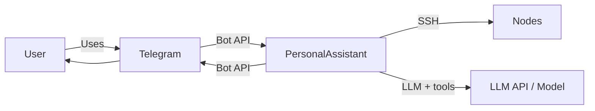

# EP-004 Structured tools and Tool-calling API — Requirements (EARS / INCOSE)

This document contains the product requirements for EP-004 (Structured tools and Tool-calling API) in EARS form, aligned with INCOSE semantic quality rules (active voice, one thought per requirement, explicit and measurable criteria, defined terminology, solution-free where applicable).

**Total: 34 requirements (26 FR, 8 NFR)**

**Contents**

- [Introduction](#introduction)
- [Glossary](#glossary)
- [C4 C1 — System Context](#c4-c1--system-context)
- [Flow](#flow)
- [EARS patterns used](#ears-patterns-used)
- [Requirement index](#requirement-index)
- [Requirements](#requirements)
  - [Tool catalog and source of truth](#tool-catalog-and-source-of-truth)
  - [Tool-calling API](#tool-calling-api)
  - [Validation and execution](#validation-and-execution)
  - [Errors to chat](#errors-to-chat)
  - [Provider interface](#provider-interface)
  - [Sonos support](#sonos-support)
  - [Tool index and pre-selection](#tool-index-and-pre-selection)
  - [Tool invocation without Tool-calling API](#tool-invocation-without-tool-calling-api)
  - [Prompt text for selected tools](#prompt-text-for-selected-tools)
  - [NFR — Security, testability, observability, consistency](#nfr--security-testability-observability-consistency)

---

## Introduction

This document is derived from [ep-scope.md](ep-scope.md). EP-004 builds on EP-001 (PersonalAssistant MVP). It introduces a single source of truth for invocable tools, exposes tools to the LLM via the provider's Tool-calling API, validates tool-call arguments, executes via the existing run_on_node path (template substitution and allowlist), and surfaces validation and execution errors to the user in chat. Sonos control (e.g. volume, play) is supported as tools defined in the same catalog and invoked via the same mechanism.

**Epic scope in brief:**

- Single source of truth for tools (e.g. YAML): id, **index_text** (required), optional **system_prompt** and **hermes_prompt**, template, node_id, argument rules; optional **triggers**; parsed at startup.
- Tool index built at startup from the catalog (id, **index_text**, optional triggers) and stored in the **same vector database as memory, in a dedicated table** (e.g. vec_tools); used for pre-selection per request. Target scale up to **1000 tools**. Index load **within 20 seconds** (batched embedding API and/or background build with fallback until ready).
- Each LLM request receives a pre-selected subset of tools (from the tool index, e.g. top-k by semantic similarity to the user message) in the provider's Tool-calling format; fallback when selection is empty or too small.
- Core handles tool_calls in the response: validate, substitute template, execute via run_on_node; results and errors returned as tool results and, when appropriate, shown in chat.
- Provider interface extended for tools payload and tool_calls; at least one provider (e.g. OpenAI-compatible or Ollama) supported.
- Sonos tools definable in the catalog and executable on a configured node; no separate Sonos API in the core.
- Scheduler contract unchanged; no dynamic tool loading; no MCP or third-party tool servers.
- Where the LLM provider does not support the Tool-calling API (e.g. returns 400 "does not support tools"), the system MAY support tool invocation by describing tools in the prompt and parsing the assistant's text output for tool calls in a defined format (e.g. Hermes-style `<tool_call>` with JSON); parsed calls use the same validation and execution path as native tool_calls.

---

## Glossary

| Term | Definition |
|------|------------|
| **PersonalAssistant (System)** | The set of components: core (Go), Telegram adapter, memory store, vector index, scheduler, LLM providers, and tools. From [scope.md](../../scope.md). |
| **Core** | The main Go service: orchestration of conversations, LLM calls, tool execution, and SSH-based node management. From [scope.md](../../scope.md). |
| **Node** | A remote host that the core connects to over SSH; has a defined capability set and credentials in configuration. From [scope.md](../../scope.md). |
| **Tool (invocable)** | Stable id, **index_text**, optional **system_prompt** / **hermes_prompt**, node binding, schema for arguments. From [ep-scope.md](ep-scope.md). |
| **Single source of truth (tools)** | One configuration (e.g. YAML), parsed at startup. Each tool: id, **index_text**, optional **system_prompt**, optional **hermes_prompt**, template, node_id, argument rules, optional **triggers**. Used for tool index text (id + index_text + triggers), native tool description (**index_text**), optional system and Hermes prompt injection, validation, and execution. From [ep-scope.md](ep-scope.md). |
| **Tool-calling API** | The provider-native mechanism to pass a list of tools in the request and receive structured tool_calls in the response (id and arguments as JSON). PersonalAssistant uses this so the model does not embed JSON in free text. From [ep-scope.md](ep-scope.md). |
| **index_text** | Short text for vector index and native tool API description. **system_prompt** / **hermes_prompt**: optional per-tool system and Hermes-list text. From [ep-scope.md](ep-scope.md). |
| **expected_json** | The shape of arguments for a tool. Sent to the LLM as a schema or example; full validation is done in PersonalAssistant from the source of truth. From [ep-scope.md](ep-scope.md). |
| **Template (command)** | A string with placeholders (e.g. `systemctl status {{service}}`) from the source of truth. After validating arguments, PersonalAssistant substitutes placeholders and runs the resulting command via run_on_node. From [ep-scope.md](ep-scope.md). |
| **run_on_node** | Existing EP-001 capability: execution on a node via SSH under the allowlist and security model; invoked after template substitution. |
| **Sonos (node / tool)** | A node or device that exposes Sonos control (e.g. volume, play) via allowlisted commands (e.g. sonos-cli). Sonos tools are defined in the same source of truth and invoked through the Tool-calling API. From [ep-scope.md](ep-scope.md). |
| **Operator** | The person who deploys and configures PersonalAssistant (config, nodes, tool catalog). |
| **Tool index (vector)** | Text per tool: id + **index_text** + optional triggers (embedded). Same vector DB, dedicated table (e.g. vec_tools). From [ep-scope.md](ep-scope.md). |
| **Tool pre-selection** | The process of selecting which tools to send to the LLM for a given request (e.g. embed user message, search tool index, take top-k by similarity). Only the selected tools are included in the Tool-calling API request. From [ep-scope.md](ep-scope.md). |
| **Tool call (text-based)** | When the provider does not support the Tool-calling API, tool invocation by instructing the model (via prompt) to output tool calls in a defined text format (e.g. `<tool_call>` tags with JSON containing name and arguments). The system parses the assistant message, validates and executes as for native tool_calls. |

---

## C4 C1 — System Context

**Source:** [c4-context.puml](diagrams/c4-context.puml) (C4-PlantUML). To regenerate PNG: `plantuml -tpng diagrams/c4-context.puml` from this directory.

### Flow

User sends a message via Telegram; PersonalAssistant may call the LLM with a tool list; the LLM may return tool_calls; PersonalAssistant validates, executes via run_on_node (or equivalent), and returns results; the user sees the assistant reply or error in chat.

---

## EARS patterns used

- **Ubiquitous:** THE \<system\> SHALL \<response\>
- **Event-driven:** WHEN \<trigger\>, THE \<system\> SHALL \<response\>
- **State-driven:** WHILE \<condition\>, THE \<system\> SHALL \<response\>
- **Unwanted event:** IF \<condition\>, THEN THE \<system\> SHALL \<response\>
- **Optional feature:** WHERE \<option\>, THE \<system\> SHALL \<response\>

In the following, *System* = PersonalAssistant (or the component stated).

---

## Requirement index

| Id | Type | Section | Summary |
|----|------|---------|--------|
| REQ-04.001 | FR | Tool catalog and source of truth | Single source of truth defines all invocable tools |
| REQ-04.002 | FR | Tool catalog and source of truth | Each tool has id, template, node_id, argument rules |
| REQ-04.003 | FR | Tool catalog and source of truth | Catalog parsed at startup; used for LLM payload and execution |
| REQ-04.004 | FR | Tool-calling API | Every completion request includes pre-selected tool list in provider format |
| REQ-04.005 | FR | Tool-calling API | At least one provider (OpenAI-compatible or Ollama) supported |
| REQ-04.006 | FR | Tool-calling API | Core handles tool_calls in response and drives tool-result loop |
| REQ-04.007 | FR | Validation and execution | Arguments validated against source-of-truth schema before execution |
| REQ-04.008 | FR | Validation and execution | Unknown tool id or invalid arguments produce deterministic error; no command run |
| REQ-04.009 | FR | Validation and execution | Valid arguments substituted into template; command executed via run_on_node |
| REQ-04.010 | FR | Validation and execution | Executed command remains under allowlist and SSH model |
| REQ-04.011 | FR | Errors to chat | Validation and execution errors surfaced to user in chat |
| REQ-04.012 | FR | Provider interface | Provider interface accepts optional tools payload and returns tool_calls |
| REQ-04.034 | FR | Provider interface | supports_tools per provider; omit native tools in HTTP when false |
| REQ-04.013 | FR | Sonos support | At least one Sonos tool definable in catalog and executable on configured node |
| REQ-04.014 | NFR | NFR — Security, testability, observability, consistency | No command executed without valid tool id and schema-passing arguments |
| REQ-04.015 | NFR | NFR — Security, testability, observability, consistency | New behaviour covered by unit/integration tests; existing tests pass |
| REQ-04.016 | NFR | NFR — Security, testability, observability, consistency | Tool-call and result (or error) traceable in logs where applicable |
| REQ-04.017 | NFR | NFR — Security, testability, observability, consistency | Sonos uses same catalog and execution path as other node tools |
| REQ-04.018 | FR | Tool index and pre-selection | Tool index built at startup from catalog and stored in vector store |
| REQ-04.019 | FR | Tool index and pre-selection | Tool list for each request built via pre-selection (e.g. embed message, search index, top-k) |
| REQ-04.020 | FR | Tool index and pre-selection | Fallback when pre-selection returns no or too few tools |
| REQ-04.021 | NFR | Tool index and pre-selection | Tool index load at startup within 20 s; batching and/or background with fallback |
| REQ-04.022 | FR | Tool index and pre-selection | Startup fails if tool catalog missing or tool index store cannot be created |
| REQ-04.023 | FR | Tool index and pre-selection | When index not ready, fallback yields non-empty bounded tool list |
| REQ-04.024 | NFR | Tool index and pre-selection | Embedding batch_size configurable (e.g. 1–1000); tool index build uses it for chunking |
| REQ-04.025 | NFR | Tool index and pre-selection | Tool index build success logged (INFO); build failure logged (ERROR with reason) |
| REQ-04.026 | FR | Tool invocation without Tool-calling API | Optional text-based tool invocation when provider lacks Tool-calling API |
| REQ-04.027 | FR | Tool invocation without Tool-calling API | Tools described in prompt; model outputs in defined format; system parses and extracts tool calls |
| REQ-04.028 | FR | Tool invocation without Tool-calling API | Parsed text-based tool calls use same validation and execution path as native tool_calls |
| REQ-04.029 | FR | Tool invocation without Tool-calling API | Parse failure or invalid format yields no execution; error or plain text to user |
| REQ-04.030 | NFR | Tool invocation without Tool-calling API | Configurable enable/disable of text-based tool invocation (global tools config) |
| REQ-04.031 | FR | Validation and execution | Commands containing shell metacharacters rejected before execution |
| REQ-04.032 | FR | Prompt text for selected tools | Non-empty system_prompt appended to system when tool is selected |
| REQ-04.033 | FR | Prompt text for selected tools | Hermes path uses hermes_prompt or index_text per tool plus schema |

---

## Requirements

### Tool catalog and source of truth

*REQ-04.001, REQ-04.002, REQ-04.003*

### REQ-04.001 — Single source of truth defines all invocable tools
THE System SHALL have a single source of truth (e.g. YAML) that defines all invocable tools; no duplicate or ad-hoc tool definitions elsewhere.

### REQ-04.002 — Each tool has id, template, node_id, argument rules
THE System SHALL define each tool in the source of truth with: a stable id, **index_text** (non-empty short text for tool index embedding and for the native Tool-calling API tool description), a template (command string with placeholders, no implicit defaults), node_id (or equivalent binding to a node), and argument rules (e.g. allowed_values, pattern, type, min/max). Each tool MAY include optional **triggers** (example phrases concatenated into tool index embedding text only). Each tool MAY include optional **system_prompt** (appended to the system message when that tool is among the selected tools for the request). Each tool MAY include optional **hermes_prompt** (instructional text for the text-based tool list when **hermes_prompt** is non-empty; otherwise the text-based list uses **index_text** for that tool).

### REQ-04.003 — Catalog parsed at startup; used for LLM payload and execution
THE System SHALL parse the tool catalog at service startup and use it both to build the tool list sent to the LLM and to validate and execute tool calls.

---

### Tool-calling API

*REQ-04.004, REQ-04.005, REQ-04.006*

### REQ-04.004 — Every completion request includes pre-selected tool list in provider format
THE System SHALL include the list of tools selected for that request (via tool pre-selection) in every completion request that uses the native Tool-calling API for that provider, in the format required by the provider (name/id, tool description, parameters schema). The tool description field SHALL be the tool's **index_text** from the catalog.

### REQ-04.005 — At least one provider (OpenAI-compatible or Ollama) supported
THE System SHALL support the Tool-calling API for at least one provider (e.g. OpenAI-compatible or Ollama).

### REQ-04.006 — Core handles tool_calls in response and drives tool-result loop
WHEN the LLM response contains tool_calls, THE System SHALL parse arguments, validate them against the source-of-truth schema, substitute into the tool template, execute via run_on_node (or equivalent), and return tool results (or errors) so the core can continue the request–response–tool-result loop without parsing JSON from assistant text.

---

### Validation and execution

*REQ-04.007, REQ-04.008, REQ-04.009, REQ-04.010, REQ-04.031*

### REQ-04.007 — Arguments validated against source-of-truth schema before execution
THE System SHALL validate tool-call arguments (types, allowed_values, pattern, min/max) against the tool's schema from the source of truth before executing any command.

### REQ-04.008 — Unknown tool id or invalid arguments produce deterministic error; no command run
IF the tool id is unknown or arguments fail validation, THEN THE System SHALL NOT execute any command and SHALL produce a deterministic error response (e.g. tool result or message to the user).

### REQ-04.009 — Valid arguments substituted into template; command executed via run_on_node
THE System SHALL substitute validated arguments into the tool's template and execute the resulting command on the node via the existing run_on_node path.

### REQ-04.010 — Executed command remains under allowlist and SSH model
THE System SHALL execute only commands that comply with the existing allowlist and SSH security model for that node.

### REQ-04.031 — Commands containing shell metacharacters rejected before execution
IF a command string to be executed on a node (after template substitution for catalog tools, or as supplied for paths that invoke run_on_node, e.g. the scheduler) contains any character or sequence from the forbidden shell-metacharacter set, THEN THE System SHALL NOT execute that command on the node and SHALL produce a deterministic error (same class as validation failure: no SSH exec, user- or tool-result-visible outcome as for other pre-execution failures). The forbidden set SHALL include at minimum: semicolon (`;`), ampersand (`&`), pipe (`|`), newline, carriage return, dollar-parenthesis command substitution (`$(`), and backtick (`` ` ``). THE System MAY extend this set (e.g. redirection characters) and SHALL document the full set in the implementation plan or system design.

*Acceptance criteria:* [AC-04.029](ep-acceptance-criteria.md#ac-04-029).

---

### Errors to chat

*REQ-04.011*

### REQ-04.011 — Validation and execution errors surfaced to user in chat
THE System SHALL surface validation failures, execution failures, and node-returned errors to the user in chat (e.g. as the assistant's reply or as a tool result conveyed to the user).

---

### Provider interface

*REQ-04.012, REQ-04.034*

### REQ-04.012 — Provider interface accepts optional tools payload and returns tool_calls
THE System SHALL extend the LLM provider interface to accept an optional tools payload and to return tool_calls and related metadata so the core can drive the request–response–tool-result loop without parsing JSON from assistant text.

### REQ-04.034 — supports_tools per provider; omit native tools in HTTP when false
THE System SHALL require each LLM provider entry in configuration to declare **supports_tools** (boolean). WHEN **supports_tools** is false for the provider used for a completion, THE System SHALL omit the native tools payload from the HTTP request to that provider.

---

### Sonos support

*REQ-04.013*

### REQ-04.013 — At least one Sonos tool definable in catalog and executable on configured node
THE System SHALL allow at least one Sonos-related tool (e.g. volume or play) to be defined in the tool source of truth, exposed to the LLM, and executed via run_on_node on a configured node; validation and error behaviour SHALL be the same as for other node tools.

---

### NFR — Security, testability, observability, consistency

*REQ-04.014, REQ-04.015, REQ-04.016, REQ-04.017*

### REQ-04.014 — No command executed without valid tool id and schema-passing arguments
THE System SHALL NOT execute any command on a node unless the tool call matches a known tool and arguments pass the schema defined in the source of truth.

### REQ-04.015 — New behaviour covered by unit/integration tests; existing tests pass
THE System SHALL cover new or changed behaviour with unit or integration tests; existing tests SHALL continue to pass.

### REQ-04.016 — Tool-call and result (or error) traceable in logs where applicable
Tool invocations (tool id, arguments, result or error) SHALL be traceable in logs where the existing logging subsystem supports it.

### REQ-04.017 — Sonos uses same catalog and execution path as other node tools
Sonos tools SHALL use the same catalog format, validation, and execution path as other node tools; no separate Sonos-specific API in the core.

---

### Tool index and pre-selection

*REQ-04.018, REQ-04.019, REQ-04.020, REQ-04.021, REQ-04.022, REQ-04.023, REQ-04.024, REQ-04.025*

### REQ-04.018 — Tool index built at startup from catalog and stored in vector store
THE System SHALL build a tool index at service startup from the parsed catalog (tool id, **index_text**, and optional triggers per tool), compute embeddings for each index entry, and store them in the **same vector database as memory, in a dedicated table** (e.g. vec_tools). The design SHALL support catalogs of **up to 1000 tools**.

### REQ-04.019 — Tool list for each request built via pre-selection (e.g. embed message, search index, top-k)
WHEN building the tool list for a completion request that can trigger tools, THE System SHALL select tools using the tool index (e.g. embed the user message, search the index, and take the top-k tools by similarity) and include only the selected tools in the request to the provider.

### REQ-04.020 — Fallback when pre-selection returns no or too few tools
IF tool pre-selection returns no tools or fewer than a configured minimum, THEN THE System SHALL apply a defined fallback (e.g. include a default subset of tools or all tools up to a cap) so that the LLM can still receive a non-empty, bounded tool list.

### REQ-04.021 — Tool index load at startup within 20 s; batching and background with fallback
THE System SHALL complete tool index load (embedding of all tools and writing to the vector store) **within 20 seconds** from service start. To meet this, the implementation SHALL use batched requests to the embedding API where supported, and background index build or update where applicable (service may accept traffic while the index is populating, with a defined fallback until the index is ready).

### REQ-04.022 — Startup fails if tool catalog missing or tool index store cannot be created
WHEN the service is configured with a tool catalog path and an embedding provider, THE System SHALL create the tool index store and start building the index. IF the tool catalog is not loaded (e.g. nil) or the vector store for the tool table cannot be created, THEN THE System SHALL fail startup and SHALL NOT accept requests.

### REQ-04.023 — When index not ready, fallback yields non-empty bounded tool list
WHILE the tool index is not ready (e.g. background build not yet completed or build has failed), WHEN the core builds the tool list for a completion request, THEN THE System SHALL apply the same fallback as when pre-selection returns no or too few tools, so that the request still receives a non-empty, bounded tool list.

### REQ-04.024 — Embedding batch_size configurable (e.g. 1–1000); tool index build uses it for chunking
WHERE an embedding provider is configured for the tool index, THE System SHALL support a configurable maximum number of texts per batch (batch_size) for embedding API calls, within defined bounds (e.g. 1–1000). The implementation SHALL use this batch_size when building the tool index (e.g. the embedding provider chunks requests so that no single API request exceeds batch_size texts).

### REQ-04.025 — Tool index build success logged (INFO); build failure logged (ERROR with reason)
THE System SHALL log the tool index build outcome: on success, an informational message (e.g. number of tools indexed); on failure, an error message including the failure reason.

---

### Tool invocation without Tool-calling API

*REQ-04.026, REQ-04.027, REQ-04.028, REQ-04.029, REQ-04.030*

### REQ-04.026 — Optional text-based tool invocation when provider lacks Tool-calling API
WHERE the configured LLM provider has **supports_tools** false and text-based tool invocation is enabled in configuration, THE System SHALL support tool invocation by describing the pre-selected tools in the prompt and parsing the assistant's text response for tool calls in a defined, documented format (e.g. Hermes-style `<tool_call>` with JSON containing tool name and arguments, or an equivalent single standard).

### REQ-04.027 — Tools described in prompt; model outputs in defined format; system parses and extracts tool calls
WHEN using text-based tool invocation, THE System SHALL include in the prompt a per-tool line using **hermes_prompt** when set for that tool, otherwise **index_text**, plus the parameters schema where applicable, and instructions for the defined tool-call format; THE System SHALL parse the assistant message to extract tool id (or name) and arguments before validation and execution.

### REQ-04.028 — Parsed text-based tool calls use same validation and execution path as native tool_calls
Parsed tool calls extracted from assistant text SHALL undergo the same validation (tool id known and in the catalog, arguments conforming to the source-of-truth schema) and execution path (template substitution, run_on_node) as tool_calls received via the Tool-calling API; THE System SHALL NOT execute any command for an unknown tool id or for arguments that fail validation.

### REQ-04.029 — Parse failure or invalid format yields no execution; error or plain text to user
IF the assistant text cannot be parsed to obtain a valid tool call (malformed format, missing required fields, or unrecoverable parse error), THEN THE System SHALL NOT execute any command based on that output and SHALL either treat the response as plain assistant text or surface a deterministic error to the user in chat.

### REQ-04.030 — Configurable enable/disable of text-based tool invocation (global tools config)
THE System SHALL support a global configuration flag (e.g. under a **tools** section) to enable or disable text-based tool invocation, so that operators can turn the feature off or on without code changes.

---

### Prompt text for selected tools

*REQ-04.032, REQ-04.033*

### REQ-04.032 — Non-empty system_prompt appended to system when tool is selected
WHEN one or more tools are selected for a completion request and the catalog defines non-empty **system_prompt** for one or more of those tools, THE System SHALL append that text to the system message for that request in the same order as the selected tool list, in a form that associates the text with the tool id.

### REQ-04.033 — Hermes path uses hermes_prompt or index_text per tool plus schema
WHERE text-based tool invocation is used for a request, THE System SHALL build the text-based tool list in the prompt from **hermes_prompt** when set for each selected tool, otherwise from **index_text**, and SHALL include each tool's parameters schema in the prompt where the schema is non-empty.
