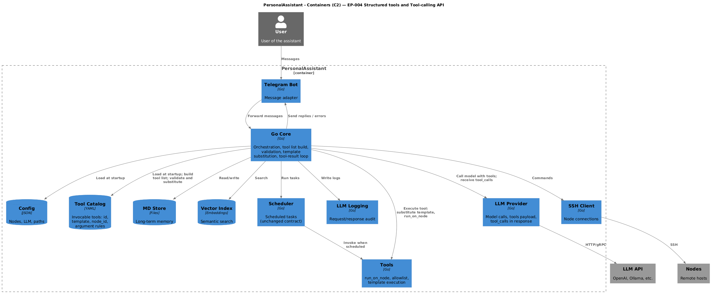

# System Design: EP-004 Structured tools and Tool-calling API

## Contents

- [Overview](#overview)
- [Architecture](#architecture)
  - [C4 C2 — Containers (PlantUML)](#c4-c2--containers-plantuml)
  - [Tool-calling flow](#tool-calling-flow)
  - [Module boundaries](#module-boundaries)
- [Components and interfaces](#components-and-interfaces)
- [Data models](#data-models)
- [Error handling](#error-handling)
- [Testing strategy](#testing-strategy)
- [Out of scope (design boundaries)](#out-of-scope-design-boundaries)

---

## Overview

EP-004 extends the PersonalAssistant MVP (EP-001) with a **single source of truth for invocable tools** ([REQ-04.001](ep-requirements.md#tool-catalog-and-source-of-truth), [REQ-04.002](ep-requirements.md#tool-catalog-and-source-of-truth)), a **vector-based tool index and pre-selection** so each LLM request receives a bounded subset of tools ([REQ-04.018](ep-requirements.md#tool-index-and-pre-selection), [REQ-04.019](ep-requirements.md#tool-index-and-pre-selection), [REQ-04.020](ep-requirements.md#tool-index-and-pre-selection), [REQ-04.021](ep-requirements.md#tool-index-and-pre-selection)). The tool index lives in the **same vector database as memory, in a dedicated table** (e.g. vec_tools); target scale **1000 tools**; index load **within 20 seconds** via batching and/or background build with fallback. **Tool-calling API integration** ([REQ-04.004](ep-requirements.md#tool-calling-api), [REQ-04.005](ep-requirements.md#tool-calling-api), [REQ-04.006](ep-requirements.md#tool-calling-api)), **validation and template-based execution** ([REQ-04.007](ep-requirements.md#validation-and-execution)–[REQ-04.010](ep-requirements.md#validation-and-execution)), **errors surfaced in chat** ([REQ-04.011](ep-requirements.md#errors-to-chat)), and **extended LLM provider interface** ([REQ-04.012](ep-requirements.md#provider-interface)). Sonos (and any node-bound command set) is supported as tools in the same catalog ([REQ-04.013](ep-requirements.md#sonos-support), [REQ-04.017](ep-requirements.md#nfr--security-testability-observability-consistency)). **Catalog:** required **index_text**; optional **system_prompt**, **hermes_prompt**, **triggers** ([REQ-04.002](ep-requirements.md#tool-catalog-and-source-of-truth), [REQ-04.032](ep-requirements.md#prompt-text-for-selected-tools), [REQ-04.033](ep-requirements.md#prompt-text-for-selected-tools)). **supports_tools** per provider ([REQ-04.034](ep-requirements.md#provider-interface)); **tools.text_based_enabled** global ([REQ-04.030](ep-requirements.md#tool-invocation-without-tool-calling-api)). **Optional text-based invocation** ([REQ-04.026](ep-requirements.md#tool-invocation-without-tool-calling-api)–[REQ-04.029](ep-requirements.md#tool-invocation-without-tool-calling-api)): Hermes list from **hermes_prompt** or **index_text**; same validation and execution as native; parse failure yields no execution. The design keeps the scheduler contract unchanged and ensures no command runs without a known tool and schema-valid arguments ([REQ-04.014](ep-requirements.md#nfr--security-testability-observability-consistency)). Testability and observability are addressed by unit/integration tests and tool-call logging ([REQ-04.015](ep-requirements.md#nfr--security-testability-observability-consistency), [REQ-04.016](ep-requirements.md#nfr--security-testability-observability-consistency)).

---

## Architecture

- **Tool catalog:** YAML defines tools with id, **index_text**, optional **system_prompt**, **hermes_prompt**, **triggers**, template, node_id, arguments ([REQ-04.002](ep-requirements.md#tool-catalog-and-source-of-truth)). Parsed at startup; index uses id + index_text + triggers only; LLM payloads use **index_text** / **hermes_prompt** as specified ([REQ-04.018](ep-requirements.md#tool-index-and-pre-selection), [REQ-04.004](ep-requirements.md#tool-calling-api), [REQ-04.033](ep-requirements.md#prompt-text-for-selected-tools)).
- **Tool index:** At startup, the system builds a tool index from the catalog (id, index_text, optional triggers), computes embeddings via the embedding provider, and stores them in the **same vector database as memory, in a dedicated table** (e.g. vec_tools) ([REQ-04.018](ep-requirements.md#tool-index-and-pre-selection)). Design scale: up to 1000 tools. Index load **MUST complete within 20 seconds** or run in the background with a defined fallback until ready; use **batched embedding API requests** and/or **background index build** ([REQ-04.021](ep-requirements.md#tool-index-and-pre-selection)). The index is used for pre-selection on each completion request.
- **Core:** For each completion request that can trigger tools, runs tool pre-selection (embed user message, search tool index, take top-k); builds the tool list from the catalog for the selected tool ids only ([REQ-04.019](ep-requirements.md#tool-index-and-pre-selection)); applies fallback when pre-selection returns no or too few tools ([REQ-04.020](ep-requirements.md#tool-index-and-pre-selection)); passes the bounded tool list to the LLM provider; on tool_calls in the response, validates arguments, substitutes into the tool template, and executes via the existing run_on_node path; returns tool results or errors and surfaces them to the user in chat.
- **LLM provider:** Interface extended to accept an optional tools payload and to return tool_calls and metadata; at least one provider (OpenAI-compatible or Ollama) supported.
- **Execution:** Valid commands are produced only by template substitution after schema validation; the resulting command is executed via run_on_node and remains subject to the node allowlist and SSH model.

**C4 C1 (System Context):** [ep-requirements.md — C4 C1](ep-requirements.md#c4-c1--system-context).

### C4 C2 — Containers (PlantUML)

**Source:** [c4-container.puml](diagrams/c4-container.puml) (C4-PlantUML). To regenerate PNG: `plantuml -tpng diagrams/c4-container.puml` from this directory.

### Tool-calling flow

**Startup:** After parsing the tool catalog, the system builds the tool index: for each tool, build text (id, index_text, optional triggers), compute embeddings (using **batched API calls** where supported), and store in the **same vector DB as memory, in a dedicated table** (e.g. vec_tools) ([REQ-04.018](ep-requirements.md#tool-index-and-pre-selection)). The full index load **SHALL complete within 20 seconds** or run in the background with a defined fallback for requests that arrive before the index is ready ([REQ-04.021](ep-requirements.md#tool-index-and-pre-selection)).

**Per request:**

1. User sends a message via Telegram → Core receives it.
2. Core runs tool pre-selection; applies fallback if needed ([REQ-04.019](ep-requirements.md#tool-index-and-pre-selection), [REQ-04.020](ep-requirements.md#tool-index-and-pre-selection)). Appends **system_prompt** blocks for selected tools ([REQ-04.032](ep-requirements.md#prompt-text-for-selected-tools)). If **supports_tools** is true: build native tool list (description = **index_text**, schema) and call provider with tools ([REQ-04.004](ep-requirements.md#tool-calling-api)). If **supports_tools** is false and text-based enabled: append Hermes tool list (**hermes_prompt** or **index_text**) and call without native tools payload ([REQ-04.026](ep-requirements.md#tool-invocation-without-tool-calling-api), [REQ-04.033](ep-requirements.md#prompt-text-for-selected-tools), [REQ-04.034](ep-requirements.md#provider-interface)).
3. Provider returns a completion; if the response contains tool_calls, Core parses each tool id and arguments ([REQ-04.006](ep-requirements.md#tool-calling-api)).
4. For each tool call: Core looks up the tool in the catalog; validates arguments (types, allowed_values, pattern, min/max) ([REQ-04.007](ep-requirements.md#validation-and-execution)); if invalid or unknown tool id, returns a deterministic error and does not execute ([REQ-04.008](ep-requirements.md#validation-and-execution)).
5. If valid: Core substitutes arguments into the tool's template to produce the command string; executes via run_on_node (Tools + SSH); the executed command is subject to the node allowlist ([REQ-04.009](ep-requirements.md#validation-and-execution), [REQ-04.010](ep-requirements.md#validation-and-execution)).
6. Tool result (stdout) or execution error is returned as a tool result; Core continues the loop (append tool result to messages, call provider again) or returns the final reply to the user. Validation and execution errors are surfaced in chat ([REQ-04.011](ep-requirements.md#errors-to-chat)).

**Optional path — text-based tool invocation:** When the provider has `supports_tools: false` and `tools.text_based_enabled` is true ([REQ-04.026](ep-requirements.md#tool-invocation-without-tool-calling-api)–[REQ-04.030](ep-requirements.md#tool-invocation-without-tool-calling-api), [REQ-04.034](ep-requirements.md#provider-interface)): (a) Core omits native `tools` from the HTTP request; (b) Core appends non-empty **system_prompt** for each selected tool to the system message ([REQ-04.032](ep-requirements.md#prompt-text-for-selected-tools)); (c) Core injects a tool list built from **hermes_prompt** or **index_text** per tool plus parameters schema and format instructions ([REQ-04.033](ep-requirements.md#prompt-text-for-selected-tools)); (d) On response, Core parses assistant text for `<tool_call>` JSON; (e) Same validation and execution as native path; (f) Parse failure → no execution, plain text or error to user. **Out of scope:** inferring `supports_tools` from HTTP errors; operator sets `supports_tools` explicitly.

### Module boundaries

| Layer | Responsibility | EP-004 changes |
|-------|----------------|-----------------|
| Config | Load and validate config, paths, nodes, providers. | Add tool catalog path(s); validate catalog at startup; embedding and vector store config for tool index. |
| Tool catalog loader | Parse YAML into catalog (tools by id: index_text, optional system_prompt, hermes_prompt, template, node_id, arguments, optional triggers). | Used at startup by Core and tool index builder ([REQ-04.002](ep-requirements.md#tool-catalog-and-source-of-truth)). |
| Tool index (builder + store) | Build tool index at startup: for each tool, form text (id, index_text, triggers), embed (batched where supported), store in **same vector DB as memory, in a dedicated table** (e.g. vec_tools). Complete within 20 s or run in background with fallback. At request time: search by query embedding, return top-k tool ids. | New or extended: uses existing embedding provider and vector store; **dedicated table** in same DB (no separate store instance). Scale up to 1000 tools ([REQ-04.018](ep-requirements.md#tool-index-and-pre-selection), [REQ-04.021](ep-requirements.md#tool-index-and-pre-selection)). |
| Core | Orchestration, context build, **tool pre-selection**, **tool list build from selected ids**, LLM call, **handle tool_calls: validate, substitute, call execution**. | Core gains: call tool selector (embed message, search index, top-k + fallback); build tool list from catalog for selected ids only; pass tools to provider; on tool_calls, validate → substitute → execute via run_on_node; surface errors in chat. |
| LLM provider | Complete(ctx, messages, opts). | Interface extended: opts (or new parameter) may include tools; response includes tool_calls when present. |
| Tools / run_on_node | Execute allowlisted command on node. | Invoked by Core with (node_id, substituted_command); allowlist and SSH unchanged. |
| Scheduler | Scheduled tasks; invokes tools by name and params. | Unchanged. |

---

## Components and interfaces

| Component | Responsibility | Key interface / traceability |
|-----------|----------------|------------------------------|
| Tool catalog (source of truth) | id, **index_text**, optional **system_prompt**, **hermes_prompt**, **triggers**, template, node_id, arguments. | [REQ-04.001](ep-requirements.md#tool-catalog-and-source-of-truth)–[REQ-04.003](ep-requirements.md#tool-catalog-and-source-of-truth). |
| Catalog loader | Parse catalog file(s) into in-memory structure; fail fast on parse or schema error. | Used at startup; output consumed by Core and tool index builder. |
| Tool index (builder + selector) | At startup: build index from catalog (id, index_text, triggers), embed via embedding provider (batched where supported), store in **same vector DB as memory, dedicated table** (e.g. vec_tools). Load within 20 s or background with fallback. At request time: embed user message, search tool table, return top-k tool ids; apply fallback when result is empty or below minimum. | [REQ-04.018](ep-requirements.md#tool-index-and-pre-selection), [REQ-04.019](ep-requirements.md#tool-index-and-pre-selection), [REQ-04.020](ep-requirements.md#tool-index-and-pre-selection), [REQ-04.021](ep-requirements.md#tool-index-and-pre-selection). |
| Core (orchestrator) | Run tool pre-selection; build tool list from catalog for selected ids only; call provider with tools; on tool_calls: validate args, substitute template, invoke run_on_node; return tool results; surface errors in chat. | [REQ-04.004](ep-requirements.md#tool-calling-api), [REQ-04.006](ep-requirements.md#tool-calling-api), [REQ-04.007](ep-requirements.md#validation-and-execution)–[REQ-04.011](ep-requirements.md#errors-to-chat). |
| LLM provider interface | Complete(ctx, messages, opts) where opts may include tools; response contains content and optional tool_calls (id, arguments). | [REQ-04.012](ep-requirements.md#provider-interface). |
| Tool executor (run_on_node path) | Receive (node_id, command) from Core after substitution; check allowlist; execute via SSH. | [REQ-04.009](ep-requirements.md#validation-and-execution), [REQ-04.010](ep-requirements.md#validation-and-execution); existing EP-001 behaviour. |
| Scheduler | Unchanged: scheduled tasks reference tool by name and params; no Tool-calling API. | — |

---

## Data models

- **Tool catalog (file):** YAML with a list of tools. Each tool: `id`, **`index_text`** (vector + native tool description), optional **`system_prompt`** (appended to system when tool is selected), optional **`hermes_prompt`** (Hermes tool-list line; default `index_text`), `template`, `node_id`, `arguments`, optional `triggers`. Single source of truth ([REQ-04.001](ep-requirements.md#tool-catalog-and-source-of-truth), [REQ-04.002](ep-requirements.md#tool-catalog-and-source-of-truth)).
- **In-memory catalog:** Parsed catalog used at runtime: lookup by tool id; for each tool, template, node_id, argument schema, and optional triggers ([REQ-04.003](ep-requirements.md#tool-catalog-and-source-of-truth)).
- **Tool index entry:** Per tool: text = id + index_text + optional triggers (concatenated for embedding); embedding vector; stored in the **same vector database as memory, in a dedicated table** (e.g. vec_tools) with id as document id ([REQ-04.018](ep-requirements.md#tool-index-and-pre-selection)). Search returns tool ids (and optionally scores) for top-k. Scale: up to 1000 entries.
- **Pre-selection result:** List of tool ids (and optionally scores) from vector search; after fallback, a non-empty bounded list of tool ids used to build the tool list for the request ([REQ-04.019](ep-requirements.md#tool-index-and-pre-selection), [REQ-04.020](ep-requirements.md#tool-index-and-pre-selection)).
- **LLM request payload:** messages + optional `tools` array (provider format: name/id, description, parameters). Built from catalog for the pre-selected tool ids only ([REQ-04.004](ep-requirements.md#tool-calling-api)).
- **LLM response:** content (text) + optional `tool_calls` (array of { id, name, arguments }). Provider returns this structure ([REQ-04.012](ep-requirements.md#provider-interface)).
- **Tool call (internal):** After parsing provider response (native tool_calls or parsed from assistant text): tool_id, arguments (map). Validated against catalog schema; then template substitution yields command string ([REQ-04.007](ep-requirements.md#validation-and-execution), [REQ-04.009](ep-requirements.md#validation-and-execution), [REQ-04.027](ep-requirements.md#tool-invocation-without-tool-calling-api), [REQ-04.028](ep-requirements.md#tool-invocation-without-tool-calling-api)).
- **Text-based tool call format:** When the provider does not support the Tool-calling API, a defined format (e.g. Hermes-style `<tool_call>` with JSON `{"name": "...", "arguments": {...}}`) is documented and used for parsing. Content before the first tool call is treated as assistant text ([REQ-04.026](ep-requirements.md#tool-invocation-without-tool-calling-api), [REQ-04.029](ep-requirements.md#tool-invocation-without-tool-calling-api)).
- **Sonos tools:** Same catalog entry shape as other node tools (id, template e.g. `sonos volume set {{volume}} --name "{{room}}"`, node_id, argument rules). No separate data model ([REQ-04.013](ep-requirements.md#sonos-support), [REQ-04.017](ep-requirements.md#nfr--security-testability-observability-consistency)).

---

## Error handling

- **Catalog load:** Invalid path, parse error, or missing required fields (id, **index_text**, template, node_id) → fail startup with clear error ([REQ-04.002](ep-requirements.md#tool-catalog-and-source-of-truth), [REQ-04.003](ep-requirements.md#tool-catalog-and-source-of-truth)).
- **Tool index build:** If embedding or vector store fails at startup (and build is synchronous), fail startup with clear error. Index load SHALL complete within 20 seconds or run in background; when in background, a defined fallback applies (e.g. default tool subset or "index not ready" handling) until the index is ready ([REQ-04.018](ep-requirements.md#tool-index-and-pre-selection), [REQ-04.021](ep-requirements.md#tool-index-and-pre-selection)).
- **Pre-selection fallback:** When pre-selection returns no tools or fewer than the configured minimum, apply fallback (e.g. default subset or all tools up to a cap) so the request still receives a non-empty, bounded tool list ([REQ-04.020](ep-requirements.md#tool-index-and-pre-selection)).
- **Unknown tool id:** When processing tool_calls, if tool id is not in the catalog → do not execute any command; return deterministic error (tool result or message); surface to user in chat ([REQ-04.008](ep-requirements.md#validation-and-execution), [REQ-04.011](ep-requirements.md#errors-to-chat)).
- **Invalid arguments:** Type mismatch, value not in allowed_values, pattern mismatch, or out of min/max → do not execute; return deterministic error; surface to user in chat ([REQ-04.008](ep-requirements.md#validation-and-execution), [REQ-04.011](ep-requirements.md#errors-to-chat)).
- **Execution failure:** run_on_node returns error (e.g. allowlist denial, SSH failure) → return error as tool result; surface to user in chat ([REQ-04.011](ep-requirements.md#errors-to-chat)).
- **Provider contract:** If provider does not support tools or returns malformed tool_calls, handle gracefully (e.g. treat as no tool_calls or return error to user). No command executed without valid tool and schema-passing arguments ([REQ-04.014](ep-requirements.md#nfr--security-testability-observability-consistency)).
- **Text-based tool invocation:** When text-based tool invocation is enabled and the provider does not support the Tool-calling API: if the assistant text cannot be parsed to obtain a valid tool call (malformed format, missing required fields, or parse error), do not execute any command; treat the response as plain assistant text or surface a deterministic error to the user ([REQ-04.029](ep-requirements.md#tool-invocation-without-tool-calling-api)).

---

## Testing strategy

- **Unit tests:** Catalog parsing and validation; argument validation (types, allowed_values, pattern, min/max); template substitution; tool index build (embed and store; same DB, dedicated table); tool list build from catalog for selected ids; pre-selection and fallback logic; batching and/or background build behaviour for 20 s constraint ([REQ-04.015](ep-requirements.md#nfr--security-testability-observability-consistency)).
- **Integration tests:** Core with mock provider that returns tool_calls; tool pre-selection (embed query, search index, top-k) and tool list build; validation and substitution; execution path to run_on_node (mocked); error paths (unknown tool, invalid args, execution failure) and that they are surfaced in chat; fallback when pre-selection returns no/too few tools; tool index in same vector DB as memory, dedicated table; index load within 20 s or background with fallback ([REQ-04.006](ep-requirements.md#tool-calling-api), [REQ-04.008](ep-requirements.md#validation-and-execution), [REQ-04.011](ep-requirements.md#errors-to-chat), [REQ-04.019](ep-requirements.md#tool-index-and-pre-selection), [REQ-04.020](ep-requirements.md#tool-index-and-pre-selection), [REQ-04.021](ep-requirements.md#tool-index-and-pre-selection)).
- **Provider integration:** At least one real provider (OpenAI-compatible or Ollama) with tools in request and tool_calls in response ([REQ-04.005](ep-requirements.md#tool-calling-api)).
- **Sonos tool:** At least one Sonos tool defined in catalog; E2E or integration that triggers it and verifies same validation/execution path as other tools ([REQ-04.013](ep-requirements.md#sonos-support)).
- **Observability:** Tool invocations (tool id, arguments, result or error) traceable in logs where supported ([REQ-04.016](ep-requirements.md#nfr--security-testability-observability-consistency)).
- **Text-based tool invocation (optional):** If implemented: unit tests for parsing assistant text (valid format, malformed, missing fields); integration test with provider that does not support tools: prompt includes tool description and format instructions; parsed tool call goes through same validation and execution path; parse failure does not trigger execution; config enable/disable ([REQ-04.026](ep-requirements.md#tool-invocation-without-tool-calling-api)–[REQ-04.030](ep-requirements.md#tool-invocation-without-tool-calling-api)).
- **Existing tests:** All EP-001 tests continue to pass; scheduler behaviour unchanged ([REQ-04.015](ep-requirements.md#nfr--security-testability-observability-consistency)).

---

## Out of scope (design boundaries)

The following are explicitly out of scope and not reflected in this design:

- Full tool list in every request; this design uses semantic tool pre-selection (vector-based) to send a bounded subset per request.
- Dynamic tool loading at runtime; tools are fixed at startup.
- MCP or third-party tool servers; only PA-defined tools from the catalog.
- Changes to the scheduler contract; scheduler continues to use the existing tool registry and params.
- Dedicated Sonos HTTP/API client in the core; Sonos is controlled only via node commands defined as tools in the catalog.

Text-based tool invocation (for providers without Tool-calling API) is in scope as an optional feature; when implemented, it uses the same validation and execution path as native tool_calls.
