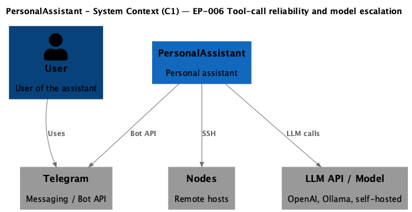
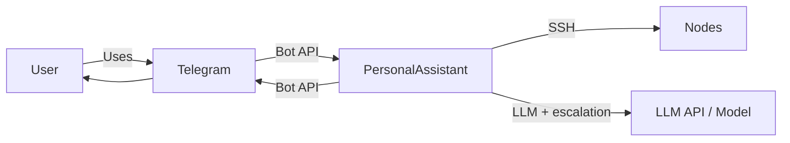

# EP-006 Tool-call reliability and model escalation — Requirements (EARS / INCOSE)

This document contains the product requirements for EP-006 (Tool-call reliability and model escalation) in EARS form, aligned with INCOSE semantic quality rules (active voice, one thought per requirement, explicit and measurable criteria, defined terminology, solution-free where applicable).

**Total: 17 requirements (12 FR, 5 NFR)**

**Contents**

- [Introduction](#introduction)
- [Glossary](#glossary)
- [C4 C1 — System Context](#c4-c1--system-context)
- [Flow](#flow)
- [EARS patterns used](#ears-patterns-used)
- [Requirement index](#requirement-index)
- [Requirements](#requirements)
  - [Baseline and configuration](#baseline-and-configuration)
  - [Error classification](#error-classification)
  - [Escalation policy and chain](#escalation-policy-and-chain)
  - [Typed tool failures and Hermes parse (escalation inputs)](#typed-tool-failures-and-hermes-parse-escalation-inputs)
  - [Exhaustion and stop](#exhaustion-and-stop)
  - [Rollback at end of turn](#rollback-at-end-of-turn)
  - [Observability](#observability)
  - [NFR — Security, testability, observability](#nfr--security-testability-observability)

---

## Introduction

This document is derived from [ep-scope.md](ep-scope.md). EP-006 improves automatic recovery when tool invocations fail or the model produces unusable tool output. It uses the ordered list of configured LLM providers without requiring the user to intervene. The epic introduces explicit policy (error classification, limits, observability), a configurable baseline model (not assumed minimal or cheapest), and rollback at end of user turn (Option A): the next user message always starts from the configured baseline; mid-turn rollback variants are out of scope.

**Epic scope in brief:**

- Error classification: stable categories for tool-related and tool-flow failures; map to allowed actions (no escalation, one repair, escalate once, or stop).
- Typed tool failures: outcomes that participate in escalation policy are represented with explicit, inspectable error types (not only unstructured message text).
- Hermes text-tool path: parser failures after a Complete call may trigger the same bounded escalation policy as qualifying tool execution failures when escalation is enabled.
- Escalation policy: bounded behaviour per user message (max escalations per turn); no escalation for errors a stronger model cannot fix.
- Multi-provider chain: ordered list; escalation advances along configuration order until policy stops or list exhausted.
- Exhaustion and stop: deterministic user-visible outcome and structured logs; no infinite loop.
- Observability: log classification, escalation yes/no, provider index/label; no secrets.
- Configuration: enable/disable escalation, max escalations per turn, which provider is the baseline; loaded and validated at startup.
- Rollback: end of user turn only; next user message starts from configured baseline.
- Escalation policy module: mapping from classified failure causes to escalation allowance is maintained in a dedicated Go package (`internal/escalationpolicy`) for testability and clear boundaries ([REQ-06.017](#nfr--security-testability-observability)).

---

## Glossary

| Term | Definition |
|------|------------|
| **PersonalAssistant (System)** | The set of components: core (Go), Telegram adapter, memory store, vector index, scheduler, LLM providers, and tools. From [scope.md](../../scope.md). |
| **Core** | The main Go service: orchestration of conversations, LLM calls, tool execution, and SSH-based node management. From [scope.md](../../scope.md). |
| **Baseline (default) model** | The LLM provider PersonalAssistant prefers when starting a user message (or after rollback), as chosen in configuration. It is not required to be the smallest or cheapest tier. Escalation walks an ordered provider list from that baseline's position (or a defined chain) according to policy. From [ep-scope.md](ep-scope.md). |
| **Escalation** | For a given user message handling path, temporarily using a later provider in the ordered escalation chain (higher index or next in list) for one or more Complete calls, according to policy, to improve reasoning or tool-call formatting after a qualifying failure. From [ep-scope.md](ep-scope.md). |
| **Tool failure (for policy)** | Any outcome where a tool invocation does not complete successfully from the core's perspective (validation error before execution, allowlist denial, SSH/exec error, etc.), or where structured tool flow cannot proceed (e.g. unrecoverable parse error in a defined text-tool path). Exact classification is specified in requirements; not every error class warrants escalation. From [ep-scope.md](ep-scope.md). |
| **Typed tool failure (for escalation)** | An error value that carries an explicit escalation-allowed or escalation-denied policy flag (or equivalent distinct types) inspectable via the language error inspection API, used when deciding whether to advance to the next LLM provider. From [REQ-06.015](#typed-tool-failures-and-hermes-parse-escalation-inputs). |
| **Hermes text-tool parser failure** | A failure returned when parsing the assistant message content for embedded tool-call markup in the text-based tool path (after a Complete call). From [REQ-06.016](#typed-tool-failures-and-hermes-parse-escalation-inputs). |
| **Successful tool round** | A processing step in which all tool calls requested in the current assistant turn have been executed and each result appended to the conversation (success or deterministic error text in the tool/user message), and the handler is about to call Complete again for the model's follow-up reply. From [ep-scope.md](ep-scope.md). |
| **Complete (call)** | A single request to the LLM provider for a completion (assistant reply); may include conversation history and tool results. |
| **User message** | A single message from the user that triggers one handling path (request–response–tool-result loop) until the assistant's final text reply is sent. |
| **Operator** | The person who deploys and configures PersonalAssistant (config, nodes, LLM provider list, escalation settings). |
| **Escalation policy package** | The Go package `pa/internal/escalationpolicy` that centralizes mapping from classified tool-path and tool-flow failure causes to escalation allowance (typed tool failure wrappers or equivalent), as specified in [ep-system-design.md](ep-system-design.md). From [REQ-06.017](#nfr--security-testability-observability). |

---

## C4 C1 — System Context

**Source:** [c4-context.puml](diagrams/c4-context.puml) (C4-PlantUML). To regenerate PNG: `plantuml -tpng diagrams/c4-context.puml` from this directory.

### Flow

User sends a message via Telegram; PersonalAssistant handles it using the configured baseline LLM provider; on qualifying tool failure the core may escalate to the next provider in the ordered list; when the assistant's final reply is sent, the next user message starts again from the baseline provider.

---

## EARS patterns used

- **Ubiquitous:** THE \<system\> SHALL \<response\>
- **Event-driven:** WHEN \<trigger\>, THE \<system\> SHALL \<response\>
- **State-driven:** WHILE \<condition\>, THE \<system\> SHALL \<response\>
- **Unwanted event:** IF \<condition\>, THEN THE \<system\> SHALL \<response\>
- **Optional feature:** WHERE \<option\>, THE \<system\> SHALL \<response\>
- **Complex:** Clauses in order WHERE → WHILE → WHEN/IF → THE → SHALL

In the following, *System* = PersonalAssistant (or the component stated).

---

## Requirement index

| Id | Type | Section | Summary |
|----|------|---------|--------|
| REQ-06.001 | FR | Baseline and configuration | Baseline provider chosen by configuration when starting a user message |
| REQ-06.002 | FR | Baseline and configuration | Config: enable/disable escalation, max escalations per turn, baseline provider; validated at startup |
| REQ-06.003 | FR | Error classification | Classify tool-related and tool-flow failures into stable categories |
| REQ-06.004 | FR | Error classification | Map each category to allowed action: no escalation, one repair, escalate once, or stop |
| REQ-06.005 | FR | Error classification | Failures that a stronger model cannot fix (e.g. allowlist denial, unknown tool id) do not trigger escalation |
| REQ-06.006 | FR | Escalation policy and chain | Where escalation enabled, advance to next provider in ordered list up to configured max per user message |
| REQ-06.007 | FR | Escalation policy and chain | Support ordered list of at least two LLM providers; escalation advances strictly along configuration order |
| REQ-06.008 | FR | Exhaustion and stop | When escalation cannot help or chain exhausted: deterministic user-visible outcome and structured logs; no infinite loop |
| REQ-06.009 | FR | Rollback at end of turn | After assistant's final text reply for a user message, next user message uses configured baseline provider |
| REQ-06.010 | NFR | Observability | Log classification, escalation yes/no, provider index or label before and after; no secrets |
| REQ-06.011 | NFR | Observability | Optional tried_providers summary in logs |
| REQ-06.012 | NFR | NFR | No secrets in escalation or provider-selection logs |
| REQ-06.013 | NFR | NFR | Unit or integration tests cover classification, escalation limits, exhaustion, rollback-at-end-of-turn |
| REQ-06.014 | NFR | NFR | With escalation disabled, behaviour uses configured baseline only; no provider advance on failure |
| REQ-06.015 | FR | Typed tool failures and Hermes parse | Tool outcomes for escalation policy use typed errors inspectable without substring matching on Error() alone |
| REQ-06.016 | FR | Typed tool failures and Hermes parse | Hermes parser failure qualifies for escalation and triggers next Complete when policy allows |
| REQ-06.017 | NFR | Security, testability, observability | Escalation-allowance mapping in `internal/escalationpolicy`; testable without full handler |

---

## Requirements

### Baseline and configuration

*REQ-06.001, REQ-06.002*

**REQ-06.001** (Ubiquitous)  
THE System SHALL use the configured baseline provider when starting handling of a new user message.

**REQ-06.002** (Ubiquitous)  
THE System SHALL load and validate at startup: enable/disable escalation, maximum number of escalations per user message, and which provider is the baseline. Optional cooldown hints MAY be supported. Invalid or missing values SHALL cause startup failure or a defined default consistent with ep-scope.

---

### Error classification

*REQ-06.003, REQ-06.004, REQ-06.005*

**REQ-06.003** (Ubiquitous)  
THE System SHALL classify tool-related and tool-flow failures into stable categories (e.g. policy/security, transient execution, model-format).

**REQ-06.004** (Ubiquitous)  
THE System SHALL map each failure category to exactly one allowed action: no escalation, one repair attempt on the same provider, escalate once to the next provider, or stop (no further escalation for that user message).

**REQ-06.005** (Ubiquitous)  
THE System SHALL classify failures such that allowlist denial, unknown tool id in the catalog, and other errors that a stronger model cannot fix do not trigger escalation.

---

### Escalation policy and chain

*REQ-06.006, REQ-06.007*

**REQ-06.006** (Event-driven)  
WHERE escalation is enabled and a qualifying tool failure occurs, THE System SHALL advance to the next provider in the configured ordered list for the next Complete call, up to the configured maximum number of escalations per user message and subject to existing tool-round caps.

**REQ-06.007** (Ubiquitous)  
THE System SHALL support an ordered list of two or more LLM providers for escalation; escalation SHALL advance strictly along configuration order until policy stops or the list is exhausted.

---

### Typed tool failures and Hermes parse (escalation inputs)

*REQ-06.015, REQ-06.016*

**REQ-06.015** (Ubiquitous)  
THE System SHALL represent tool-invocation outcomes that participate in escalation policy using error values distinguishable by type (for example a dedicated wrapper type with an explicit escalation-allowed flag) that callers inspect with the language standard error inspection API, so that the decision whether a failure qualifies for escalation does not depend solely on matching substrings in the string returned by the error `Error()` method.

**REQ-06.016** (Event-driven)  
WHERE escalation is enabled and the assistant reply is interpreted with the Hermes text-tool markup parser after a Complete call (including the first completion for a user message and follow-up completions inside the tool-result loop), WHEN that parser reports a failure, THE System SHALL treat that outcome as qualifying for the same escalation policy as a qualifying tool execution failure, subject to the configured maximum escalations per user message and provider chain limits, and SHALL perform a new Complete call on the next provider when policy permits, or SHALL produce the deterministic user-visible outcome for exhausted escalation when policy does not permit further advance.

---

### Exhaustion and stop

*REQ-06.008*

**REQ-06.008** (Event-driven)  
WHEN escalation cannot help (e.g. policy dictates stop) or the provider chain is exhausted, THE System SHALL produce a deterministic user-visible outcome and structured logs and SHALL NOT attempt further escalation for that user message.

---

### Rollback at end of turn

*REQ-06.009*

**REQ-06.009** (Ubiquitous)  
THE System SHALL use the configured baseline provider for the next user message after the assistant's final text reply has been sent for the current user message (rollback at end of turn).

---

### Observability

*REQ-06.010, REQ-06.011*

**REQ-06.010** (Ubiquitous)  
THE System SHALL log for each relevant decision: the classification result, whether escalation occurred, and the provider index or label before and after the decision; logs SHALL NOT contain secrets.

**REQ-06.011** (Optional feature)  
WHERE supported, THE System MAY include an optional tried_providers summary in logs for a user message.

---

### NFR — Security, testability, observability

*REQ-06.012, REQ-06.013, REQ-06.014, REQ-06.017*

**REQ-06.012** (Ubiquitous)  
THE System SHALL NOT include secrets (e.g. API keys, tokens) in escalation or provider-selection logs.

**REQ-06.013** (Ubiquitous)  
THE System SHALL be covered by unit and/or integration tests for: classification tables or key branches, escalation limits, exhaustion behaviour, and rollback-at-end-of-turn with a mock provider chain.

**REQ-06.014** (Optional feature)  
WHERE escalation is disabled, THE System SHALL use only the configured baseline provider for each user message and SHALL NOT advance the provider on tool failure.

**REQ-06.017** (Ubiquitous)  
THE System SHALL implement the mapping from classified tool-path and tool-flow failure causes to escalation allowance for the conversation tool path in the Go package `pa/internal/escalationpolicy` (see [ep-system-design.md](ep-system-design.md)), and SHALL cover that mapping with unit tests that do not require constructing the full conversation handler, Telegram adapter, or LLM transport.

---

**Traceability:** [ep-scope.md](ep-scope.md) · [scope.md](../../scope.md) · [strategy.md](../../strategy.md)
