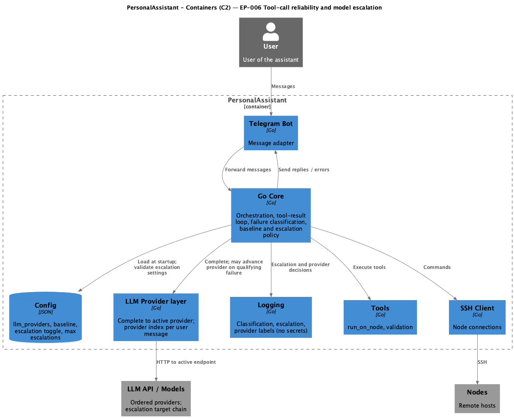

# System Design: EP-006 Tool-call reliability and model escalation

## Contents

- [Overview](#overview)
- [Architecture](#architecture)
  - [C4 C2 — Containers (PlantUML)](#c4-c2--containers-plantuml)
  - [Escalation and provider flow](#escalation-and-provider-flow)
  - [Module boundaries](#module-boundaries)
- [Components and interfaces](#components-and-interfaces)
- [Data models](#data-models)
- [Error handling](#error-handling)
- [Testing strategy](#testing-strategy)
- [Out of scope (design boundaries)](#out-of-scope-design-boundaries)
- [Requirement traceability](#requirement-traceability)

---

## Overview

EP-006 adds **configurable baseline provider** and **bounded escalation** along an **ordered LLM provider list** when tool-related or tool-flow failures qualify, without user intervention. Configuration loads at startup: escalation enable/disable, max escalations per user message, baseline provider identity ([REQ-06.001](ep-requirements.md#baseline-and-configuration), [REQ-06.002](ep-requirements.md#baseline-and-configuration)). The core **classifies** failures into stable categories and maps each category to a single allowed action ([REQ-06.003](ep-requirements.md#error-classification), [REQ-06.004](ep-requirements.md#error-classification)); **policy/security** failures such as allowlist denial and **unknown tool id** do **not** trigger escalation ([REQ-06.005](ep-requirements.md#error-classification)). **Typed tool failures** ([REQ-06.015](ep-requirements.md#typed-tool-failures-and-hermes-parse-escalation-inputs), [REQ-06.018](ep-requirements.md#typed-tool-failures-and-hermes-parse-escalation-inputs)): tool-path and node-runner outcomes that participate in escalation are wrapped in a dedicated error type with an explicit **escalate / do not escalate** flag inspected via `errors.As`; `QualifiesForEscalation` does **not** use substring matching on `Error()` alone. **Catalog validation** returns `*toolcatalog.ValidateError` with **`ValidateKind`**; `internal/escalationpolicy.WrapCatalogValidateError` maps kinds (e.g. unknown tool → `NoEscalate`, argument/schema failures → `MayEscalate`) using `errors.As` only ([REQ-06.018](ep-requirements.md#typed-tool-failures-and-hermes-parse-escalation-inputs)). **Hermes parse failures** ([REQ-06.016](ep-requirements.md#typed-tool-failures-and-hermes-parse-escalation-inputs)): after a **Complete** in text-tool mode, if Hermes markup parsing fails, the core applies the same escalation budget and chain rules as for a qualifying tool execution failure and re-issues **Complete** on the next provider when allowed. On qualifying failure with escalation enabled, the **active provider index** advances to the next configured entry, up to the configured maximum per user message and respecting existing tool-round caps ([REQ-06.006](ep-requirements.md#escalation-policy-and-chain)); the chain supports two or more providers and advances **strictly in list order** ([REQ-06.007](ep-requirements.md#escalation-policy-and-chain)). When escalation cannot continue, the system yields a **deterministic user-visible outcome** and **structured logs**, with **no further escalation attempts** for that user message ([REQ-06.008](ep-requirements.md#exhaustion-and-stop)). **Rollback at end of turn:** after the assistant's final text reply, the **next user message** starts from the configured baseline ([REQ-06.009](ep-requirements.md#rollback-at-end-of-turn)). **Observability:** log classification (`failure_class` includes e.g. `tool_execution`, `hermes_parse`), escalation flag, provider before/after; optional **tried_providers** summary; **no secrets** in these logs ([REQ-06.010](ep-requirements.md#observability), [REQ-06.011](ep-requirements.md#observability), [REQ-06.012](ep-requirements.md#nfr--security-testability-observability)). **Tests** cover classification, limits, exhaustion, rollback-at-end-of-turn, typed qualification, and Hermes escalation paths ([REQ-06.013](ep-requirements.md#nfr--security-testability-observability)). With escalation **disabled**, only the baseline is used and failures do not advance the provider ([REQ-06.014](ep-requirements.md#nfr--security-testability-observability)). **Escalation policy package** ([REQ-06.017](ep-requirements.md#nfr--security-testability-observability)): the mapping from classified failure causes (e.g. catalog validation outcomes) to `toolfailure.NoEscalate` / `toolfailure.MayEscalate` (or equivalent) SHALL live in `pa/internal/escalationpolicy`; the conversation handler calls into that package instead of embedding the full policy table ([ep-implementation-plan.md](ep-implementation-plan.md) Task 8).

**C4 C1 (System Context):** [ep-requirements.md — C4 C1](ep-requirements.md#c4-c1--system-context).

---

## Architecture

- **Config:** Extends or refines existing `llm_providers` ordering with explicit **baseline provider** selection (e.g. index or stable id) and **escalation** settings ([REQ-06.002](ep-requirements.md#baseline-and-configuration)).
- **Core:** Holds **per–user-message** state: current provider index (or equivalent), escalation count, classification outcome for the last qualifying event. On each **Complete**, selects the active provider; after tool failure, runs **classifier → policy** (via `internal/escalationpolicy` for cause→allowance mapping per [REQ-06.017](ep-requirements.md#nfr--security-testability-observability)) and optionally advances provider ([REQ-06.003](ep-requirements.md#error-classification)–[REQ-06.007](ep-requirements.md#escalation-policy-and-chain)).
- **LLM provider layer:** Thin routing over the ordered list: `Complete` targets the endpoint/model for the active index; failures from the provider (transport) may remain separate from tool-policy escalation unless requirements merge them in a later epic ([ep-scope.md](ep-scope.md) out-of-scope note).
- **Logging:** Dedicated fields or structured log lines for escalation decisions; redaction consistent with existing log redaction ([REQ-06.010](ep-requirements.md#observability)–[REQ-06.012](ep-requirements.md#nfr--security-testability-observability)).

### C4 C2 — Containers (PlantUML)

**Source:** [c4-container.puml](diagrams/c4-container.puml) (C4-PlantUML). To regenerate PNG: `plantuml -tpng diagrams/c4-container.puml` from this directory.

### Escalation and provider flow

**Startup**

1. Load config: ordered `llm_providers`, baseline identifier, `escalation_enabled`, `max_escalations_per_user_message` (names illustrative; exact keys in implementation plan). Validate; fail fast or apply documented defaults per [REQ-06.002](ep-requirements.md#baseline-and-configuration).

**Per new user message**

2. Reset or set **active provider** to **baseline** ([REQ-06.001](ep-requirements.md#baseline-and-configuration), [REQ-06.009](ep-requirements.md#rollback-at-end-of-turn) — baseline applies at message start; end-of-turn rollback ensures the *next* message also starts at baseline after the previous turn completed).
3. Reset **escalation count** for this user message to zero (or equivalent).

**Per Complete / tool round**

4. Call **Complete** on the **active** provider ([REQ-06.001](ep-requirements.md#baseline-and-configuration), [REQ-06.014](ep-requirements.md#nfr--security-testability-observability)).
5. On **tool failure** (or tool-flow failure as defined in requirements), **classify** the failure ([REQ-06.003](ep-requirements.md#error-classification)).
6. If category is **non-escalating** (e.g. allowlist denial, unknown tool id), apply mapped action without advancing provider ([REQ-06.004](ep-requirements.md#error-classification), [REQ-06.005](ep-requirements.md#error-classification)).
7. If category allows **escalate once** and escalation is **enabled** and **count < max**, advance **active** to the **next** list entry and increment count; next **Complete** uses new provider ([REQ-06.006](ep-requirements.md#escalation-policy-and-chain), [REQ-06.007](ep-requirements.md#escalation-policy-and-chain)).
8. If category is **stop** or **max** reached or **last provider** with no further help, produce **deterministic** outcome and logs; do not escalate further ([REQ-06.008](ep-requirements.md#exhaustion-and-stop)).

**End of user message**

9. After final assistant reply is sent, clear or mark turn complete so the **next** user message applies step 2 with **baseline** ([REQ-06.009](ep-requirements.md#rollback-at-end-of-turn)).

### Module boundaries

| Layer | Responsibility | EP-006 changes |
|-------|----------------|----------------|
| Config | Load JSON/YAML; validate provider list and escalation fields. | Add baseline provider field; escalation toggle; max escalations; optional cooldown placeholder ([REQ-06.002](ep-requirements.md#baseline-and-configuration)). |
| Core / handler | User-message scope; tool-result loop; invoke classifier and **escalationpolicy**; update active provider; call LLM layer. | Hold per-message provider state; call `escalationpolicy` for tool-path cause→typed failure; enforce caps ([REQ-06.001](ep-requirements.md#baseline-and-configuration), [REQ-06.003](ep-requirements.md#error-classification)–[REQ-06.009](ep-requirements.md#rollback-at-end-of-turn), [REQ-06.017](ep-requirements.md#nfr--security-testability-observability)). |
| **escalationpolicy** | Central mapping: classified causes → `toolfailure.NoEscalate` / `MayEscalate`; catalog path uses `toolcatalog.ValidateKind` via `errors.As`. | No Telegram, no handler loop; unit-testable ([REQ-06.004](ep-requirements.md#error-classification), [REQ-06.005](ep-requirements.md#error-classification), [REQ-06.015](ep-requirements.md#typed-tool-failures-and-hermes-parse-escalation-inputs), [REQ-06.018](ep-requirements.md#typed-tool-failures-and-hermes-parse-escalation-inputs), [REQ-06.017](ep-requirements.md#nfr--security-testability-observability)). |
| LLM package | Provider registry; `Complete` for a chosen provider index. | Accept explicit provider index or resolved client; no change to allowlist/tool execution ([REQ-06.007](ep-requirements.md#escalation-policy-and-chain)). |
| Logging | Structured logs; redaction. | Emit classification, escalation, provider labels; optional `tried_providers` ([REQ-06.010](ep-requirements.md#observability)–[REQ-06.012](ep-requirements.md#nfr--security-testability-observability)). |

**Package `pa/internal/escalationpolicy` (dependency rules)**

- **Imports allowed:** `pa/internal/core/toolfailure`; `pa/internal/toolcatalog` for `ValidateError` / `ValidateKind` on the catalog validation path ([REQ-06.018](ep-requirements.md#typed-tool-failures-and-hermes-parse-escalation-inputs)).
- **Imports forbidden:** `pa/internal/core` (handler), `pa/internal/telegram`, concrete LLM implementations — keep policy free of orchestration and I/O ([REQ-06.017](ep-requirements.md#nfr--security-testability-observability)).
- **Importers:** `internal/core` (handler / `executeOneToolCall` path); optionally refactor `internal/noderunner` to call shared helpers **exported from escalationpolicy** if the operator wants a single matrix for node + catalog causes (design choice at implementation time; default in plan: migrate catalog mapping first, keep noderunner as-is until aligned).

---

## Components and interfaces

| Component | Responsibility | Key interface / traceability |
|-----------|----------------|------------------------------|
| **Escalation config** | Baseline id/index, ordered providers, enable flag, max escalations. | [REQ-06.002](ep-requirements.md#baseline-and-configuration) |
| **Provider session state** | Per user message: active index, escalation count, optional list of tried providers for logs. | [REQ-06.001](ep-requirements.md#baseline-and-configuration), [REQ-06.006](ep-requirements.md#escalation-policy-and-chain), [REQ-06.011](ep-requirements.md#observability) |
| **Failure classifier** | Maps raw outcomes to stable category (e.g. in `toolcatalog` / noderunner); produces typed `toolfailure.Failure` or inputs consumed by policy ([REQ-06.015](ep-requirements.md#typed-tool-failures-and-hermes-parse-escalation-inputs)). | [REQ-06.003](ep-requirements.md#error-classification) |
| **Escalation policy (`internal/escalationpolicy`)** | Single place for cause → escalation allowance (wrap as `NoEscalate`/`MayEscalate`); catalog uses `ValidateKind` via `errors.As`; fail-closed for unknown causes ([REQ-06.017](ep-requirements.md#nfr--security-testability-observability), [REQ-06.018](ep-requirements.md#typed-tool-failures-and-hermes-parse-escalation-inputs)). Hermes / handler **advance** logic stays in core; policy package covers **which errors are qualifying** for catalog and aligned paths. | [REQ-06.004](ep-requirements.md#error-classification), [REQ-06.005](ep-requirements.md#error-classification), [REQ-06.015](ep-requirements.md#typed-tool-failures-and-hermes-parse-escalation-inputs), [REQ-06.018](ep-requirements.md#typed-tool-failures-and-hermes-parse-escalation-inputs) |
| **Provider router** | Selects provider for next `Complete`; advances on policy; stops at exhaustion. | [REQ-06.006](ep-requirements.md#escalation-policy-and-chain), [REQ-06.007](ep-requirements.md#escalation-policy-and-chain), [REQ-06.008](ep-requirements.md#exhaustion-and-stop), [REQ-06.014](ep-requirements.md#nfr--security-testability-observability) |
| **Turn boundary handler** | Resets baseline for new user message after previous turn completed. | [REQ-06.009](ep-requirements.md#rollback-at-end-of-turn) |
| **Escalation audit logger** | Emits structured fields; redacts secrets. | [REQ-06.010](ep-requirements.md#observability)–[REQ-06.012](ep-requirements.md#nfr--security-testability-observability) |

---

## Data models

- **EscalationConfig (logical):** `providers[]` (ordered), `baseline_index` or `baseline_provider_id`, `escalation_enabled` (bool), `max_escalations_per_user_message` (non-negative integer), optional `cooldown_*` reserved for future use ([REQ-06.002](ep-requirements.md#baseline-and-configuration)).
- **ProviderSessionState (per user message, in-memory):** `active_index` (int), `escalation_count` (int), `tried_indices` or labels (optional, for [REQ-06.011](ep-requirements.md#observability)).
- **FailureCategory (enum or string):** Stable set agreed in implementation (e.g. `policy_denial`, `unknown_tool`, `transient_exec`, `model_format`); each maps to **EscalationAction** (`none`, `repair_same`, `escalate_next`, `stop`) ([REQ-06.003](ep-requirements.md#error-classification), [REQ-06.004](ep-requirements.md#error-classification)).
- **Classification input:** Tool result type, typed errors from node runner and `executeOneToolCall` (`toolfailure.Failure`), validation stage, Hermes parse outcome for text-tool path ([REQ-06.003](ep-requirements.md#error-classification), [REQ-06.005](ep-requirements.md#error-classification), [REQ-06.015](ep-requirements.md#typed-tool-failures-and-hermes-parse-escalation-inputs), [REQ-06.016](ep-requirements.md#typed-tool-failures-and-hermes-parse-escalation-inputs)).
- **Log record (structured):** `failure_class` (e.g. `tool_execution`, `hermes_parse`), `escalation` (bool), `provider_index_before`, `provider_index_after`, optional `tried_providers`; no raw API keys ([REQ-06.010](ep-requirements.md#observability)–[REQ-06.012](ep-requirements.md#nfr--security-testability-observability)).

---

## Error handling

- **Config invalid at startup:** Fail startup with clear error or documented default path ([REQ-06.002](ep-requirements.md#baseline-and-configuration)).
- **Policy / unknown tool / non-qualifying failure:** No provider advance; deterministic user-visible message or tool error per existing EP-004 behaviour ([REQ-06.005](ep-requirements.md#error-classification)).
- **Qualifying failure with escalation disabled:** Stay on baseline; same as [REQ-06.014](ep-requirements.md#nfr--security-testability-observability).
- **Qualifying failure with escalation enabled:** Advance if under cap and category permits; else **stop** path ([REQ-06.006](ep-requirements.md#escalation-policy-and-chain), [REQ-06.008](ep-requirements.md#exhaustion-and-stop)).
- **Typed errors:** `QualifiesForEscalation` uses `errors.As` on `toolfailure.Failure` only ([REQ-06.015](ep-requirements.md#typed-tool-failures-and-hermes-parse-escalation-inputs)). Catalog-validation path: `toolcatalog.ValidateToolCall` returns `*toolcatalog.ValidateError` with `ValidateKind`; `internal/escalationpolicy.WrapCatalogValidateError` uses `errors.As` on that type and maps `ValidateKindUnknownTool` → `NoEscalate`, other kinds → `MayEscalate`; non-`ValidateError` inputs fail closed ([REQ-06.017](ep-requirements.md#nfr--security-testability-observability), [REQ-06.018](ep-requirements.md#typed-tool-failures-and-hermes-parse-escalation-inputs)). Node runner attaches typed failures at source (optional future consolidation into `escalationpolicy`).
- **Hermes parse failure:** First completion: loop retry `Complete` on next provider after `maybeEscalate(..., "hermes_parse")`. Follow-up: `resolveHermesFollowUpCompletion` applies the same pattern ([REQ-06.016](ep-requirements.md#typed-tool-failures-and-hermes-parse-escalation-inputs)).
- **Exhausted chain:** Single deterministic outcome; log terminal reason; no spin loop ([REQ-06.008](ep-requirements.md#exhaustion-and-stop)).

---

## Testing strategy

- **Unit tests:** `internal/escalationpolicy`: table-driven tests for each mapped cause → `NoEscalate`/`MayEscalate` and fail-closed unknown input; catalog cases built via `toolcatalog.ValidateToolCall` so `ValidateError` is exercised ([REQ-06.017](ep-requirements.md#nfr--security-testability-observability), [REQ-06.018](ep-requirements.md#typed-tool-failures-and-hermes-parse-escalation-inputs)). Classification via `toolfailure.Failure` and `QualifiesForEscalation`; untyped errors fail closed; cap enforcement; state transitions for `active_index` and `escalation_count`; baseline resolution from config; Hermes escalation paths where mockable ([REQ-06.013](ep-requirements.md#nfr--security-testability-observability)).
- **Integration tests:** Mock provider chain (three stubs); inject qualifying vs non-qualifying failures; assert order of calls and exhaustion; assert next user message uses baseline ([REQ-06.007](ep-requirements.md#escalation-policy-and-chain), [REQ-06.008](ep-requirements.md#exhaustion-and-stop), [REQ-06.009](ep-requirements.md#rollback-at-end-of-turn), [REQ-06.013](ep-requirements.md#nfr--security-testability-observability)).
- **Logging tests:** Log lines contain required fields; secrets from config do not appear in escalation log samples ([REQ-06.010](ep-requirements.md#observability)–[REQ-06.012](ep-requirements.md#nfr--security-testability-observability)).
- **Regression:** With `escalation_enabled=false`, behaviour matches pre-EP-006 expectations for same config except explicit new fields ([REQ-06.014](ep-requirements.md#nfr--security-testability-observability); note [ep-scope.md](ep-scope.md) states backward compatibility is not required for this epic—tests still pin "no advance" when disabled).

Align with [strategy.md](../../strategy.md) for integration-first verification.

---

## Out of scope (design boundaries)

- **Mid-turn rollback** to baseline (after each successful tool round, sticky-until-success, configurable enum of rollback modes)—see [ep-scope.md](ep-scope.md).
- **Blind retry** of the same remote command without a new model decision.
- **Replacing** pure LLM transport-level fallback—may stay separate unless merged in a later change ([ep-scope.md](ep-scope.md)).
- **Inferring** provider capabilities from HTTP errors for escalation (operator configures provider list and baseline explicitly).

---

## Requirement traceability

| REQ | Primary sections |
|-----|------------------|
| [REQ-06.001](ep-requirements.md#baseline-and-configuration) | Overview, Escalation flow, Components, Data models |
| [REQ-06.002](ep-requirements.md#baseline-and-configuration) | Overview, Architecture, Data models, Error handling |
| [REQ-06.003](ep-requirements.md#error-classification) | Overview, Flow, Components, Data models |
| [REQ-06.004](ep-requirements.md#error-classification) | Overview, Components, Data models |
| [REQ-06.005](ep-requirements.md#error-classification) | Overview, Flow, Error handling, Data models |
| [REQ-06.006](ep-requirements.md#escalation-policy-and-chain) | Overview, Flow, Components, Data models |
| [REQ-06.007](ep-requirements.md#escalation-policy-and-chain) | Overview, Flow, Module boundaries |
| [REQ-06.008](ep-requirements.md#exhaustion-and-stop) | Overview, Flow, Error handling, Testing |
| [REQ-06.009](ep-requirements.md#rollback-at-end-of-turn) | Overview, Flow, Components, Testing |
| [REQ-06.010](ep-requirements.md#observability) | Overview, Architecture, Components, Data models, Testing |
| [REQ-06.011](ep-requirements.md#observability) | Overview, Data models, Testing |
| [REQ-06.012](ep-requirements.md#nfr--security-testability-observability) | Overview, Architecture, Testing |
| [REQ-06.013](ep-requirements.md#nfr--security-testability-observability) | Overview, Testing strategy |
| [REQ-06.014](ep-requirements.md#nfr--security-testability-observability) | Overview, Flow, Components, Error handling, Testing |
| [REQ-06.015](ep-requirements.md#typed-tool-failures-and-hermes-parse-escalation-inputs) | Overview, Components, Data models, Error handling, Testing |
| [REQ-06.016](ep-requirements.md#typed-tool-failures-and-hermes-parse-escalation-inputs) | Overview, Flow, Components, Data models, Error handling, Testing |
| [REQ-06.018](ep-requirements.md#typed-tool-failures-and-hermes-parse-escalation-inputs) | Overview, Module boundaries, Error handling, Testing |
| [REQ-06.017](ep-requirements.md#nfr--security-testability-observability) | Overview, Architecture, Module boundaries, Components, Error handling, Testing |

**Traceability:** [ep-requirements.md](ep-requirements.md) · [ep-acceptance-criteria.md](ep-acceptance-criteria.md) · [ep-scope.md](ep-scope.md)
