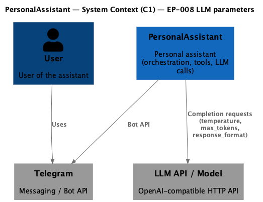
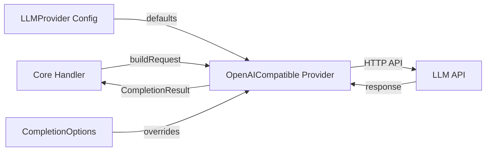

# EP-008 LLM Parameters Enhancement — Requirements (EARS / INCOSE)

This document contains the product requirements for EP-008 LLM Parameters Enhancement in EARS form, aligned with INCOSE semantic quality rules (active voice, one thought per requirement, explicit and measurable criteria, defined terminology, solution-free where applicable).

> **7 requirements** · 3 FR · 4 NFR · 3 theme groups

**Contents**

- [Introduction](#introduction)
- [Glossary](#glossary)
- [C4 C1 — System Context](#c4-c1--system-context)
- [Flow](#flow)
- [EARS patterns used](#ears-patterns-used)
- [Requirement index](#requirement-index)
- [Requirements](#requirements)
  - [Temperature configuration](#temperature-configuration)
  - [Max tokens configuration](#max-tokens-configuration)
  - [JSON response format](#json-response-format)
- [Non-functional requirements](#non-functional-requirements)

---

## Introduction

This document specifies requirements for enhancing LLM provider configuration with temperature, max_tokens, and JSON response format parameters. These parameters improve control over LLM behavior, cost optimization, and reliability of structured output parsing.

**Traceability to epic scope:** Themes match [ep-scope.md](ep-scope.md) (provider defaults, per-request overrides, JSON mode for text-based tools, ResponseFormat priority chain).

**MVP scope in brief**

- Temperature configuration at provider and request level
- Max tokens configuration at provider and request level
- JSON response format for text-based tool mode (Hermes)
- Flexible ResponseFormat per-request override with priority chain

---

## Glossary

| Term | Definition |
|------|------------|
| **LLMProvider** | Configuration struct defining one LLM provider (endpoint, model, capabilities) |
| **CompletionOptions** | Per-request options for LLM completion calls |
| **Temperature** | Sampling parameter controlling response randomness (0.0-2.0, lower = more deterministic) |
| **MaxTokens** | Maximum tokens to generate in LLM response |
| **ResponseFormat** | Structure specifying desired output format type (text, json_object) |
| **ForceJSONOutput** | Boolean hint in CompletionOptions to request JSON output for text-based tool mode |
| **OpenAICompatible** | Provider implementation for OpenAI-compatible HTTP APIs |

---

## C4 C1 — System Context

**Source:** [c4-context.puml](diagrams/c4-context.puml) (C4-PlantUML). To regenerate PNG: `plantuml -tpng diagrams/c4-context.puml` from this directory.

### Flow

High-level interaction flow at system context level: Core handler builds completion requests using provider defaults and per-request options, sends to LLM API, receives response.

---

## EARS patterns used

- **Ubiquitous:** THE \<system\> SHALL \<response\>
- **Event-driven:** WHEN \<trigger\>, THE \<system\> SHALL \<response\>
- **Optional feature:** WHERE \<option\>, THE \<system\> SHALL \<response\>

In the following, *System* = OpenAICompatible provider.

---

## Requirement index

| Id | Type | Section | Summary |
|----------|------|---------|--------|
| REQ-08.001 | FR | Temperature configuration | Provider default temperature applied to requests |
| REQ-08.002 | FR | Temperature configuration | Request temperature overrides provider default |
| REQ-08.003 | FR | Max tokens configuration | Provider default max_tokens applied to requests |
| REQ-08.004 | NFR | Max tokens configuration | Request max_tokens overrides provider default |
| REQ-08.005 | NFR | JSON response format | ForceJSONOutput enables JSON mode when supported |
| REQ-08.006 | NFR | JSON response format | Explicit ResponseFormat overrides ForceJSONOutput |
| REQ-08.007 | NFR | JSON response format | Provider default response format applied when no override |

---

## Requirements

### Temperature configuration

*REQ-08.001, REQ-08.002*

**REQ-08.001** (Optional feature)
WHERE the LLMProvider has DefaultTemperature configured, THE OpenAICompatible provider SHALL include the temperature parameter in the HTTP request body.

**REQ-08.002** (Event-driven)
WHEN CompletionOptions.Temperature is set, THE OpenAICompatible provider SHALL use the request temperature value instead of the provider default.

---

### Max tokens configuration

*REQ-08.003, REQ-08.004*

**REQ-08.003** (Optional feature)
WHERE the LLMProvider has DefaultMaxTokens greater than zero, THE OpenAICompatible provider SHALL include the max_tokens parameter in the HTTP request body.

**REQ-08.004** (Event-driven)
WHEN CompletionOptions.MaxTokens is greater than zero, THE OpenAICompatible provider SHALL use the request max_tokens value instead of the provider default.

---

### JSON response format

*REQ-08.005, REQ-08.006, REQ-08.007*

**REQ-08.005** (Optional feature)
WHERE the LLMProvider has SupportsJSONMode enabled AND CompletionOptions.ForceJSONOutput is true, THE OpenAICompatible provider SHALL include response_format with type "json_object" in the HTTP request body.

**REQ-08.006** (Event-driven)
WHEN CompletionOptions.ResponseFormat is set, THE OpenAICompatible provider SHALL use the explicit ResponseFormat value instead of ForceJSONOutput or provider default.

**REQ-08.007** (Optional feature)
WHERE the LLMProvider has DefaultResponseFormat configured AND no explicit ResponseFormat or ForceJSONOutput is set, THE OpenAICompatible provider SHALL include response_format with the configured type in the HTTP request body.

---

## Non-functional requirements

Themes below complement the functional behaviour in [Requirements](#requirements). They are expressed as concrete REQ identifiers where applicable.

- **Security and privacy:** LLM request logs and diagnostics SHALL follow the project redaction and logging rules in [strategy.md](../../strategy.md); new JSON and numeric parameters MUST NOT introduce secret material into logs.
- **Performance and cost:** Default and per-request **MaxTokens** (see [REQ-08.003](ep-requirements.md#max-tokens-configuration), [REQ-08.004](ep-requirements.md#max-tokens-configuration)) bound generated output size and cost; operators configure limits per provider.
- **Deploy and configuration:** New provider fields are optional with validation at config load so existing deployments keep working; invalid combinations fail fast at startup per project config rules.
- **Observability:** Behaviour for unsupported JSON mode (see [REQ-08.005](ep-requirements.md#json-response-format)) is deterministic (no `response_format` when unsupported) so operators can infer behaviour from configuration without silent partial failures.
