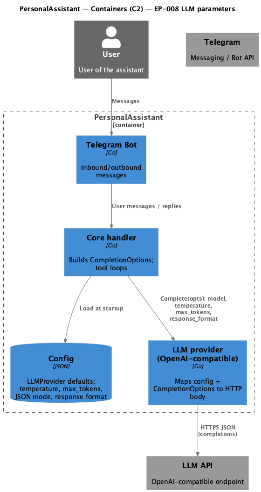

# EP-008 LLM Parameters Enhancement — System design

Stage 6 output for epic EP-008. Upstream: [ep-scope.md](ep-scope.md), [ep-requirements.md](ep-requirements.md), [ep-acceptance-criteria.md](ep-acceptance-criteria.md). Pipeline definition: repository file `ai-sdlc/specification/pipeline.spec.md` (not linked; outside `ai-sdlc-artefacts/`).

## Contents

- [Overview](#overview)
- [Architecture](#architecture)
- [Components and interfaces](#components-and-interfaces)
- [Data models](#data-models)
- [Error handling](#error-handling)
- [Testing strategy](#testing-strategy)
- [Key design decisions](#key-design-decisions)
- [Requirement traceability](#requirement-traceability)

## Overview

The design extends the OpenAI-compatible LLM provider so completion calls carry **temperature**, **max_tokens**, and **response_format** derived from [LLMProvider](ep-requirements.md#glossary) defaults and [CompletionOptions](ep-requirements.md#glossary) overrides. The core handler supplies per-request options (including JSON hints for text-based tools).

Coverage of requirements:

- [REQ-08.001](ep-requirements.md#temperature-configuration), [REQ-08.002](ep-requirements.md#temperature-configuration) — temperature default and override.
- [REQ-08.003](ep-requirements.md#max-tokens-configuration), [REQ-08.004](ep-requirements.md#max-tokens-configuration) — max_tokens default and override.
- [REQ-08.005](ep-requirements.md#json-response-format), [REQ-08.006](ep-requirements.md#json-response-format), [REQ-08.007](ep-requirements.md#json-response-format) — `response_format` priority: explicit `ResponseFormat` → `ForceJSONOutput` + `SupportsJSONMode` → `DefaultResponseFormat`.

Verification scenarios align with [ep-acceptance-criteria.md](ep-acceptance-criteria.md) (AC-08.001–AC-08.007).

## Architecture

PersonalAssistant loads provider configuration once, then each completion merges **LLMProvider** defaults with **CompletionOptions** inside the OpenAI-compatible adapter before HTTPS JSON to the external LLM API. System context (C1) is in [ep-requirements.md](ep-requirements.md); container view (C2) for this epic is below.

**Source:** [c4-container.puml](diagrams/c4-container.puml) (C4-PlantUML). To regenerate PNG: `plantuml -tpng diagrams/c4-container.puml` from directory `ai-sdlc-artefacts/epics/EP-008/`.

## Components and interfaces

| Component | Responsibility | Key interface / contract |
|-----------|------------------|---------------------------|
| **Core handler** | Builds `CompletionOptions` for each LLM call; sets `ForceJSONOutput` for text-based tool mode when applicable. | Calls provider `Complete` (or equivalent) with `CompletionOptions`; must not bypass provider resolution rules for temperature, max tokens, and response format. |
| **Config — LLMProvider** | Holds per-provider defaults: optional default temperature, default max tokens, `supports_json_mode`, default response format string. | Loaded from validated JSON config; optional fields preserve backward compatibility ([ep-scope.md](ep-scope.md) success criteria). |
| **OpenAICompatible provider** | Maps config + `CompletionOptions` to OpenAI-style chat completion JSON: `temperature`, `max_tokens`, `response_format`. | HTTP request body MUST satisfy [REQ-08.001](ep-requirements.md#temperature-configuration)–[REQ-08.007](ep-requirements.md#json-response-format); resolution order for `response_format` is explicit option, then JSON hint, then default. |
| **External LLM API** | Executes the model with the supplied parameters. | OpenAI-compatible JSON schema; errors for out-of-range values returned to caller. |

## Data models

Logical fields (names align with config JSON and `CompletionOptions`). Implementation uses Go structs in the product repository (`internal/config`, `internal/llm`).

**LLMProvider (relevant fields)**

| Field | Meaning |
|-------|---------|
| `default_temperature` | Optional pointer; when set, used as temperature if request does not override ([REQ-08.001](ep-requirements.md#temperature-configuration)). |
| `default_max_tokens` | Integer; when &gt; 0, used if request max tokens not set ([REQ-08.003](ep-requirements.md#max-tokens-configuration)). |
| `supports_json_mode` | When true, `ForceJSONOutput` may set `response_format: json_object` ([REQ-08.005](ep-requirements.md#json-response-format)). |
| `default_response_format` | When set and no per-request override or JSON hint applies, sent as `response_format` type ([REQ-08.007](ep-requirements.md#json-response-format)). |

**CompletionOptions (relevant fields)**

| Field | Meaning |
|-------|---------|
| `temperature` | Optional override ([REQ-08.002](ep-requirements.md#temperature-configuration)). |
| `max_tokens` | When &gt; 0, overrides provider default ([REQ-08.004](ep-requirements.md#max-tokens-configuration)). |
| `force_json_output` | Hint for JSON object output when provider supports JSON mode ([REQ-08.005](ep-requirements.md#json-response-format)). |
| `response_format` | Explicit type; wins over hint and default ([REQ-08.006](ep-requirements.md#json-response-format)). |

**HTTP request body (provider-internal)**  
OpenAI-style chat completion payload includes `temperature`, `max_tokens`, and `response_format` when resolution yields a value, per requirements above.

## Error handling

| Scenario | Handling | Requirements |
|----------|----------|--------------|
| JSON mode not supported | Omit `response_format` from JSON hint path; no error solely for unsupported mode. | [REQ-08.005](ep-requirements.md#json-response-format) behaviour; see [Non-functional requirements](ep-requirements.md#non-functional-requirements) (observability). |
| Invalid `ResponseFormat` type | Fail at validation (config load or request build) with a clear error; do not send invalid enum to the API. | Aligns with [REQ-08.006](ep-requirements.md#json-response-format) and project fail-fast config rules ([ep-requirements.md](ep-requirements.md)). |
| Temperature out of allowed range | Forward API error to caller; no silent clamp unless explicitly specified elsewhere. | Operational handling; [REQ-08.001](ep-requirements.md#temperature-configuration)–[REQ-08.002](ep-requirements.md#temperature-configuration) assume valid numeric values reach the API. |

## Testing strategy

| Level | Focus |
|-------|--------|
| Unit | Resolution helpers for temperature, max tokens, and `response_format`; JSON marshalling of request body. |
| Unit | Config parsing and validation for new optional fields. |
| Integration | Mock LLM HTTP server asserts request bodies for scenarios in [ep-acceptance-criteria.md](ep-acceptance-criteria.md). |

Project-wide test expectations: [strategy.md](../../strategy.md).

## Key design decisions

| Decision | Rationale |
|----------|------------|
| Explicit resolution helpers | Keeps `buildRequest` readable and testable; maps directly to AC-08.001–AC-08.007. |
| Priority: ResponseFormat → ForceJSONOutput → default | Matches [REQ-08.006](ep-requirements.md#json-response-format) and [REQ-08.007](ep-requirements.md#json-response-format). |
| Optional config fields | Preserves backward compatibility per [ep-scope.md](ep-scope.md). |
| `ForceJSONOutput` for Hermes / text-based tools | Improves structured parsing when the provider supports JSON mode ([ep-scope.md](ep-scope.md)). |

## Requirement traceability

| REQ | Where addressed |
|-----|-----------------|
| [REQ-08.001](ep-requirements.md#temperature-configuration) | [Overview](#overview), [Components](#components-and-interfaces), [Data models](#data-models) |
| [REQ-08.002](ep-requirements.md#temperature-configuration) | [Overview](#overview), [Data models](#data-models) |
| [REQ-08.003](ep-requirements.md#max-tokens-configuration) | [Overview](#overview), [Data models](#data-models) |
| [REQ-08.004](ep-requirements.md#max-tokens-configuration) | [Overview](#overview), [Data models](#data-models) |
| [REQ-08.005](ep-requirements.md#json-response-format) | [Overview](#overview), [Components](#components-and-interfaces), [Data models](#data-models), [Error handling](#error-handling) |
| [REQ-08.006](ep-requirements.md#json-response-format) | [Overview](#overview), [Data models](#data-models), [Error handling](#error-handling), [Key design decisions](#key-design-decisions) |
| [REQ-08.007](ep-requirements.md#json-response-format) | [Overview](#overview), [Data models](#data-models), [Key design decisions](#key-design-decisions) |
