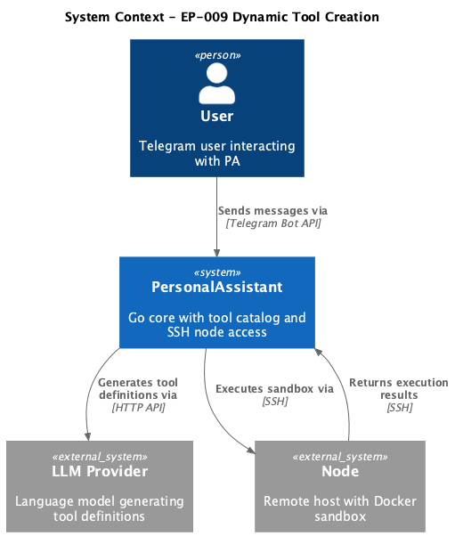
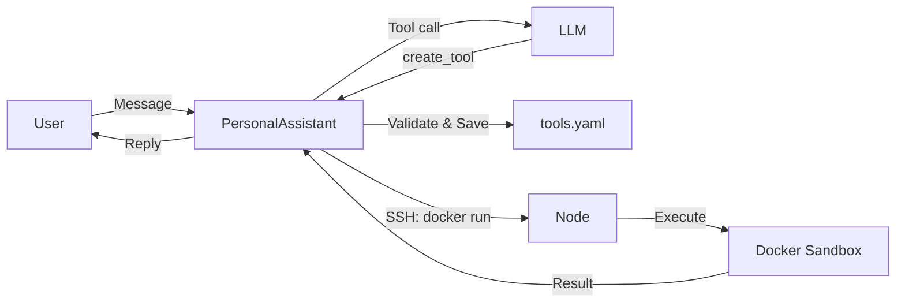

# EP-009 Dynamic Tool Creation with Docker Sandbox — Requirements (EARS / INCOSE)

This document contains the product requirements for EP-009 in EARS form, aligned with INCOSE semantic quality rules (active voice, one thought per requirement, explicit and measurable criteria, defined terminology, solution-free where applicable).

> **17 requirements** · 13 FR · 4 NFR · 3 theme groups

**Contents**

- [Introduction](#introduction)
- [Glossary](#glossary)
- [C4 C1 — System Context](#c4-c1--system-context)
- [Flow](#flow)
- [EARS patterns used](#ears-patterns-used)
- [Requirement index](#requirement-index)
- [Requirements](#requirements)
  - [Docker Sandbox Execution](#docker-sandbox-execution)
  - [Tool Creation](#tool-creation)
  - [Non-Functional Requirements](#non-functional-requirements)

---

## Introduction

EP-009 enables the LLM to create new tools at runtime by generating code (Python, Node.js, or shell), executing it in an isolated Docker sandbox on a configured node, and persisting the tool definition to the catalog for future reuse.

**MVP scope in brief**

- Docker sandbox execution on any configured node with resource limits
- Pre-built sandbox images (Python 3.14, Node.js 22, Alpine base)
- Native `create_tool` tool for LLM-driven tool creation
- Template whitelist for security
- Automatic tool persistence and reuse

---

## Glossary

| Term | Definition |
|------|------------|
| **PersonalAssistant** | The Go application (core) that orchestrates conversations, tool execution, and SSH access to nodes. |
| **Dynamic tool creation** | LLM-driven process where the assistant generates a new tool definition and saves it to the catalog without operator intervention. |
| **Docker sandbox** | Isolated execution environment on a node using Docker containers with resource limits and controlled network access. |
| **pa-sandbox image** | Pre-built Docker images on the node containing language runtimes and common packages. |
| **create_tool** | Native tool that validates and persists a new tool definition to the catalog (tools.yaml). |
| **Template whitelist** | Security constraint allowing only specific command prefixes in dynamically created tool templates. |
| **Runtime catalog** | In-memory representation of the tool catalog that can be updated without service restart. |
| **Tool definition** | Structured data describing a tool: id, index_text, template, node_id, arguments, system_prompt. |
| **tools.yaml** | File path configured as the tool catalog; holds invocable tool definitions loaded at startup and appended when tools are created. |
| **Secret detection pattern** | Operator-configured rule (e.g. regular expression) used to detect credential-like content in tool definitions before persistence. |

---

## C4 C1 — System Context

**Source:** [c4-context.puml](diagrams/c4-context.puml) (C4-PlantUML). To regenerate PNG: `plantuml -tpng diagrams/c4-context.puml` from this directory.

### Flow

High-level interaction flow: LLM generates tool definition via create_tool, PersonalAssistant validates and persists to catalog, then executes the new tool in Docker sandbox on the node.

---

## EARS patterns used

- **Ubiquitous:** THE \<system\> SHALL \<response\>
- **Event-driven:** WHEN \<trigger\>, THE \<system\> SHALL \<response\>
- **State-driven:** WHILE \<condition\>, THE \<system\> SHALL \<response\>
- **Unwanted event:** IF \<condition\>, THEN THE \<system\> SHALL \<response\>
- **Optional feature:** WHERE \<option\>, THE \<system\> SHALL \<response\>
- **Complex:** Clauses in order WHERE → WHILE → WHEN/IF → THE → SHALL

In the following, *System* = PersonalAssistant.

---

## Requirement index

| Id | Type | Section | Summary |
|----|------|---------|---------|
| REQ-09.001 | FR | Docker Sandbox Execution | Execute code in Docker with network bridge |
| REQ-09.002 | FR | Docker Sandbox Execution | Apply 256MB memory limit |
| REQ-09.003 | FR | Docker Sandbox Execution | Apply 0.5 CPU limit |
| REQ-09.004 | FR | Docker Sandbox Execution | Enforce 30s execution timeout |
| REQ-09.005 | FR | Docker Sandbox Execution | Support Python 3.14 sandbox image |
| REQ-09.006 | FR | Docker Sandbox Execution | Support Node.js 22 sandbox image |
| REQ-09.007 | FR | Docker Sandbox Execution | Support Alpine base sandbox image |
| REQ-09.008 | FR | Tool Creation | Accept tool definition parameters |
| REQ-09.009 | FR | Tool Creation | Validate template whitelist; reject invalid |
| REQ-09.010 | FR | Tool Creation | Reject duplicate tool IDs |
| REQ-09.011 | FR | Tool Creation | Append tool to tools.yaml |
| REQ-09.012 | FR | Tool Creation | Add tool to runtime catalog |
| REQ-09.013 | FR | Tool Creation | Return success message to LLM |
| REQ-09.014 | NFR | Non-Functional Requirements | Sandbox startup within 5 seconds |
| REQ-09.015 | NFR | Non-Functional Requirements | create_tool within 1 second |
| REQ-09.016 | NFR | Non-Functional Requirements | Unit test coverage at least 70% |
| REQ-09.017 | NFR | Non-Functional Requirements | Reject tool definitions containing secrets |

---

## Requirements

### Docker Sandbox Execution

*REQ-09.001, REQ-09.002, REQ-09.003, REQ-09.004, REQ-09.005, REQ-09.006, REQ-09.007*

**REQ-09.001** (Event-driven)
WHEN the LLM invokes a catalog tool that runs sandboxed code on a configured node, THE System SHALL execute the resulting command in a Docker container with `--network bridge` for outbound network access.

**REQ-09.002** (Event-driven)
WHEN the System executes code in a Docker sandbox, THE System SHALL apply a memory limit of 256MB via `--memory="256m"`.

**REQ-09.003** (Event-driven)
WHEN the System executes code in a Docker sandbox, THE System SHALL apply a CPU limit of 0.5 cores via `--cpus="0.5"`.

**REQ-09.004** (Event-driven)
WHEN the System executes code in a Docker sandbox, THE System SHALL enforce an execution timeout of 30 seconds and terminate the container if exceeded.

**REQ-09.005** (Ubiquitous)
THE System SHALL support the `pa-sandbox:python` Docker image containing Python 3.14 with the Python standard library `json` module and third-party packages requests, httpx, beautifulsoup4, and lxml, and standard library modules re, datetime, and math.

**REQ-09.006** (Ubiquitous)
THE System SHALL support the `pa-sandbox:node` Docker image containing Node.js 22 LTS with axios, node-fetch, and cheerio packages.

**REQ-09.007** (Ubiquitous)
THE System SHALL support the `pa-sandbox:base` Docker image based on Alpine Linux with curl and jq for simple HTTP and shell tasks.

---

### Tool Creation

*REQ-09.008, REQ-09.009, REQ-09.010, REQ-09.011, REQ-09.012, REQ-09.013*

**REQ-09.008** (Event-driven)
WHEN the LLM calls the `create_tool` tool, THE System SHALL accept parameters: id, index_text, template, node_id, arguments (optional), and system_prompt (optional).

**REQ-09.009** (Complex)
WHEN the System receives a tool definition from `create_tool`, THE System SHALL validate that the template starts with `docker run --rm --network bridge` or `docker run --rm --network none`; IF the template does not match, THEN THE System SHALL reject the tool definition with a validation error.

**REQ-09.010** (Unwanted event)
IF a tool definition contains an ID that already exists in the catalog, THEN THE System SHALL reject the tool definition and return a duplicate ID error.

**REQ-09.011** (Event-driven)
WHEN a tool definition passes validation, THE System SHALL append the tool definition to tools.yaml in YAML format.

**REQ-09.012** (Event-driven)
WHEN a tool definition is written to tools.yaml, THE System SHALL add the tool to the runtime catalog immediately without requiring a service restart.

**REQ-09.013** (Event-driven)
WHEN a tool is successfully created, THE System SHALL return a success message to the LLM indicating the tool ID and availability.

---

### Non-Functional Requirements

*REQ-09.014, REQ-09.015, REQ-09.016, REQ-09.017*

**REQ-09.014** (Ubiquitous)
THE System SHALL start a Docker sandbox container and begin execution within 5 seconds when the image is cached on the node.

**REQ-09.015** (Ubiquitous)
THE System SHALL complete the `create_tool` operation (validation, file write, runtime catalog update) within 1 second.

**REQ-09.016** (Ubiquitous)
THE System SHALL maintain unit test coverage of at least 70% for the `create_tool` tool and template validation logic.

**REQ-09.017** (Unwanted event)
IF a tool definition matches configured patterns for secrets, API keys, or credentials, THEN THE System SHALL reject persistence of that tool definition.

---

## Traceability

- **Scope:** [ep-scope.md](ep-scope.md) — Requirements derived from EP-009 scope
- **Strategy:** [../../strategy.md](../../strategy.md) — Testability and security alignment
