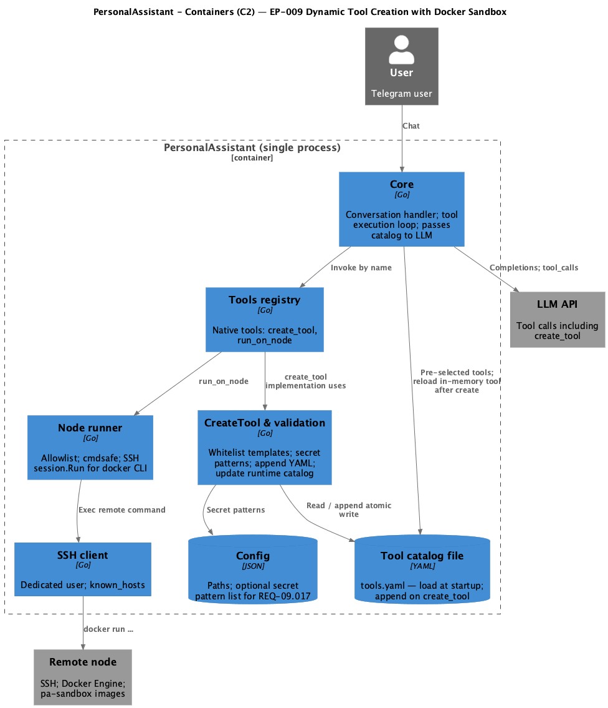

# EP-009 Dynamic Tool Creation with Docker Sandbox — System design

**Pipeline:** [pipeline.spec.md](../../../ai-sdlc/specification/pipeline.spec.md) (stage 6)  
**Inputs:** [ep-requirements.md](ep-requirements.md), [ep-acceptance-criteria.md](ep-acceptance-criteria.md), [ep-scope.md](ep-scope.md)

**Contents**

- [Overview](#overview)
- [Architecture](#architecture)
- [Concurrency and catalog writes](#concurrency-and-catalog-writes)
- [Resource flags contract (sandbox templates)](#resource-flags-contract-sandbox-templates)
- [Tool vector index after create](#tool-vector-index-after-create)
- [Module boundaries](#module-boundaries)
- [Components and interfaces](#components-and-interfaces)
- [Data models](#data-models)
- [Error handling](#error-handling)
- [Testing strategy](#testing-strategy)
- [Documentation and diagram maintenance](#documentation-and-diagram-maintenance)
- [Risks and trade-offs](#risks-and-trade-offs)
- [Requirement traceability](#requirement-traceability)

---

## Overview

EP-009 extends the existing PersonalAssistant monolith ([EP-004](../EP-004/ep-scope.md) baseline) with a **native `create_tool`** path, **runtime updates** to the tool catalog file and in-memory catalog, **template whitelist** and **secret-pattern** checks before persistence, and **Docker sandbox execution** on nodes via the existing **SSH + `run_on_node`** pipeline. The LLM calls `create_tool` like any other native tool; sandbox workloads are ordinary catalog tools whose `template` expands to a `docker run` command meeting [Docker Sandbox Execution](ep-requirements.md#docker-sandbox-execution) requirements.

Design scope covers: [REQ-09.001](ep-requirements.md#docker-sandbox-execution)–[REQ-09.007](ep-requirements.md#docker-sandbox-execution), [REQ-09.018](ep-requirements.md#docker-sandbox-execution), [REQ-09.008](ep-requirements.md#tool-creation)–[REQ-09.013](ep-requirements.md#tool-creation), [REQ-09.014](ep-requirements.md#non-functional-requirements)–[REQ-09.017](ep-requirements.md#non-functional-requirements). Acceptance tests align with [ep-acceptance-criteria.md](ep-acceptance-criteria.md).

---

## Architecture

PersonalAssistant remains a **single deployable process** (see C2 below). EP-009 adds logical components for **create_tool validation**, **YAML append**, and relies on **noderunner** + **SSH** to run `docker` on the node. No new network service on the node beyond existing SSH and Docker Engine.

<p align="center"></p>

**Source:** [c4-container.puml](diagrams/c4-container.puml) (C4-PlantUML). To regenerate PNG: `plantuml -tpng diagrams/c4-container.puml` from this directory.

**Glossary:** Epic-specific terms are defined in [ep-requirements.md — Glossary](ep-requirements.md#glossary); avoid duplicating definitions in this document—link there.

---

## Concurrency and catalog writes

**Problem:** Two concurrent `create_tool` invocations could interleave YAML read-modify-write and corrupt `tools.yaml` or the in-memory `Catalog`.

**Design decision:**

1. **Process-level mutex (or `sync.Mutex`)** around the **entire** `create_tool` critical section: validation → YAML append → in-memory `Catalog` update. This serializes concurrent creates in a single PA process and is the **primary** concurrency control (see [ep-system-design-review.md](ep-system-design-review.md) §3.1).
2. **Atomic file write** for the catalog file: write to a temp file in the same directory, then `rename` to `tools.yaml` (or equivalent) so readers never see a half-written file. Combined with (1), this addresses single-writer + safe replace.
3. **Multi-instance PA** (if ever deployed) is out of EP-009 scope; that would need external locking or a single writer—document as non-goal unless product scope changes.

---

## Resource flags contract (sandbox templates)

**Requirement:** [REQ-09.002](ep-requirements.md#docker-sandbox-execution)–[REQ-09.004](ep-requirements.md#docker-sandbox-execution) (memory, CPU, timeout).

**Chosen contract for MVP:**

| Aspect | Rule |
|--------|------|
| **Source of flags** | The **persisted `template` string** MUST contain the Docker CLI flags required by requirements: `--memory="256m"`, `--cpus="0.5"`, and a **30s** execution bound using either `timeout 30s …` before `docker` / inside the template, or Docker stop behaviour documented in the epic implementation plan (stage 7). |
| **Validation** | **Whitelist** ([REQ-09.009](ep-requirements.md#tool-creation)) remains prefix-only. **Optional hardening (recommended in implementation):** after prefix match, reject templates that do not contain the required substrings for memory/CPU/timeout so invalid tools never reach the node. Exact substring checks are specified in stage 7. |
| **No silent injection** | PA does **not** silently rewrite the LLM-provided template to inject flags in EP-009 MVP—avoids surprising operators and keeps allowlist strings stable. |

**Integration tests** assert the **remote command** as built after substitution ([AC-09.002](ep-acceptance-criteria.md#ac-09-002)–[AC-09.004](ep-acceptance-criteria.md#ac-09-004)).

---

## Tool vector index after create

**Requirement:** [REQ-09.012](ep-requirements.md#tool-creation) requires the new tool in the **runtime catalog** immediately; **semantic pre-selection** uses a separate vector index.

**MVP behaviour (explicit limitation):**

1. After a successful YAML write, **in-memory `Catalog.Tools[id]`** is updated—the tool is invokable by id in the same process.
2. **Embedding / `vec_tools` update** may be **async** or **best-effort**. If embedding fails after the file write succeeds:
   - Log an error (operator-visible).
   - **Retry:** at least one retry or a background queue item is **recommended** in implementation; exact policy is stage 7.
   - **Pre-selection:** the new tool may be **missing from vector search** until embed succeeds or PA restarts and rebuilds the index—document as **known MVP limitation** unless implementation guarantees synchronous embed (see [ep-system-design-review.md](ep-system-design-review.md) §3.1).
3. **Restart** always reloads YAML and can rebuild the tool index on startup—recovery path for operators.

---

## Module boundaries


| Layer / package (proposed)      | Responsibility                                                                                                          | Depends on                           |
| ------------------------------- | ----------------------------------------------------------------------------------------------------------------------- | ------------------------------------ |
| `internal/tools`                | `Tool` interface; `create_tool` implementation (**mutex** for catalog write path); register with `Registry` in `cmd/pa` | `toolcatalog`, `config`, filesystem  |
| `internal/toolcatalog` (extend) | Parse single tool; append list item to YAML; thread-safe or single-writer update of in-memory `Catalog`                 | `os`, `yaml`                         |
| `internal/noderunner`           | Unchanged contract: after substitution, `cmdsafe` + allowlist + SSH `Exec`                                              | `internal/ssh`, `internal/allowlist` |
| `internal/config` (extend)      | Load optional **secret detection patterns** for [REQ-09.017](ep-requirements.md#non-functional-requirements)            | existing validation                  |
| `internal/core`                 | Wire `create_tool`; refresh tool list / pre-selection subset after successful create (implementation detail in stage 7) | `tools`, `toolcatalog`, `toolindex`  |


**Rule:** `create_tool` MUST NOT bypass `noderunner` for remote execution: new tools still use `run_on_node` with the same allowlist model (operator extends allowlist for expected `docker run` lines).

---

## Components and interfaces


| Component                         | Responsibility                                                                                    | Key interface / contract                        | Requirements                                                                                                                                                                   |
| --------------------------------- | ------------------------------------------------------------------------------------------------- | ----------------------------------------------- | ------------------------------------------------------------------------------------------------------------------------------------------------------------------------------ |
| **Core conversation handler**     | Invokes native tools by name; passes catalog-derived tool defs to LLM                             | Existing `executeOneToolCall` path              | [REQ-09.008](ep-requirements.md#tool-creation), [REQ-09.013](ep-requirements.md#tool-creation)                                                                                 |
| **Tools registry**                | Registers `create_tool` + `run_on_node`                                                           | `tools.Tool` / `Registry`                       | [REQ-09.008](ep-requirements.md#tool-creation)                                                                                                                                 |
| **CreateTool handler**            | Validates params; whitelist; duplicate id; secret patterns; append YAML; update runtime `Catalog`; **mutex** over full critical section ([Concurrency](#concurrency-and-catalog-writes)) | `Run(ctx, params) (string, error)`              | [REQ-09.009](ep-requirements.md#tool-creation)–[REQ-09.012](ep-requirements.md#tool-creation), [REQ-09.017](ep-requirements.md#non-functional-requirements)                    |
| **Template whitelist**            | Prefix check: `docker run --rm --network bridge` or `docker run --rm --network none`              | Pure function or small package                  | [REQ-09.009](ep-requirements.md#tool-creation)                                                                                                                                 |
| **YAML append**                   | Atomic append of one tool list entry to `paths.tool_catalog_path`                                 | Serialize `toolcatalog.Tool` to YAML            | [REQ-09.011](ep-requirements.md#tool-creation)                                                                                                                                 |
| **Runtime catalog**               | `Catalog.Tools[id] = t` after successful write                                                    | Mutex if accessed from async paths              | [REQ-09.012](ep-requirements.md#tool-creation)                                                                                                                                 |
| **Node runner**                   | Executes substituted template via SSH                                                             | `RunOnNode(ctx, nodeID, command)`               | [REQ-09.001](ep-requirements.md#docker-sandbox-execution)–[REQ-09.004](ep-requirements.md#docker-sandbox-execution), [REQ-09.018](ep-requirements.md#docker-sandbox-execution) |
| **SSH client**                    | `session.Run(command)`                                                                            | Existing `internal/ssh`                         | [REQ-09.001](ep-requirements.md#docker-sandbox-execution), [REQ-09.018](ep-requirements.md#docker-sandbox-execution)                                                           |
| **Docker on node**                | Interprets CLI; applies `--network`, `--memory`, `--cpus`; enforces isolation                     | Operator-built `pa-sandbox:`* images            | [REQ-09.005](ep-requirements.md#docker-sandbox-execution)–[REQ-09.007](ep-requirements.md#docker-sandbox-execution)                                                            |
| **Tool index (optional refresh)** | After create, new tool available for pre-selection                                                | Embed new `index_text` + id or defer to restart | [REQ-09.012](ep-requirements.md#tool-creation), [REQ-09.014](ep-requirements.md#non-functional-requirements) (performance)                                                     |


See [Resource flags contract](#resource-flags-contract-sandbox-templates) for the MVP decision on where memory/CPU/timeout live and how tests validate them.

---

## Data models

### Tool definition (append)

Same schema as existing [tool catalog](ep-requirements.md#tool-creation): `id`, `index_text`, `template`, `node_id`, `arguments`, optional `system_prompt` / `hermes_prompt` / `triggers`. Persisted as a new list element under `tools:` in `tools.yaml`.

### create_tool parameters (native tool)


| Field           | Type             | Required | Notes                                     |
| --------------- | ---------------- | -------- | ----------------------------------------- |
| `id`            | string           | yes      | Must not collide with existing catalog id |
| `index_text`    | string           | yes      | For vector index and LLM description      |
| `template`      | string           | yes      | Whitelisted `docker run` prefix           |
| `node_id`       | string           | yes      | Must exist in `config.Nodes`              |
| `arguments`     | array (optional) | no       | Serialized per `toolcatalog.ArgumentRule` |
| `system_prompt` | string           | no       |                                           |


### Config extension (secret detection)


| Field                                                                     | Purpose                                                                                                                               |
| ------------------------------------------------------------------------- | ------------------------------------------------------------------------------------------------------------------------------------- |
| `tools.create_tool_secret_patterns` (or under `log_redaction`-style list) | List of regex strings; if any matches concatenated tool fields, reject ([REQ-09.017](ep-requirements.md#non-functional-requirements)) |


**Example** (illustrative—field names validated at load; invalid regex **must** fail config load):

```json
{
  "tools": {
    "text_based_enabled": false,
    "create_tool_secret_patterns": [
      "api[_-]?key\\s*[:=]",
      "BEGIN (RSA |OPENSSH )?PRIVATE KEY"
    ]
  }
}
```

- Patterns are **Go `regexp` syntax** (RE2); compile each at startup and reject the config if compilation fails.
- **Behaviour:** no partial application—if the block is present, every pattern must compile.

Exact final JSON shape and placement (nested under `tools` vs top-level) are fixed in the implementation plan and mirrored into product configuration documentation when the feature ships.

### State transition (create_tool)

1. **Acquire** process-level mutex for `create_tool`.
2. Validate params → whitelist → duplicate id → secret patterns.
3. Append YAML (atomic) → update `Catalog.Tools`.
4. Return success string to LLM.
5. **Release** mutex.
6. (Optional, may be outside mutex) Queue or run tool index embedding for new id.

---

## Error handling


| Failure                          | Behaviour                                                                              | Requirement                                                                                                         |
| -------------------------------- | -------------------------------------------------------------------------------------- | ------------------------------------------------------------------------------------------------------------------- |
| Invalid whitelist prefix         | Error string to LLM; no file write                                                     | [REQ-09.009](ep-requirements.md#tool-creation)                                                                      |
| Duplicate `id`                   | Typed error; no file write                                                             | [REQ-09.010](ep-requirements.md#tool-creation)                                                                      |
| Secret pattern match             | Error; no file write                                                                   | [REQ-09.017](ep-requirements.md#non-functional-requirements)                                                        |
| YAML write failure               | Error; in-memory catalog unchanged (transactional discipline)                          | [REQ-09.011](ep-requirements.md#tool-creation), [REQ-09.012](ep-requirements.md#tool-creation)                      |
| Tool index embed fails after successful write | Log error; optional retry/queue ([Tool vector index](#tool-vector-index-after-create)); tool still invokable by id | [REQ-09.012](ep-requirements.md#tool-creation) (partial: memory vs vector) |
| Remote `docker run` failure      | Existing noderunner / escalation behaviour; stdout/stderr surfaced per existing policy | [REQ-09.001](ep-requirements.md#docker-sandbox-execution)–[REQ-09.004](ep-requirements.md#docker-sandbox-execution) |
| Network-none probe fails in test | Pass [AC-09.018](ep-acceptance-criteria.md#ac-09-018); if unexpected pass, fail build  | [REQ-09.018](ep-requirements.md#docker-sandbox-execution)                                                           |


---

## Testing strategy

Aligned with [strategy.md](../../strategy.md):

- **Unit:** whitelist parser, duplicate check, secret regex, YAML append (temp dir), coverage per [REQ-09.016](ep-requirements.md#non-functional-requirements).
- **Coverage ([REQ-09.016](ep-requirements.md#non-functional-requirements)):** The implementation plan / `Makefile` **SHALL** define how the **70%** floor is enforced (e.g. `go test -cover` on `internal/tools` and validation packages, or a coverage gate in `make check`). Until code exists, this remains a **stage 7** task (see [ep-system-design-review.md](ep-system-design-review.md) §3.3).
- **Integration:** SSH testbed (existing pattern): run tool with `--network bridge` vs `--network none`; assert command flags; for none, run probe command inside container ([AC-09.018](ep-acceptance-criteria.md#ac-09-018)).
- **Network isolation ([REQ-09.018](ep-requirements.md#docker-sandbox-execution)):** Satisfied by the **integration test** probe above. **Runtime** verification on every container start is **not** required by the epic. An optional **deploy-time** check (e.g. operator script that runs a one-off `docker run --network none` probe) is a **post-MVP / operations** improvement (see [ep-system-design-review.md](ep-system-design-review.md) §3.2).
- **Manual / operator:** verify `pa-sandbox:python`, `:node`, `:base` images on NAS per [REQ-09.005](ep-requirements.md#docker-sandbox-execution)–[REQ-09.007](ep-requirements.md#docker-sandbox-execution).

---

## Documentation and diagram maintenance

- **C4 PNG:** Regenerate [c4-container.png](diagrams/c4-container.png) whenever [c4-container.puml](diagrams/c4-container.puml) changes (`plantuml -tpng diagrams/c4-container.puml` from this epic directory).
- **CI (optional):** Add a check that `.puml` is newer than `.png` or run PlantUML in CI/docs build so drift is caught (see [ep-system-design-review.md](ep-system-design-review.md) §3.3)—implementation choice in stage 7.
- **Glossary overlap:** Prefer a single glossary in [ep-requirements.md](ep-requirements.md#glossary); [ep-scope.md](ep-scope.md) may keep a short epic summary only (see [ep-system-design-review.md](ep-system-design-review.md) §3.3).

---

## Risks and trade-offs


| Risk                                             | Mitigation                                                                                                                                         |
| ------------------------------------------------ | -------------------------------------------------------------------------------------------------------------------------------------------------- |
| LLM emits dangerous but whitelisted `docker run` | Prefix whitelist + allowlist on node + secret patterns; operator controls allowlist file                                                           |
| YAML append corruption / concurrent writes       | **Mutex** in CreateTool path + **atomic** write (temp + rename); see [Concurrency](#concurrency-and-catalog-writes)                              |
| Tool index stale after create                    | Documented MVP limitation + retry/embed queue; see [Tool vector index](#tool-vector-index-after-create)                                              |
| `network none` misconfigured on node             | Integration test fails; operator fixes Docker                                                                                                      |


---

## Requirement traceability

Every requirement in [ep-requirements.md](ep-requirements.md) is covered by the design below.


| ID                                                           | Design coverage                                                                                        |
| ------------------------------------------------------------ | ------------------------------------------------------------------------------------------------------ |
| [REQ-09.001](ep-requirements.md#docker-sandbox-execution)    | Bridge templates → SSH command includes `--network bridge`; Core + noderunner                          |
| [REQ-09.002](ep-requirements.md#docker-sandbox-execution)    | Template includes `--memory="256m"` (enforced or validated per implementation plan)                    |
| [REQ-09.003](ep-requirements.md#docker-sandbox-execution)    | Template includes `--cpus="0.5"`                                                                       |
| [REQ-09.004](ep-requirements.md#docker-sandbox-execution)    | Context timeout / `timeout` wrapper in template or runner                                              |
| [REQ-09.005](ep-requirements.md#docker-sandbox-execution)    | Operator image `pa-sandbox:python`; documented in deploy artefact                                      |
| [REQ-09.006](ep-requirements.md#docker-sandbox-execution)    | Operator image `pa-sandbox:node`                                                                       |
| [REQ-09.007](ep-requirements.md#docker-sandbox-execution)    | Operator image `pa-sandbox:base`                                                                       |
| [REQ-09.018](ep-requirements.md#docker-sandbox-execution)    | Templates with `--network none` + integration probe ([AC-09.018](ep-acceptance-criteria.md#ac-09-018)) |
| [REQ-09.008](ep-requirements.md#tool-creation)               | Native tool params schema in `internal/tools`                                                          |
| [REQ-09.009](ep-requirements.md#tool-creation)               | CreateTool whitelist validation                                                                        |
| [REQ-09.010](ep-requirements.md#tool-creation)               | Duplicate check against `Catalog.Tools`                                                                |
| [REQ-09.011](ep-requirements.md#tool-creation)               | Append to `tools.yaml`                                                                                 |
| [REQ-09.012](ep-requirements.md#tool-creation)               | Mutate in-memory `Catalog`                                                                             |
| [REQ-09.013](ep-requirements.md#tool-creation)               | Return string to LLM from `create_tool.Run`                                                            |
| [REQ-09.014](ep-requirements.md#non-functional-requirements) | Measured in integration test environment                                                               |
| [REQ-09.015](ep-requirements.md#non-functional-requirements) | Timed integration / benchmark hook                                                                     |
| [REQ-09.016](ep-requirements.md#non-functional-requirements) | `make check` coverage threshold on new packages                                                        |
| [REQ-09.017](ep-requirements.md#non-functional-requirements) | Config-driven regex list in CreateTool path                                                            |


---

## Traceability

- **Requirements:** [ep-requirements.md](ep-requirements.md)
- **Acceptance criteria:** [ep-acceptance-criteria.md](ep-acceptance-criteria.md)
- **Architecture review (resolved items):** [ep-system-design-review.md](ep-system-design-review.md)
- **Scope:** [ep-scope.md](ep-scope.md)
- **Strategy:** [../../strategy.md](../../strategy.md)

