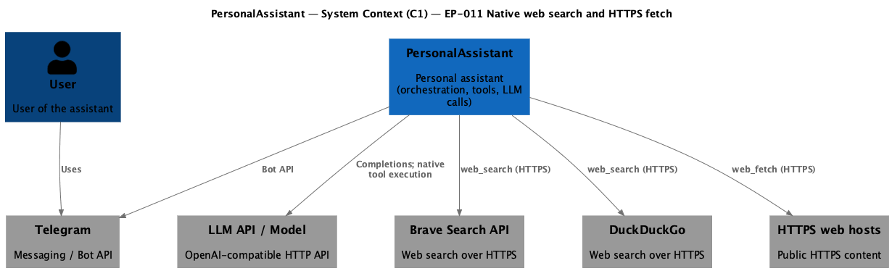
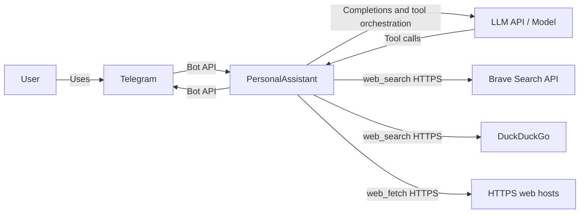

# Native web search and HTTPS content fetch — Requirements (EARS / INCOSE)

This document contains the product requirements for EP-011 Native web search and HTTPS content fetch (tools) in EARS form, aligned with INCOSE semantic quality rules (active voice, one thought per requirement, explicit and measurable criteria, defined terminology, solution-free where applicable).

> **26 requirements** · 24 FR · 2 NFR · 6 theme groups

**Contents**

- [Introduction](#introduction)
- [Glossary](#glossary)
- [C4 C1 — System Context](#c4-c1--system-context)
- [Flow](#flow)
- [EARS patterns used](#ears-patterns-used)
- [Requirement index](#requirement-index)
- [Requirements](#requirements)
  - [Tools & providers](#tools--providers)
  - [Search cache](#search-cache)
  - [web_fetch & SSRF](#web_fetch--ssrf)
  - [Config & limits](#config--limits)
  - [Security & observability](#security--observability)
  - [Testing](#testing)

---

## Introduction

EP-011 adds first-class **native** (non-browser) tools for **web search** and **HTTPS-only** retrieval of public page content. **web_search** supports **Brave Search** and **DuckDuckGo** with a configurable **primary search provider** and an optional **fallback search provider**, uses an **in-process** search result cache with **TTL** and a bounded entry count, and aligns with the existing tool contract. **web_fetch** enforces **HTTPS-only** input, **SSRF** controls, size and redirect limits, and timeouts. Security and logging follow project norms (no secret material in logs or LLM-visible content on the secret path).

**Traceability to epic scope:** Capabilities and boundaries match [ep-scope.md](ep-scope.md); cross-cutting product terms align with [scope.md](../../scope.md); test expectations align with [strategy.md](../../strategy.md).

**MVP scope in brief**

- **web_search** with configurable **Brave Search** or **DuckDuckGo** provider
- Brave Search API credential supplied via filesystem path in the **configuration file**
- In-memory **search result cache** with TTL and maximum entry count
- **web_fetch** for `https` URLs only, with SSRF mitigations, redirect cap, body size cap, and timeouts
- Structured tool errors and log redaction compatible with existing assistant behaviour

---

## Glossary

| Term | Definition |
|------|------------|
| **PersonalAssistant** | The Go-based personal assistant process that orchestrates messaging, LLM calls, and tool execution. |
| **configuration file** | The primary JSON (or equivalent) configuration consumed by PersonalAssistant at startup, including tool and network limit settings for this epic. |
| **web_search** | The native tool that returns ranked search results (title, URL, snippet or equivalent) for a query string using the **primary search provider** and, when configured, the **fallback search provider**. |
| **primary search provider** | The **search provider** named first in **web_tools** configuration for **web_search**; PersonalAssistant attempts this provider before any **fallback search provider**. |
| **fallback search provider** | An optional second **search provider** in **web_tools** configuration, distinct from the **primary search provider**, used for one additional **upstream search request** when the **primary search provider** attempt fails as defined in the **system design artefact**. |
| **web_fetch** | The native tool that retrieves public document body bytes for a single URL over **HTTPS** only. |
| **Native tool** | A tool implemented inside PersonalAssistant with standard HTTP clients and parsing; no headless browser and no remote browser MCP on the search or fetch path for this epic. |
| **search provider** | Either **Brave Search** or **DuckDuckGo** as the upstream source for **web_search** results. |
| **Brave Search** | The Brave Search HTTP API used when **search provider** is Brave Search. |
| **DuckDuckGo** | The DuckDuckGo service reached over HTTPS when **search provider** is DuckDuckGo; the exact programmatic contract is fixed in the system design artefact. |
| **HTTPS-only policy** | The rule that **web_fetch** accepts only URLs whose scheme is `https`. |
| **SSRF mitigation** | Controls that block or reject requests whose resolved destinations fall into disallowed address or hostname classes (for example loopback, private, link-local, metadata). |
| **search result cache** | An in-memory, per-process store of **web_search** responses keyed by a **cache lookup key**, with **time-to-live** and a maximum entry count. |
| **cache lookup key** | The value derived from normalized query text, the ordered **search provider** chain (**primary search provider** and optional **fallback search provider**), and any additional facets named in the system design artefact. |
| **time-to-live** | The configured duration after which a **search result cache** entry is treated as expired. |
| **eviction policy** | The rule that removes or replaces **search result cache** entries when the maximum entry count is reached. |
| **upstream search request** | An HTTP call from PersonalAssistant to **Brave Search** or **DuckDuckGo** to obtain fresh **web_search** results. |
| **structured error** | A tool error representation consumed by the agent that identifies the failure class without leaking secret material. |
| **operator-visible logs** | Log output intended for operators, excluding secrets per project logging norms. |
| **LLM-visible content** | Strings included in LLM requests, responses, or tool arguments and results as seen by the model interface. |
| **system design artefact** | The approved design document for EP-011 under `ai-sdlc-artefacts/epics/EP-011/` that records interface choices, SSRF lists, and cache facets. |

---

## C4 C1 — System Context

**Source:** [c4-context.puml](diagrams/c4-context.puml) (C4-PlantUML). To regenerate PNG: `plantuml -tpng diagrams/c4-context.puml` from this directory.

### Flow

High-level interaction flow at system context level: the user interacts via Telegram; PersonalAssistant exchanges messages with Telegram, calls the LLM, and executes **web_search** against Brave Search or DuckDuckGo and **web_fetch** against public HTTPS sites when the agent selects those tools.

---

## EARS patterns used

- **Ubiquitous:** THE \<system\> SHALL \<response\>
- **Event-driven:** WHEN \<trigger\>, THE \<system\> SHALL \<response\>
- **Optional feature:** WHERE \<option\>, THE \<system\> SHALL \<response\>
- **Unwanted event:** IF \<condition\>, THEN THE \<system\> SHALL \<response\>

In the following, the implementing system is **PersonalAssistant** unless a requirement names **web_search** or **web_fetch** explicitly.

---

## Requirement index

| Id | Type | Section | Summary |
|----|------|---------|---------|
| REQ-11.001 | FR | Tools & providers | Register **web_search** as a native tool from the **configuration file** |
| REQ-11.002 | FR | Tools & providers | Register **web_fetch** as a native tool from the **configuration file** |
| REQ-11.003 | FR | Tools & providers | **web_search** accepts a validated query string per the tool contract |
| REQ-11.004 | FR | Tools & providers | **Brave Search** path when **search provider** is Brave Search |
| REQ-11.005 | FR | Tools & providers | **DuckDuckGo** path when **search provider** is DuckDuckGo |
| REQ-11.006 | FR | Tools & providers | Read Brave Search credential from configured filesystem path |
| REQ-11.007 | FR | Tools & providers | Structured error when Brave credential file is unusable |
| REQ-11.008 | FR | Tools & providers | **web_search** returns structured ranked items |
| REQ-11.009 | FR | Search cache | In-memory **search result cache** with **time-to-live** |
| REQ-11.010 | FR | Search cache | **cache lookup key** from normalized query and provider |
| REQ-11.011 | FR | Search cache | Cache hit avoids new **upstream search request** |
| REQ-11.012 | FR | Search cache | Maximum cache entries with **eviction policy** |
| REQ-11.013 | FR | web_fetch & SSRF | Reject non-HTTPS **web_fetch** URLs with **structured error** |
| REQ-11.014 | FR | web_fetch & SSRF | **SSRF mitigation** blocks disallowed destinations |
| REQ-11.015 | FR | web_fetch & SSRF | Redirect hop limit and rejection of non-HTTPS redirect targets |
| REQ-11.016 | FR | web_fetch & SSRF | Cap retrieved body size in bytes |
| REQ-11.017 | NFR | Config & limits | Configurable wall-clock bound for **web_fetch** completion |
| REQ-11.018 | NFR | Config & limits | Configurable wall-clock bound for each **upstream search request** |
| REQ-11.019 | FR | Config & limits | Load tool and limit settings from the **configuration file** |
| REQ-11.020 | FR | Config & limits | Fail fast on invalid required configuration at startup |
| REQ-11.021 | FR | Security & observability | Keep Brave Search credential material out of logs and **LLM-visible content** |
| REQ-11.022 | FR | Security & observability | **Structured errors** for **web_search** and **web_fetch** failures |
| REQ-11.023 | FR | Security & observability | Truncate or redact sensitive fields in **operator-visible logs** |
| REQ-11.024 | FR | Testing | Automated tests for validation, SSRF, cache, and local HTTPS **web_fetch** |
| REQ-11.025 | FR | Tools & providers | **Primary** and optional distinct **fallback search provider** in configuration |
| REQ-11.026 | FR | Tools & providers | **Fallback** **upstream search request** after **primary** failure |

---

## Requirements

### Tools & providers

*REQ-11.001, REQ-11.002, REQ-11.003, REQ-11.004, REQ-11.005, REQ-11.006, REQ-11.007, REQ-11.008, REQ-11.025, REQ-11.026*

### REQ-11.001 — Register **web_search** as a native tool from the **configuration file**
THE PersonalAssistant SHALL register **web_search** as a **Native tool** using entries in the **configuration file** alongside existing tools.

### REQ-11.002 — Register **web_fetch** as a native tool from the **configuration file**
THE PersonalAssistant SHALL register **web_fetch** as a **Native tool** using entries in the **configuration file** alongside existing tools.

### REQ-11.003 — **web_search** accepts a validated query string per the tool contract
THE **web_search** tool SHALL accept a search query string as validated input defined by the tool contract.

### REQ-11.004 — **Brave Search** path when **search provider** is Brave Search
WHERE the **configuration file** sets the **primary search provider** to **Brave Search**, THE **web_search** tool SHALL obtain ranked results from **Brave Search** when the **primary search provider** attempt succeeds.

### REQ-11.005 — **DuckDuckGo** path when **search provider** is DuckDuckGo
WHERE the **configuration file** sets the **primary search provider** to **DuckDuckGo**, THE **web_search** tool SHALL obtain ranked results from **DuckDuckGo** over HTTPS using the programmatic interface recorded in the **system design artefact** when the **primary search provider** attempt succeeds.

### REQ-11.006 — Read Brave Search credential from configured filesystem path
WHEN **web_search** performs an **upstream search request** to **Brave Search** for either the **primary search provider** or the **fallback search provider**, THE PersonalAssistant SHALL read the **Brave Search** API credential from the filesystem path declared in the **configuration file**.

### REQ-11.007 — Structured error when Brave credential file is unusable
IF the **Brave Search** API credential file is missing, unreadable, or empty at the time **web_search** attempts **Brave Search** for the **primary search provider** or the **fallback search provider**, THEN THE **web_search** tool SHALL return a **structured error** for that attempt.

### REQ-11.008 — **web_search** returns structured ranked items
THE **web_search** tool SHALL return structured ranked items that each contain a title field, a URL field, and a snippet field or equivalent summary field.

### REQ-11.025 — **Primary** and optional distinct **fallback search provider** in configuration
THE PersonalAssistant SHALL read a **primary search provider** and MAY read a **fallback search provider** from the **configuration file** when **web_tools** is enabled; WHERE a **fallback search provider** is configured, THE **fallback search provider** SHALL identify a **search provider** that differs from the **primary search provider**.

### REQ-11.026 — **Fallback** **upstream search request** after **primary** failure
WHEN **web_search** performs an **upstream search request** using the **primary search provider** and receives a failure outcome listed in the **system design artefact**, AND a **fallback search provider** is configured, THEN THE **web_search** tool SHALL perform one **upstream search request** using the **fallback search provider** before the tool invocation returns an outcome to the agent.

---

### Search cache

*REQ-11.009, REQ-11.010, REQ-11.011, REQ-11.012*

### REQ-11.009 — In-memory **search result cache** with **time-to-live**
THE PersonalAssistant SHALL store **web_search** responses in a **search result cache** that resides in process memory and uses a configurable **time-to-live**.

### REQ-11.010 — **cache lookup key** from normalized query and provider
WHEN PersonalAssistant handles a **web_search** request, THE PersonalAssistant SHALL compute the **cache lookup key** from a normalized form of the query string, an ordered **search provider** chain consisting of the **primary search provider** identifier and, when configured, the **fallback search provider** identifier, and every additional cache facet named in the **system design artefact**.

### REQ-11.011 — Cache hit avoids new **upstream search request**
WHEN a **search result cache** entry exists for the computed **cache lookup key** and the entry age is less than the configured **time-to-live**, THE PersonalAssistant SHALL return the cached **web_search** response without issuing a new **upstream search request**.

### REQ-11.012 — Maximum cache entries with **eviction policy**
THE PersonalAssistant SHALL enforce a configurable maximum entry count on the **search result cache** using an **eviction policy** defined in the **system design artefact**.

---

### web_fetch & SSRF

*REQ-11.013, REQ-11.014, REQ-11.015, REQ-11.016*

### REQ-11.013 — Reject non-HTTPS **web_fetch** URLs with **structured error**
IF a **web_fetch** request supplies a URL whose scheme is not `https`, THEN THE **web_fetch** tool SHALL reject the request with a **structured error**.

### REQ-11.014 — **SSRF mitigation** blocks disallowed destinations
THE **web_fetch** tool SHALL reject requests whose resolved destinations match loopback IPv4 addresses, loopback IPv6 addresses, private IPv4 ranges, IPv6 unique local addresses, IPv6 link-local addresses, link-local IPv4 addresses, and **SSRF mitigation** metadata endpoints listed in the **system design artefact**.

### REQ-11.015 — Redirect hop limit and rejection of non-HTTPS redirect targets
THE **web_fetch** tool SHALL follow HTTP redirects with a configurable maximum redirect hop count and SHALL reject the fetch when any redirect target URL uses a scheme other than `https`.

### REQ-11.016 — Cap retrieved body size in bytes
THE **web_fetch** tool SHALL stop reading response body bytes after a configurable maximum byte count for the stored result.

---

### Config & limits

*REQ-11.017, REQ-11.018, REQ-11.019, REQ-11.020*

### REQ-11.017 — Configurable wall-clock bound for **web_fetch** completion
THE **web_fetch** tool SHALL enforce a configurable wall-clock timeout bound that covers the full operation including redirects.

### REQ-11.018 — Configurable wall-clock bound for each **upstream search request**
THE **web_search** tool SHALL enforce a configurable wall-clock timeout bound for each **upstream search request**.

### REQ-11.019 — Load tool and limit settings from the **configuration file**
THE PersonalAssistant SHALL read **primary search provider** selection, optional **fallback search provider** selection, filesystem path for the **Brave Search** API credential, **search result cache** **time-to-live**, **search result cache** maximum entry count, **web_fetch** maximum body bytes, **web_fetch** maximum redirect hop count, **web_search** timeout bounds, and **web_fetch** timeout bounds from the **configuration file**.

### REQ-11.020 — Fail fast on invalid required configuration at startup
IF required entries for **web_search** or **web_fetch** in the **configuration file** are missing or invalid at process startup, THEN THE PersonalAssistant SHALL terminate startup and emit a configuration error message.

---

### Security & observability

*REQ-11.021, REQ-11.022, REQ-11.023*

### REQ-11.021 — Keep Brave Search credential material out of logs and **LLM-visible content**
THE PersonalAssistant SHALL exclude **Brave Search** API credential material from **operator-visible logs** and from **LLM-visible content** on the **web_search** execution path.

### REQ-11.022 — **Structured errors** for **web_search** and **web_fetch** failures
THE PersonalAssistant SHALL surface **web_search** failures and **web_fetch** failures to the agent using **structured errors** aligned with the existing tool error contract.

### REQ-11.023 — Truncate or redact sensitive fields in **operator-visible logs**
THE PersonalAssistant SHALL truncate or redact **web_search** query text, **web_fetch** URLs, and **web_fetch** body fragments in **operator-visible logs** according to project logging norms.

---

### Testing

*REQ-11.024*

### REQ-11.024 — Automated tests for validation, SSRF, cache, and local HTTPS **web_fetch**
THE PersonalAssistant SHALL ship automated tests that cover **web_fetch** URL validation, **web_fetch** scheme enforcement, **SSRF mitigation** classification helpers, at least one **search result cache** hit path, at least one **search result cache** miss or expiry path, at least one **web_search** path where the **fallback search provider** supplies results after **primary search provider** failure, and **web_fetch** against a local HTTPS test server or fixture without relying on the public internet in default continuous integration jobs.

---
