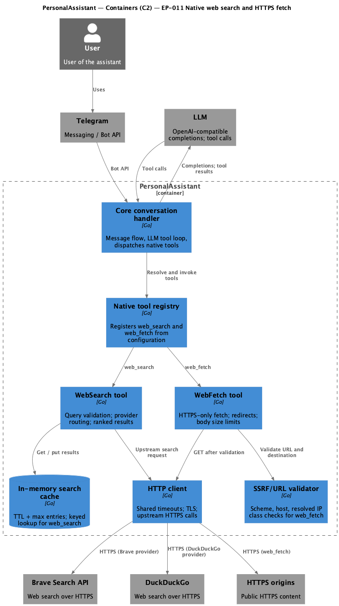

# EP-011 Native web search and HTTPS content fetch — System design

Stage output for epic EP-011. Upstream: [ep-scope.md](ep-scope.md), [ep-requirements.md](ep-requirements.md). Pipeline definition: repository file `ai-sdlc/specification/pipeline.spec.md` (not linked; outside `ai-sdlc-artefacts/`).

## Contents

- [Overview](#overview)
- [Architecture](#architecture)
  - [C4 container (C2)](#c4-container-c2)
  - [Module boundaries](#module-boundaries)
- [Components and interfaces](#components-and-interfaces)
- [Data models](#data-models)
  - [Search result cache entry](#search-result-cache-entry)
  - [Configuration keys](#configuration-keys)
- [SSRF and URL policy (web_fetch)](#ssrf-and-url-policy-web_fetch)
- [Error handling](#error-handling)
- [Testing strategy](#testing-strategy)
- [Requirement traceability](#requirement-traceability)

## Overview

This design adds **native** tools **web_search** and **web_fetch** inside PersonalAssistant: configurable **primary search provider** and optional **fallback search provider** over **Brave Search** and **DuckDuckGo**, an **in-process** search result cache with **TTL** and bounded size, and **HTTPS-only** fetching with **SSRF** controls, redirect limits, body size caps, and timeouts. The **core conversation handler** continues to orchestrate the LLM tool loop; the **native tool registry** exposes **web_search** and **web_fetch** according to the existing tool contract ([REQ-11.001](ep-requirements.md#tools--providers), [REQ-11.002](ep-requirements.md#tools--providers), [REQ-11.022](ep-requirements.md#security--observability)).

**web_search** validates the query ([REQ-11.003](ep-requirements.md#tools--providers)), reads **primary** and optional **fallback search provider** settings ([REQ-11.025](ep-requirements.md#tools--providers)), attempts the **primary search provider** first and, on failure listed below, one **upstream search request** on the **fallback search provider** ([REQ-11.026](ep-requirements.md#tools--providers)), routes each attempt to Brave or DuckDuckGo per that attempt’s provider ([REQ-11.004](ep-requirements.md#tools--providers), [REQ-11.005](ep-requirements.md#tools--providers)), loads the Brave API credential from a configured filesystem path when an attempt uses Brave ([REQ-11.006](ep-requirements.md#tools--providers)), returns a structured error if that credential is unusable for that attempt ([REQ-11.007](ep-requirements.md#tools--providers)), and returns ranked items with title, URL, and snippet (or equivalent) on success ([REQ-11.008](ep-requirements.md#tools--providers)). Responses are cached in memory ([REQ-11.009](ep-requirements.md#search-cache)) using a **cache lookup key** that includes the ordered provider chain ([REQ-11.010](ep-requirements.md#search-cache)); cache hits avoid upstream calls ([REQ-11.011](ep-requirements.md#search-cache)); eviction applies when the entry cap is reached ([REQ-11.012](ep-requirements.md#search-cache)).

**web_fetch** rejects non-HTTPS URLs ([REQ-11.013](ep-requirements.md#web_fetch--ssrf)), enforces SSRF rules ([REQ-11.014](ep-requirements.md#web_fetch--ssrf)), limits redirects and requires HTTPS on every hop ([REQ-11.015](ep-requirements.md#web_fetch--ssrf)), and caps stored body bytes ([REQ-11.016](ep-requirements.md#web_fetch--ssrf)). Wall-clock timeouts apply to **web_fetch** (full operation including redirects) ([REQ-11.017](ep-requirements.md#config--limits)) and to each **web_search** upstream request ([REQ-11.018](ep-requirements.md#config--limits)). All tool and limit settings are read from the **configuration file** ([REQ-11.019](ep-requirements.md#config--limits)); invalid required configuration fails startup ([REQ-11.020](ep-requirements.md#config--limits)). Brave credential material never appears in operator logs or LLM-visible content ([REQ-11.021](ep-requirements.md#security--observability)); failures use **structured errors** ([REQ-11.022](ep-requirements.md#security--observability)); queries, URLs, and body fragments are truncated or redacted in logs ([REQ-11.023](ep-requirements.md#security--observability)). Automated tests cover validation, SSRF, cache behaviour, **web_search** fallback after **primary search provider** failure, and local HTTPS fetch without public internet in default CI ([REQ-11.024](ep-requirements.md#testing)).

Terms match the [Glossary](ep-requirements.md#glossary) in [ep-requirements.md](ep-requirements.md).

## Architecture

PersonalAssistant remains a single process. The **core conversation handler** receives user context from Telegram, calls the LLM, and executes tool calls through the **native tool registry**. **WebSearch** and **WebFetch** are native tool implementations that share a configurable **HTTP client** for upstream TLS and timeouts. **web_fetch** consults the **SSRF/URL validator** before any outbound request. **web_search** reads and writes the **in-memory search cache** before optionally calling Brave or DuckDuckGo for the **primary search provider** and, when configured and needed, for the **fallback search provider**.

### C4 container (C2)

**Source:** [c4-container.puml](diagrams/c4-container.puml) (C4-PlantUML). To regenerate PNG: `plantuml -tpng diagrams/c4-container.puml` from directory `ai-sdlc-artefacts/epics/EP-011/`.

### Module boundaries

Short separation of concerns (implementation may map to packages under `internal/`):

| Boundary | Owns | Does not own |
|----------|------|----------------|
| **Core conversation handler** | LLM round-trip, tool call dispatch, Telegram-facing flow | Provider-specific search HTTP details |
| **Native tool registry** | Registration of **web_search** / **web_fetch** from config ([REQ-11.001](ep-requirements.md#tools--providers), [REQ-11.002](ep-requirements.md#tools--providers)) | SSRF classification logic |
| **WebSearch tool** | Query validation, cache keying, **primary** / **fallback** provider chain, provider adapter, result shaping ([REQ-11.003](ep-requirements.md#tools--providers)–[REQ-11.008](ep-requirements.md#tools--providers), [REQ-11.025](ep-requirements.md#tools--providers), [REQ-11.026](ep-requirements.md#tools--providers), [REQ-11.009](ep-requirements.md#search-cache)–[REQ-11.012](ep-requirements.md#search-cache)) | Fetch URL policy |
| **WebFetch tool** | Orchestration of validate → request → read up to cap ([REQ-11.013](ep-requirements.md#web_fetch--ssrf)–[REQ-11.016](ep-requirements.md#web_fetch--ssrf)) | Shared TCP pool internals |
| **In-memory search cache** | TTL, max entries, eviction ([REQ-11.009](ep-requirements.md#search-cache), [REQ-11.012](ep-requirements.md#search-cache)) | Persistent storage |
| **HTTP client** | Timeouts, TLS, redirect handling hooks ([REQ-11.017](ep-requirements.md#config--limits), [REQ-11.018](ep-requirements.md#config--limits)) | Business validation of URLs |
| **SSRF/URL validator** | Scheme, host, DNS resolution, IP class checks ([REQ-11.013](ep-requirements.md#web_fetch--ssrf), [REQ-11.014](ep-requirements.md#web_fetch--ssrf)) | HTTP response parsing |

**DuckDuckGo interface (design record):** the DuckDuckGo adapter uses an **HTTPS GET** to a **stable DuckDuckGo HTML or lite JSON endpoint** (concrete path and query parameters fixed in implementation), parses ranked-like results into the same structured item shape as Brave, and respects the same timeout ([REQ-11.005](ep-requirements.md#tools--providers), [REQ-11.018](ep-requirements.md#config--limits)). No headless browser.

## Components and interfaces

| Component | Responsibility | Key interface / contract |
|-----------|----------------|---------------------------|
| **Core conversation handler** | Drives the agent loop; invokes registered tools by name with validated arguments; returns tool results to the LLM. | Existing tool execution contract; must surface [REQ-11.022](ep-requirements.md#security--observability) structured errors without leaking secrets ([REQ-11.021](ep-requirements.md#security--observability)). |
| **Native tool registry** | Loads tool definitions from the **configuration file** and wires **web_search** / **web_fetch** implementations. | [REQ-11.001](ep-requirements.md#tools--providers), [REQ-11.002](ep-requirements.md#tools--providers), [REQ-11.019](ep-requirements.md#config--limits), [REQ-11.020](ep-requirements.md#config--limits). |
| **WebSearch tool** | Validates query input; computes **cache lookup key** (includes ordered **primary** + optional **fallback**); on miss, calls **primary search provider** then, on listed failure, **fallback search provider** via **HTTP client**; maps responses to ranked items. | Output items: title, URL, snippet ([REQ-11.008](ep-requirements.md#tools--providers)); Brave credential from path ([REQ-11.006](ep-requirements.md#tools--providers)); structured error if credential unusable ([REQ-11.007](ep-requirements.md#tools--providers)); **primary** / **fallback** configuration ([REQ-11.025](ep-requirements.md#tools--providers), [REQ-11.026](ep-requirements.md#tools--providers)); per-attempt routing ([REQ-11.004](ep-requirements.md#tools--providers), [REQ-11.005](ep-requirements.md#tools--providers)); cache ([REQ-11.009](ep-requirements.md#search-cache)–[REQ-11.012](ep-requirements.md#search-cache)); per-request timeout ([REQ-11.018](ep-requirements.md#config--limits)). |
| **WebFetch tool** | Accepts a single URL string; runs **SSRF/URL validator**; performs HTTPS GET with redirect cap; reads body up to max bytes. | [REQ-11.013](ep-requirements.md#web_fetch--ssrf)–[REQ-11.016](ep-requirements.md#web_fetch--ssrf); overall timeout [REQ-11.017](ep-requirements.md#config--limits). |
| **In-memory search cache** | Stores serialized **web_search** results keyed by **cache lookup key**; expires by TTL; evicts when over max entries. | **Eviction policy:** remove **least-recently-used** entry when inserting a new entry would exceed the configured maximum count ([REQ-11.012](ep-requirements.md#search-cache)). |
| **HTTP client** | Executes HTTPS requests for search and fetch; enforces timeouts; follows redirects only within **web_fetch** policy. | Shared by WebSearch and WebFetch; must not log secrets ([REQ-11.021](ep-requirements.md#security--observability)). |
| **SSRF/URL validator** | Parses URL; rejects non-HTTPS; resolves hostnames where required; classifies resolved addresses. | Rules in [SSRF and URL policy](#ssrf-and-url-policy-web_fetch) ([REQ-11.014](ep-requirements.md#web_fetch--ssrf)). |
| **Brave Search API** (external) | Brave Search HTTP API. | API key in `Authorization` or query per Brave docs; key never in logs or LLM content ([REQ-11.021](ep-requirements.md#security--observability)). |
| **DuckDuckGo** (external) | Public HTTPS search interface. | Rate and terms of use respected; no credential on this path for MVP. |
| **HTTPS origins** (external) | Target hosts for **web_fetch**. | Only after validation and redirect checks ([REQ-11.015](ep-requirements.md#web_fetch--ssrf)). |
| **Telegram** (external) | User messaging channel. | Unchanged; relates to core handler only. |
| **LLM** (external) | Model API with tool calling. | Supplies tool calls to **web_search** / **web_fetch**; receives structured errors on failure ([REQ-11.022](ep-requirements.md#security--observability)). |

## Data models

### Search result cache entry

| Field | Meaning |
|-------|---------|
| `key` | **Cache lookup key** ([REQ-11.010](ep-requirements.md#search-cache)): string derived from facets below. |
| `stored_at` | Monotonic or wall time when the entry was written; used with configured **time-to-live** ([REQ-11.009](ep-requirements.md#search-cache), [REQ-11.011](ep-requirements.md#search-cache)). |
| `last_access_at` | Timestamp for LRU ordering ([REQ-11.012](ep-requirements.md#search-cache)). |
| `results` | Ordered list of search items (title, URL, snippet or equivalent) matching **web_search** output ([REQ-11.008](ep-requirements.md#tools--providers)). |

**Cache lookup key facets** (all concatenated or hashed in a stable, documented order):

| Facet | Purpose |
|-------|---------|
| Normalized query string | Whitespace normalization and case folding per implementation spec ([REQ-11.010](ep-requirements.md#search-cache)). |
| Ordered **search provider** chain | Stable encoding of **primary search provider** and, when configured, **fallback search provider** (e.g. `primary` or `primary>fallback`) so cache entries differ when fallback is present or absent and when provider order differs ([REQ-11.010](ep-requirements.md#search-cache), [REQ-11.004](ep-requirements.md#tools--providers), [REQ-11.005](ep-requirements.md#tools--providers)). |
| Optional result limit | If the tool accepts a configurable or schema-defined maximum number of results, include it in the key ([REQ-11.010](ep-requirements.md#search-cache)). |

### Configuration keys

All loaded from the **configuration file** ([REQ-11.019](ep-requirements.md#config--limits)); missing or invalid required values fail startup ([REQ-11.020](ep-requirements.md#config--limits)).

| Key (logical) | Applies to | Purpose |
|---------------|------------|---------|
| **Primary search provider** | web_search | First provider attempted ([REQ-11.004](ep-requirements.md#tools--providers), [REQ-11.005](ep-requirements.md#tools--providers), [REQ-11.025](ep-requirements.md#tools--providers)). |
| **Fallback search provider** (optional) | web_search | Second provider attempted after **primary search provider** failure ([REQ-11.025](ep-requirements.md#tools--providers), [REQ-11.026](ep-requirements.md#tools--providers)). |
| Brave API credential filesystem path | web_search (Brave) | Location read when any attempt uses Brave ([REQ-11.006](ep-requirements.md#tools--providers)); required at startup when **primary** or **fallback** is Brave. |
| Search cache **time-to-live** | web_search | Entry expiry duration ([REQ-11.009](ep-requirements.md#search-cache), [REQ-11.011](ep-requirements.md#search-cache)). |
| Search cache **maximum entry count** | web_search | Upper bound with LRU eviction ([REQ-11.012](ep-requirements.md#search-cache)). |
| **web_fetch** maximum body bytes | web_fetch | Stop reading after this many bytes ([REQ-11.016](ep-requirements.md#web_fetch--ssrf)). |
| **web_fetch** maximum redirect hops | web_fetch | Cap on redirect chain length ([REQ-11.015](ep-requirements.md#web_fetch--ssrf)). |
| **web_fetch** wall-clock timeout | web_fetch | Full operation bound including redirects ([REQ-11.017](ep-requirements.md#config--limits)). |
| **web_search** upstream request timeout | web_search | Per Brave or DuckDuckGo HTTP call ([REQ-11.018](ep-requirements.md#config--limits)). |
| Tool registration entries | registry | Enable **web_search** and **web_fetch** alongside existing tools ([REQ-11.001](ep-requirements.md#tools--providers), [REQ-11.002](ep-requirements.md#tools--providers)). |

Exact JSON paths and naming follow the product config schema when implemented; the list above is the required logical surface from [REQ-11.019](ep-requirements.md#config--limits).

## SSRF and URL policy (web_fetch)

**HTTPS-only:** reject if scheme is not `https` ([REQ-11.013](ep-requirements.md#web_fetch--ssrf)).

**Resolved destination classification** — reject if any resolved address of the request host (and, after redirects, of each redirect target host) matches ([REQ-11.014](ep-requirements.md#web_fetch--ssrf)):

| Class | Examples (non-exhaustive) |
|-------|---------------------------|
| IPv4 loopback | `127.0.0.0/8` |
| IPv6 loopback | `::1` |
| IPv4 private (RFC 1918) | `10.0.0.0/8`, `172.16.0.0/12`, `192.168.0.0/16` |
| IPv6 unique local | `fc00::/7` |
| IPv6 link-local | `fe80::/10` |
| IPv4 link-local | `169.254.0.0/16` |
| **Metadata endpoints** (hostname or IP) | `169.254.169.254`; `metadata.google.internal`; `metadata` on common cloud provider suffixes as listed in implementation allow/deny tables |

**Redirects:** follow up to the configured hop count; each new URL must use `https` and pass the same validation ([REQ-11.015](ep-requirements.md#web_fetch--ssrf)).

**DNS:** resolver behaviour must be consistent in tests; blocking decisions use addresses returned by the resolver at validation time ([REQ-11.014](ep-requirements.md#web_fetch--ssrf), [REQ-11.024](ep-requirements.md#testing)).

## Error handling

| Scenario | Handling | Requirements |
|----------|----------|--------------|
| Non-HTTPS **web_fetch** URL | Return **structured error** (invalid input / scheme); no outbound request. | [REQ-11.013](ep-requirements.md#web_fetch--ssrf) |
| SSRF or disallowed destination | Return **structured error**; no request (or abort redirect chain). | [REQ-11.014](ep-requirements.md#web_fetch--ssrf), [REQ-11.015](ep-requirements.md#web_fetch--ssrf) |
| Redirect limit exceeded or non-HTTPS redirect | **Structured error**; close body. | [REQ-11.015](ep-requirements.md#web_fetch--ssrf) |
| Body size exceeds cap | Truncate at max bytes for stored result; completion within tool contract. | [REQ-11.016](ep-requirements.md#web_fetch--ssrf) |
| Timeout (fetch or search upstream) | **Structured error** indicating timeout class. | [REQ-11.017](ep-requirements.md#config--limits), [REQ-11.018](ep-requirements.md#config--limits) |
| Brave credential missing / unreadable / empty | **Structured error** from **web_search** when provider is Brave. | [REQ-11.007](ep-requirements.md#tools--providers) |
| Upstream HTTP / parse errors | **Structured error** to agent for that attempt; no raw key material ([REQ-11.021](ep-requirements.md#security--observability)). If **fallback search provider** is configured and the failure applies to the **primary search provider** attempt only, perform the **fallback search provider** attempt next ([REQ-11.026](ep-requirements.md#tools--providers)). | [REQ-11.022](ep-requirements.md#security--observability) |
| Invalid config at startup | Process exit with configuration error message. | [REQ-11.020](ep-requirements.md#config--limits) |

**Primary search provider failure outcomes** that trigger a **fallback search provider** attempt (when configured): TLS or transport error on the **upstream search request**; wall-clock timeout for that request; HTTP status outside the 2xx range; failure to read the response body; JSON or HTML parse failure that prevents producing ranked items; zero ranked results after a nominally successful response.

## Testing strategy

| Level | Focus |
|-------|--------|
| Unit | URL parsing and scheme enforcement ([REQ-11.013](ep-requirements.md#web_fetch--ssrf)); SSRF classification helpers for loopback, private, ULA, link-local, metadata IPs and hostnames ([REQ-11.014](ep-requirements.md#web_fetch--ssrf), [REQ-11.024](ep-requirements.md#testing)). |
| Unit | **Cache lookup key** stability; TTL expiry; LRU eviction when over max entries ([REQ-11.010](ep-requirements.md#search-cache)–[REQ-11.012](ep-requirements.md#search-cache), [REQ-11.024](ep-requirements.md#testing)). |
| Unit / integration | At least one cache **hit** path (no upstream call) and one **miss** or **expiry** path ([REQ-11.011](ep-requirements.md#search-cache), [REQ-11.024](ep-requirements.md#testing)). |
| Integration | **web_fetch** against a **local HTTPS test server** or fixture; no dependency on the public internet in default CI ([REQ-11.024](ep-requirements.md#testing)); redirect hop and HTTPS-only redirect policy ([REQ-11.015](ep-requirements.md#web_fetch--ssrf)). |
| Integration / contract | Mock Brave (and optionally DuckDuckGo) HTTP handlers for ranked mapping, **primary** then **fallback** attempts, and timeouts ([REQ-11.004](ep-requirements.md#tools--providers), [REQ-11.008](ep-requirements.md#tools--providers), [REQ-11.018](ep-requirements.md#config--limits), [REQ-11.026](ep-requirements.md#tools--providers)). |

Project-wide expectations: [strategy.md](../../strategy.md).

## Requirement traceability

| REQ | Primary design location |
|-----|-------------------------|
| [REQ-11.001](ep-requirements.md#tools--providers) | [Module boundaries](#module-boundaries), [Components](#components-and-interfaces), [Configuration keys](#configuration-keys) |
| [REQ-11.002](ep-requirements.md#tools--providers) | [Module boundaries](#module-boundaries), [Components](#components-and-interfaces), [Configuration keys](#configuration-keys) |
| [REQ-11.003](ep-requirements.md#tools--providers) | [Overview](#overview), [Components](#components-and-interfaces) |
| [REQ-11.004](ep-requirements.md#tools--providers) | [Overview](#overview), [Components](#components-and-interfaces), [Cache lookup key facets](#search-result-cache-entry) |
| [REQ-11.005](ep-requirements.md#tools--providers) | [Overview](#overview), [Module boundaries](#module-boundaries), [Components](#components-and-interfaces) |
| [REQ-11.006](ep-requirements.md#tools--providers) | [Overview](#overview), [Components](#components-and-interfaces) |
| [REQ-11.007](ep-requirements.md#tools--providers) | [Overview](#overview), [Error handling](#error-handling) |
| [REQ-11.008](ep-requirements.md#tools--providers) | [Overview](#overview), [Components](#components-and-interfaces), [Search result cache entry](#search-result-cache-entry) |
| [REQ-11.009](ep-requirements.md#search-cache) | [Overview](#overview), [Data models](#data-models), [Components](#components-and-interfaces) |
| [REQ-11.010](ep-requirements.md#search-cache) | [Overview](#overview), [Data models](#data-models) |
| [REQ-11.011](ep-requirements.md#search-cache) | [Overview](#overview), [Data models](#data-models), [Testing strategy](#testing-strategy) |
| [REQ-11.012](ep-requirements.md#search-cache) | [Overview](#overview), [Data models](#data-models), [Components](#components-and-interfaces) |
| [REQ-11.013](ep-requirements.md#web_fetch--ssrf) | [SSRF and URL policy](#ssrf-and-url-policy-web_fetch), [Error handling](#error-handling) |
| [REQ-11.014](ep-requirements.md#web_fetch--ssrf) | [SSRF and URL policy](#ssrf-and-url-policy-web_fetch), [Module boundaries](#module-boundaries) |
| [REQ-11.015](ep-requirements.md#web_fetch--ssrf) | [SSRF and URL policy](#ssrf-and-url-policy-web_fetch), [Error handling](#error-handling), [Components](#components-and-interfaces) |
| [REQ-11.016](ep-requirements.md#web_fetch--ssrf) | [Overview](#overview), [Configuration keys](#configuration-keys), [Error handling](#error-handling) |
| [REQ-11.017](ep-requirements.md#config--limits) | [Overview](#overview), [Module boundaries](#module-boundaries), [Error handling](#error-handling) |
| [REQ-11.018](ep-requirements.md#config--limits) | [Overview](#overview), [Module boundaries](#module-boundaries), [Components](#components-and-interfaces), [Testing strategy](#testing-strategy) |
| [REQ-11.019](ep-requirements.md#config--limits) | [Configuration keys](#configuration-keys), [Components](#components-and-interfaces) |
| [REQ-11.020](ep-requirements.md#config--limits) | [Configuration keys](#configuration-keys), [Error handling](#error-handling) |
| [REQ-11.021](ep-requirements.md#security--observability) | [Overview](#overview), [Components](#components-and-interfaces), [Error handling](#error-handling) |
| [REQ-11.022](ep-requirements.md#security--observability) | [Overview](#overview), [Components](#components-and-interfaces), [Error handling](#error-handling) |
| [REQ-11.023](ep-requirements.md#security--observability) | [Overview](#overview), [Error handling](#error-handling) (no sensitive payloads in logs); operator log redaction in implementation |
| [REQ-11.024](ep-requirements.md#testing) | [Testing strategy](#testing-strategy), [SSRF and URL policy](#ssrf-and-url-policy-web_fetch) |
| [REQ-11.025](ep-requirements.md#tools--providers) | [Overview](#overview), [Configuration keys](#configuration-keys), [Components](#components-and-interfaces) |
| [REQ-11.026](ep-requirements.md#tools--providers) | [Overview](#overview), [Error handling](#error-handling), [Components](#components-and-interfaces), [Testing strategy](#testing-strategy) |
