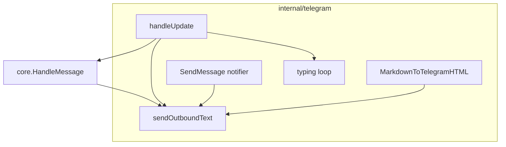

# EP-012 — System design

**Pipeline:** Stage 6.  
**Inputs:** [ep-requirements.md](ep-requirements.md), [ep-acceptance-criteria.md](ep-acceptance-criteria.md)

---

## Overview

Outbound Telegram text is converted from assistant-oriented Markdown to Telegram HTML in a small pure function package under `internal/telegram`. The adapter applies this conversion for every `SendMessage`, sets `models.ParseModeHTML`, and on `bad request` errors whose message indicates parse/entity failure, retries once without parse mode. While `HandleMessage` runs for an allowed user, a goroutine refreshes `sendChatAction` typing on a ~4 s ticker until the handler returns or context ends.

---

## Architecture

---

## Components and interfaces

| Component | Responsibility |
|-----------|------------------|
| **`format.go`** (or same package) | `MarkdownToTelegramHTML(string) string` — pure, testable conversion. |
| **`Adapter.sendOutboundText`** (unexported) | Calls converter; `SendMessage` with `ParseModeHTML`; on `errors.Is(err, bot.ErrorBadRequest)` and description contains parse/entity hint, retry plain. |
| **`Adapter.handleUpdate`** | Starts typing refresh goroutine (cancel via `context.CancelFunc` after handler returns); calls `sendOutboundText` for errors, rejection, and replies. |
| **`Adapter.SendMessage`** | Notifier path: same `sendOutboundText` as user replies. |
| **`telegramOutbound` interface** | `SendMessage` + `SendChatAction` for test doubles. |

---

## Data models

- No persistent schema changes. Message text remains a string; parse mode is a Bot API field only.

---

## Error handling

- **HTML rejected:** Detect wrapped `bot.ErrorBadRequest` and substring match on description (`parse`, `entity` case-insensitive) to avoid retrying unrelated 400s (e.g. invalid chat). If uncertain, optional conservative approach: retry plain only on entity-related descriptions.
- **`sendChatAction` errors:** Ignored for control flow; no user-visible failure.

---

## Testing strategy

- **Unit:** `MarkdownToTelegramHTML` — bold, code, headers, links, tables, XSS-style escaping (AC-12.001, AC-12.002).
- **Unit:** Adapter with mock implementing `SendMessage` + `SendChatAction` — parse mode on success; fallback on simulated bad request; typing call count with slow handler; typing error does not block (AC-12.003–AC-12.007).

---

## References

- [Telegram Bot API — HTML](https://core.telegram.org/bots/api#html-style)
- [Telegram Bot API — sendChatAction](https://core.telegram.org/bots/api#sendchataction)
