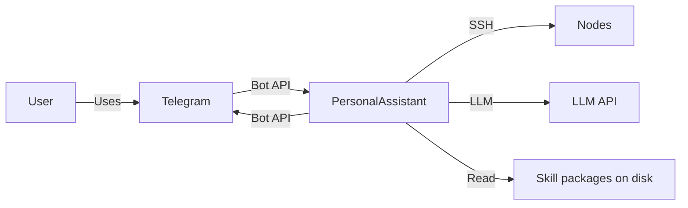

# EP-013 Runtime skills and consolidated system prompt — Requirements (EARS / INCOSE)

This document contains the product requirements for EP-013 in EARS form, aligned with INCOSE semantic quality rules. Derived from [ep-scope.md](ep-scope.md).

**Total: 20 requirements (15 FR, 5 NFR)**

**Contents**

- [Introduction](#introduction)
- [Glossary](#glossary)
- [C4 C1 — System Context](#c4-c1--system-context)
- [Flow](#flow)
- [EARS patterns used](#ears-patterns-used)
- [Requirement index](#requirement-index)
- [Requirements](#requirements)
- [NFR — Security, testability, observability](#nfr--security-testability-observability)

---

## Introduction

EP-013 introduces **runtime skills** (AgentSkills-style `SKILL.md` packages), a dedicated **`vec_skills`** semantic index, **union-based tool selection** with **`always_include`** and caps, and a **single merged `role: system` message** structured with an English **trust policy**, **canonical `<<<PA_BEGIN_*>>>` / `<<<PA_END_*>>>` markers**, and bounded **runtime skill** text at the tail. Hermes and native tool-calling paths remain supported. **Skill `scripts/` execution** and **`references/`** loading are out of scope for this epic.

**Scope in brief**

- Configurable skills root directory; optional enable flag; **`always_include`** tool ids; per-turn caps for skill count, tool-vector top-k, and two rune budgets (skills text and tool-instruction aggregate).
- Fail-fast startup validation for skill packages, tool references (variant **D**), and forbidden marker lines in `SKILL.md`.
- **`vec_skills`** in the same SQLite file as existing vector tables; full rebuild at process start; no hot-reload.
- Fallback to existing tool pre-selection when skills are disabled or selection yields no skills.
- Reject indexing conversation chunks that contain a forbidden marker line after trim.

---

## Glossary

| Term | Definition |
|------|------------|
| **PersonalAssistant (System)** | The Go core, adapters, memory, vector indexes, tools, and LLM integration. |
| **Runtime skill** | A subdirectory under `paths.skills_dir` containing `SKILL.md` with YAML frontmatter (`name`, `description` required) and optional `tools` list of tool ids. |
| **`vec_skills`** | Dedicated sqlite-vec virtual table for skill embedding rows; same DB file and embedding dimension as `vec_tools`. |
| **Canonical marker line** | One of the exact `<<<PA_BEGIN_*>>>` or `<<<PA_END_*>>>` strings defined for prompt blocks; compared line-by-line after trim. |
| **Tool reference variant D** | Every tool id listed in any skill `tools` field or in **`always_include`** SHALL resolve to a catalog tool or an allowed native tool id; orphan catalog rows remain valid. |
| **User turn** | One inbound user message that starts a handler invocation before `HandleMessage` returns. |
| **Tool round** | One iteration of the tool-result loop inside the same user turn. |

---

## C4 C1 — System Context

**Source:** [c4-context.puml](diagrams/c4-context.puml) (C4-PlantUML). To regenerate PNG: `plantuml -tpng diagrams/c4-context.puml` from this directory.

### Flow

The user messages via Telegram; the core loads configuration, tool catalog, and optional runtime skills; the core builds a merged system string and tool list, calls the LLM, runs tools, and replies.

---

## EARS patterns used

- **Ubiquitous:** THE \<system\> SHALL \<response\>
- **Event-driven:** WHEN \<trigger\>, THE \<system\> SHALL \<response\>
- **Unwanted event:** IF \<condition\>, THEN THE \<system\> SHALL \<response\>
- **Optional feature:** WHERE \<option\>, THE \<system\> SHALL \<response\>

*System* = PersonalAssistant unless a component is named.

---

## Requirement index

| Id | Type | Section | Summary |
|----|------|---------|--------|
| REQ-13.001 | FR | Config | Skills directory path on Paths |
| REQ-13.002 | FR | Config | Runtime skills enable and numeric caps in config |
| REQ-13.003 | FR | Config | always_include list validated at load |
| REQ-13.004 | FR | Load | WHEN runtime skills enabled THE System SHALL load packages from skills_dir |
| REQ-13.005 | FR | Load | WHEN frontmatter invalid THE System SHALL fail startup |
| REQ-13.006 | FR | Load | WHEN tool ref from skill or always_include unresolved THE System SHALL fail startup |
| REQ-13.007 | FR | Load | WHEN SKILL.md contains forbidden marker line THE System SHALL fail startup |
| REQ-13.008 | FR | Index | vec_skills uses same DB file and embedding dimension as tool index |
| REQ-13.009 | FR | Index | THE System SHALL rebuild vec_skills at process start |
| REQ-13.010 | FR | Selection | WHEN runtime skills enabled THE System SHALL vector-search skills per user message |
| REQ-13.011 | FR | Selection | THE System SHALL form tool id set as union of skill-declared, always_include, and tool-vector top-k |
| REQ-13.012 | FR | Selection | THE System SHALL apply rune budgets by dropping whole skills then whole vector-only tools |
| REQ-13.013 | FR | Fallback | WHERE runtime skills disabled or no skill match THE System SHALL retain prior tool pre-selection behaviour |
| REQ-13.014 | FR | Prompt | THE System SHALL prepend English trust policy before other dynamic assistant instructions in system |
| REQ-13.015 | FR | Prompt | THE System SHALL wrap retrieved context, tool instructions, Hermes instructions, and runtime skills in canonical marker pairs |
| REQ-13.016 | FR | Prompt | THE System SHALL place retrieved context and runtime skills toward the tail of the merged system string |
| REQ-13.017 | FR | Turn model | THE System SHALL rebuild merged system for each new user turn and keep the same merged system across tool rounds within that turn |
| REQ-13.018 | FR | Memory | IF conversation chunk for indexing contains forbidden marker line THEN THE System SHALL reject indexing that chunk |
| REQ-13.019 | NFR | NFR | Startup validation errors SHALL include actionable messages |
| REQ-13.020 | NFR | NFR | Automated tests SHALL cover marker rules, load validation, prompt structure, and tool union; E2E path documented or automated |

---

## Requirements

### Configuration and paths

*REQ-13.001, REQ-13.002, REQ-13.003*

**REQ-13.001** (Ubiquitous)  
THE System SHALL expose `paths.skills_dir` as the filesystem root for runtime skill packages (subdirectory per skill).

**REQ-13.002** (Optional feature)  
WHERE the `runtime_skills` configuration object is present, THE System SHALL support `enabled`, `max_skills_per_turn` (>= 1), `tool_vector_top_k_cap` (>= 1), `max_skill_runes_per_turn` (>= 1), and `max_tool_instruction_runes_per_turn` (>= 1) with validation at config load.

**REQ-13.003** (Ubiquitous)  
THE System SHALL validate every tool id in `tools.always_include` at startup against the tool catalog or the allowed native tool id set used by the core.

---

### Load and validation

*REQ-13.004–REQ-13.007*

**REQ-13.004** (Event-driven)  
WHEN `runtime_skills.enabled` is true and `paths.skills_dir` is non-empty, THE System SHALL parse each skill package and retain `name`, `description`, optional `tools` list, and markdown body from `SKILL.md` at startup.

**REQ-13.005** (Event-driven)  
WHEN a `SKILL.md` file lacks required frontmatter fields `name` and `description`, THE System SHALL fail startup with an error that identifies the skill directory.

**REQ-13.006** (Event-driven)  
WHEN a skill `tools` entry or `always_include` references a tool id that exists in neither the tool catalog nor the allowed native tool id set, THE System SHALL fail startup with an error that identifies the tool id.

**REQ-13.007** (Event-driven)  
WHEN any line in `SKILL.md` body or frontmatter values equals a canonical marker line after trim, THE System SHALL fail startup with an error that identifies the skill directory.

---

### vec_skills index

*REQ-13.008, REQ-13.009*

**REQ-13.008** (Ubiquitous)  
THE System SHALL store skill embeddings in a dedicated `vec_skills` virtual table in the same SQLite database file as `vec_items` and `vec_tools`, using the same embedding model dimension as the tool index.

**REQ-13.009** (Ubiquitous)  
THE System SHALL clear and fully rebuild the `vec_skills` table during process startup after skill packages are loaded.

---

### Selection and tool union

*REQ-13.010–REQ-13.012*

**REQ-13.010** (Event-driven)  
WHEN `runtime_skills.enabled` is true and the skill index is ready, THE System SHALL run semantic search over `vec_skills` for the current user message text and select up to `max_skills_per_turn` skills by similarity score ordering.

**REQ-13.011** (Ubiquitous)  
THE System SHALL compute the candidate tool id set as the union of tool ids declared on selected skills, all `always_include` ids, and the tool ids returned by existing tool-vector pre-selection, with tool-vector results capped by `tool_vector_top_k_cap` before the union.

**REQ-13.012** (Ubiquitous)  
THE System SHALL enforce `max_skill_runes_per_turn` across concatenated selected skill bodies by removing whole lowest-ranked selected skills first; THE System SHALL enforce `max_tool_instruction_runes_per_turn` across tool instruction aggregates by removing whole tools that appear only from uncapped vector pre-selection and are not pinned by a selected skill or `always_include`, in a deterministic order.

---

### Fallback

*REQ-13.013*

**REQ-13.013** (Optional feature)  
WHERE `runtime_skills.enabled` is false or skill semantic search yields zero skills, THE System SHALL build the tool list using the existing tool pre-selection and fallback rules from EP-004 without requiring skill packages.

---

### Prompt assembly

*REQ-13.014–REQ-13.016*

**REQ-13.014** (Ubiquitous)  
THE System SHALL insert the agreed English trust-and-injection policy text at the beginning of the merged `role: system` content before retrieved context, tool instructions, Hermes text, and runtime skill bodies.

**REQ-13.015** (Ubiquitous)  
THE System SHALL wrap retrieved context in `<<<PA_BEGIN_RETRIEVED_CONTEXT>>>` / `<<<PA_END_RETRIEVED_CONTEXT>>>`, aggregate catalog tool instructions in `<<<PA_BEGIN_TOOL_INSTRUCTIONS>>>` / `<<<PA_END_TOOL_INSTRUCTIONS>>>`, Hermes tool-format instructions in `<<<PA_BEGIN_HERMES_TOOL_FORMAT>>>` / `<<<PA_END_HERMES_TOOL_FORMAT>>>`, and selected runtime skill bodies in `<<<PA_BEGIN_RUNTIME_SKILLS>>>` / `<<<PA_END_RUNTIME_SKILLS>>>` when the corresponding block is non-empty.

**REQ-13.016** (Ubiquitous)  
THE System SHALL order dynamic blocks so that retrieved context and runtime skills appear after the trust policy and tool instruction blocks inside the merged system string.

---

### Turn model

*REQ-13.017*

**REQ-13.017** (Ubiquitous)  
THE System SHALL construct the merged `role: system` message once per user turn before the first LLM call for that turn; THE System SHALL reuse that same merged system content for subsequent LLM calls in the same user turn (including tool-result follow-ups).

---

### Memory indexing

*REQ-13.018*

**REQ-13.018** (Unwanted event)  
IF the conversation chunk text prepared for vector indexing contains any line equal to a canonical marker line after trim, THEN THE System SHALL refuse to add that chunk to the vector store for that attempt and SHALL surface the failure through existing logging without silent truncation of marker text into the index.

---

## NFR — Security, testability, observability

*REQ-13.019, REQ-13.020*

**REQ-13.019** (Ubiquitous)  
THE System SHALL return startup errors for skill and marker validation that include the skill directory name or tool id sufficient for an operator to correct configuration.

**REQ-13.020** (Ubiquitous)  
THE System SHALL maintain automated tests that cover forbidden marker detection, skill load failures, merged system marker structure with non-empty blocks, tool union behaviour with `always_include`, and rejection of forbidden markers during indexing; THE System SHALL provide at least one integration or E2E-level test or documented manual scenario that exercises Telegram or an equivalent adapter boundary with runtime skills enabled and a mocked or real LLM client as stated in the implementation plan.
