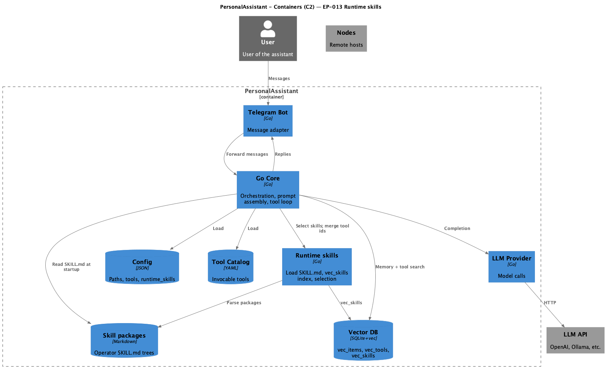

# EP-013 — System design

**Pipeline:** Stage 6.  
**Inputs:** [ep-requirements.md](ep-requirements.md), [ep-acceptance-criteria.md](ep-acceptance-criteria.md)

## Contents

- [Overview](#overview)
- [Architecture](#architecture)
- [Components and interfaces](#components-and-interfaces)
- [Data models](#data-models)
- [Error handling](#error-handling)
- [Testing strategy](#testing-strategy)
- [Requirement traceability](#requirement-traceability)

---

## Overview

EP-013 adds **runtime skills** (parsed `SKILL.md` trees), a **`vec_skills`** sqlite-vec table, **config-driven** `always_include` and caps, **union-based tool selection**, and **structured merged system** content using shared marker constants. The Telegram adapter and LLM router contracts stay unchanged; work concentrates on [config](ep-requirements.md#configuration-and-paths), new **`internal/runtimeskills`**, **`internal/skillindex`**, **`internal/promptmarkers`**, **`internal/systemprompt`**, and **`internal/core/handler.go`** assembly paths. See [REQ-13.001](ep-requirements.md#configuration-and-paths) through [REQ-13.020](ep-requirements.md#nfr--security-testability-observability).

---

## Architecture

**Source:** [c4-container.puml](diagrams/c4-container.puml). Regenerate: `plantuml -tpng diagrams/c4-container.puml` from this directory.

### Module boundaries

| Layer | Responsibility |
|-------|----------------|
| **cmd/pa** | Opens `vec_skills` store on same DB path as memory/tools; builds skill index at startup; passes `SkillIndex` into `core.Run`. |
| **internal/config** | New `Paths.SkillsDir`, `RuntimeSkillsConfig`, post-load skill package slice; validation. [REQ-13.001](ep-requirements.md#configuration-and-paths)–[REQ-13.003](ep-requirements.md#configuration-and-paths). |
| **internal/runtimeskills** | Parse `SKILL.md`, validate markers and tool refs. [REQ-13.004](ep-requirements.md#load-and-validation)–[REQ-13.007](ep-requirements.md#load-and-validation). |
| **internal/skillindex** | Clear/rebuild `vec_skills`, search. [REQ-13.008](ep-requirements.md#vec_skills-index)–[REQ-13.009](ep-requirements.md#vec_skills-index). |
| **internal/promptmarkers** | Canonical line set; `TextContainsForbiddenMarkerLine`. [REQ-13.007](ep-requirements.md#load-and-validation), [REQ-13.018](ep-requirements.md#memory-indexing). |
| **internal/systemprompt** | Trust paragraph, wrap helpers for blocks. [REQ-13.014](ep-requirements.md#prompt-assembly)–[REQ-13.016](ep-requirements.md#prompt-assembly). |
| **internal/core** | Select skills, merge tool ids, apply budgets, assemble `messages[0]`. [REQ-13.010](ep-requirements.md#selection-and-tool-union)–[REQ-13.017](ep-requirements.md#turn-model). |
| **internal/vector/sqlite** | `TableSkills = "vec_skills"`. [REQ-13.008](ep-requirements.md#vec_skills-index). |

---

## Components and interfaces

| Component | Responsibility | Requirements |
|-----------|----------------|--------------|
| **`config.Paths`** | `skills_dir` string; resolved absolute at load. | [REQ-13.001](ep-requirements.md#configuration-and-paths) |
| **`config.RuntimeSkillsConfig`** | `enabled`, `max_skills_per_turn`, `tool_vector_top_k_cap`, `max_skill_runes_per_turn`, `max_tool_instruction_runes_per_turn`, `always_include`. | [REQ-13.002](ep-requirements.md#configuration-and-paths), [REQ-13.003](ep-requirements.md#configuration-and-paths) |
| **`config.Config` (derived)** | `RuntimeSkillPackages []*runtimeskills.Package` (json `-`), filled after YAML/JSON load. | [REQ-13.004](ep-requirements.md#load-and-validation) |
| **`runtimeskills.LoadDir`** | Walk immediate subdirs; parse frontmatter + body; validate markers. | [REQ-13.004](ep-requirements.md#load-and-validation), [REQ-13.005](ep-requirements.md#load-and-validation), [REQ-13.007](ep-requirements.md#load-and-validation) |
| **`runtimeskills.ValidateToolRefs`** | Variant D vs catalog + native allowlist. | [REQ-13.006](ep-requirements.md#load-and-validation) |
| **`skillindex.Build`** | Embed skill text; `Clear` + `Add` on `vec_skills` store. | [REQ-13.009](ep-requirements.md#vec_skills-index) |
| **`skillindex.SearchSkillIDs`** | Top-k over `vec_skills` (same pattern as toolindex search). | [REQ-13.010](ep-requirements.md#selection-and-tool-union) |
| **`systemprompt` helpers** | `TrustPolicy`, `WrapRetrievedContext`, `WrapToolInstructions`, `WrapHermes`, `WrapRuntimeSkills`. Assembly order inside system: trust + personality, then RETRIEVED_CONTEXT, then TOOL_INSTRUCTIONS, then HERMES, then RUNTIME_SKILLS. | [REQ-13.014](ep-requirements.md#prompt-assembly)–[REQ-13.016](ep-requirements.md#prompt-assembly) |
| **`conversationHandler`** | Fields: `skillIndex`, `runtimeSkills *config.RuntimeSkillsConfig`, `skillPackages map[string]*runtimeskills.Package`; `buildToolOptions` extended; `buildSystemContent` / `appendToolBlocksToSystem` use wrappers; `indexTurn` guard. | [REQ-13.010](ep-requirements.md#selection-and-tool-union)–[REQ-13.018](ep-requirements.md#memory-indexing) |
| **`core.SkillIndex` interface** | `Store() vector.Store`, `Ready() bool`, `Close() error` (mirrors tool index lifecycle). | [REQ-13.008](ep-requirements.md#vec_skills-index) |

---

## Data models

- **`runtimeskills.Package`:** `ID` (directory name), `Name`, `Description`, `Tools []string`, `Body string` (markdown after frontmatter). [REQ-13.004](ep-requirements.md#load-and-validation)
- **Frontmatter (YAML):** required `name`, `description`; optional `tools: [id, ...]`. [REQ-13.005](ep-requirements.md#load-and-validation)
- **SQLite `vec_skills`:** same schema row shape as `vec_tools` (`embedding`, `id`, `content`). [REQ-13.008](ep-requirements.md#vec_skills-index)
- **Allowed native tool ids at load:** derived from core defaults plus optional web tools (`web_search`, `web_fetch`) when enabled. [REQ-13.003](ep-requirements.md#configuration-and-paths), [REQ-13.006](ep-requirements.md#load-and-validation)

---

## Error handling

- Config load: wrap errors with `skills_dir` path and skill id / tool id. [REQ-13.019](ep-requirements.md#nfr--security-testability-observability)
- Skill parse: fail fast; no partial skill registry. [REQ-13.005](ep-requirements.md#load-and-validation)–[REQ-13.007](ep-requirements.md#load-and-validation)
- `indexTurn`: if `promptmarkers.TextContainsForbiddenMarkerLine(chunk)` return error before `Add`. [REQ-13.018](ep-requirements.md#memory-indexing)
- When `vec_skills` build fails at startup: process exits (same severity as tool index failure policy in deployment). [REQ-13.009](ep-requirements.md#vec_skills-index)

---

## Testing strategy

- **Unit:** `promptmarkers`, `runtimeskills` parse/validate, `systemprompt` wrapping, `skillindex.Build` with mock embedder, tool-union and budget helpers. [REQ-13.020](ep-requirements.md#nfr--security-testability-observability)
- **Integration:** `handler` tests with mock LLM router and in-memory or temp sqlite `vec_skills`; assert system string markers and tool defs. [AC-13.004](ep-acceptance-criteria.md#ac-13-004)–[AC-13.007](ep-acceptance-criteria.md#ac-13-007), [AC-13.012](ep-acceptance-criteria.md#ac-13-012), [AC-13.013](ep-acceptance-criteria.md#ac-13-013)
- **E2E:** Same integration file may serve as E2E-style boundary test without real Telegram when adapter is not in scope; document in implementation plan if manual Telegram check is optional. [REQ-13.020](ep-requirements.md#nfr--security-testability-observability)

---

## Requirement traceability

| REQ | Design anchor |
|-----|----------------|
| REQ-13.001 | `Paths.SkillsDir` |
| REQ-13.002 | `RuntimeSkillsConfig` validation |
| REQ-13.003 | `validateRuntimeSkills` + native allowlist |
| REQ-13.004 | `LoadDir` after catalog load |
| REQ-13.005 | Frontmatter parse errors |
| REQ-13.006 | `ValidateToolRefs` |
| REQ-13.007 | `promptmarkers` scan on `SKILL.md` full text |
| REQ-13.008 | `sqlite.TableSkills` |
| REQ-13.009 | `skillindex.Build` at startup |
| REQ-13.010 | `SearchSkillIDs` in handler |
| REQ-13.011 | `mergeToolIDs` in handler |
| REQ-13.012 | `trimSkillsToBudget`, `trimToolsToBudget` |
| REQ-13.013 | Branch when `!enabled` |
| REQ-13.014 | `systemprompt.TrustPolicy` prefix |
| REQ-13.015 | Wrap helpers in handler assembly |
| REQ-13.016 | Call order: trust + personality → retrieved → tool → Hermes → runtime skills |
| REQ-13.017 | `HandleMessage` builds `messages` once; tool loop mutates tail only |
| REQ-13.018 | `indexTurn` guard |
| REQ-13.019 | Error strings in `config` / `runtimeskills` |
| REQ-13.020 | Test files under `internal/..._test.go` and `Covers AC-13.*` |
