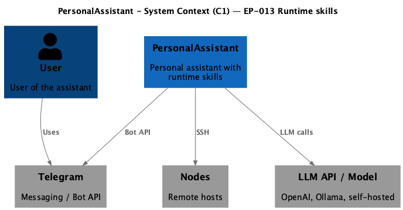
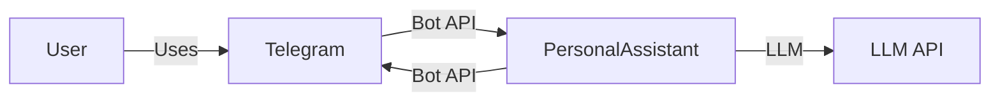

# EP-014 Sliding session memory window — Requirements (EARS / INCOSE)

This document contains the product requirements for EP-014 in EARS form, aligned with INCOSE semantic quality rules. Derived from [ep-scope.md](ep-scope.md).

**Total: 14 requirements (11 FR, 3 NFR)**

**Contents**

- [Introduction](#introduction)
- [Glossary](#glossary)
- [C4 C1 — System Context](#c4-c1--system-context)
- [Flow](#flow)
- [EARS patterns used](#ears-patterns-used)
- [Requirement index](#requirement-index)
- [Requirements](#requirements)
- [NFR — Security, testability, operations](#nfr--security-testability-operations)

---

## Introduction

EP-014 adds a **sliding session memory window**: a bounded, ordered list of recent **user** and **assistant** text exchanges per **session**, injected into the LLM request as `user` / `assistant` messages after the merged `system` message and before the current user turn. This complements **vector memory** (`vec_items`, future EP-002 summaries) and **runtime skills** (EP-013); the session window provides **working memory** for short clarifications without relying on semantic retrieval alone. **Disk persistence** of the window, **cross-channel** session merge, and **LLM-based compaction** of the window are out of scope for this epic.

---

## Glossary

| Term | Definition |
|------|------------|
| **PersonalAssistant (System)** | The Go core, adapters, vector store, tools, LLM integration, and configuration. |
| **Session identifier** | A stable string or integer key supplied with each inbound message that identifies one conversation thread (e.g. Telegram chat ID). |
| **Session exchange** | One pair consisting of the user message text that started a handler invocation and the final assistant reply text returned to the user for that invocation. |
| **Sliding window** | The bounded list of the most recent session exchanges for one session identifier; when full, the oldest exchange is removed on insert. |
| **Working memory** | The session sliding window content passed as explicit `user` / `assistant` messages to the LLM. |
| **Vector memory** | Semantic retrieval from `vec_items` embedded in the merged system message inside the CONTEXT (`PA_BEGIN_CONTEXT` / `PA_END_CONTEXT`) marker block. |
| **User turn** | One inbound user message processed by `HandleMessage` until the handler returns a reply string to the adapter. |

---

## C4 C1 — System Context

**Source:** [diagrams/c4-context.puml](diagrams/c4-context.puml) (C4-PlantUML). To regenerate PNG: `plantuml -tpng diagrams/c4-context.puml` from this epic directory.

### Flow

The user messages via Telegram; the adapter passes a session identifier with each message; the core merges prior exchanges into the LLM message list, calls the LLM, returns the reply, and updates the in-memory window.

---

## EARS patterns used

- **Ubiquitous:** THE \<system\> SHALL \<response\>
- **Event-driven:** WHEN \<trigger\>, THE \<system\> SHALL \<response\>
- **Unwanted event:** IF \<condition\>, THEN THE \<system\> SHALL \<response\>
- **Optional feature:** WHERE \<option\>, THE \<system\> SHALL \<response\>

*System* = PersonalAssistant unless a component is named.

---

## Requirement index

| Id | Type | Section | Summary |
|----|------|---------|---------|
| REQ-14.001 | FR | Config | Conversation session config section with enable and cap |
| REQ-14.002 | FR | Config | Fail fast on invalid cap when session memory enabled |
| REQ-14.003 | FR | Adapter | Inbound channel supplies session identifier with each message |
| REQ-14.004 | FR | Store | In-memory sliding window per session identifier |
| REQ-14.005 | FR | Store | Thread-safe updates for concurrent messages |
| REQ-14.006 | FR | Prompt | Historical exchanges after system, before current user |
| REQ-14.007 | FR | Prompt | WHERE disabled, single user message after system |
| REQ-14.008 | FR | Lifecycle | Append exchange after successful user turn |
| REQ-14.009 | FR | Lifecycle | Early-rejected user input does not append an exchange |
| REQ-14.010 | FR | Coherence | Window content order oldest to newest |
| REQ-14.011 | FR | Vector | Vector retrieval and session window may both apply |
| REQ-14.012 | NFR | NFR | Automated tests for store, assembly, and regression |
| REQ-14.013 | NFR | NFR | Debug logs follow existing redaction rules for session text |
| REQ-14.014 | NFR | NFR | Operator documentation for config keys and semantics |

---

## Requirements

### Configuration

*REQ-14.001, REQ-14.002*

### REQ-14.001 — Conversation session config section with enable and cap
WHERE `conversation_session` (or equivalently named) configuration is present, THE System SHALL expose `enabled` and a positive integer `max_session_exchanges` meaning the maximum number of **session exchanges** retained per session identifier.

### REQ-14.002 — Fail fast on invalid cap when session memory enabled
WHEN session memory is enabled and `max_session_exchanges` is less than 1, THE System SHALL fail configuration load with an error that names the invalid field.

---

### Session identifier and adapter

*REQ-14.003*

### REQ-14.003 — Inbound channel supplies session identifier with each message
THE Telegram adapter SHALL supply a session identifier with every call to the core message handler such that private chats and group chats resolve to distinct threads per Telegram chat ID unless a later requirement defers group handling to the same rule documented in system design.

---

### Session store

*REQ-14.004, REQ-14.005*

### REQ-14.004 — In-memory sliding window per session identifier
THE System SHALL retain session exchanges in process memory only, keyed by session identifier, without writing the session window to disk in this epic.

### REQ-14.005 — Thread-safe updates for concurrent messages
THE System SHALL serialize updates to the session window for a single session identifier when concurrent inbound messages for that session can occur.

---

### Prompt assembly

*REQ-14.006, REQ-14.007, REQ-14.010*

### REQ-14.006 — Historical exchanges after system, before current user
WHERE session memory is enabled and the session has one or more stored exchanges, THE System SHALL build the LLM message list with the merged `system` message first, then `user` and `assistant` messages for each stored exchange in chronological order, then the current user message.

### REQ-14.007 — WHERE disabled, single user message after system
WHERE session memory is disabled, THE System SHALL build the LLM message list with the merged `system` message followed by exactly one `user` message containing the current user text, matching pre-epic behaviour.

### REQ-14.010 — Window content order oldest to newest
THE System SHALL order stored exchanges from oldest to newest when injecting working memory into the LLM message list.

---

### Lifecycle

*REQ-14.008, REQ-14.009*

### REQ-14.008 — Append exchange after successful user turn
WHEN the handler returns a non-error reply string to the adapter after processing a user turn, THE System SHALL append one session exchange consisting of that turn user text and the returned assistant reply text to the sliding window for the session identifier, then enforce `max_session_exchanges` by removing the oldest exchange if the limit is exceeded.

### REQ-14.009 — Early-rejected user input does not append an exchange
WHEN the handler rejects the user message before any LLM call (empty message or over configured max length), THE System SHALL omit appending a session exchange for that inbound message.

---

### Interaction with vector memory

*REQ-14.011*

### REQ-14.011 — Vector retrieval and session window may both apply
THE System SHALL continue to inject semantically retrieved chunks from vector memory into the merged system message according to existing rules when session memory is enabled; overlap between retrieved text and recent exchanges is permitted in the minimum viable implementation.

---

## NFR — Security, testability, operations

*REQ-14.012–REQ-14.014*

### REQ-14.012 — Automated tests for store, assembly, and regression
THE System SHALL include automated unit tests for sliding-window eviction order and caps and at least one integration-level test that asserts LLM request message structure for a two-step user clarification without relying on vector hits.

### REQ-14.013 — Debug logs follow existing redaction rules for session text
THE System SHALL apply the same log redaction rules to debug log lines that include session window text as apply to other user-derived log content.

### REQ-14.014 — Operator documentation for config keys and semantics
THE operator-facing documentation SHALL describe how to enable session memory, the meaning of `max_session_exchanges`, and that the window resets on process restart.
