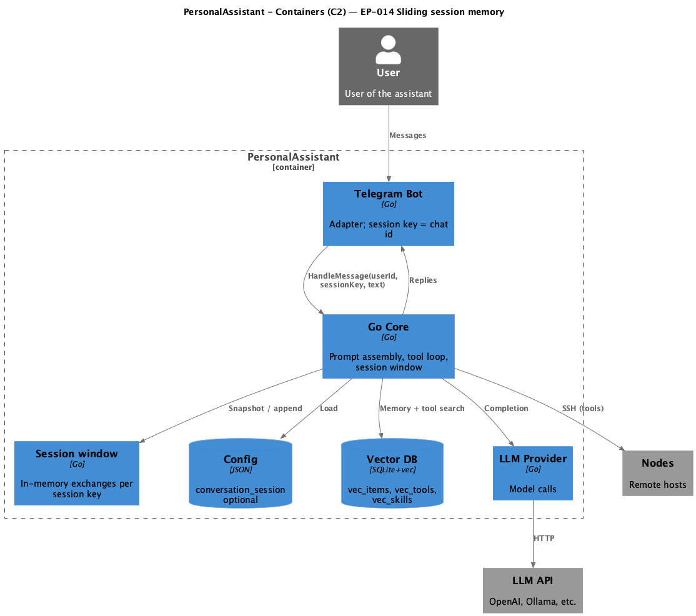

# EP-014 — System design

**Pipeline:** Stage 6.  
**Inputs:** [ep-requirements.md](ep-requirements.md), [ep-acceptance-criteria.md](ep-acceptance-criteria.md)

## Contents

- [Overview](#overview)
- [Architecture](#architecture)
- [Components and interfaces](#components-and-interfaces)
- [Data models](#data-models)
- [Error handling](#error-handling)
- [Testing strategy](#testing-strategy)
- [Requirement traceability](#requirement-traceability)

---

## Overview

EP-014 adds an optional **sliding session memory window**: in-process, per–**session key** ordered list of **exchanges** (user text + final assistant reply), injected into the LLM `messages` slice as `user`/`assistant` pairs after the merged `system` message and before the current user turn. It complements vector retrieval ([REQ-14.011](ep-requirements.md#interaction-with-vector-memory)) and EP-013 system tail assembly without changing marker contracts. Configuration: [REQ-14.001](ep-requirements.md#configuration), [REQ-14.002](ep-requirements.md#configuration). Telegram supplies **chat id** as session key ([REQ-14.003](ep-requirements.md#session-identifier-and-adapter)).

---

## Architecture

**Source:** [diagrams/c4-container.puml](diagrams/c4-container.puml). Regenerate: `plantuml -tpng diagrams/c4-container.puml` from this epic directory.

### Module boundaries

| Layer | Responsibility |
|-------|----------------|
| **internal/config** | Optional `conversation_session`; validate `max_session_exchanges` when `enabled` ([REQ-14.001](ep-requirements.md#configuration), [REQ-14.002](ep-requirements.md#configuration)). |
| **internal/core** | `sessionWindowStore`, `HandleMessage` assembly, append after successful LLM completion ([REQ-14.004](ep-requirements.md#session-store)–[REQ-14.011](ep-requirements.md#interaction-with-vector-memory)). |
| **internal/telegram** | Pass `fmt.Sprintf("%d", chat.ID)` as session key ([REQ-14.003](ep-requirements.md#session-identifier-and-adapter)). |
| **docs/configuration.md** | Operator-facing keys and semantics ([REQ-14.014](ep-requirements.md#nfr--security-testability-operations)). |

---

## Components and interfaces

| Component | Responsibility | Requirements |
|-----------|----------------|--------------|
| **`config.ConversationSessionConfig`** | `enabled`, `max_session_exchanges` | [REQ-14.001](ep-requirements.md#configuration) |
| **`validateConversationSession`** | Fail load when enabled and cap &lt; 1 | [REQ-14.002](ep-requirements.md#configuration) |
| **`core.MessageHandler`** | `HandleMessage(ctx, userID, sessionKey, text)` | [REQ-14.003](ep-requirements.md#session-identifier-and-adapter) |
| **`sessionWindowStore`** | Per-key deque with per-key mutex; snapshot; append with cap | [REQ-14.004](ep-requirements.md#session-store), [REQ-14.005](ep-requirements.md#session-store) |
| **`conversationHandler.HandleMessage`** | Resolve key (`trim` or `uid:%d`); inject history; append on `handleLLMSuccess` paths only | [REQ-14.006](ep-requirements.md#prompt-assembly)–[REQ-14.010](ep-requirements.md#prompt-assembly), [REQ-14.008](ep-requirements.md#lifecycle), [REQ-14.009](ep-requirements.md#lifecycle) |
| **`logLLMRequest` + `logRedactor`** | Same redaction for all message roles including history | [REQ-14.013](ep-requirements.md#nfr--security-testability-operations) |
| **Vector + session** | Unchanged retrieval path in system tail when both on | [REQ-14.011](ep-requirements.md#interaction-with-vector-memory) |

---

## Data models

- **Session key:** Non-empty string; Telegram uses decimal chat id; tests may pass `""` to fall back to `uid:<userID>`.
- **Exchange:** `{user text, assistant reply}` after successful completion (post–`handleLLMSuccess`).
- **Store:** `map[string]*sessionKeyBuf` with `[]sessionExchange` and `sync.Mutex` per key.

---

## Error handling

- Invalid session config at load: clear error naming `conversation_session.max_session_exchanges` ([REQ-14.002](ep-requirements.md#configuration)).
- Runtime: session feature does not add new user-visible errors; LLM errors do not append exchanges ([REQ-14.008](ep-requirements.md#lifecycle)).

---

## Testing strategy

- **Unit:** `session_window_test.go` (cap, concurrency), `handler_test.go` session tests (assembly, isolation, redaction), `config` load tests ([REQ-14.012](ep-requirements.md#nfr--security-testability-operations)).
- **Integration:** Existing adapter tests updated for new `HandleMessage` signature; Telegram passes chat id.
- **AC-14.004:** Deferred manual check (restart clears memory) per [ep-acceptance-criteria.md](ep-acceptance-criteria.md).

---

## Requirement traceability

| REQ | Design anchor |
|-----|----------------|
| REQ-14.001 | `ConversationSessionConfig` JSON |
| REQ-14.002 | `validateConversationSession` |
| REQ-14.003 | `MessageHandler` + Telegram `sessionKey` |
| REQ-14.004 | `sessionWindowStore` in-process only |
| REQ-14.005 | Per-key `sessionKeyBuf.mu` |
| REQ-14.006 | `HandleMessage` injects pairs after `system` |
| REQ-14.007 | No store / disabled → single user after system |
| REQ-14.008 | `appendSessionIfEnabled` after `handleLLMSuccess` |
| REQ-14.009 | Early return from `checkUserMessage` skips append |
| REQ-14.010 | `snapshot` returns oldest→newest |
| REQ-14.011 | `gatherRetrievedChunkTexts` unchanged |
| REQ-14.012 | Tests under `internal/core`, `internal/config` |
| REQ-14.013 | `redactLogString` in `logLLMRequest` |
| REQ-14.014 | `docs/configuration.md` |
