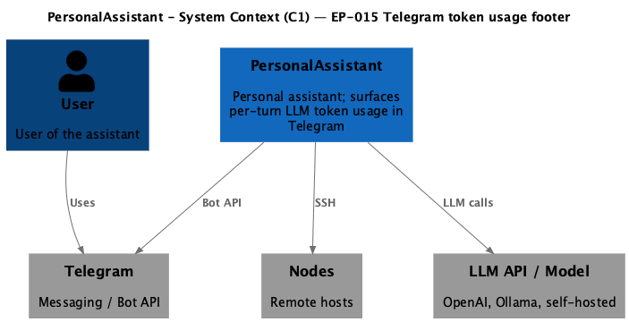
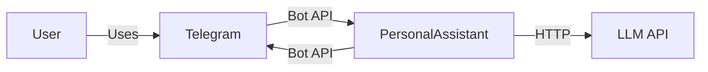

# EP-015 Telegram token usage footer — Requirements (EARS / INCOSE)

This document contains the product requirements for EP-015 in EARS form, aligned with INCOSE semantic quality rules. Derived from [ep-scope.md](ep-scope.md).

**Total: 12 requirements (9 FR, 3 NFR)**

**Contents**

- [Introduction](#introduction)
- [Glossary](#glossary)
- [C4 C1 — System Context](#c4-c1--system-context)
- [Flow](#flow)
- [EARS patterns used](#ears-patterns-used)
- [Requirement index](#requirement-index)
- [Requirements](#requirements)
- [NFR — Security, testability, operations](#nfr--security-testability-operations)

---

## Introduction

EP-015 adds a **plain-text token usage footer** to **Telegram** assistant replies for an allowed user. Numbers come only from **provider-reported API usage** on each LLM completion during one **user turn**. The footer is appended to the **last outbound Telegram chunk** after length splitting, only when aggregated **in** or **out** is greater than zero. Scheduler-only Telegram sends stay out of scope. The footer line format is fixed: `Tokens <in+out> (in: <in> / out: <out>)`.

---

## Glossary

| Term | Definition |
|------|------------|
| **PersonalAssistant (System)** | The Go core, Telegram adapter, LLM providers, tools, vector store, and configuration. |
| **User turn** | One inbound Telegram text message from an allowed user processed by `HandleMessage` until the handler returns a reply to the adapter, including intermediate LLM completions (for example tool rounds). |
| **API usage** | The `prompt_tokens`, `completion_tokens`, and optional `total_tokens` integers returned on a successful LLM completion response (`CompletionResult.Usage`). |
| **Aggregated in** | The sum of `prompt_tokens` from API usage over all successful completions in one user turn; missing usage on a completion contributes zero. |
| **Aggregated out** | The sum of `completion_tokens` from API usage over all successful completions in one user turn; missing usage on a completion contributes zero. |
| **Token footer** | One optional trailing plain-text line reporting aggregated usage in the prescribed format. |
| **Outbound chunk** | One Telegram `sendMessage` text payload produced after splitting assistant Markdown-style body to satisfy the 4096-character limit. |
| **Assistant reply body** | The assistant text produced for the user before the optional token footer is appended for Telegram display. |

---

## C4 C1 — System Context

**Source:** [diagrams/c4-context.puml](diagrams/c4-context.puml) (C4-PlantUML). To regenerate PNG: `plantuml -tpng diagrams/c4-context.puml` from this epic directory.

### Flow

The user sends a message via Telegram; the core calls the LLM one or more times; the core returns reply text with optional token footer; the Telegram adapter splits long replies and ensures the footer appears on the last chunk.

---

## EARS patterns used

- **Ubiquitous:** THE \<system\> SHALL \<response\>
- **Event-driven:** WHEN \<trigger\>, THE \<system\> SHALL \<response\>
- **State-driven:** WHILE \<condition\>, THE \<system\> SHALL \<response\>

*System* = PersonalAssistant unless a named component is specified.

---

## Requirement index

| Id | Type | Section | Summary |
|----|------|---------|---------|
| REQ-15.001 | FR | Accounting | Sum prompt_tokens into aggregated in per turn |
| REQ-15.002 | FR | Accounting | Sum completion_tokens into aggregated out per turn |
| REQ-15.003 | FR | Source | Counts from API usage only |
| REQ-15.004 | FR | Footer visibility | Append footer when in or out is greater than zero |
| REQ-15.005 | FR | Footer visibility | Deliver body without footer when in and out are zero |
| REQ-15.006 | FR | Footer format | Inner `Tokens …` pattern; total equals in plus out; optional `*…*` for italic |
| REQ-15.007 | FR | Telegram | Footer on last chunk; Markdown italic wrapper only |
| REQ-15.008 | FR | Empty body | No token-only outbound Telegram message |
| REQ-15.009 | FR | Session memory | Store assistant body without token footer |
| REQ-15.010 | NFR | NFR | Automated tests with positive and negative cases |
| REQ-15.011 | NFR | NFR | Footer exposes only numeric aggregates |
| REQ-15.012 | NFR | NFR | `./bin/validate EP-015` passes |

---

## Requirements

### Token accounting

*REQ-15.001, REQ-15.002, REQ-15.003*

**REQ-15.001** (Ubiquitous)  
THE PersonalAssistant SHALL add each successful LLM completion’s `prompt_tokens` value from API usage to **aggregated in** for the active user turn.

**REQ-15.002** (Ubiquitous)  
THE PersonalAssistant SHALL add each successful LLM completion’s `completion_tokens` value from API usage to **aggregated out** for the active user turn.

**REQ-15.003** (Ubiquitous)  
THE PersonalAssistant SHALL treat token counts used for the footer as authoritative only when they appear in provider-reported API usage fields on successful completions; client-side token estimation is outside scope for this epic.

---

### Footer content and visibility

*REQ-15.004, REQ-15.005, REQ-15.006, REQ-15.008*

**REQ-15.004** (Event-driven)  
WHEN **aggregated in** is greater than zero or **aggregated out** is greater than zero at the end of a user turn, THE PersonalAssistant SHALL include a **token footer** in the Telegram-bound reply string.

**REQ-15.005** (Event-driven)  
WHEN **aggregated in** and **aggregated out** are both zero at the end of a user turn, THE PersonalAssistant SHALL deliver the Telegram-bound reply string without a **token footer**.

**REQ-15.006** (Event-driven)  
WHEN a **token footer** is present, THE PersonalAssistant SHALL format it as exactly one new line at the end of the logical reply consisting of the inner pattern `Tokens <total> (in: <aggregated in> / out: <aggregated out>)` wrapped as `*Tokens <total> (in: <aggregated in> / out: <aggregated out>)*` for Markdown italic, where `<total>` equals `<aggregated in>` plus `<aggregated out>`, using decimal integer literals and single ASCII spaces as shown in [ep-scope.md](ep-scope.md).

**REQ-15.008** (Event-driven)  
WHEN the **assistant reply body** is empty at the end of a user turn, THE PersonalAssistant SHALL deliver no Telegram outbound message whose sole payload is the **token footer**.

---

### Telegram presentation

*REQ-15.007*

**REQ-15.007** (Ubiquitous)  
THE Telegram adapter SHALL send the **token footer**, when present, only as part of the **last outbound chunk** for that reply, after Markdown-to-HTML length splitting of the **assistant reply body**; the **token footer** in Markdown source SHALL use only the single-italic wrapper from **REQ-15.006** and SHALL contain no raw `<` or `>` characters inside the inner pattern.

---

### Session memory coherence

*REQ-15.009*

**REQ-15.009** (Ubiquitous)  
THE PersonalAssistant SHALL persist the **assistant reply body** in sliding session memory without appending the **token footer** line.

---

## NFR — Security, testability, operations

*REQ-15.010, REQ-15.011, REQ-15.012*

**REQ-15.010** (Ubiquitous)  
THE PersonalAssistant SHALL maintain automated tests that cover at least one positive case (non-zero usage yields a footer on the last chunk) and at least one negative case (zero usage yields no footer), including multi-chunk splitting behaviour where applicable.

**REQ-15.011** (Ubiquitous)  
THE **token footer** SHALL contain only the numeric aggregates, fixed punctuation, and the Markdown italic asterisk pair defined in **REQ-15.006**; the footer SHALL copy no user-provided text.

**REQ-15.012** (Ubiquitous)  
THE repository validation command `./bin/validate EP-015` SHALL complete with exit code zero after this epic’s acceptance criteria are wired for coverage.

---

## Traceability

- **Epic scope:** [ep-scope.md](ep-scope.md)
- **Project scope:** [scope.md](../../scope.md)
- **Strategy:** [strategy.md](../../strategy.md)
