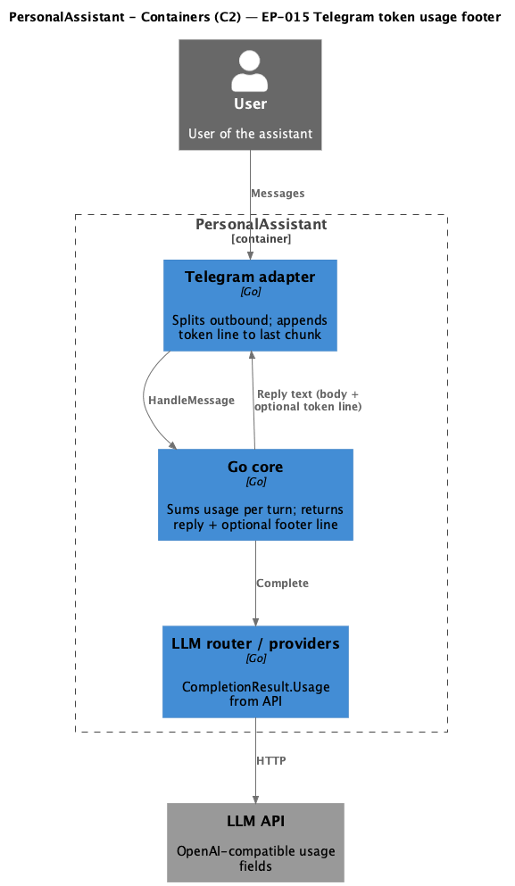

# EP-015 — System design

**Pipeline:** Stage 6.  
**Inputs:** [ep-requirements.md](ep-requirements.md), [ep-acceptance-criteria.md](ep-acceptance-criteria.md)

## Contents

- [Overview](#overview)
- [Architecture](#architecture)
- [Components and interfaces](#components-and-interfaces)
- [Data models](#data-models)
- [Error handling](#error-handling)
- [Testing strategy](#testing-strategy)
- [Risks and trade-offs](#risks-and-trade-offs)
- [Requirement traceability](#requirement-traceability)

---

## Overview

EP-015 surfaces **aggregated LLM API usage** for one **user turn** as a **plain-text footer** on **Telegram** user replies. The **Go core** sums `CompletionResult.Usage` across every **successful** `Complete` call in the turn (initial completion, tool-loop follow-ups, Hermes re-parse escalations). The core returns a **logical reply string** consisting of the **assistant reply body** plus an optional trailing `\n` + footer. Sliding **session memory** stores only the **body** (see [REQ-15.009](ep-requirements.md#req-15-009)). The **Telegram adapter** splits the **body** for the 4096 limit, then appends the footer to the **last chunk** (or sends the footer as a final short chunk if the last body chunk is full—see [Risks](#risks-and-trade-offs)).

---

## Architecture

**Source:** [diagrams/c4-container.puml](diagrams/c4-container.puml) (C4-PlantUML). To regenerate PNG: `plantuml -tpng diagrams/c4-container.puml` from this epic directory.

### Module boundaries

| Layer | Responsibility |
|-------|----------------|
| `internal/core` | Accumulate per-turn usage on each successful completion; format footer line; append footer only when `in>0 || out>0`; keep session append and `indexTurn` on **body** without footer. |
| `internal/telegram` | Split outbound Markdown source for length; merge optional footer onto last outbound chunk; avoid token-only sends when body empty. |
| `internal/llm` | No change to `Usage` shape; providers continue filling API fields. |

---

## Components and interfaces

| Component | Responsibility | Key interface |
|-----------|----------------|---------------|
| **Usage accumulator** (core) | Holds running sums of `PromptTokens` and `CompletionTokens` for the active turn. | Private struct + `add(Usage)`; `footerLine() string`. |
| **`completeAt` (core)** | Invokes router `Complete`; on success, adds `result.Usage` to the accumulator when a non-nil accumulator pointer is supplied. | Extend `completeAt` (or thin wrapper) with optional accumulator parameter passed through `finishAfterFirstLLM`, `runToolResultLoop`, `resolveHermesFollowUpCompletion`. |
| **`HandleMessage` (core)** | After `finishAfterFirstLLM`, if footer non-empty and body non-empty, return `body + "\n" + footer`; session append continues to use **body** only. | Existing `MessageHandler` return type remains `string`; Telegram strips footer for chunking (see below). |
| **`sendLongOutboundText` (telegram)** | Peel optional **Markdown footer line** (without leading newline). Split **body** via `splitTelegramOutboundSource`; append footer to last chunk if it fits after HTML conversion; otherwise append a final chunk containing only the footer. | Same entrypoint as today; footer is `*Tokens …*` or legacy plain `Tokens …`. |
| **`SplitTokenFooterSuffix` (telegram)** | If the handler returns `body + "\n" + footer`, split using an end-anchored regex so chunking applies only to **body**. | Matches `\n*Tokens …*` (preferred) or legacy `\nTokens …` at end of string. |

**Design note:** Passing `(body, footer)` as two values from core to Telegram would change `MessageHandler` and every test. The chosen approach keeps **`HandleMessage` returning one string** and lets the **Telegram adapter peel** a known footer suffix before splitting, matching [REQ-15.007](ep-requirements.md#req-15-007) without widening the `MessageHandler` interface.

---

## Data models

| Entity | Fields | Notes |
|--------|--------|-------|
| **Turn usage accumulator** | `promptSum int`, `completionSum int` | Updated only after successful `Complete`; omitted usage treated as zero. |
| **Footer string** | Single Markdown line, italic wrapper | Example: `*Tokens 42 (in: 30 / out: 12)*` → `<i>…</i>` after `MarkdownToTelegramHTML`. |

---

## Error handling

- Failed `Complete` calls do not add to the accumulator (no partial usage on error).
- Early user validation errors (empty message, too long) return without LLM calls → no footer.
- Telegram send failures behave as today; footer is part of the logical outbound text for the last chunk attempt.

---

## Testing strategy

- **Unit (core):** mock provider with multiple completions and different `Usage` values; assert returned string ends with expected footer; assert zero usage omits footer.
- **Unit (telegram):** multi-chunk body with forced splitting; assert mock `SendMessage` payloads: footer only on last call; assert empty body does not produce footer-only send.
- **Session (core):** with session memory enabled, assert stored assistant text excludes footer (AC-15.005).
- **Validation:** `./bin/validate EP-015` after AC comments are bound to tests.

---

## Risks and trade-offs

| Risk | Mitigation |
|------|------------|
| Model-generated text accidentally matches footer suffix pattern | Suffix matcher is anchored to **end of full handler return string** and strict digit pattern; residual risk documented; acceptable for personal assistant scope. |
| Last body chunk near 4096 rune limit | Append footer to new minimal chunk if combined HTML exceeds limit (still satisfies “last chunk” ordering). |

---

## Requirement traceability

| REQ | Design coverage |
|-----|------------------|
| [REQ-15.001](ep-requirements.md#req-15-001) | Accumulator sums `prompt_tokens` after each successful completion. |
| [REQ-15.002](ep-requirements.md#req-15-002) | Accumulator sums `completion_tokens` after each successful completion. |
| [REQ-15.003](ep-requirements.md#req-15-003) | Only `CompletionResult.Usage` from providers; no tiktoken. |
| [REQ-15.004](ep-requirements.md#req-15-004) | Core appends footer when `promptSum>0 \|\| completionSum>0`. |
| [REQ-15.005](ep-requirements.md#req-15-005) | Core omits footer when both sums are zero. |
| [REQ-15.006](ep-requirements.md#req-15-006) | Inner `Tokens …` pattern; `fmt`-style with `total = in + out`; wrapped in `*…*` for italic. |
| [REQ-15.007](ep-requirements.md#req-15-007) | Telegram merges footer onto last outbound chunk; suffix regex accepts `*Tokens…*` or legacy plain form. |
| [REQ-15.008](ep-requirements.md#req-15-008) | Telegram skips send when trimmed body empty and footer-only would result. |
| [REQ-15.009](ep-requirements.md#req-15-009) | `appendSessionIfEnabled` uses assistant **body** without footer. |
| [REQ-15.010](ep-requirements.md#req-15-010) | Positive and negative tests per AC-15.001 / AC-15.002 and chunk tests for AC-15.003. |
| [REQ-15.011](ep-requirements.md#req-15-011) | Footer built only from integers and fixed punctuation in core. |
| [REQ-15.012](ep-requirements.md#req-15-012) | Test comments `Covers AC-15.NNN`; run `./bin/validate EP-015`. |
