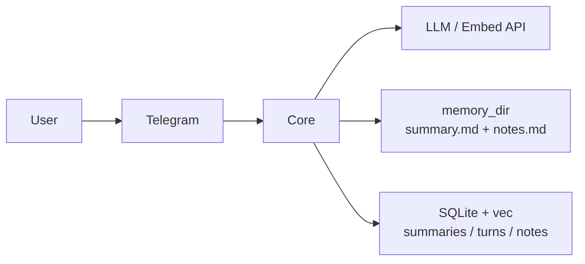

# EP-016 Manual day notes, write_memory, and vector memory refinement — Requirements (EARS / INCOSE)

This document contains the product requirements for EP-016 in EARS form, aligned with INCOSE semantic quality rules. Derived from [ep-scope.md](ep-scope.md).

**Total: 28 requirements (22 FR, 6 NFR)**

**Contents**

- [Introduction](#introduction)
- [Glossary](#glossary)
- [C4 C1 — System Context](#c4-c1--system-context)
- [Flow](#flow)
- [EARS patterns used](#ears-patterns-used)
- [Requirement index](#requirement-index)
- [Requirements](#requirements)
- [NFR — Security, observability, testing](#nfr--security-observability-testing)

---

## Introduction

EP-016 adds **append-only daily notes** at `memory_dir/YYYY/MM/DD/notes.md`, a native **`write_memory`** tool (disk append plus vector indexing), extends **`read_memory`** to return both `summary.md` and `notes.md` per day, and refines **vector memory**: separate sqlite-vec tables for **rollup summaries**, **conversation turns**, and **notes**; **split-query retrieval** with merge order **notes → summaries → turns**; **event-aligned** calendar dates in turn chunks; **deduplicated** turn ids; and **operator-visible** migration behaviour (no silent loss of intentional memory semantics).

---

## Glossary

| Term | Definition |
|------|------------|
| **PersonalAssistant (System)** | The Go core, adapters, native tools, memory filesystem layout, sqlite-vec stores, and configuration. |
| **memory_dir** | Root directory for calendar long-term memory files configured as `paths.memory_dir`. |
| **Day summary file** | `memory_dir/YYYY/MM/DD/summary.md`, overwritten by automatic summarization (EP-002). |
| **Day notes file** | `memory_dir/YYYY/MM/DD/notes.md`, append-only; not modified by automatic summarization. |
| **pa_timezone** | Calendar timezone for memory paths and default dates, per product configuration. |
| **write_memory** | Native tool that appends a validated entry to the **day notes file** and updates the **notes** vector table. |
| **Event-aligned date** | Calendar date in **pa_timezone** derived from the inbound user message timestamp supplied by the adapter when present, otherwise from a documented fallback. |
| **vec_summaries** | Virtual table holding embeddings for **summary:day**, **summary:month**, **summary:year** documents only. |
| **vec_turns** | Virtual table holding embeddings for **conversation turn** documents only. |
| **vec_notes** | Virtual table holding embeddings for **notes** documents derived from `notes.md` appends. |
| **Split-query retrieval** | Semantic search runs **separately** per vector class (notes, summaries, turns); results merge per [ep-scope.md](ep-scope.md) §D variant 1. |
| **Legacy mixed table** | Pre-epic storage where rollup summaries and turn rows shared one table (e.g. `vec_items`); summary retrieval **restricts** candidates to `summary:*` ids when that table still holds legacy turn rows. |

---

## C4 C1 — System Context

**Source:** [diagrams/c4-context.puml](diagrams/c4-context.puml) (C4-PlantUML). To regenerate PNG: `plantuml -tpng diagrams/c4-context.puml` from this directory.

### Flow

The user sends a message via Telegram; the core builds LLM context using **split-query** vector retrieval and optional tools; the core may append to `notes.md` via **write_memory**; summarization continues to write `summary.md` and **vec_summaries** only.

---

## EARS patterns used

- **Ubiquitous:** THE \<system\> SHALL \<response\>
- **Event-driven:** WHEN \<trigger\>, THE \<system\> SHALL \<response\>
- **State-driven:** WHILE \<condition\>, THE \<system\> SHALL \<response\>
- **Unwanted event:** IF \<condition\>, THEN THE \<system\> SHALL \<response\>

*System* = PersonalAssistant unless a named component is specified.

---

## Requirement index

| Id | Type | Section | Summary |
|----|------|---------|---------|
| REQ-16.001 | FR | Day notes file | notes.md path under memory_dir |
| REQ-16.002 | FR | Day notes file | Summarization does not overwrite notes.md |
| REQ-16.003 | FR | Day notes file | Append carries UTC timestamp and optional kind |
| REQ-16.004 | FR | write_memory | Tool appends to notes.md for resolved day |
| REQ-16.005 | FR | write_memory | Default date is today in pa_timezone |
| REQ-16.006 | FR | write_memory | Tool updates vec_notes after successful append |
| REQ-16.007 | FR | write_memory | Paths constrained under memory_dir |
| REQ-16.008 | FR | read_memory | Returns summary and notes sections per day |
| REQ-16.009 | FR | read_memory | Preserves max_span_days and max_output_bytes |
| REQ-16.010 | FR | Vector split | Rollup vectors exist only in vec_summaries |
| REQ-16.011 | FR | Vector split | Turn vectors exist only in vec_turns |
| REQ-16.012 | FR | Vector split | Notes vectors exist only in vec_notes |
| REQ-16.013 | FR | Retrieval | Split-query retrieval per variant 1 |
| REQ-16.014 | FR | Retrieval | Merge order notes then summaries then turns |
| REQ-16.015 | FR | Retrieval | Within-class order follows similarity from that class search |
| REQ-16.016 | FR | Turn chunk | Date line uses event-aligned date |
| REQ-16.017 | FR | Turn chunk | Event-aligned date from adapter time or handler entry |
| REQ-16.018 | FR | Dedup | Turn vector id stable from date and content hash |
| REQ-16.019 | FR | Dedup | Re-index same canonical turn does not grow vec_turns without bound |
| REQ-16.020 | FR | Migration | Startup or docs surface legacy turn isolation |
| REQ-16.021 | FR | Migration | New writes use vec_turns and vec_summaries and vec_notes |
| REQ-16.022 | FR | Labels | Injected chunks carry type labels for notes, summaries, turns |
| REQ-16.023 | NFR | Security | write_memory rejects path traversal |
| REQ-16.024 | NFR | Limits | Configurable max append and max notes file size |
| REQ-16.025 | NFR | Observability | Log migration and retrieval class counts at debug |
| REQ-16.026 | NFR | Testing | Unit and integration cover read/write and retrieval |
| REQ-16.027 | NFR | Quality gate | make check passes |
| REQ-16.028 | NFR | AC validation | ./bin/validate EP-016 passes after AC publication |

---

## Requirements

### Day notes file

*REQ-16.001, REQ-16.002, REQ-16.003*

**REQ-16.001** (Ubiquitous)  
THE PersonalAssistant SHALL store **day notes file** content at `memory_dir/YYYY/MM/DD/notes.md` where `YYYY`, `MM`, and `DD` are calendar components of the target day in **pa_timezone**.

**REQ-16.002** (Ubiquitous)  
THE automatic summarization pipeline SHALL write or replace only **day summary file** paths for rollup input and SHALL leave each **day notes file** byte sequence unchanged except where **write_memory** appends per REQ-16.004.

**REQ-16.003** (Event-driven)  
WHEN **write_memory** appends an entry, THE PersonalAssistant SHALL include a **UTC ISO-8601 timestamp** and an optional **kind** token drawn from the set {`fact`, `guideline`, `preference`} or a documented free tag in the appended block, using the exact line layout fixed in [ep-acceptance-criteria.md](ep-acceptance-criteria.md) once published.

---

### write_memory native tool

*REQ-16.004–REQ-16.007*

**REQ-16.004** (Event-driven)  
WHEN **write_memory** completes validation for a target calendar day, THE PersonalAssistant SHALL append one formatted entry to that day’s **day notes file**, creating parent directories if missing.

**REQ-16.005** (State-driven)  
WHERE the caller omits an explicit ISO date argument, THE PersonalAssistant SHALL resolve the target day as the current local calendar date in **pa_timezone** for **write_memory**.

**REQ-16.006** (Event-driven)  
WHEN the **day notes file** append succeeds, THE PersonalAssistant SHALL embed the new or updated **notes** slice and **upsert** the corresponding row in **vec_notes** using the embedder configured for vector memory.

**REQ-16.007** (Ubiquitous)  
THE **write_memory** implementation SHALL resolve paths only under **memory_dir** using the same path-prefix validation approach as **read_memory** for day-scoped reads.

---

### read_memory extension

*REQ-16.008, REQ-16.009*

**REQ-16.008** (Ubiquitous)  
THE **read_memory** native tool SHALL, for each calendar day in the requested inclusive range, include **day summary file** content when the file exists and **day notes file** content when the file exists, using distinct Markdown section headings defined in [ep-acceptance-criteria.md](ep-acceptance-criteria.md).

**REQ-16.009** (Ubiquitous)  
THE **read_memory** native tool SHALL enforce existing configured bounds for range length and total output bytes and SHALL anchor day iteration at local noon for **pa_timezone** per EP-002 behaviour.

---

### Vector storage separation

*REQ-16.010–REQ-16.012, REQ-16.021*

**REQ-16.010** (Ubiquitous)  
THE PersonalAssistant SHALL store rollup **summary** embeddings and auxiliary text only in **vec_summaries**.

**REQ-16.011** (Ubiquitous)  
THE PersonalAssistant SHALL store **conversation turn** embeddings and auxiliary text only in **vec_turns**.

**REQ-16.012** (Ubiquitous)  
THE PersonalAssistant SHALL store **notes** embeddings and auxiliary text only in **vec_notes**.

**REQ-16.021** (Event-driven)  
WHEN the epic migration is active on an installation, THE PersonalAssistant SHALL write new summary upserts to **vec_summaries**, new turn indexes to **vec_turns**, and new note indexes to **vec_notes**, without writing new turn rows to **vec_summaries**.

---

### Retrieval

*REQ-16.013–REQ-16.015, REQ-16.022*

**REQ-16.013** (Ubiquitous)  
THE core retrieval path SHALL run semantic search for **notes**, **rollup summaries**, and **turns** as **separate** queries (split-query retrieval), following **variant 1** in [ep-scope.md](ep-scope.md) §D, including **legacy mixed table** restriction to `summary:*` ids when reads still target legacy storage for summaries.

**REQ-16.014** (Ubiquitous)  
THE core SHALL merge non-empty hit lists for injection in the order **notes**, then **rollup summaries**, then **turns**, before applying the dynamic system tail rune budget.

**REQ-16.015** (Ubiquitous)  
THE core SHALL preserve descending similarity order returned by each per-class search inside that class’s contribution to the merged list.

**REQ-16.022** (Ubiquitous)  
THE PersonalAssistant SHALL prefix or label each injected chunk so the model can distinguish **notes**, **summary:day**, **summary:month**, **summary:year**, and **turn** sources, consistent with existing chunk labels for summaries and turns.

---

### Turn indexing

*REQ-16.016–REQ-16.019*

**REQ-16.016** (Ubiquitous)  
THE PersonalAssistant SHALL set the `Date:` line in each stored **conversation turn** vector text to the **event-aligned date** for that user message.

**REQ-16.017** (Ubiquitous)  
THE core SHALL derive **event-aligned date** in **pa_timezone** from the adapter-supplied Unix message timestamp when that value is present, and from the wall-clock handler entry time in **pa_timezone** when the adapter supplies no timestamp, recording the rule in [ep-system-design.md](ep-system-design.md).

**REQ-16.018** (Ubiquitous)  
THE PersonalAssistant SHALL compute each **conversation turn** vector **document id** from the **event-aligned date** plus a cryptographic hash of a canonical UTF-8 encoding of the paired user text and final assistant reply, using the algorithm fixed in [ep-system-design.md](ep-system-design.md).

**REQ-16.019** (Ubiquitous)  
THE PersonalAssistant SHALL apply **upsert** semantics for **conversation turn** vectors so that repeated indexing of the same canonical pair for the same **event-aligned date** replaces at most one row in **vec_turns** rather than growing row count without bound.

---

### Migration and operator awareness

*REQ-16.020*

**REQ-16.020** (Ubiquitous)  
THE PersonalAssistant SHALL emit an **INFO**-level log line on process start after upgrade when legacy turn rows may remain excluded from retrieval, pointing operators to documentation that explains cleanup or optional reindex commands.

---

## NFR — Security, observability, testing

*REQ-16.023–REQ-16.028*

**REQ-16.023** (Unwanted event)  
IF **write_memory** receives arguments that would resolve outside **memory_dir**, THEN THE PersonalAssistant SHALL reject the call with a validation error and SHALL perform no filesystem write.

**REQ-16.024** (Ubiquitous)  
THE PersonalAssistant SHALL enforce configurable positive upper bounds for a single **write_memory** append payload and for the on-disk size of a **day notes file**, returning a clear error when a bound is exceeded.

**REQ-16.025** (Ubiquitous)  
THE PersonalAssistant SHALL log at **DEBUG** severity the count of candidate chunks selected per vector class after each retrieval merge step.

**REQ-16.026** (Ubiquitous)  
THE PersonalAssistant SHALL provide automated unit or integration tests that cover **write_memory** append, **read_memory** dual-file output, split-query retrieval ordering, and turn upsert idempotency.

**REQ-16.027** (Ubiquitous)  
THE repository SHALL pass **`make check`** on the branch that delivers EP-016.

**REQ-16.028** (Ubiquitous)  
THE repository SHALL pass **`./bin/validate EP-016`** from the repository root after **`make build`** once acceptance criteria identifiers are wired to tests per project validation rules.
