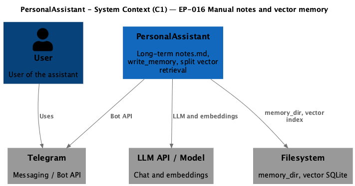
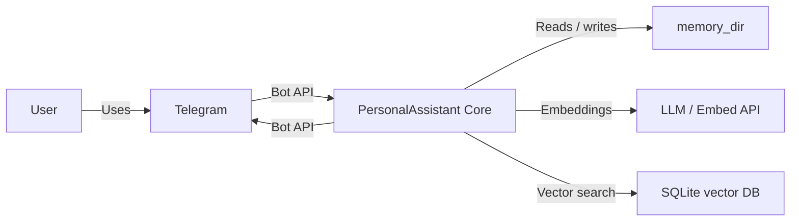

# EP-016 — Requirements (EARS / INCOSE)

This document contains the product requirements for **EP-016 Manual day notes, write_memory, and vector memory refinement** in EARS form. Derived from [ep-scope.md](ep-scope.md).

**Total: 27 requirements (21 FR, 6 NFR)**

**Contents**

- [Introduction](#introduction)
- [Glossary](#glossary)
- [C4 C1 — System Context](#c4-c1--system-context)
- [Flow](#flow)
- [EARS patterns used](#ears-patterns-used)
- [Requirement index](#requirement-index)
- [Requirements](#requirements)
- [NFR — Security, observability, verification](#nfr--security-observability-verification)

---

## Introduction

EP-016 adds **append-only day notes** (`notes.md` per calendar day under `memory_dir`), a native **`write_memory`** tool that validates input, appends structured entries, and indexes them for semantic retrieval, extends **`read_memory`** so date-range reads surface both automatic **`summary.md`** and **`notes.md`**, and refines **vector memory**: logical separation of **turn**, **rollup summary**, and **notes** embeddings; **event-aligned** calendar dates on turn chunks; and a **deduplication** policy for turn indexing. Rollout follows **split-query** semantics from [ep-scope.md](ep-scope.md) so legacy rows may remain on disk without polluting retrieval.

---

## Glossary

| Term | Definition |
|------|------------|
| **PersonalAssistant (System)** | The Go core, Telegram adapter, memory store on disk, vector indexes, LLM providers, tools, and configuration. |
| **Core** | The main Go service that orchestrates conversations, tool execution, memory access, and vector retrieval assembly. |
| **memory_dir** | Root directory on the filesystem where long-term markdown memory lives, as configured for the deployment. |
| **pa_timezone** | The configured IANA timezone used to interpret calendar days for memory paths and tools. |
| **Day summary** | File `memory_dir/YYYY/MM/DD/summary.md` produced by the automatic summarization pipeline; overwritten by that job when run. |
| **Day notes** | File `memory_dir/YYYY/MM/DD/notes.md`; append-only at the file level for manual and tool writes; not overwritten by the summarization job. |
| **write_memory** | Native tool that appends a validated entry to `notes.md` for a resolved calendar day and updates the notes vector slice. |
| **read_memory** | Native tool that reads `summary.md` and, after this epic, `notes.md` for ISO dates or inclusive ranges in pa_timezone. |
| **Summarize job** | The automatic summarization pipeline that writes day summaries and indexes rollup summary vectors. |
| **Vector store (sqlite)** | SQLite + sqlite-vec virtual table holding embedding vectors, row `id`, and `content` text for semantic search. |
| **vec_items (legacy)** | The existing shared memory vector table name in the product; may contain mixed historical rows until migrated or cleaned up. |
| **Dedicated summary vector table** | Vector table holding only rollup summary documents (stable `summary:*` id prefixes). |
| **Dedicated turn vector table** | Vector table holding only per-turn conversation documents. |
| **Dedicated notes vector table** | Vector table holding only documents derived from `notes.md` appends. |
| **Turn chunk** | Vector document text representing one completed user message and the assistant final reply for that handler invocation. |
| **Summary chunk** | Vector document for `summary:day`, `summary:month`, or `summary:year` rollups. |
| **Notes chunk** | Vector document whose text represents a single logical append to `notes.md` (or a defined row-level slice). |
| **Event-aligned date** | Calendar date in pa_timezone associated with the inbound user message timestamp from the adapter, or a documented fallback when absent. |
| **Canonicalised pair** | Normalised `(user_text, assistant_text)` representation defined in system design for hashing and deduplication. |
| **Merge order (retrieval)** | Ordering when combining vector hits from notes, summary, and turn searches before the dynamic system tail budget is applied. |
| **Dynamic system tail** | The portion of the system prompt assembled after the protected head, including retrieved vector chunks, subject to `max_dynamic_system_runes`. |
| **Embedding provider** | Configured component that produces embedding vectors for memory indexing and retrieval. |
| **Native tool** | Tool implemented in Go, registered in the native tool registry, subject to allowlists where configured. |
| **Telegram adapter** | Component that receives Telegram updates and supplies message metadata (including wall-clock or Telegram `date` when available) to the core. |

---

## C4 C1 — System Context

**Source:** [diagrams/c4-context.puml](diagrams/c4-context.puml) (C4-PlantUML). To regenerate PNG: `plantuml -tpng diagrams/c4-context.puml` from this epic directory.

### Flow

The user interacts via Telegram; the core handles messages, calls the LLM, runs tools including `read_memory` and `write_memory`, reads and writes markdown under `memory_dir`, and queries separate sqlite-vec tables for notes, rollup summaries, and turns when building retrieved context.

---

## EARS patterns used

- **Ubiquitous:** THE \<system\> SHALL \<response\>
- **Event-driven:** WHEN \<trigger\>, THE \<system\> SHALL \<response\>
- **State-driven:** WHILE \<condition\>, THE \<system\> SHALL \<response\>
- **Unwanted event:** IF \<condition\>, THEN THE \<system\> SHALL \<response\>
- **Optional feature:** WHERE \<option\>, THE \<system\> SHALL \<response\>
- **Complex:** Clauses in order WHERE → WHILE → WHEN/IF → THE → SHALL

In the following, *PersonalAssistant* means the PersonalAssistant (System) unless a component name is given explicitly.

---

## Requirement index

| Id | Type | Section | Summary |
|----|------|---------|---------|
| REQ-16.001 | FR | Day notes layout | notes.md path beside summary.md |
| REQ-16.002 | FR | Day notes lifecycle | Summarize job preserves notes.md |
| REQ-16.003 | FR | Day notes lifecycle | Calendar interpretation uses pa_timezone |
| REQ-16.004 | FR | Day notes format | Each append starts with UTC RFC3339 timestamp |
| REQ-16.005 | FR | Day notes format | Optional kind recorded in machine-readable form |
| REQ-16.006 | FR | Day notes limits | Reject append on configured byte limit breach |
| REQ-16.007 | FR | write_memory | Expose native tool when enabled in deployment |
| REQ-16.008 | FR | write_memory | Append one formatted entry for resolved day |
| REQ-16.009 | FR | write_memory | Reject paths outside memory_dir |
| REQ-16.010 | FR | write_memory | Update notes vector slice after append |
| REQ-16.011 | FR | read_memory | Include summary.md per day when present |
| REQ-16.012 | FR | read_memory | Include notes.md under distinct headings |
| REQ-16.013 | FR | read_memory | Omit days with neither file |
| REQ-16.014 | FR | read_memory | Preserve span, byte limits, noon anchoring |
| REQ-16.015 | FR | Vector separation | Rollup summary vectors isolated from turn vectors |
| REQ-16.016 | FR | Vector separation | Notes vectors isolated from rollup and turn |
| REQ-16.017 | FR | Retrieval merge | Default merge order notes then summary then turn |
| REQ-16.018 | FR | Legacy rollout | Summary path filters legacy rows by id prefix |
| REQ-16.019 | FR | Legacy rollout | Turn path avoids duplicate legacy plus new hits |
| REQ-16.020 | FR | Turn indexing | Date line uses event-aligned calendar date |
| REQ-16.021 | FR | Turn indexing | Documented fallback when adapter timestamp missing |
| REQ-16.022 | FR | Turn deduplication | Bounded growth under repeated identical indexing |
| REQ-16.023 | FR | Turn deduplication | Stable id from event-aligned date and content hash |
| REQ-16.024 | NFR | Security / logging | write_memory I/O follows memory redaction class |
| REQ-16.025 | NFR | Verification | Each AC mapped to automated or manual verification |
| REQ-16.026 | NFR | Quality | make check passes on delivered branch |
| REQ-16.027 | FR | Documentation | Runtime docs list write_memory when exposed |

---

## Requirements

### Day notes layout and lifecycle

*REQ-16.001 – REQ-16.003*

**REQ-16.001** (Ubiquitous)  
THE PersonalAssistant SHALL persist day notes for calendar day *D* in pa_timezone at `memory_dir/YYYY/MM/DD/notes.md` using the same directory depth as `summary.md` for that day.

**REQ-16.002** (Event-driven)  
WHEN the Summarize job writes or replaces `summary.md` for a calendar day, THE PersonalAssistant SHALL leave `notes.md` for that day unchanged if the file exists.

**REQ-16.003** (Ubiquitous)  
THE PersonalAssistant SHALL derive `YYYY`, `MM`, and `DD` path segments for day notes from calendar day *D* in pa_timezone.

---

### Day notes format and limits

*REQ-16.004 – REQ-16.006*

**REQ-16.004** (Ubiquitous)  
THE PersonalAssistant SHALL begin each appended entry in `notes.md` with one line containing a UTC timestamp in RFC3339 format, followed by the remainder of the entry as defined in system design.

**REQ-16.005** (Optional feature)  
WHERE `write_memory` receives an optional `kind` argument from the allowed set defined in system design, THE PersonalAssistant SHALL encode that `kind` on the entry line or the immediately following line in the format defined in system design.

**REQ-16.006** (Unwanted event)  
IF an append would exceed the configured maximum bytes for a single append or the configured maximum bytes for the whole `notes.md` file, THEN THE PersonalAssistant SHALL reject the operation with an error message that states which limit was exceeded.

---

### write_memory native tool

*REQ-16.007 – REQ-16.010*

**REQ-16.007** (Ubiquitous)  
THE PersonalAssistant SHALL register `write_memory` as a native tool on deployments where native tools are enabled and the operator configuration exposes `write_memory` per native-tool allowlist rules.

**REQ-16.008** (Event-driven)  
WHEN `write_memory` receives non-empty `text` and an optional ISO `date` defaulting to the current calendar date in pa_timezone, THE PersonalAssistant SHALL append exactly one new entry to `notes.md` for that resolved day, creating parent directories on first write for that path.

**REQ-16.009** (Ubiquitous)  
THE PersonalAssistant SHALL resolve paths for `write_memory` only under `memory_dir` and SHALL reject requests whose resolved path leaves `memory_dir` using the same path validation strength as `read_memory`.

**REQ-16.010** (Event-driven)  
WHEN the filesystem append for `write_memory` succeeds, THE PersonalAssistant SHALL upsert the corresponding notes vector document for that logical append in the dedicated notes vector table per system design.

---

### read_memory extension

*REQ-16.011 – REQ-16.014*

**REQ-16.011** (Event-driven)  
WHEN `read_memory` returns content for a calendar day that has `summary.md`, THE PersonalAssistant SHALL include that summary body under the existing per-day heading pattern used for summaries.

**REQ-16.012** (Event-driven)  
WHEN `read_memory` returns content for a calendar day that has `notes.md`, THE PersonalAssistant SHALL include the notes body in the same per-day block using section headings that differ unambiguously from the summary heading, with exact heading strings defined in system design.

**REQ-16.013** (Ubiquitous)  
THE PersonalAssistant SHALL omit a calendar day entirely from `read_memory` output when that day has neither `summary.md` nor `notes.md`.

**REQ-16.014** (Ubiquitous)  
THE PersonalAssistant SHALL enforce the configured `max_span_days`, `max_output_bytes`, and noon-anchored day iteration for `read_memory` exactly as before this epic, aside from the added notes content.

---

### Vector storage and retrieval

*REQ-16.015 – REQ-16.019*

**REQ-16.015** (Ubiquitous)  
THE PersonalAssistant SHALL store rollup summary vector documents only in the dedicated summary vector storage defined in system design, separate from the dedicated turn vector storage.

**REQ-16.016** (Ubiquitous)  
THE PersonalAssistant SHALL store notes vector documents only in the dedicated notes vector storage defined in system design, separate from the dedicated summary vector storage and the dedicated turn vector storage.

**REQ-16.017** (Ubiquitous)  
THE PersonalAssistant SHALL merge vector hits for the dynamic system tail in the order **notes**, then **rollup summaries**, then **turns**, each sub-list ordered by similarity from its own search, unless system design documents an optional configuration override.

**REQ-16.018** (State-driven)  
WHILE legacy `vec_items` rows remain and the implementation queries that table for rollup summaries, THE PersonalAssistant SHALL include only rows whose `id` values match the stable `summary:day:`, `summary:month:`, or `summary:year:` prefixes in that query path.

**REQ-16.019** (State-driven)  
WHILE legacy turn rows remain in `vec_items` and dedicated turn vectors exist in the turn table, THE PersonalAssistant SHALL retrieve turn hits from the dedicated turn table path only and SHALL merge results so the same conversation turn does not appear twice from legacy and dedicated paths in one retrieval assembly.

---

### Turn chunk date and deduplication

*REQ-16.020 – REQ-16.023*

**REQ-16.020** (Event-driven)  
WHEN the core indexes a completed turn into the dedicated turn vector table, THE PersonalAssistant SHALL set the `Date: YYYY-MM-DD` line in the stored chunk body to the event-aligned calendar date in pa_timezone derived from the inbound message timestamp supplied by the Telegram adapter.

**REQ-16.021** (Unwanted event)  
IF the Telegram adapter supplies no usable message timestamp for an inbound user message, THEN THE PersonalAssistant SHALL apply the fallback timestamp policy documented in system design and SHALL still produce a `Date` line consistent with pa_timezone calendar rules.

**REQ-16.022** (Event-driven)  
WHEN the same canonicalised user and assistant pair for the same event-aligned day is indexed again under the deduplication policy, THE PersonalAssistant SHALL keep the row count in the dedicated turn table bounded for that repeated operation as verified by tests referenced in acceptance criteria.

**REQ-16.023** (Ubiquitous)  
THE PersonalAssistant SHALL compute stable turn vector document ids from the event-aligned date string and a cryptographic hash of the canonicalised pair using the algorithm in system design.

---

## NFR — Security, observability, verification

*REQ-16.024 – REQ-16.027*

**REQ-16.024** (Ubiquitous)  
THE PersonalAssistant SHALL apply the same redaction and sensitivity rules to `write_memory` tool arguments and outcomes in logs as applied to `read_memory` and other memory-class native tools.

**REQ-16.025** (Ubiquitous)  
THE PersonalAssistant SHALL map every acceptance criterion in [ep-acceptance-criteria.md](ep-acceptance-criteria.md) to at least one automated test with `Covers AC-16.NNN` or to an explicit manual scenario referenced from the acceptance criteria document.

**REQ-16.026** (Ubiquitous)  
THE PersonalAssistant SHALL pass `make check` on the branch that delivers this epic.

**REQ-16.027** (Optional feature)  
WHERE runtime skill or operator documentation lists native tools available in a curated profile that includes memory writers, THE documentation SHALL list `write_memory` alongside `read_memory` when that profile enables `write_memory`.
