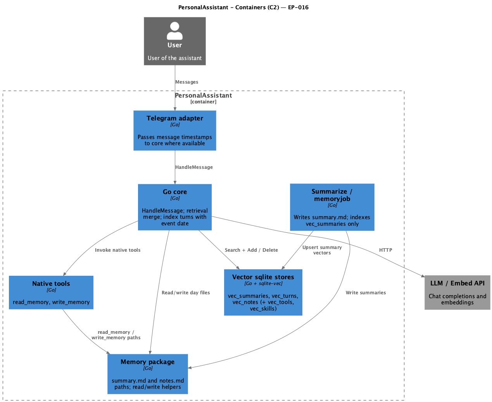
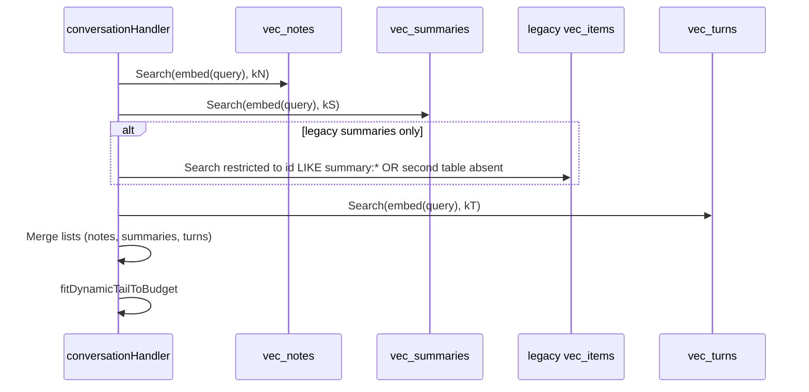

# EP-016 — System design

**Pipeline:** [pipeline.spec.md](../../ai-sdlc/specification/pipeline.spec.md)  
**Inputs:** [ep-requirements.md](ep-requirements.md), [ep-acceptance-criteria.md](ep-acceptance-criteria.md), [ep-scope.md](ep-scope.md)  
**Test strategy:** [strategy.md](../strategy.md)

## Contents

- [Overview](#overview)
- [Architecture](#architecture)
- [Components and interfaces](#components-and-interfaces)
- [Data models](#data-models)
- [Retrieval sequence](#retrieval-sequence)
- [Migration and operator messaging](#migration-and-operator-messaging)
- [Error handling](#error-handling)
- [Testing strategy](#testing-strategy)
- [Risks and trade-offs](#risks-and-trade-offs)
- [Requirement traceability](#requirement-traceability)

---

## Overview

EP-016 introduces **append-only `notes.md`**, native **write_memory**, extended **read_memory**, and **three** dedicated sqlite-vec tables (**vec_summaries**, **vec_turns**, **vec_notes**) plus **split-query retrieval** with deterministic merge order. Summarization and **write_memory** stop writing rollup vectors into the turn table; **indexTurn** stops writing turns into the summary table. Legacy deployments may retain old turn rows inside the historical **`vec_items`** table until an operator runs an optional cleanup; summary retrieval from that table uses **id prefix** restriction per [REQ-16.013](ep-requirements.md#req-16-013).

---

## Architecture

**Source:** [diagrams/c4-container.puml](diagrams/c4-container.puml) (C4-PlantUML). To regenerate PNG: `plantuml -tpng diagrams/c4-container.puml` from this directory.

### Module boundaries

| Layer | Responsibility |
|-------|------------------|
| **Adapters** (Telegram) | Supply `UnixMessageTime` (optional) on each inbound user text to the core boundary. |
| **internal/memory** | Calendar path helpers for `summary.md` and `notes.md`; append and read helpers for notes. |
| **internal/tools** | `read_memory`, `write_memory` implementations and JSON schemas. |
| **internal/vector/sqlite** | Constants and `Store` instances for `vec_summaries`, `vec_turns`, `vec_notes` (existing `vec_tools`, `vec_skills` unchanged). |
| **internal/summarize** + **internal/memoryjob** | Upsert vectors **only** into **vec_summaries**. |
| **internal/core** | Build merged retrieval lists; call `indexTurn` against **vec_turns**; pass event time through `HandleMessage`. |

---

## Components and interfaces

| Component | Responsibility | Key interface |
|-----------|----------------|-----------------|
| **Telegram adapter** | Map `Message.Date` to int64 unix for core | Extended `HandleMessage` parameter or context struct |
| **conversationHandler** | Orchestrate triple `Search`, merge, tail budget | `gatherRetrievedChunkTexts` becomes multi-store |
| **memory.Store** | `ReadDayNotes`, `AppendDayNote` (atomic append or file lock) | New methods alongside existing summary APIs |
| **ReadMemoryTool** | Emit `## Summary` / `## Notes` sections | Preserves EP-002 noon anchoring, `max_span_days`, and `max_output_bytes` ([REQ-16.009](ep-requirements.md#req-16-009)); stable heading strings tested in [AC-16.007](ep-acceptance-criteria.md#ac-16-007) |
| **WriteMemoryTool** | Validate, append, trigger vec upsert | Returns success line or error |
| **sqlite.Store** | vec0 tables | `NewWithTable(dbPath, dim, tableName)` per table |
| **summarize.Day/Month/Year** | Delete+Add summary vectors | Target **vec_summaries** store handle |

---

## Data models

### Filesystem

| Path pattern | Writer | Reader |
|--------------|--------|--------|
| `memory_dir/YYYY/MM/DD/summary.md` | summarize pipeline | read_memory, rollup |
| `memory_dir/YYYY/MM/DD/notes.md` | write_memory only (append) | read_memory |

### SQLite vector tables (same DB file as today)

| Table | Rows | **document id** examples |
|-------|------|--------------------------|
| **vec_summaries** | Day/month/year rollup chunks | `summary:day:YYYY-MM-DD`, `summary:month:YYYY-MM`, `summary:year:YYYY` |
| **vec_turns** | Turn chunks | `turn:YYYY-MM-DD:<sha256-hex>` where input to SHA-256 is UTF-8 `user\n---\nassistant` after NFKC trim and newline normalization defined in code constants |
| **vec_notes** | One row per successful append | `notes:YYYY-MM-DD:<ulid>` or monotonic ULID per entry |
| **vec_tools** | Unchanged | existing |
| **vec_skills** | Unchanged | existing |

**Stored text shapes**

- **Turn:** `Date: YYYY-MM-DD\n[turn]\nUser: …\nAssistant: …` (labels align with [REQ-16.022](ep-requirements.md#req-16-022)).
- **Summary:** existing `FormatDayVectorText` / month / year against **vec_summaries**.
- **Notes:** `Date: YYYY-MM-DD\n[notes]\n` + single-line or folded append body matching disk line.

### Event-aligned date derivation (turn indexing)

Used only for **conversation turn** vector `Date:` and **turn:** id date component ([REQ-16.016](ep-requirements.md#req-16-016), [REQ-16.017](ep-requirements.md#req-16-017)):

1. If adapter supplied Unix *t*: `dateStr = time.Unix(t,0).In(paLoc).Format("2006-01-02")`.  
2. Else: `dateStr = time.Now().In(paLoc).Format("2006-01-02")` at handler entry (documented fallback).

### write_memory default calendar day ([REQ-16.005](ep-requirements.md#req-16-005))

Independent of turn indexing: when the tool omits `date`, resolve the target day as **`time.Now().In(paLoc)`** at **tool invocation** (same clock semantics as “today” for the operator). Documented separately so tool defaults are not confused with **event-aligned** turn dates.

---

## Retrieval sequence

**Top-k per class:** configurable keys `vector_search_top_k_notes`, `vector_search_top_k_summaries`, `vector_search_top_k_turns`, with conservative defaults mirroring current single-`k` split three-way until tuned.

### Observability ([REQ-16.025](ep-requirements.md#req-16-025))

After the three `Search` calls and **merge** into one ordered list (before tail budget trimming), the core SHALL log at **DEBUG** a single structured line, for example:

`DEBUG retrieval_merge notes_selected=2 summaries_selected=3 turns_selected=5`

Counts are **post-merge, pre-trim** lengths per class bucket. Field names fixed in implementation for grep stability.

---

## Migration and operator messaging

On startup, if configuration `memory.vector_legacy_vec_items` (name illustrative) detects non-empty **vec_items** in the deployment and code build includes EP-016 migration path, log:

`INFO memory_migration legacy vec_items contains rows not used for turn retrieval; summaries read with summary:* filter only; see docs EP-016`

Exact string frozen in tests for [AC-16.014](ep-acceptance-criteria.md#ac-16-014).

**Optional operator command** (future CLI flag out of minimal scope unless pulled in): `pa -reindex-turns-from-logs` documented in implementation plan—**not** required for MVP merge if read path satisfies AC-16.010.

---

## Error handling

| Failure | Response |
|---------|----------|
| Append exceeds size limit | Tool error, no partial write |
| notes.md directory not creatable | Wrapped OS error, fail fast |
| **read_memory** range exceeds `max_span_days` | Return `read_memory` validation error string (existing behaviour); no partial read ([REQ-16.009](ep-requirements.md#req-16-009)) |
| **read_memory** output would exceed `max_output_bytes` | Return explicit error; no silent truncation beyond existing product rule ([REQ-16.009](ep-requirements.md#req-16-009), [AC-16.008](ep-acceptance-criteria.md#ac-16-008)) |
| Embedder failure before any disk write for **write_memory** | Return tool error; no `notes.md` change |
| **write_memory** disk append succeeds then **vec_notes** upsert fails | **Contract:** attempt **truncate** of `notes.md` back to the file size recorded immediately before append; if truncate succeeds return tool error to the model; if truncate fails log **ERROR** with path and still return tool error (operator may see duplicated line on retry—documented limitation) |

---

## Testing strategy

- **Unit:** path validation, id hash stability, merge ordering with mocked `Search` results.
- **Integration:** in-memory or temp-dir sqlite with vec0 bindings; full `read_memory` / `write_memory` roundtrip.
- **Regression:** existing memory summarization tests retargeted to **vec_summaries** fixture.
- **Coverage:** `./bin/validate EP-016` after AC comments land in Go tests.

---

## Risks and trade-offs

| Risk | Mitigation |
|------|------------|
| CGO sqlite-vec open cost ×3 tables | Single `sql.DB` with attached logic opening one file remains one file; confirm sqlite allows multiple vec0 vtables in one DB (yes). |
| Triple embed cost per message | Same as today one query + two small extras; make k’s configurable. |
| Transactionality append vs vector | Implementation follows **append then vec_notes upsert** with **truncate-on-vector-failure** per [Error handling](#error-handling); temp-file staging is optional optimisation only. |

---

## Requirement traceability

| REQ ID | Component | Design section |
|--------|-----------|----------------|
| REQ-16.001 | memory.Store | [Data models — Filesystem](#data-models) |
| REQ-16.002 | summarize pipeline, memory.Store | [Data models — Filesystem](#data-models) |
| REQ-16.003 | WriteMemoryTool, AC normative format | [Components](#components-and-interfaces); [ep-acceptance-criteria.md](ep-acceptance-criteria.md) |
| REQ-16.004 | WriteMemoryTool | [Components](#components-and-interfaces), [Data models](#data-models) |
| REQ-16.005 | WriteMemoryTool | [write_memory default calendar day](#write-memory-default-calendar-day) |
| REQ-16.006 | WriteMemoryTool, sqlite.Store | [Data models — vec_notes](#data-models) |
| REQ-16.007 | WriteMemoryTool | [Error handling](#error-handling), [Components](#components-and-interfaces) |
| REQ-16.008 | ReadMemoryTool | [Components](#components-and-interfaces) |
| REQ-16.009 | ReadMemoryTool | [Components](#components-and-interfaces); EP-002 noon anchor and caps (same as pre-epic) |
| REQ-16.010 | summarize, sqlite.Store | [Data models — vec_summaries](#data-models) |
| REQ-16.011 | conversationHandler indexTurn | [Data models — vec_turns](#data-models) |
| REQ-16.012 | WriteMemoryTool | [Data models — vec_notes](#data-models) |
| REQ-16.013 | conversationHandler retrieval | [Retrieval sequence](#retrieval-sequence) |
| REQ-16.014 | conversationHandler retrieval | [Retrieval sequence](#retrieval-sequence) |
| REQ-16.015 | conversationHandler retrieval | [Retrieval sequence](#retrieval-sequence) |
| REQ-16.016 | conversationHandler indexTurn | [Data models — Stored text](#data-models), [Event-aligned date derivation](#event-aligned-date-derivation-turn-indexing) |
| REQ-16.017 | Telegram adapter, conversationHandler | [Event-aligned date derivation](#event-aligned-date-derivation-turn-indexing) |
| REQ-16.018 | conversationHandler indexTurn | [Data models — vec_turns id](#data-models) |
| REQ-16.019 | conversationHandler indexTurn | [Data models — vec_turns](#data-models) |
| REQ-16.020 | cmd/pa or core startup | [Migration and operator messaging](#migration-and-operator-messaging) |
| REQ-16.021 | summarize, core | [Architecture](#architecture), [Data models](#data-models) |
| REQ-16.022 | system_tail / chunk labels | [Data models — Stored text](#data-models) |
| REQ-16.023 | WriteMemoryTool | [Error handling](#error-handling) |
| REQ-16.024 | WriteMemoryTool, config | [Error handling](#error-handling) |
| REQ-16.025 | conversationHandler | [Observability (DEBUG merge counts)](#observability-req-16025) |
| REQ-16.026 | tests | [Testing strategy](#testing-strategy) |
| REQ-16.027 | CI | [Testing strategy](#testing-strategy) |
| REQ-16.028 | validate tool | [Testing strategy](#testing-strategy) |
