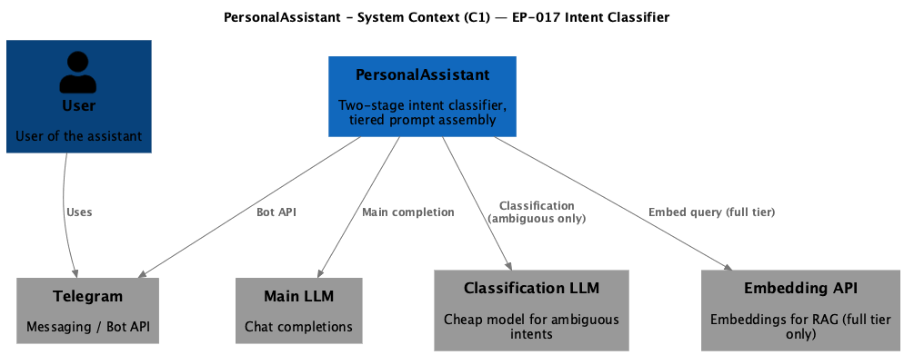
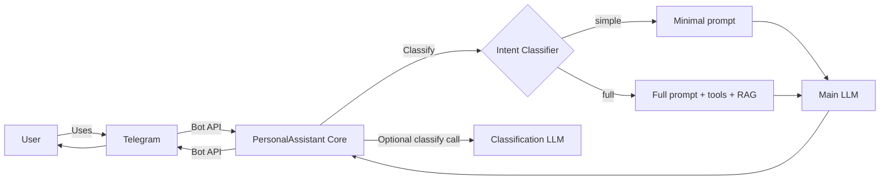

# EP-017 — Requirements (EARS / INCOSE)

This document contains the product requirements for **EP-017 Intent Classifier for Prompt Optimization** in EARS form. Derived from [ep-scope.md](ep-scope.md).

**Total: 20 requirements (15 FR, 5 NFR)**

**Contents**

- [Introduction](#introduction)
- [Glossary](#glossary)
- [C4 C1 — System Context](#c4-c1--system-context)
- [Flow](#flow)
- [EARS patterns used](#ears-patterns-used)
- [Requirement index](#requirement-index)
- [Requirements](#requirements)
  - [Complexity tiers](#complexity-tiers)
  - [Heuristic stage](#heuristic-stage)
  - [Model stage](#model-stage)
  - [Cascade and fallback](#cascade-and-fallback)
  - [Prompt assembly](#prompt-assembly)
  - [Configuration](#configuration)
  - [Observability](#observability)
- [NFR — Fallback safety, quality, verification](#nfr--fallback-safety-quality-verification)

---

## Introduction

EP-017 adds a **two-stage intent classifier** (fast heuristic → cheap model fallback) that assigns each incoming user message to a **complexity tier** before the main LLM prompt is constructed. A `simple` tier skips tools, RAG retrieval, and dynamic tail assembly; a `full` tier preserves current behaviour. The goal is to reduce main-model input token consumption by at least 50 % for trivial messages (greetings, pings) while maintaining full functionality for messages that need tools or memory.

**Scope in brief**

- Two complexity tiers (`simple`, `full`) governing prompt component inclusion
- Heuristic classifier (patterns, keywords) for obvious cases
- Small-model classifier via existing LLM provider for ambiguous cases
- Prompt assembly branching based on assigned tier
- Configuration and observability for both classification stages

---

## Glossary

| Term | Definition |
|------|------------|
| **PersonalAssistant (System)** | The Go core, Telegram adapter, memory store, vector indexes, LLM providers, tools, and configuration. |
| **Core** | The main Go service that orchestrates conversations, LLM calls, tool execution, memory access, and vector retrieval. |
| **Intent classifier** | Two-stage component that assigns an incoming message to a complexity tier before the main LLM call. |
| **Complexity tier** | Category that determines which prompt components are included in the main LLM call. Defined values: `simple`, `full`. |
| **Heuristic stage** | First classification stage: pattern matching (regex, keyword lists) that resolves obvious cases with no external calls. |
| **Model stage** | Second classification stage: a small/cheap LLM call via existing provider infrastructure, invoked only when the heuristic stage returns ambiguous. |
| **Classification provider** | LLM provider instance configured for the model stage; may differ from the main conversation provider. |
| **Dynamic tail** | Variable portion of the system prompt built by `buildDynamicTailString` — tool instructions, Hermes block, retrieved context, runtime skills — bounded by `max_dynamic_system_runes`. |
| **HandleMessage** | Core function that constructs the prompt and invokes the main LLM for a user turn. |
| **RAG retrieval** | Semantic vector search (`gatherRetrievedChunkTexts`) that injects memory chunks into the dynamic tail. |

---

## C4 C1 — System Context

**Source:** [diagrams/c4-context.puml](diagrams/c4-context.puml) (C4-PlantUML). To regenerate PNG: `plantuml -tpng diagrams/c4-context.puml` from this epic directory.

### Flow

The user sends a message via Telegram. The core runs the intent classifier (heuristic, then optionally a cheap classification model). Based on the assigned tier, the core assembles the prompt — either minimal (simple) or full (with tools, RAG, skills) — and calls the main LLM. The reply is sent back via Telegram.

---

## EARS patterns used

- **Ubiquitous:** THE \<system\> SHALL \<response\>
- **Event-driven:** WHEN \<trigger\>, THE \<system\> SHALL \<response\>
- **State-driven:** WHILE \<condition\>, THE \<system\> SHALL \<response\>
- **Unwanted event:** IF \<condition\>, THEN THE \<system\> SHALL \<response\>
- **Optional feature:** WHERE \<option\>, THE \<system\> SHALL \<response\>
- **Complex:** Clauses in order WHERE → WHILE → WHEN/IF → THE → SHALL

In the following, *PersonalAssistant* means the PersonalAssistant (System) unless a component name is given explicitly.

---

## Requirement index

| Id | Type | Section | Summary |
|----|------|---------|---------|
| REQ-17.001 | FR | Complexity tiers | Define at least simple and full tiers |
| REQ-17.002 | FR | Complexity tiers | Simple tier excludes tools, RAG, dynamic tail, skills |
| REQ-17.003 | FR | Complexity tiers | Full tier preserves current prompt assembly |
| REQ-17.004 | FR | Heuristic stage | Heuristic matches configurable patterns |
| REQ-17.005 | FR | Heuristic stage | Heuristic returns tier or ambiguous |
| REQ-17.006 | FR | Heuristic stage | Heuristic performs no external calls |
| REQ-17.007 | FR | Model stage | Model stage — **Superseded by EP-036** |
| REQ-17.008 | FR | Model stage | Classification provider — **Superseded by EP-036** |
| REQ-17.009 | FR | Model stage | Model stage prompt — **Superseded by EP-036** |
| REQ-17.010 | FR | Cascade and fallback | Cascade: heuristic → default full (**Amended EP-036**) |
| REQ-17.011 | FR | Cascade and fallback | Model failure path — **Superseded by EP-036** |
| REQ-17.012 | FR | Prompt assembly | Simple tier skips RAG retrieval |
| REQ-17.013 | FR | Prompt assembly | Simple tier skips tool selection and tool definitions |
| REQ-17.014 | FR | Prompt assembly | Simple tier skips dynamic tail assembly |
| REQ-17.015 | FR | Prompt assembly | Full tier prompt path unchanged |
| REQ-17.016 | NFR | Configuration | Classifier enable/disable without code changes |
| REQ-17.017 | FR | Observability | Log tier and deciding stage per turn |
| REQ-17.018 | NFR | Observability | Model-stage token logging — **Superseded by EP-036** |
| REQ-17.019 | NFR | Quality | make check passes on delivered branch |
| REQ-17.020 | NFR | Verification | Each AC mapped to automated or manual test |

---

## Requirements

### Complexity tiers

*REQ-17.001 – REQ-17.003*

### REQ-17.001 — Define at least simple and full tiers
THE PersonalAssistant SHALL define at least two complexity tiers — `simple` and `full` — each specifying which prompt components (system prompt dynamic tail, tool definitions, RAG chunks, session history, runtime skills) are included in the main LLM call.

### REQ-17.002 — Simple tier excludes tools, RAG, dynamic tail, skills
WHILE a user turn is assigned to the `simple` tier, THE PersonalAssistant SHALL exclude tool definitions, RAG retrieval results, Hermes tool-format instructions, and runtime skill playbook text from the main LLM prompt for that turn.

### REQ-17.003 — Full tier preserves current prompt assembly
WHILE a user turn is assigned to the `full` tier, THE PersonalAssistant SHALL construct the main LLM prompt using the same components and assembly logic as before this epic (tools, RAG, dynamic tail, session history, runtime skills).

---

### Heuristic stage

*REQ-17.004 – REQ-17.006*

### REQ-17.004 — Heuristic matches configurable patterns
THE intent classifier heuristic stage SHALL evaluate the incoming message against configurable pattern sets (keyword lists, regex patterns, message-length thresholds) loaded from the application configuration.

### REQ-17.005 — Heuristic returns tier or ambiguous
WHEN the heuristic stage evaluates a message, THE intent classifier SHALL return one of: a confident complexity tier assignment, or an `ambiguous` result indicating the heuristic cannot decide.

### REQ-17.006 — Heuristic performs no external calls
THE intent classifier heuristic stage SHALL perform no network calls, no LLM calls, and no filesystem I/O during classification.

---

### Model stage

*REQ-17.007 – REQ-17.009*

### REQ-17.007 — Model stage — **Superseded by EP-036**
WHEN the heuristic stage returns `ambiguous` and the model stage is enabled in configuration, THE intent classifier SHALL send a classification request to the configured classification provider.

### REQ-17.008 — Classification provider — **Superseded by EP-036**
THE PersonalAssistant SHALL allow the classification provider (endpoint, model name, parameters) to be configured independently from the main conversation LLM provider.

### REQ-17.009 — Model stage prompt — **Superseded by EP-036**
THE intent classifier model stage SHALL send a prompt that contains only the user message text and the list of available tier names with brief descriptions, without including tools, RAG context, or session history.

---

### Cascade and fallback

*REQ-17.010 – REQ-17.011*

### REQ-17.010 — Cascade: heuristic → default full — **Amended EP-036**
THE intent classifier SHALL evaluate stages in the fixed order: heuristic stage first; model stage only when the heuristic returns `ambiguous` and the model stage is enabled; default to `full` tier when both stages are skipped or exhausted.

### REQ-17.011 — Model failure path — **Superseded by EP-036**
IF the model stage returns an unparseable response, times out, or produces an error, THEN THE intent classifier SHALL assign the `full` tier for that turn and log the failure at WARN level.

---

### Prompt assembly

*REQ-17.012 – REQ-17.015*

### REQ-17.012 — Simple tier skips RAG retrieval
WHILE the assigned tier is `simple`, THE PersonalAssistant SHALL skip the call to `gatherRetrievedChunkTexts` (RAG retrieval) for that turn.

### REQ-17.013 — Simple tier skips tool selection and tool definitions
WHILE the assigned tier is `simple`, THE PersonalAssistant SHALL skip tool selection (`selectSkillPackages`, `mergeSelectedToolIDs`) and SHALL send no `tools` array in the main LLM request.

### REQ-17.014 — Simple tier skips dynamic tail assembly
WHILE the assigned tier is `simple`, THE PersonalAssistant SHALL omit the dynamic tail (tool instructions, Hermes block, retrieved context, runtime skills) from the system message for that turn.

### REQ-17.015 — Full tier prompt path unchanged
WHILE the assigned tier is `full`, THE PersonalAssistant SHALL construct the prompt using the same path as before this epic, with no change to tool selection, RAG retrieval, dynamic tail assembly, or session history inclusion.

---

### Configuration

*REQ-17.016*

### REQ-17.016 — Classifier enable/disable without code changes
THE PersonalAssistant SHALL expose configuration parameters for: (a) intent classifier enabled/disabled flag, (b) heuristic pattern definitions, (c) model stage enabled/disabled flag, (d) classification provider endpoint and model name — all changeable via `config.yaml` or environment variables without code changes.

---

### Observability

*REQ-17.017 – REQ-17.018*

### REQ-17.017 — Log tier and deciding stage per turn
WHEN the intent classifier assigns a tier for a user turn, THE PersonalAssistant SHALL log at INFO level the assigned tier, the stage that decided (heuristic or model), and the original message length.

### REQ-17.018 — Model-stage token logging — **Superseded by EP-036**
WHEN the model stage is invoked, THE PersonalAssistant SHALL record model-stage token usage (prompt and completion) in logs separately from main-model usage, and SHALL exclude model-stage tokens from the user-facing usage footer.

---

## NFR — Fallback safety, quality, verification

*REQ-17.019 – REQ-17.020*

### REQ-17.019 — make check passes on delivered branch
THE PersonalAssistant SHALL pass `make check` on the branch that delivers this epic.

### REQ-17.020 — Each AC mapped to automated or manual test
THE PersonalAssistant SHALL map every acceptance criterion in [ep-acceptance-criteria.md](ep-acceptance-criteria.md) to at least one automated test with `Covers AC-17.NNN` or to an explicit manual scenario referenced from the acceptance criteria document.
