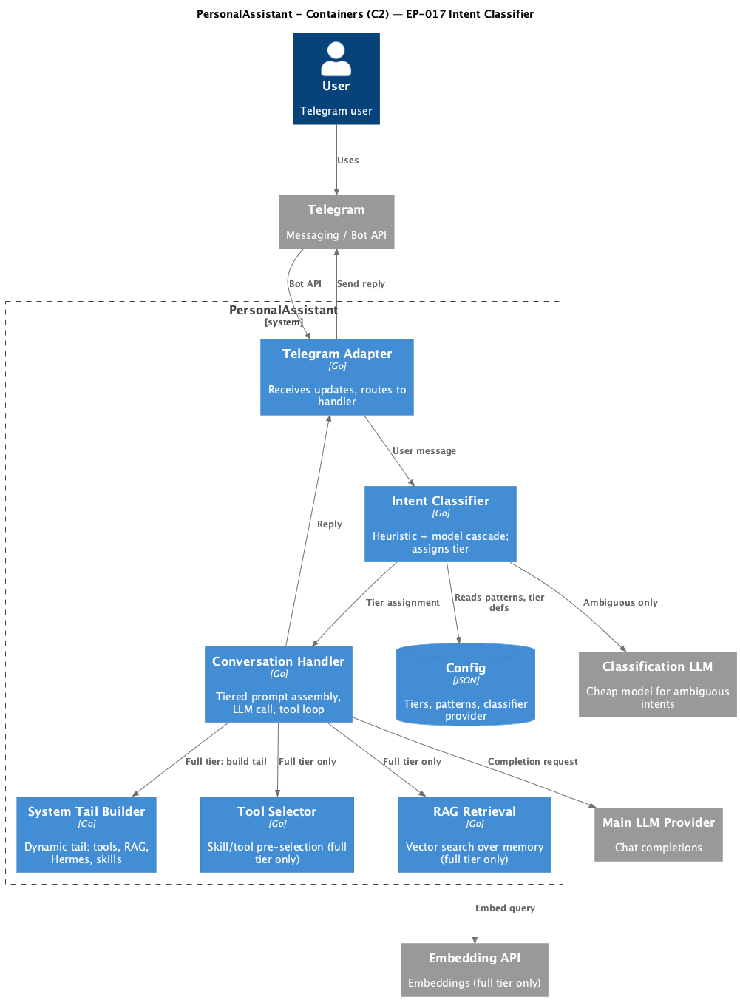

# EP-017 — System design

**Pipeline:** Stage 6.
**Inputs:** [ep-requirements.md](ep-requirements.md), [ep-acceptance-criteria.md](ep-acceptance-criteria.md)

## Contents

- [Overview](#overview)
- [Architecture](#architecture)
- [Components and interfaces](#components-and-interfaces)
- [Data models](#data-models)
- [Error handling](#error-handling)
- [Testing strategy](#testing-strategy)
- [Requirement traceability](#requirement-traceability)

---

## Overview

EP-017 introduces a **two-stage intent classifier** that sits between the Telegram adapter and the existing prompt assembly logic in `HandleMessage`. The classifier assigns each incoming message to a **complexity tier** (`simple` or `full`) which gates which prompt components are included in the main LLM call ([REQ-17.001](ep-requirements.md#req-17-001)).

Stage 1 (heuristic) uses configurable regex/keyword patterns with zero external calls ([REQ-17.004](ep-requirements.md#req-17-004)–[REQ-17.006](ep-requirements.md#req-17-006)). Stage 2 (model) fires only on `ambiguous` results, sending a minimal prompt to a separately-configured cheap LLM provider ([REQ-17.007](ep-requirements.md#req-17-007)–[REQ-17.009](ep-requirements.md#req-17-009)). The cascade always defaults to `full` on failure or disabled stages ([REQ-17.010](ep-requirements.md#req-17-010), [REQ-17.011](ep-requirements.md#req-17-011)).

For `simple` tier, `HandleMessage` skips RAG retrieval, tool selection, and dynamic tail assembly — sending only the static system head + session history + user message ([REQ-17.012](ep-requirements.md#req-17-012)–[REQ-17.014](ep-requirements.md#req-17-014)). For `full` tier, the existing path is unchanged ([REQ-17.003](ep-requirements.md#req-17-003), [REQ-17.015](ep-requirements.md#req-17-015)).

---

## Architecture

<p align="center"></p>

**Source:** [diagrams/c4-container.puml](diagrams/c4-container.puml). Regenerate: `plantuml -tpng diagrams/c4-container.puml` from this epic directory.

### Module boundaries

| Layer | Responsibility |
|-------|----------------|
| **internal/intent** (new package) | `Classifier` interface, `Tier` type, `HeuristicClassifier`, `ModelClassifier`, `CascadeClassifier`. Pure classification logic, no prompt assembly. ([REQ-17.001](ep-requirements.md#req-17-001)–[REQ-17.011](ep-requirements.md#req-17-011)) |
| **internal/config** | New `IntentClassifier` config struct: enabled flag, heuristic patterns, model-stage provider settings. ([REQ-17.016](ep-requirements.md#req-17-016)) |
| **internal/core/handler.go** | `HandleMessage` calls classifier before prompt construction; branches on tier for component assembly. ([REQ-17.012](ep-requirements.md#req-17-012)–[REQ-17.015](ep-requirements.md#req-17-015)) |
| **internal/core/run.go** | Wires `CascadeClassifier` from config; injects into `conversationHandler`. |
| **internal/llm** | Existing `OpenAICompatible` reused by model stage via a separate provider instance. ([REQ-17.008](ep-requirements.md#req-17-008)) |
| **cmd/pa** | Instantiates classification provider (if configured) and passes to `core.Run`. |

---

## Components and interfaces

### Tier type

```go
package intent

type Tier string

const (
    TierSimple Tier = "simple"
    TierFull   Tier = "full"
)
```

Defines the two complexity tiers ([REQ-17.001](ep-requirements.md#req-17-001)). `simple` excludes tools, RAG, dynamic tail ([REQ-17.002](ep-requirements.md#req-17-002)). `full` preserves current behaviour ([REQ-17.003](ep-requirements.md#req-17-003)).

### Classifier interface

```go
package intent

import "context"

type Result struct {
    Tier      Tier   // assigned tier
    Stage     string // "heuristic", "model", or "default"
    MessageLen int   // original message length in runes
}

type Classifier interface {
    Classify(ctx context.Context, message string) Result
}
```

Single method returning the tier, the deciding stage name, and message length for logging ([REQ-17.017](ep-requirements.md#req-17-017)).

### HeuristicClassifier

```go
type HeuristicResult struct {
    Tier      Tier
    Confident bool
}

type HeuristicClassifier struct {
    simplePatterns []*regexp.Regexp
    fullPatterns   []*regexp.Regexp
    maxSimpleLen   int // messages longer than this are never classified simple by heuristic
}

func (h *HeuristicClassifier) Classify(message string) HeuristicResult
```

**Logic** ([REQ-17.004](ep-requirements.md#req-17-004)–[REQ-17.006](ep-requirements.md#req-17-006)):
1. If `len(message) > maxSimpleLen` → return `{TierFull, true}` (long messages are likely complex).
2. Match against `simplePatterns` (compiled from config). If any pattern matches the full message → `{TierSimple, true}`.
3. Match against `fullPatterns`. If any matches → `{TierFull, true}`.
4. Otherwise → `{TierFull, false}` (ambiguous, `Confident=false`).

No network, LLM, or I/O calls — operates only on in-memory compiled regexps and the message string.

### ModelClassifier

```go
type ModelClassifier struct {
    provider llm.Provider
    model    string
    logger   *slog.Logger
}

func (m *ModelClassifier) Classify(ctx context.Context, message string) (Tier, error)
```

Sends a minimal prompt to the classification provider ([REQ-17.009](ep-requirements.md#req-17-009)):

```
Classify the following user message into one of these categories:
- "simple": casual greeting, ping, short acknowledgment, chitchat (no tools or memory needed)
- "full": question requiring knowledge, memory, tools, or detailed response

Message: "<user message>"

Reply with exactly one word: simple or full
```

Parses the response: if the trimmed lowercase output starts with `simple` → `TierSimple`; if `full` → `TierFull`; otherwise returns error (unparseable). Uses existing `llm.Provider.Complete` with `max_tokens=10`, no tools ([REQ-17.008](ep-requirements.md#req-17-008)).

### CascadeClassifier

```go
type CascadeClassifier struct {
    heuristic    *HeuristicClassifier // nil when heuristic disabled
    model        *ModelClassifier     // nil when model stage disabled
    logger       *slog.Logger
}

func (c *CascadeClassifier) Classify(ctx context.Context, message string) Result
```

**Cascade logic** ([REQ-17.010](ep-requirements.md#req-17-010)):
1. If `heuristic != nil`: run heuristic.
   - If `Confident` → return result with `Stage="heuristic"`.
   - If not confident → proceed to step 2.
2. If `model != nil`: run model classifier.
   - On success → return result with `Stage="model"`.
   - On error → log at WARN ([REQ-17.011](ep-requirements.md#req-17-011)), proceed to step 3.
3. Return `{TierFull, "default"}`.

When the entire classifier is disabled in config, `conversationHandler.classifier` is nil, and `HandleMessage` skips classification entirely (no `Classify` call), equivalent to `TierFull` always ([REQ-17.016](ep-requirements.md#req-17-016)).

### conversationHandler changes

New field:

```go
type conversationHandler struct {
    // ... existing fields ...
    classifier intent.Classifier // optional; nil = disabled, always full tier
}
```

**HandleMessage modification** — insert classification before the existing prompt assembly block:

```go
func (h *conversationHandler) HandleMessage(ctx context.Context, userID int64, sessionKey string, text string) (string, error) {
    userText, early, stop := h.checkUserMessage(text)
    if stop { return early, nil }
    EnterUserTurn()
    defer LeaveUserTurn()

    // --- EP-017: classify intent ---
    tier := intent.TierFull
    var classResult intent.Result
    if h.classifier != nil {
        classResult = h.classifier.Classify(ctx, userText)
        tier = classResult.Tier
        h.logger.InfoContext(ctx, "intent classified",
            "tier", string(tier),
            "stage", classResult.Stage,
            "message_len", classResult.MessageLen,
        )
    }

    // --- Existing logic, gated by tier ---
    sk := strings.TrimSpace(sessionKey)
    if sk == "" { sk = fmt.Sprintf("uid:%d", userID) }

    var chunks []string
    if tier == intent.TierFull {
        chunks = h.gatherRetrievedChunkTexts(ctx, userText) // REQ-17.012: skip for simple
    }
    hasRet := len(chunks) > 0
    sysHead := h.systemStaticHead(hasRet)
    messages := []llm.Message{{Role: "system", Content: sysHead}}

    if h.sessionMemoryEnabled() {
        for _, ex := range h.sessionStore.snapshot(sk) {
            messages = append(messages, llm.Message{Role: "user", Content: ex.user},
                llm.Message{Role: "assistant", Content: ex.assistant})
        }
    }
    messages = append(messages, llm.Message{Role: "user", Content: userText})

    var opts *llm.CompletionOptions
    if tier == intent.TierFull {
        // existing skill/tool selection + dynamic tail (REQ-17.013, REQ-17.014, REQ-17.015)
        skills, err := h.selectSkillPackages(ctx, userText)
        // ... existing tail building, opts construction ...
    }
    // else: simple tier — no tools, no dynamic tail, no opts

    // ... rest of completeAt, tool loop, usage footer ...
}
```

Session history is included for both tiers — context continuity is valuable even for simple replies.

### Configuration wiring (run.go / cmd/pa)

```go
// In run.go: newRunConversationHandler receives optional classifier
func newRunConversationHandler(cfg *config.Config, ..., classifier intent.Classifier) {
    h := &conversationHandler{
        // ... existing ...
        classifier: classifier, // nil when disabled
    }
}

// In cmd/pa: build classifier from config
func buildIntentClassifier(cfg *config.Config, logger *slog.Logger) intent.Classifier {
    ic := cfg.IntentClassifier
    if ic == nil || !ic.Enabled {
        return nil
    }
    var heuristic *intent.HeuristicClassifier
    if ic.Heuristic != nil {
        heuristic = intent.NewHeuristicClassifier(ic.Heuristic.SimplePatterns, ic.Heuristic.FullPatterns, ic.Heuristic.MaxSimpleLen)
    }
    var model *intent.ModelClassifier
    if ic.ModelStage != nil && ic.ModelStage.Enabled {
        provider := buildClassificationProvider(ic.ModelStage) // reuse llm.NewOpenAICompatible
        model = intent.NewModelClassifier(provider, ic.ModelStage.Model, logger)
    }
    return intent.NewCascadeClassifier(heuristic, model, logger)
}
```

---

## Data models

### Config schema (JSON)

```json
{
  "intent_classifier": {
    "enabled": true,
    "heuristic": {
      "simple_patterns": [
        "^(привет|hello|hi|hey|yo|ку|здравствуй|хай)\\b",
        "^(да|нет|ок|ok|ага|угу|ладно|хорошо|понял|спасибо|thanks)$",
        "^(ты (здесь|тут|на месте)|are you (here|there))\\??$"
      ],
      "full_patterns": [
        "(напомни|запусти|найди|покажи|создай|удали|прочитай|запиши)",
        "(вчера|сегодня|завтра|на прошлой неделе|помнишь)"
      ],
      "max_simple_len": 40
    },
    "model_stage": {
      "enabled": true,
      "type": "openai-compatible",
      "endpoint": "http://localhost:11434/v1",
      "model": "qwen2.5:0.5b",
      "api_key_path": "",
      "default_temperature": 0.0,
      "default_max_tokens": 10
    }
  }
}
```

([REQ-17.016](ep-requirements.md#req-17-016)): All fields changeable via config.json without code changes.

### Config Go types

```go
// IntentClassifierConfig holds EP-017 intent classification settings.
type IntentClassifierConfig struct {
    Enabled    bool                      `json:"enabled"`
    Heuristic  *HeuristicConfig          `json:"heuristic,omitempty"`
    ModelStage *ClassificationModelConfig `json:"model_stage,omitempty"`
}

type HeuristicConfig struct {
    SimplePatterns []string `json:"simple_patterns"` // regexps; match → simple
    FullPatterns   []string `json:"full_patterns"`   // regexps; match → full
    MaxSimpleLen   int      `json:"max_simple_len"`  // rune length; messages longer → full by heuristic
}

type ClassificationModelConfig struct {
    Enabled            bool    `json:"enabled"`
    Type               string  `json:"type"`               // "openai-compatible", "ollama"
    Endpoint           string  `json:"endpoint"`
    APIKeyPath         string  `json:"api_key_path"`
    Model              string  `json:"model"`
    DefaultTemperature float64 `json:"default_temperature"`
    DefaultMaxTokens   int     `json:"default_max_tokens"`
}
```

Added to `Config` struct:

```go
type Config struct {
    // ... existing fields ...
    IntentClassifier *IntentClassifierConfig `json:"intent_classifier,omitempty"`
}
```

### Validation at load

- If `intent_classifier.enabled` is true and `heuristic` is present: compile each regex in `simple_patterns` and `full_patterns` (fail fast on invalid regex). `max_simple_len` must be >= 1.
- If `model_stage.enabled` is true: `endpoint` and `model` must be non-empty. `default_max_tokens` must be >= 1.
- If `intent_classifier` is absent or `enabled` is false: classifier is nil, zero overhead.

---

## Error handling

| Scenario | Behaviour | REQ |
|----------|-----------|-----|
| Invalid regex in heuristic config | Fail fast at config load | [REQ-17.016](ep-requirements.md#req-17-016) |
| Model stage endpoint unreachable | Timeout → WARN log → default `full` | [REQ-17.011](ep-requirements.md#req-17-011) |
| Model stage returns unparseable response | WARN log → default `full` | [REQ-17.011](ep-requirements.md#req-17-011) |
| Classifier disabled or nil | No classification call; `HandleMessage` runs existing full path | [REQ-17.016](ep-requirements.md#req-17-016) |
| Heuristic alone (model stage disabled) + ambiguous | Default `full` | [REQ-17.010](ep-requirements.md#req-17-010) |

No panics, no user-visible errors from classification failures — the system degrades gracefully to full prompts.

---

## Testing strategy

| Level | What | Coverage |
|-------|------|----------|
| **Unit** | `HeuristicClassifier.Classify` — pattern matching, length threshold, ambiguous | AC-17.004–AC-17.007 |
| **Unit** | `CascadeClassifier` — heuristic confident, ambiguous→model, model error→full, all disabled→full | AC-17.010, AC-17.011 |
| **Unit** | `ModelClassifier.Classify` — mock provider, parse "simple"/"full"/garbage | AC-17.008 |
| **Unit** | Config validation — valid config, invalid regex, missing endpoint | AC-17.015 |
| **Integration** | `HandleMessage` with classifier injected — verify simple tier skips RAG/tools/tail; full tier unchanged | AC-17.002, AC-17.003, AC-17.012–AC-17.014 |
| **Integration** | Model stage with real `llm.OpenAICompatible` (mock HTTP) — classification provider separate from main | AC-17.009 |
| **Integration** | Observability — log output contains tier, stage, message_len; model-stage tokens logged separately | AC-17.016, AC-17.017 |
| **CI** | `make check` passes | AC-17.018 |

---

## Requirement traceability

| REQ | Design section |
|-----|---------------|
| [REQ-17.001](ep-requirements.md#req-17-001) | Tier type (simple/full) |
| [REQ-17.002](ep-requirements.md#req-17-002) | HandleMessage changes: simple tier skips tools, RAG, tail |
| [REQ-17.003](ep-requirements.md#req-17-003) | HandleMessage changes: full tier unchanged |
| [REQ-17.004](ep-requirements.md#req-17-004) | HeuristicClassifier: configurable patterns |
| [REQ-17.005](ep-requirements.md#req-17-005) | HeuristicClassifier: returns tier or ambiguous |
| [REQ-17.006](ep-requirements.md#req-17-006) | HeuristicClassifier: no I/O, no LLM, no network |
| [REQ-17.007](ep-requirements.md#req-17-007) | CascadeClassifier: model stage on ambiguous |
| [REQ-17.008](ep-requirements.md#req-17-008) | ModelClassifier: separate provider config |
| [REQ-17.009](ep-requirements.md#req-17-009) | ModelClassifier: minimal prompt (message + tier choices) |
| [REQ-17.010](ep-requirements.md#req-17-010) | CascadeClassifier: fixed cascade order |
| [REQ-17.011](ep-requirements.md#req-17-011) | CascadeClassifier + error handling: failure → full + WARN |
| [REQ-17.012](ep-requirements.md#req-17-012) | HandleMessage: simple skips gatherRetrievedChunkTexts |
| [REQ-17.013](ep-requirements.md#req-17-013) | HandleMessage: simple skips tool selection |
| [REQ-17.014](ep-requirements.md#req-17-014) | HandleMessage: simple omits dynamic tail |
| [REQ-17.015](ep-requirements.md#req-17-015) | HandleMessage: full path unchanged |
| [REQ-17.016](ep-requirements.md#req-17-016) | Config schema: all parameters in config.json |
| [REQ-17.017](ep-requirements.md#req-17-017) | CascadeClassifier + HandleMessage: INFO log with tier, stage, len |
| [REQ-17.018](ep-requirements.md#req-17-018) | ModelClassifier: separate usage logging |
| [REQ-17.019](ep-requirements.md#req-17-019) | Testing strategy: make check |
| [REQ-17.020](ep-requirements.md#req-17-020) | Testing strategy: AC coverage |
