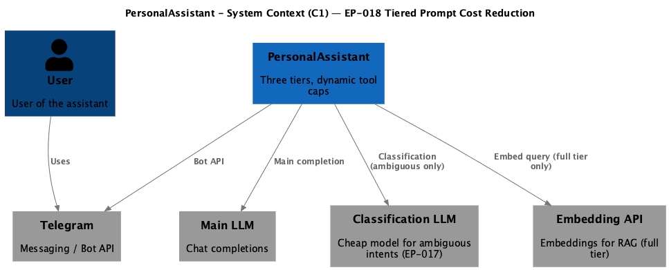
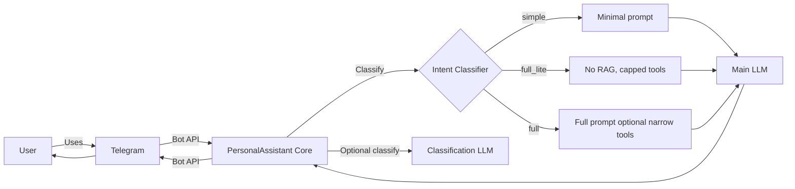

# EP-018 — Requirements (EARS / INCOSE)

This document contains the product requirements for **EP-018 Tiered Prompt Cost Reduction** in EARS form. Derived from [ep-scope.md](ep-scope.md).

**Total: 21 requirements (19 FR, 2 NFR)**

**Contents**

- [Introduction](#introduction)
- [Glossary](#glossary)
- [C4 C1 — System Context](#c4-c1--system-context)
- [Flow](#flow)
- [EARS patterns used](#ears-patterns-used)
- [Requirement index](#requirement-index)
- [Requirements](#requirements)
  - [Complexity tiers](#complexity-tiers)
  - [Prompt assembly — full_lite](#prompt-assembly--full_lite)
  - [Intent classification](#intent-classification)
  - [Dynamic tool selection](#dynamic-tool-selection)
  - [Observability](#observability)
  - [Configuration validation](#configuration-validation)
  - [NFR — Quality and verification](#nfr--quality-and-verification)

---

## Introduction

EP-018 extends **EP-017** with a third complexity tier **`full_lite`** and **dynamic tool selection** (bounded tool lists using existing ranking plus `always_include`). The goal is lower main-model **input** token usage on conversational paths without changing the **`full`** tier assembly when **dynamic tool selection for the `full` tier** is disabled in configuration.

**Scope in brief**

- Three tiers: `simple`, `full_lite`, `full` with a documented component matrix.
- Classifier and model stage updated for three-way assignment; failures default to `full`.
- `full_lite`: no RAG, no runtime skills tail, session history on; tools only via dynamic selection when conversation tools are enabled.
- Optional dynamic selection for the `full` tier behind configuration.
- **System prompt density / static text compression** is out of scope for this epic (see [ep-scope.md](ep-scope.md) out of scope).

---

## Glossary

| Term | Definition |
|------|------------|
| **PersonalAssistant (System)** | The Go core, Telegram adapter, memory store, vector indexes, LLM providers, tools, skills runtime, and configuration. |
| **Core** | The main Go service that orchestrates conversations, LLM calls, tool execution, memory access, and vector retrieval. |
| **Intent classifier** | The EP-017 two-stage component extended in this epic to assign `simple`, `full_lite`, or `full` before main-model prompt assembly. |
| **`full_lite` tier** | Mid complexity tier: session history included; RAG omitted; runtime skill playbook omitted from the dynamic tail; tools attached only through dynamic tool selection rules when conversation tools are enabled. |
| **Dynamic tool selection** | Merging `always_include` tool identifiers with ranked candidates, then enforcing a configured maximum count before building tool definitions for the main LLM request. |
| **Tool vector pre-selection** | Existing configuration-driven ranking of tools by semantic similarity to the user message (`tool_pre_selection` and related settings). |
| **Fallback cap list** | The tool identifier list produced by the existing tool assembly when vector pre-selection is unavailable or disabled, bounded by the configured fallback cap (current product behaviour). |
| **Main LLM request** | The primary chat completion request to the configured conversation provider for a user turn (excluding the EP-017 classification provider call). |
| **HandleMessage** | Core function that constructs the prompt and invokes the main LLM for a user turn. |

---

## C4 C1 — System Context

**Source:** [diagrams/c4-context.puml](diagrams/c4-context.puml) (C4-PlantUML). To regenerate PNG: `plantuml -tpng diagrams/c4-context.puml` from this epic directory.

### Flow

The user sends a message via Telegram. The core classifies the message into `simple`, `full_lite`, or `full` (heuristic, then optional cheap model). The core builds the main-model prompt using tier rules and dynamic tool selection where applicable. For `full`, RAG may run; for `full_lite`, RAG is skipped. The reply returns via Telegram.

---

## EARS patterns used

- **Ubiquitous:** THE \<system\> SHALL \<response\>
- **Event-driven:** WHEN \<trigger\>, THE \<system\> SHALL \<response\>
- **State-driven:** WHILE \<condition\>, THE \<system\> SHALL \<response\>
- **Unwanted event:** IF \<condition\>, THEN THE \<system\> SHALL \<response\>
- **Optional feature:** WHERE \<option\>, THE \<system\> SHALL \<response\>
- **Complex:** Clauses in order WHERE → WHILE → WHEN/IF → THE → SHALL

In the following, *PersonalAssistant* means the PersonalAssistant (System) unless a component name is given explicitly.

---

## Requirement index

| Id | Type | Section | Summary |
|----|------|---------|---------|
| REQ-18.001 | FR | Complexity tiers | Three tiers with documented prompt matrix |
| REQ-18.002 | FR | Complexity tiers | `simple` excludes tools, RAG, tail skills, Hermes |
| REQ-18.003 | FR | Complexity tiers | `full` matches EP-017 when full-tier dynamic off |
| REQ-18.004 | FR | Prompt assembly — full_lite | `full_lite` skips RAG and chunk injection — **Superseded by EP-036** |
| REQ-18.005 | FR | Prompt assembly — full_lite | `full_lite` keeps session exchanges like `full` |
| REQ-18.006 | FR | Prompt assembly — full_lite | `full_lite` omits runtime skill playbook in tail |
| REQ-18.007 | FR | Prompt assembly — full_lite | `full_lite` includes Hermes when tools present |
| REQ-18.008 | FR | Prompt assembly — full_lite | `full_lite` omits Hermes when no tools |
| REQ-18.009 | FR | Intent classification | Classifier assigns one of three tiers when enabled — **Superseded by EP-036** |
| REQ-18.010 | FR | Intent classification | Model stage prompt lists three tiers on ambiguous — **Superseded by EP-036** |
| REQ-18.011 | FR | Intent classification | Model failure defaults to `full` with WARN — **Superseded by EP-036** |
| REQ-18.012 | FR | Dynamic tool selection | Merge `always_include` before cap enforcement |
| REQ-18.013 | FR | Dynamic tool selection | Enforce max tools when dynamic selection applies |
| REQ-18.014 | FR | Dynamic tool selection | Ranked order from tool vector pre-selection when enabled |
| REQ-18.015 | FR | Dynamic tool selection | `full` tier unchanged when full-tier dynamic off |
| REQ-18.016 | FR | Dynamic tool selection | `full_lite` uses fallback list when pre-selection off |
| REQ-18.017 | FR | Dynamic tool selection | `full_lite` uses dynamic path when tools enabled |
| REQ-18.018 | FR | Observability | INFO log tier, tool count, dynamic flag, stage |
| REQ-18.019 | FR | Configuration validation | Reject invalid epic configuration at load |
| REQ-18.020 | NFR | Quality | `make check` passes on delivery branch |
| REQ-18.021 | NFR | Verification | Each AC mapped to automated or manual test |

---

## Requirements

### Complexity tiers

*REQ-18.001 – REQ-18.003*

**REQ-18.001** (Ubiquitous)  
THE PersonalAssistant SHALL define three complexity tiers — `simple`, `full_lite`, and `full` — and SHALL document in product configuration documentation which prompt components each tier includes for the main LLM request (static system head text, session history, RAG retrieval and chunk injection, runtime skill playbook text in the dynamic tail, Hermes tool-format instructions, tool definitions, tool vector pre-selection, dynamic tool cap).

**REQ-18.002** (State-driven)  
WHILE a user turn is assigned the `simple` tier, THE PersonalAssistant SHALL exclude tool definitions, RAG retrieval results, Hermes tool-format instructions, and runtime skill playbook text from the main LLM request for that turn.

**REQ-18.003** (State-driven)  
WHILE a user turn is assigned the `full` tier, WHERE dynamic tool selection for the `full` tier is disabled in configuration, THE PersonalAssistant SHALL construct the main LLM request using the same RAG retrieval behaviour, dynamic tail assembly, session history behaviour, and tool definition assembly as after EP-017 for the `full` tier.

---

### Prompt assembly — full_lite

*REQ-18.004 – REQ-18.008*

**REQ-18.004** (State-driven) **Superseded by EP-036:** the `full_lite` tier was removed; former `full_lite` turns now use the `full` assembly path. Retained for historical traceability.  
WHILE a user turn is assigned the `full_lite` tier, THE PersonalAssistant SHALL skip semantic vector retrieval for RAG on that turn and SHALL omit retrieved memory chunk strings from the main LLM system message for that turn.

**REQ-18.005** (State-driven)  
WHILE a user turn is assigned the `full_lite` tier, WHERE session memory is enabled, THE PersonalAssistant SHALL include session store exchanges in the main LLM request message list using the same ordering rules as for the `full` tier.

**REQ-18.006** (State-driven)  
WHILE a user turn is assigned the `full_lite` tier, THE PersonalAssistant SHALL omit runtime skill playbook text from the system message dynamic tail for that turn.

**REQ-18.007** (State-driven)  
WHILE a user turn is assigned the `full_lite` tier, WHERE the main LLM completion request includes at least one tool, THE PersonalAssistant SHALL include Hermes tool-format instructions in the system message for that turn.

**REQ-18.008** (State-driven)  
WHILE a user turn is assigned the `full_lite` tier, WHERE the main LLM completion request includes zero tools, THE PersonalAssistant SHALL omit Hermes tool-format instructions from the system message for that turn.

---

### Intent classification

*REQ-18.009 – REQ-18.011*

**REQ-18.009** (Event-driven) **Superseded by EP-036:** classification is now heuristic-only with two tiers (`simple`, `full`); the three-tier assignment was removed. Retained for historical traceability.  
WHEN the intent classifier is enabled in configuration, THE PersonalAssistant SHALL assign exactly one of `simple`, `full_lite`, or `full` to each user turn before main-model prompt assembly for that turn.

**REQ-18.010** (Event-driven) **Superseded by EP-036:** the model classification stage was removed; ambiguous heuristics default to `full` without an LLM call. Retained for historical traceability.  
WHEN the heuristic stage returns `ambiguous` and the model stage is enabled in configuration, THE PersonalAssistant SHALL send a classification provider request whose prompt body contains only the user message text and three tier labels (`simple`, `full_lite`, `full`) each with a brief plain-text description.

**REQ-18.011** (Unwanted event) **Superseded by EP-036:** the model classification stage was removed; there is no model failure path. Retained for historical traceability.  
IF the model stage returns an unparseable tier label, times out, or returns an error, THEN THE PersonalAssistant SHALL assign the `full` tier for that turn and SHALL record a WARN-level log entry that contains error details.

---

### Dynamic tool selection

*REQ-18.012 – REQ-18.017*

**REQ-18.012** (Ubiquitous)  
THE PersonalAssistant SHALL merge the configured `always_include` tool identifiers into the selected tool identifier set for a user turn before enforcing the configured maximum tool count for the main LLM request when dynamic tool selection applies to that turn.

**REQ-18.013** (Ubiquitous)  
THE PersonalAssistant SHALL enforce a configured upper bound on the number of tools attached to the main LLM completion request when dynamic tool selection applies to that user turn.

**REQ-18.014** (Event-driven)  
WHEN dynamic tool selection applies to a user turn and tool vector pre-selection is enabled in configuration, THE PersonalAssistant SHALL derive ranked tool candidate ordering from the existing tool vector pre-selection output for that user message before applying the configured maximum tool count.

**REQ-18.015** (Optional feature)  
WHERE dynamic tool selection for the `full` tier is disabled in configuration, THE PersonalAssistant SHALL not apply the maximum tool count from [REQ-18.013](ep-requirements.md#req-18-013) to the `full` tier tool assembly for that configuration.

**REQ-18.016** (Optional feature)  
WHERE a user turn is assigned the `full_lite` tier and tool vector pre-selection is disabled in configuration, THE PersonalAssistant SHALL build the initial ranked tool identifier list for dynamic tool selection using the existing fallback cap list behaviour from the current tool pre-selection configuration for that user message.

**REQ-18.017** (State-driven)  
WHILE a user turn is assigned the `full_lite` tier and text-based tools are enabled for conversations, THE PersonalAssistant SHALL construct the tool identifier set for the main LLM request using dynamic tool selection rules from this epic before building tool definitions.

---

### Observability

*REQ-18.018*

**REQ-18.018** (Event-driven)  
WHEN the main LLM request for a user turn is assembled, THE PersonalAssistant SHALL log at INFO level the assigned complexity tier, the number of tools attached to that request, whether dynamic tool selection ran for that turn, and the classifier deciding stage name for that turn.

---

### Configuration validation

*REQ-18.019*

**REQ-18.019** (Ubiquitous)  
THE PersonalAssistant SHALL reject configuration at load time with a clear error when any EP-018 field is invalid (including unknown tier labels in pattern files, non-positive `max_tools_for_llm_request`, or mutually inconsistent dynamic-tool flags).

---

### NFR — Quality and verification

*REQ-18.020 – REQ-18.021*

**REQ-18.020** (Ubiquitous)  
THE PersonalAssistant SHALL pass `make check` on the branch that delivers this epic.

**REQ-18.021** (Ubiquitous)  
THE PersonalAssistant SHALL map every acceptance criterion in [ep-acceptance-criteria.md](ep-acceptance-criteria.md) to at least one automated test with `Covers AC-18.NNN` or to an explicit manual scenario referenced from the acceptance criteria document.
