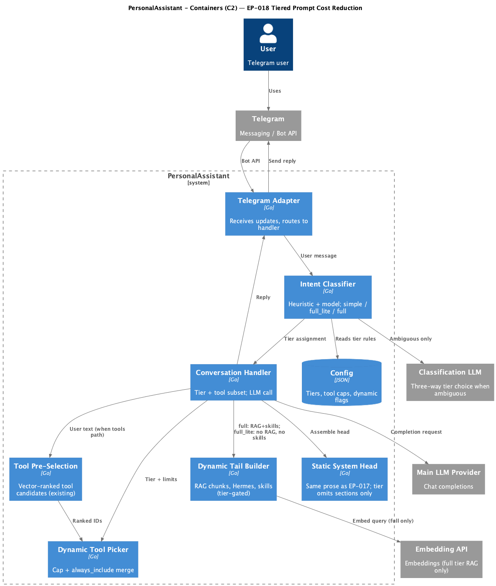

# EP-018 — System design

**Pipeline:** Stage 6.  
**Inputs:** [ep-requirements.md](ep-requirements.md), [ep-acceptance-criteria.md](ep-acceptance-criteria.md)

## Contents

- [Overview](#overview)
- [Architecture](#architecture)
- [Components and interfaces](#components-and-interfaces)
- [Data models](#data-models)
- [Risks and trade-offs](#risks-and-trade-offs)
- [Error handling](#error-handling)
- [Testing strategy](#testing-strategy)
- [Requirement traceability](#requirement-traceability)

---

## Overview

EP-018 extends the EP-017 intent pipeline with a third tier **`full_lite`** and **dynamic tool selection** with a configurable cap and optional application to the **`full`** tier. The classifier ([REQ-18.009](ep-requirements.md#req-18-009)–[REQ-18.011](ep-requirements.md#req-18-011)) assigns `simple`, `full_lite`, or `full` before `HandleMessage` builds the main-model request. Prompt assembly gates RAG, runtime skills tail, and tool lists per tier ([REQ-18.002](ep-requirements.md#req-18-002)–[REQ-18.008](ep-requirements.md#req-18-008), [REQ-18.003](ep-requirements.md#req-18-003)). A small **dynamic tool picker** step merges ranked tool IDs with `always_include`, then truncates to `max_tools_for_llm_request` when dynamic selection applies ([REQ-18.012](ep-requirements.md#req-18-012)–[REQ-18.017](ep-requirements.md#req-18-017)). Static system head prose stays the same as EP-017; only tier-driven omissions change what is appended ([REQ-18.001](ep-requirements.md#req-18-001)). **System prompt density** is explicitly out of scope ([ep-scope.md](ep-scope.md)). Observability and configuration validation satisfy [REQ-18.018](ep-requirements.md#req-18-018) and [REQ-18.019](ep-requirements.md#req-18-019).

---

## Architecture

<p align="center"></p>

**Source:** [diagrams/c4-container.puml](diagrams/c4-container.puml) (C4-PlantUML). To regenerate PNG: `plantuml -tpng diagrams/c4-container.puml` from this epic directory.

### Module boundaries

| Layer | Responsibility |
|-------|----------------|
| **internal/intent** | Add `TierFullLite` constant; extend `HeuristicClassifier` with optional `full_lite` patterns; extend `ModelClassifier` to parse `full_lite` response token; update `CascadeClassifier` default-on-failure to `full` ([REQ-18.009](ep-requirements.md#req-18-009)–[REQ-18.011](ep-requirements.md#req-18-011)). |
| **internal/config** | New fields: `intent_classifier` heuristic `full_lite_patterns` (regex list), `model_stage` classification prompt template optional; `tools.dynamic_selection` (or sibling key) with `enabled_for_full_lite`, `enabled_for_full`, `max_tools_for_llm_request` (int ≥ 1) ([REQ-18.019](ep-requirements.md#req-18-019)). |
| **internal/core** | `HandleMessage` branches on three tiers; invokes dynamic tool picker when [REQ-18.017](ep-requirements.md#req-18-017) or optional `full` path applies; logs per [REQ-18.018](ep-requirements.md#req-18-018). |
| **internal/core** (tool path) | Reuse existing tool vector ranking output; new helper `pickToolsForMainRequest(ctx, tier, rankedIDs, alwaysInclude, cfg)` applies merge + cap ([REQ-18.012](ep-requirements.md#req-18-012)–[REQ-18.016](ep-requirements.md#req-18-016)). |

---

## Components and interfaces

### Consolidated component table

| Component | Responsibility | Primary inputs / outputs | REQ ids |
|-----------|----------------|--------------------------|---------|
| `intent.Tier` + classifier implementations | Assign `simple` \| `full_lite` \| `full` | User message string → `intent.Result` | [REQ-18.009](ep-requirements.md#req-18-009)–[REQ-18.011](ep-requirements.md#req-18-011) |
| `HeuristicClassifier` | Regex / length rules including `full_lite` | Message → confident tier or ambiguous | [REQ-18.009](ep-requirements.md#req-18-009) |
| `ModelClassifier` | Cheap LLM three-way parse | Classification prompt body (see below) → tier or error | [REQ-18.010](ep-requirements.md#req-18-010), [REQ-18.011](ep-requirements.md#req-18-011) |
| `CascadeClassifier` | Order heuristic → model → default `full` | `Result` with stage name | [REQ-18.011](ep-requirements.md#req-18-011) |
| `conversationHandler.HandleMessage` | Tier branches, RAG/skills/tail/tools | Tier, session, user text → `llm.Messages`, `CompletionOptions` | [REQ-18.002](ep-requirements.md#req-18-002)–[REQ-18.008](ep-requirements.md#req-18-008), [REQ-18.003](ep-requirements.md#req-18-003) |
| `pickToolsForMainRequest` (name TBD) | Merge `always_include`, cap | Ranked IDs, config → tool ID list | [REQ-18.012](ep-requirements.md#req-18-012)–[REQ-18.017](ep-requirements.md#req-18-017) |
| Config load / `ResolvePaths` | Validate EP-018 fields | `config.json` → error or typed config | [REQ-18.019](ep-requirements.md#req-18-019) |

### Detail by component

### Tier type ([REQ-18.001](ep-requirements.md#req-18-001))

```go
const (
    TierSimple   Tier = "simple"
    TierFullLite Tier = "full_lite"
    TierFull     Tier = "full"
)
```

### HeuristicClassifier ([REQ-18.009](ep-requirements.md#req-18-009))

Extend configuration with compiled `fullLitePatterns []*regexp.Regexp`. Classification order (example; final order is implementation detail if tests preserve behaviour):

1. Length guard (reuse EP-017 `max_simple_len` semantics for `simple` only).
2. Match `simplePatterns` → confident `TierSimple`.
3. Match `fullPatterns` → confident `TierFull`.
4. Match `fullLitePatterns` → confident `TierFullLite`.
5. Otherwise → ambiguous for model stage.

The heuristic stage SHALL perform no network calls, LLM calls, or filesystem I/O during classification (same non-functional constraint as the EP-017 heuristic stage).

### ModelClassifier ([REQ-18.010](ep-requirements.md#req-18-010), [REQ-18.011](ep-requirements.md#req-18-011))

**Classification request shape ([REQ-18.010](ep-requirements.md#req-18-010)):** The outbound body sent to the classification provider SHALL consist of **only**:

1. A fixed instruction preamble (stored in code or a single config template string) that tells the model to reply with exactly one token.
2. A bullet list of exactly three tier labels: `simple`, `full_lite`, `full`, each with one brief plain-text description line (no tool names, no session, no RAG).
3. The literal user message text in a clearly delimited block (same delimiter pattern as EP-017 model stage uses today, extended for three tiers).

No other sections (Hermes, TrustPolicy, session history) are included. This matches [AC-18.010](ep-acceptance-criteria.md#ac-18-010).

**Response parsing:** The model SHALL return exactly one token on the first line: `simple`, `full_lite`, or `full`. Parser trims, lowercases, validates against the three literals; unknown → error to cascade → `TierFull` + WARN ([REQ-18.011](ep-requirements.md#req-18-011)).

### conversationHandler / HandleMessage ([REQ-18.003](ep-requirements.md#req-18-003)–[REQ-18.008](ep-requirements.md#req-18-008))

Insert tier checks after classification (unchanged EP-017 position):

- **`TierSimple`:** unchanged from EP-017 ([REQ-18.002](ep-requirements.md#req-18-002)).
- **`TierFullLite`:** skip `gatherRetrievedChunkTexts` ([REQ-18.004](ep-requirements.md#req-18-004)); build `sysHead` without retrieved-chunk sections; append session snapshot like `full` ([REQ-18.005](ep-requirements.md#req-18-005)); skip runtime skill injection in dynamic tail ([REQ-18.006](ep-requirements.md#req-18-006)); build tool list via dynamic picker when tools enabled ([REQ-18.017](ep-requirements.md#req-18-017)); set Hermes block only if `len(tools) > 0` ([REQ-18.007](ep-requirements.md#req-18-007), [REQ-18.008](ep-requirements.md#req-18-008)).
- **`TierFull`:** if `!cfg.DynamicSelection.EnabledForFull`, reuse exact EP-017 `full` assembly ([REQ-18.003](ep-requirements.md#req-18-003), [REQ-18.015](ep-requirements.md#req-18-015)). If enabled, run dynamic picker after existing ranking ([REQ-18.012](ep-requirements.md#req-18-012)–[REQ-18.014](ep-requirements.md#req-18-014)).

### Dynamic tool picker ([REQ-18.012](ep-requirements.md#req-18-012)–[REQ-18.017](ep-requirements.md#req-18-017))

**Inputs:** ranked tool IDs (from vector pre-selection or fallback list per [REQ-18.014](ep-requirements.md#req-18-014), [REQ-18.016](ep-requirements.md#req-18-016)), `always_include` slice, `max_tools_for_llm_request`.

**Algorithm:**

1. Start ordered list from ranked output (preserve order).
2. Prepend or merge `always_include` IDs at front without duplicates ([REQ-18.012](ep-requirements.md#req-18-012)).
3. Truncate to first N unique IDs where N = `max_tools_for_llm_request` ([REQ-18.013](ep-requirements.md#req-18-013)).
4. Filter to tools that exist in the catalog; invalid IDs logged at WARN and dropped ([REQ-18.019](ep-requirements.md#req-18-019) supports fail-fast at load for config; runtime drops are implementation detail for unknown tool IDs).

### Observability ([REQ-18.018](ep-requirements.md#req-18-018))

After assembling the main `CompletionOptions`, log single INFO line: `tier`, `main_tool_count`, `dynamic_tool_selection` (bool), `intent_stage` (heuristic | model | default).

---

## Data models

### Configuration (JSON excerpt)

Document exact field names in [docs/configuration.md](../../../docs/configuration.md) during implementation; illustrative shape:

```json
{
  "intent_classifier": {
    "enabled": true,
    "heuristic": {
      "simple_patterns": [],
      "full_patterns": [],
      "full_lite_patterns": [
        "^(расскажи|объясни|почему)\\b.{0,80}$"
      ],
      "max_simple_len": 40
    },
    "model_stage": { "enabled": true, "endpoint": "", "model": "" }
  },
  "tools": {
    "always_include": ["run_on_node"],
    "dynamic_selection": {
      "enabled_for_full_lite": true,
      "enabled_for_full": false,
      "max_tools_for_llm_request": 8
    }
  }
}
```

Validation ([REQ-18.019](ep-requirements.md#req-18-019)):

- `max_tools_for_llm_request` ≥ 1 when any dynamic flag is true.
- Regex compile fail-fast for `full_lite_patterns` (and existing pattern lists touched by this change).
- If `enabled_for_full_lite` is true while text-based tools are globally disabled, reject at load (fail-fast) to avoid silent mismatch with [REQ-18.017](ep-requirements.md#req-18-017).
- **Cardinality rule:** Let `A` be the count of distinct `always_include` tool IDs that exist in the tool catalog. When `enabled_for_full_lite` or `enabled_for_full` is true, configuration load SHALL require `max_tools_for_llm_request` ≥ `A` so the cap never truncates a valid forced-include tool after deduplication ([REQ-18.012](ep-requirements.md#req-18-012), [AC-18.012](ep-acceptance-criteria.md#ac-18-012)).

---

## Risks and trade-offs

| Risk | Mitigation |
|------|------------|
| **`full_lite` misclassified** → missing RAG when user expected memory | Strong `full` patterns and conservative defaults; model stage on ambiguous; failure defaults to `full` ([REQ-18.011](ep-requirements.md#req-18-011)). |
| **Dynamic cap hides needed tool** | Operator raises cap; improves `full_lite` / `full` patterns; `always_include` for critical tools ([REQ-18.012](ep-requirements.md#req-18-012)). |
| **Order of heuristic pattern matches** changes behaviour | Document match order in code comments and configuration docs; lock ordering with unit tests ([AC-18.009](ep-acceptance-criteria.md#ac-18-009)). |
| **Config shape drift** between design JSON and shipped `config.json` | Single source in `internal/config` structs; docs updated in same change set as code ([REQ-18.019](ep-requirements.md#req-18-019)). |

---

## Error handling

| Scenario | Behaviour | REQ |
|----------|-----------|-----|
| Invalid regex in `full_lite_patterns` | Fail at config load | [REQ-18.019](ep-requirements.md#req-18-019) |
| `max_tools_for_llm_request` missing or less than 1 when dynamic enabled | Fail at config load | [REQ-18.019](ep-requirements.md#req-18-019) |
| Model stage returns garbage | WARN + tier `full` | [REQ-18.011](ep-requirements.md#req-18-011) |
| `always_include` references unknown tool | WARN + omit that ID; continue if at least one valid tool remains for dynamic path | (implementation); tests cover valid `always_include` ([AC-18.012](ep-acceptance-criteria.md#ac-18-012)) |

---

## Testing strategy

| Level | What | Coverage |
|-------|------|----------|
| **Unit** | Heuristic three-way patterns; model parser `full_lite`; dynamic picker merge+cap; config validation | [AC-18.009](ep-acceptance-criteria.md#ac-18-009)–[AC-18.016](ep-acceptance-criteria.md#ac-18-016), [AC-18.019](ep-acceptance-criteria.md#ac-18-019) |
| **Integration** | `HandleMessage` with mock classifier and providers: tier matrix, RAG skip, Hermes gating, EP-017 `full` baseline | [AC-18.002](ep-acceptance-criteria.md#ac-18-002)–[AC-18.008](ep-acceptance-criteria.md#ac-18-008), [AC-18.003](ep-acceptance-criteria.md#ac-18-003), [AC-18.020](ep-acceptance-criteria.md#ac-18-020) |
| **CI** | `make check`, `./bin/validate EP-018` | [AC-18.021](ep-acceptance-criteria.md#ac-18-021), [REQ-18.020](ep-requirements.md#req-18-020)–[REQ-18.021](ep-requirements.md#req-18-021) |

---

## Requirement traceability

| REQ | Design section |
|-----|----------------|
| [REQ-18.001](ep-requirements.md#req-18-001) | Tier type; configuration documentation task |
| [REQ-18.002](ep-requirements.md#req-18-002) | HandleMessage `TierSimple` branch |
| [REQ-18.003](ep-requirements.md#req-18-003) | HandleMessage `TierFull` + `!EnabledForFull` |
| [REQ-18.004](ep-requirements.md#req-18-004) | HandleMessage `TierFullLite` RAG skip |
| [REQ-18.005](ep-requirements.md#req-18-005) | HandleMessage session snapshot |
| [REQ-18.006](ep-requirements.md#req-18-006) | HandleMessage skip skills tail |
| [REQ-18.007](ep-requirements.md#req-18-007) | Hermes when tool count is non-zero |
| [REQ-18.008](ep-requirements.md#req-18-008) | Hermes when tool count is zero |
| [REQ-18.009](ep-requirements.md#req-18-009) | Classifier interface + wiring |
| [REQ-18.010](ep-requirements.md#req-18-010) | ModelClassifier prompt template |
| [REQ-18.011](ep-requirements.md#req-18-011) | CascadeClassifier error path |
| [REQ-18.012](ep-requirements.md#req-18-012) | Dynamic picker merge |
| [REQ-18.013](ep-requirements.md#req-18-013) | Dynamic picker cap |
| [REQ-18.014](ep-requirements.md#req-18-014) | Order from pre-selection |
| [REQ-18.015](ep-requirements.md#req-18-015) | `full` branch bypass picker |
| [REQ-18.016](ep-requirements.md#req-18-016) | Fallback list input to picker |
| [REQ-18.017](ep-requirements.md#req-18-017) | `full_lite` invokes picker |
| [REQ-18.018](ep-requirements.md#req-18-018) | INFO logging fields |
| [REQ-18.019](ep-requirements.md#req-18-019) | Config validation in `internal/config` |
| [REQ-18.020](ep-requirements.md#req-18-020) | Testing strategy CI row |
| [REQ-18.021](ep-requirements.md#req-18-021) | AC coverage comments + validate tool |

Every requirement [REQ-18.001](ep-requirements.md#req-18-001) through [REQ-18.021](ep-requirements.md#req-18-021) appears in at least one design subsection or the traceability table above.
