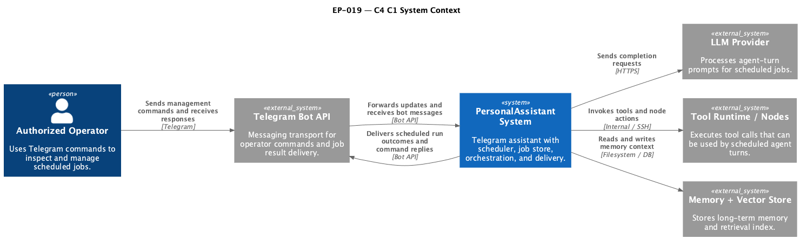
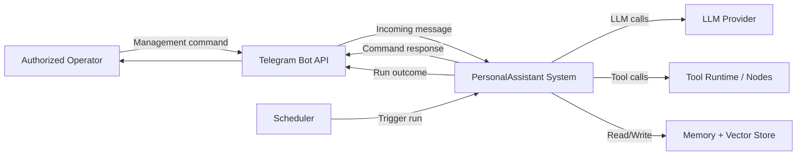

# Scheduled Agent Jobs and Legacy Scheduler Replacement — Requirements (EARS / INCOSE)

This document contains the product requirements for EP-019 in EARS form, aligned with INCOSE semantic quality rules.

> **22 requirements** · 15 FR · 7 NFR · 5 theme groups

**Contents**

- [Introduction](#introduction)
- [Glossary](#glossary)
- [C4 C1 — System Context](#c4-c1--system-context)
- [Flow](#flow)
- [EARS patterns used](#ears-patterns-used)
- [Requirement index](#requirement-index)
- [Requirements](#requirements)
  - [Job Model and Scheduling](#job-model-and-scheduling)
  - [Job Execution and Delivery](#job-execution-and-delivery)
  - [Telegram Job Management](#telegram-job-management)
  - [Legacy Replacement and Configuration](#legacy-replacement-and-configuration)
  - [Non-functional Requirements](#non-functional-requirements)

---

## Introduction

EP-019 replaces the legacy `scheduled_tasks` model with scheduled agent jobs that execute natural-language instructions on a schedule and deliver results to Telegram.
The product is pre-production, so no backward compatibility with the legacy scheduler is required.

**MVP scope in brief**

- Persisted scheduled agent jobs with stable IDs.
- Telegram management commands for operators (`list`, `show`, `pause`, `resume`, `run-now`, `delete` with confirmation).
- Deterministic run lifecycle and delivery behavior.
- Full removal of legacy `scheduled_tasks` path.

---

## Glossary

| Term | Definition |
|------|------------|
| **PersonalAssistant System** | The full assistant product running Telegram adapter, core orchestration, tools, memory, and scheduler. |
| **Scheduled Agent Job** | A persisted cron-based job that triggers an agent turn from an instruction payload. |
| **Scheduler** | The component that evaluates schedules and triggers job runs. |
| **Job Store** | Persistent storage for scheduled jobs and their lifecycle state. |
| **Job ID** | Stable unique identifier of a scheduled job. |
| **Job Run** | One execution instance of a scheduled job. |
| **Cron Expression** | Five-field schedule expression used to define run timing. |
| **Time Zone** | Named IANA time zone used to resolve schedule evaluation. |
| **Delivery Target** | Telegram destination where job outcomes are delivered. |
| **Authorized Operator** | Telegram user allowed to execute job-management commands. |
| **Management Command** | Telegram command used to inspect or control scheduled jobs. |
| **Overlap Policy** | Rule that defines behavior when a new run is due while a previous run is still active. |
| **Confirmation Token** | Short-lived token used to confirm destructive operations. |
| **Audit Logger** | Logging facility that records management and execution events with actor and outcome. |

---

## C4 C1 — System Context

**Source:** [c4-context.puml](diagrams/c4-context.puml) (C4-PlantUML). To regenerate PNG: `plantuml -tpng diagrams/c4-context.puml` from this directory.

### Flow

High-level interaction flow at context level: operators manage jobs via Telegram, Scheduler triggers runs, Core executes agent turns with LLM/tools/memory, and delivery is returned to Telegram.

---

## EARS patterns used

- **Ubiquitous:** THE \<system\> SHALL \<response\>
- **Event-driven:** WHEN \<trigger\>, THE \<system\> SHALL \<response\>
- **State-driven:** WHILE \<condition\>, THE \<system\> SHALL \<response\>
- **Unwanted event:** IF \<condition\>, THEN THE \<system\> SHALL \<response\>
- **Optional feature:** WHERE \<option\>, THE \<system\> SHALL \<response\>
- **Complex:** Clauses in order WHERE → WHILE → WHEN/IF → THE → SHALL

In this document, *System* = PersonalAssistant System (or the stated component).

---

## Requirement index

| Id | Type | Section | Summary |
|----|------|---------|---------|
| REQ-19.001 | FR | Job Model and Scheduling | Persist jobs with stable unique ID |
| REQ-19.002 | FR | Job Model and Scheduling | Load persisted jobs on startup |
| REQ-19.003 | FR | Job Model and Scheduling | Evaluate schedule using configured time zone |
| REQ-19.004 | FR | Job Model and Scheduling | Expose next run timestamp per job |
| REQ-19.005 | FR | Job Execution and Delivery | Start job run on due trigger |
| REQ-19.006 | FR | Job Execution and Delivery | Execute instruction as agent turn |
| REQ-19.007 | FR | Job Execution and Delivery | Deliver successful run result to Telegram |
| REQ-19.008 | FR | Job Execution and Delivery | Deliver failure notification with reason class |
| REQ-19.009 | NFR | Job Execution and Delivery | Enforce run timeout policy |
| REQ-19.010 | NFR | Job Execution and Delivery | Enforce overlap policy |
| REQ-19.011 | FR | Telegram Job Management | List jobs via Telegram command |
| REQ-19.012 | FR | Telegram Job Management | Show job details via Telegram command |
| REQ-19.013 | FR | Telegram Job Management | Pause job via Telegram command |
| REQ-19.014 | FR | Telegram Job Management | Resume job via Telegram command |
| REQ-19.015 | FR | Telegram Job Management | Trigger run-now via Telegram command |
| REQ-19.016 | FR | Telegram Job Management | Delete requires confirmation challenge |
| REQ-19.017 | FR | Telegram Job Management | Delete on valid confirmation |
| REQ-19.018 | NFR | Telegram Job Management | Reject unauthorized management commands |
| REQ-19.019 | FR | Legacy Replacement and Configuration | Reject legacy scheduled_tasks config |
| REQ-19.020 | FR | Legacy Replacement and Configuration | Expose only new job schema in docs/examples |
| REQ-19.021 | NFR | Non-functional Requirements | Audit all management and run lifecycle events |
| REQ-19.022 | NFR | Non-functional Requirements | Keep management-list interaction responsive by deployment profile |

---

## Requirements

### Job Model and Scheduling

*REQ-19.001, REQ-19.002, REQ-19.003, REQ-19.004*

### REQ-19.001 — Persist jobs with stable unique ID
THE Job Store SHALL persist each Scheduled Agent Job with a stable Job ID that is unique within the PersonalAssistant System.

### REQ-19.002 — Load persisted jobs on startup
WHEN the PersonalAssistant System starts, THE Scheduler SHALL load all persisted Scheduled Agent Jobs from the Job Store before accepting Management Commands.

### REQ-19.003 — Evaluate schedule using configured time zone
WHEN the Scheduler evaluates a Scheduled Agent Job, THE Scheduler SHALL resolve the Cron Expression using the job Time Zone.

### REQ-19.004 — Expose next run timestamp per job
THE Scheduler SHALL maintain a computed next run timestamp for each Scheduled Agent Job.

---

### Job Execution and Delivery

*REQ-19.005, REQ-19.006, REQ-19.007, REQ-19.008, REQ-19.009, REQ-19.010*

### REQ-19.005 — Start job run on due trigger
WHEN a Scheduled Agent Job becomes due, THE Scheduler SHALL create a new Job Run for that job.

### REQ-19.006 — Execute instruction as agent turn
WHEN a Job Run starts, THE PersonalAssistant System SHALL execute the job instruction as an agent turn through the standard LLM/tool/memory orchestration path.

### REQ-19.007 — Deliver successful run result to Telegram
WHEN a Job Run completes successfully, THE PersonalAssistant System SHALL send a delivery message with the generated result to the job Delivery Target in Telegram.

### REQ-19.008 — Deliver failure notification with reason class
IF a Job Run fails, THEN THE PersonalAssistant System SHALL send a failure delivery message to the job Delivery Target including a failure reason class.

### REQ-19.009 — Enforce run timeout policy
WHILE a Job Run is active, THE Scheduler SHALL enforce the configured run timeout policy for that run.

### REQ-19.010 — Enforce overlap policy
WHILE the overlap policy is single-instance and a previous Job Run is active, THE Scheduler SHALL mark the newly due run as skipped and record the skip event.

---

### Telegram Job Management

*REQ-19.011, REQ-19.012, REQ-19.013, REQ-19.014, REQ-19.015, REQ-19.016, REQ-19.017, REQ-19.018*

### REQ-19.011 — List jobs via Telegram command
WHEN an Authorized Operator sends the `list` Management Command, THE PersonalAssistant System SHALL return all scheduled jobs with Job ID, schedule, Time Zone, status, and next run timestamp.

### REQ-19.012 — Show job details via Telegram command
WHEN an Authorized Operator sends the `show` Management Command with a valid Job ID, THE PersonalAssistant System SHALL return job details including instruction summary, Delivery Target, last run status, and next run timestamp.

### REQ-19.013 — Pause job via Telegram command
WHEN an Authorized Operator sends the `pause` Management Command with a valid Job ID, THE Scheduler SHALL set that job status to paused.

### REQ-19.014 — Resume job via Telegram command
WHEN an Authorized Operator sends the `resume` Management Command with a valid Job ID, THE Scheduler SHALL set that job status to active.

### REQ-19.015 — Trigger run-now via Telegram command
WHEN an Authorized Operator sends the `run-now` Management Command with a valid Job ID, THE Scheduler SHALL enqueue an immediate Job Run for that job.

### REQ-19.016 — Delete requires confirmation challenge
WHEN an Authorized Operator sends the `delete` Management Command with a valid Job ID, THE PersonalAssistant System SHALL return a confirmation challenge with a Confirmation Token bound to that Job ID.

### REQ-19.017 — Delete on valid confirmation
WHEN an Authorized Operator confirms deletion with a valid Confirmation Token for the matching Job ID, THE Job Store SHALL remove that Scheduled Agent Job.

### REQ-19.018 — Reject unauthorized management commands
IF a Telegram user who is not an Authorized Operator sends a Management Command, THEN THE PersonalAssistant System SHALL reject the command and record an audit event with user ID and command name.

---

### Legacy Replacement and Configuration

*REQ-19.019, REQ-19.020*

### REQ-19.019 — Reject legacy scheduled_tasks config
WHEN configuration input contains legacy `scheduled_tasks` schema fields, THE Configuration Loader SHALL fail startup with a validation error that names each unsupported field.

### REQ-19.020 — Expose only new job schema in docs/examples
THE PersonalAssistant System SHALL provide examples and operational documentation that reference only the new Scheduled Agent Job schema.

---

### Non-functional Requirements

*REQ-19.021, REQ-19.022*

### REQ-19.021 — Audit all management and run lifecycle events
WHEN a management operation or Job Run lifecycle transition occurs, THE Audit Logger SHALL record timestamp, actor identity, Job ID, operation type, and outcome.

### REQ-19.022 — Keep management-list interaction responsive by deployment profile
THE PersonalAssistant System SHALL provide responsive execution of the `list` Management Command under expected deployment load, and measurable performance thresholds SHALL be defined per deployment profile in acceptance criteria.
