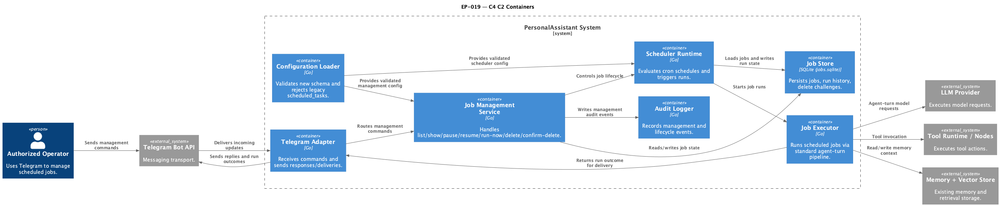

# EP-019 — System design

**Pipeline:** Stage 6.  
**Inputs:** [ep-requirements.md](ep-requirements.md), [ep-acceptance-criteria.md](ep-acceptance-criteria.md)

## Contents

- [Overview](#overview)
- [Architecture](#architecture)
- [Components and interfaces](#components-and-interfaces)
- [Data models](#data-models)
- [Error handling](#error-handling)
- [Testing strategy](#testing-strategy)
- [Risks and trade-offs](#risks-and-trade-offs)
- [Requirement traceability](#requirement-traceability)

---

## Overview

EP-019 introduces first-class Scheduled Agent Jobs and removes legacy `scheduled_tasks` behavior without a compatibility mode. The design adds a persistent Job Store, Scheduler runtime, Telegram management command handling, and explicit audit controls. Scheduled runs use the existing agent-turn execution pipeline and deliver outcomes to Telegram targets.  

Storage decision for this epic: use SQLite in a dedicated file (`jobs.sqlite`) under deployment data directory. This store is separate from vector index storage to keep job scheduling concerns isolated from retrieval/index concerns.

This design covers [REQ-19.001](ep-requirements.md#job-model-and-scheduling) through [REQ-19.022](ep-requirements.md#non-functional-requirements).

---

## Architecture

<p align="center"></p>

**Source:** [diagrams/c4-container.puml](diagrams/c4-container.puml) (C4-PlantUML). To regenerate PNG: `plantuml -tpng diagrams/c4-container.puml` from this epic directory.

### Module boundaries

| Container / module | Responsibility | Key REQ |
|--------------------|----------------|---------|
| **Telegram Adapter** | Receives operator management commands and sends command responses plus run outcomes | [REQ-19.007](ep-requirements.md#job-execution-and-delivery), [REQ-19.008](ep-requirements.md#job-execution-and-delivery), [REQ-19.011](ep-requirements.md#telegram-job-management)-[REQ-19.018](ep-requirements.md#telegram-job-management) |
| **Job Management Service** | Parses and executes `list/show/pause/resume/run-now/delete/confirm-delete` command flows | [REQ-19.011](ep-requirements.md#telegram-job-management)-[REQ-19.017](ep-requirements.md#telegram-job-management) |
| **Authorization Gate** | Confirms operator eligibility for management actions | [REQ-19.018](ep-requirements.md#telegram-job-management) |
| **Scheduler Runtime** | Evaluates cron expressions with timezone and creates due runs | [REQ-19.003](ep-requirements.md#job-model-and-scheduling), [REQ-19.005](ep-requirements.md#job-execution-and-delivery) |
| **Policy Engine** | Enforces overlap and timeout policy for active runs | [REQ-19.009](ep-requirements.md#job-execution-and-delivery), [REQ-19.010](ep-requirements.md#job-execution-and-delivery) |
| **Job Executor** | Executes one run by invoking standard agent-turn path (LLM/tools/memory) | [REQ-19.006](ep-requirements.md#job-execution-and-delivery) |
| **Delivery Service** | Sends success/failure messages to Telegram targets | [REQ-19.007](ep-requirements.md#job-execution-and-delivery), [REQ-19.008](ep-requirements.md#job-execution-and-delivery) |
| **Job Store (SQLite: `jobs.sqlite`)** | Persists job definitions, run history, and delete challenges | [REQ-19.001](ep-requirements.md#job-model-and-scheduling), [REQ-19.002](ep-requirements.md#job-model-and-scheduling), [REQ-19.004](ep-requirements.md#job-model-and-scheduling), [REQ-19.017](ep-requirements.md#telegram-job-management) |
| **Configuration Loader** | Validates new scheduling schema and rejects legacy fields | [REQ-19.019](ep-requirements.md#legacy-replacement-and-configuration) |
| **Audit Logger** | Writes lifecycle and management events with actor, operation, and outcome | [REQ-19.021](ep-requirements.md#non-functional-requirements) |
| **Docs + examples** | Publish only new scheduling schema | [REQ-19.020](ep-requirements.md#legacy-replacement-and-configuration) |

### Runtime flow

1. On startup, the system loads all persisted jobs from `jobs.sqlite` and computes initial `next_run_at` values.  
2. Until startup load succeeds, management commands return a deterministic "scheduler initializing" response and no lifecycle mutation is accepted.  
3. Scheduler tick resolves due jobs by cron expression and job timezone.  
4. Scheduler applies overlap policy before creating a run.  
5. Executor starts run with timeout policy and uses standard agent-turn orchestration.  
6. Delivery sends success or failure class to Telegram target.  
7. Audit logger records lifecycle and management events.  
8. After readiness state is true, management commands can inspect/control jobs through authorized operator path.

---

## Components and interfaces

| Component | Interface contract | Notes |
|-----------|--------------------|-------|
| `JobStore` | `CreateJob`, `GetJob`, `ListJobs`, `UpdateJob`, `DeleteJob`, `RecordRun`, `GetLastRun` | Backed by `jobs.sqlite`; startup loads all jobs ([REQ-19.002](ep-requirements.md#job-model-and-scheduling)). |
| `Scheduler` | `Start`, `Stop`, `EvaluateDue(now)` | Computes `next_run_at` and due triggers ([REQ-19.003](ep-requirements.md#job-model-and-scheduling), [REQ-19.004](ep-requirements.md#job-model-and-scheduling)). |
| `RunPolicy` | `CheckOverlap(jobID)`, `WithTimeout(ctx, jobPolicy)` | Applies overlap and timeout controls ([REQ-19.009](ep-requirements.md#job-execution-and-delivery), [REQ-19.010](ep-requirements.md#job-execution-and-delivery)). |
| `Executor` | `ExecuteRun(ctx, job, triggerType)` | Produces `RunResult` with outcome and failure class ([REQ-19.006](ep-requirements.md#job-execution-and-delivery), [REQ-19.008](ep-requirements.md#job-execution-and-delivery)). |
| `Delivery` | `SendSuccess`, `SendFailure` | Telegram output contract for run outcomes ([REQ-19.007](ep-requirements.md#job-execution-and-delivery), [REQ-19.008](ep-requirements.md#job-execution-and-delivery)). |
| `ManagementService` | `List`, `Show`, `Pause`, `Resume`, `RunNow`, `BeginDelete`, `ConfirmDelete` | `delete` is two-step with challenge token ([REQ-19.016](ep-requirements.md#telegram-job-management), [REQ-19.017](ep-requirements.md#telegram-job-management)). |
| `SchedulerReadiness` | `IsReady()`, `RequireReady()` | Enforces startup gate: pre-ready commands return deterministic initializing response ([REQ-19.002](ep-requirements.md#job-model-and-scheduling)). |
| `Authz` | `CanManage(userID)` | Rejects non-operators with audit event ([REQ-19.018](ep-requirements.md#telegram-job-management)). |
| `Audit` | `Record(event)` | Structured events for operations and transitions ([REQ-19.021](ep-requirements.md#non-functional-requirements)). |

---

## Data models

### Path decision

The scheduling database is a dedicated file:

- `paths.jobs_db_path` (new config field), default recommendation: `jobs.sqlite`
- Resolved relative to deployment data directory (same behavior family as other `paths.*` data entries)
- Must not reuse vector index file path

This decision satisfies separation concerns for EP-019 while keeping runtime simple.

### ScheduledAgentJob

```json
{
  "id": "job_01HT...",
  "name": "morning-ai-digest",
  "schedule_expr": "0 9 * * *",
  "time_zone": "Europe/Berlin",
  "instruction": "Collect an AI digest and send a concise summary.",
  "delivery_chat_id": 123456789,
  "status": "active",
  "overlap_policy": "single_instance",
  "timeout_policy": "cancel_after_limit",
  "next_run_at": "2026-04-17T09:00:00+02:00"
}
```

### JobRun

```json
{
  "run_id": "run_01HT...",
  "job_id": "job_01HT...",
  "trigger_type": "schedule",
  "started_at": "2026-04-16T09:00:00+02:00",
  "finished_at": "2026-04-16T09:00:08+02:00",
  "outcome": "success",
  "failure_reason_class": ""
}
```

### DeleteChallenge

```json
{
  "job_id": "job_01HT...",
  "token": "confirmation-token",
  "requested_by_user_id": 123456789,
  "expires_at": "2026-04-16T09:05:00+02:00"
}
```

### SQLite tables

- `jobs` (definitions + schedule + status + computed next run)
- `job_runs` (run history and outcomes)
- `delete_challenges` (short-lived delete confirmations)
- `schema_migrations` (schema version tracking)

---

## Error handling

| Scenario | Behavior | REQ |
|----------|----------|-----|
| Unauthorized management command | Reject and audit user + command | [REQ-19.018](ep-requirements.md#telegram-job-management) |
| Unknown job ID | Return deterministic not-found response | [REQ-19.011](ep-requirements.md#telegram-job-management)-[REQ-19.017](ep-requirements.md#telegram-job-management) |
| Invalid cron/timezone in config input | Fail validation and reject startup configuration | [REQ-19.003](ep-requirements.md#job-model-and-scheduling), [REQ-19.019](ep-requirements.md#legacy-replacement-and-configuration) |
| Overlap conflict in single-instance mode | Mark due run as skipped and record lifecycle event | [REQ-19.010](ep-requirements.md#job-execution-and-delivery), [REQ-19.021](ep-requirements.md#non-functional-requirements) |
| Timeout reached | Stop per policy, persist outcome, deliver failure class where required | [REQ-19.009](ep-requirements.md#job-execution-and-delivery), [REQ-19.008](ep-requirements.md#job-execution-and-delivery) |
| Delivery failure | Persist failure class and audit event | [REQ-19.008](ep-requirements.md#job-execution-and-delivery), [REQ-19.021](ep-requirements.md#non-functional-requirements) |
| Legacy `scheduled_tasks` fields present | Fail startup with unsupported-field details | [REQ-19.019](ep-requirements.md#legacy-replacement-and-configuration) |

---

## Testing strategy

| Level | Focus | AC |
|-------|-------|----|
| **Unit** | JobStore constraints, scheduler due evaluation, overlap/timeout policy, delete challenge flow | [AC-19.001](ep-acceptance-criteria.md#ac-19-001)-[AC-19.010](ep-acceptance-criteria.md#ac-19-010), [AC-19.016](ep-acceptance-criteria.md#ac-19-016)-[AC-19.019](ep-acceptance-criteria.md#ac-19-019) |
| **Integration** | Telegram management commands + authorization + persistence + run control | [AC-19.011](ep-acceptance-criteria.md#ac-19-011)-[AC-19.018](ep-acceptance-criteria.md#ac-19-018) |
| **E2E** | Scheduled digest delivery and operator command lifecycle | [AC-19.023](ep-acceptance-criteria.md#ac-19-023) |
| **Docs/config validation** | New schema only and legacy rejection behavior | [AC-19.019](ep-acceptance-criteria.md#ac-19-019), [AC-19.020](ep-acceptance-criteria.md#ac-19-020) |
| **Profile acceptance** | Validate `list` responsiveness per deployment profile threshold | [AC-19.022](ep-acceptance-criteria.md#ac-19-022) |

### Profile threshold contract (REQ-19.022)

- Deployment profile thresholds are stored in operator-maintained acceptance test config (outside product runtime schema).
- Each profile declares measurable `list` responsiveness targets (for example latency percentile and sample size).
- Acceptance run binds to one named profile and passes only when measured metrics satisfy that profile target.

---

## Risks and trade-offs

| Risk / trade-off | Impact | Mitigation | Residual risk |
|------------------|--------|------------|---------------|
| Dedicated `jobs.sqlite` introduces one more persistent file | Slight operational complexity (backup/restore path count) | Keep default path in config examples and document backup scope | Low |
| Single-instance overlap policy can skip due runs during long execution | Reduced run frequency in peak/slow periods | Explicit skip audit + operator visibility in `show`/`list`; optional `run-now` recovery | Medium |
| Timeout policy may terminate long but valid runs | Partial task completion | Operator-configurable timeout policy and explicit failure class delivery | Medium |
| Telegram delivery dependency for user-visible outcomes | Failed notifications despite completed execution | Delivery failure class, retries policy in implementation, audit event for failed send | Medium |
| Startup readiness gate delays management actions during boot | Temporary control-plane unavailability | Deterministic "scheduler initializing" response and short startup load path | Low |

---

## Requirement traceability

| REQ | Design component(s) | Interface / flow reference | Acceptance criteria alignment |
|-----|----------------------|----------------------------|-----------------------------|
| [REQ-19.001](ep-requirements.md#job-model-and-scheduling) | `JobStore`, `jobs` table | `CreateJob` uniqueness constraint | [AC-19.001](ep-acceptance-criteria.md#ac-19-001) |
| [REQ-19.002](ep-requirements.md#job-model-and-scheduling) | `JobStore`, `SchedulerReadiness` | Runtime flow steps 1-2; `RequireReady()` | [AC-19.002](ep-acceptance-criteria.md#ac-19-002) |
| [REQ-19.003](ep-requirements.md#job-model-and-scheduling) | `Scheduler`, config validation | `EvaluateDue(now)` using timezone | [AC-19.003](ep-acceptance-criteria.md#ac-19-003) |
| [REQ-19.004](ep-requirements.md#job-model-and-scheduling) | `Scheduler`, `JobStore` | `next_run_at` persistence and response shape | [AC-19.004](ep-acceptance-criteria.md#ac-19-004) |
| [REQ-19.005](ep-requirements.md#job-execution-and-delivery) | `Scheduler`, `JobRun` model | Runtime flow step 3 (due -> run) | [AC-19.005](ep-acceptance-criteria.md#ac-19-005) |
| [REQ-19.006](ep-requirements.md#job-execution-and-delivery) | `Executor` | `ExecuteRun(ctx, job, triggerType)` | [AC-19.006](ep-acceptance-criteria.md#ac-19-006) |
| [REQ-19.007](ep-requirements.md#job-execution-and-delivery) | `Delivery`, Telegram adapter | `SendSuccess` to delivery target | [AC-19.007](ep-acceptance-criteria.md#ac-19-007), [AC-19.023](ep-acceptance-criteria.md#ac-19-023) |
| [REQ-19.008](ep-requirements.md#job-execution-and-delivery) | `Delivery`, `Executor` failure mapping | `SendFailure` with reason class | [AC-19.008](ep-acceptance-criteria.md#ac-19-008) |
| [REQ-19.009](ep-requirements.md#job-execution-and-delivery) | `RunPolicy`, `Scheduler` | `WithTimeout(ctx, jobPolicy)` | [AC-19.009](ep-acceptance-criteria.md#ac-19-009) |
| [REQ-19.010](ep-requirements.md#job-execution-and-delivery) | `RunPolicy`, `Scheduler` | `CheckOverlap(jobID)` skip behavior | [AC-19.010](ep-acceptance-criteria.md#ac-19-010) |
| [REQ-19.011](ep-requirements.md#telegram-job-management) | `ManagementService` | `List` command response contract | [AC-19.011](ep-acceptance-criteria.md#ac-19-011), [AC-19.023](ep-acceptance-criteria.md#ac-19-023) |
| [REQ-19.012](ep-requirements.md#telegram-job-management) | `ManagementService` | `Show` command response contract | [AC-19.012](ep-acceptance-criteria.md#ac-19-012) |
| [REQ-19.013](ep-requirements.md#telegram-job-management) | `ManagementService`, `JobStore` | `Pause` status mutation | [AC-19.013](ep-acceptance-criteria.md#ac-19-013) |
| [REQ-19.014](ep-requirements.md#telegram-job-management) | `ManagementService`, `JobStore` | `Resume` status mutation | [AC-19.014](ep-acceptance-criteria.md#ac-19-014) |
| [REQ-19.015](ep-requirements.md#telegram-job-management) | `ManagementService`, `Scheduler` | `RunNow` enqueue immediate run | [AC-19.015](ep-acceptance-criteria.md#ac-19-015) |
| [REQ-19.016](ep-requirements.md#telegram-job-management) | `ManagementService`, `delete_challenges` | `BeginDelete` challenge issuance | [AC-19.016](ep-acceptance-criteria.md#ac-19-016), [AC-19.023](ep-acceptance-criteria.md#ac-19-023) |
| [REQ-19.017](ep-requirements.md#telegram-job-management) | `ManagementService`, `JobStore` | `ConfirmDelete` token validation + delete | [AC-19.017](ep-acceptance-criteria.md#ac-19-017) |
| [REQ-19.018](ep-requirements.md#telegram-job-management) | `Authz`, `Audit` | `CanManage(userID)` reject path | [AC-19.018](ep-acceptance-criteria.md#ac-19-018) |
| [REQ-19.019](ep-requirements.md#legacy-replacement-and-configuration) | `Configuration Loader` | Startup validation rejects legacy fields | [AC-19.019](ep-acceptance-criteria.md#ac-19-019) |
| [REQ-19.020](ep-requirements.md#legacy-replacement-and-configuration) | Docs/examples artefacts | Operator documentation scope | [AC-19.020](ep-acceptance-criteria.md#ac-19-020) |
| [REQ-19.021](ep-requirements.md#non-functional-requirements) | `Audit` | `Record(event)` payload contract | [AC-19.021](ep-acceptance-criteria.md#ac-19-021) |
| [REQ-19.022](ep-requirements.md#non-functional-requirements) | Profile acceptance config + test harness | Testing strategy profile-threshold contract | [AC-19.022](ep-acceptance-criteria.md#ac-19-022) |
