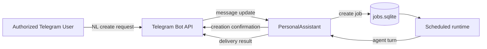

# Natural-Language Scheduled Job Creation from Telegram - Requirements (EARS / INCOSE)

This document defines EP-020 requirements for creating scheduled jobs from natural-language Telegram messages.

> **13 requirements** - 10 FR - 3 NFR - 4 theme groups

## Introduction

EP-020 extends EP-019 by allowing an authorized Telegram user to create a scheduled agent job using a natural-language message such as "Collect an AI news digest and send it at 09:00 every day".

## Glossary

| Term | Definition |
|------|------------|
| **Natural-language creation request** | A Telegram message containing an instruction and daily time intent in supported syntax. |
| **Creation parser** | Component that validates supported syntax and extracts instruction/time fields. |
| **Native create tool fallback** | Controlled extraction path invoked only after deterministic parser non-match for explicit schedule-intent messages. |
| **Creation confirmation** | Deterministic response with created job metadata. |
| **Requested delivery time** | Daily HH:MM time extracted from user message. |
| **Default creation timezone** | `pa_timezone` used for created jobs when no explicit timezone is supplied. |

## C4 C1 - System Context

**Source:** [c4-context.puml](diagrams/c4-context.puml). Regenerate: `plantuml -tpng diagrams/c4-context.puml`.

### Flow

## Requirement index

| Id | Type | Section | Summary |
|----|------|---------|---------|
| REQ-20.001 | FR | NL Request Intake | Detect supported NL creation request in chat |
| REQ-20.002 | FR | NL Request Intake | Extract instruction and HH:MM daily time |
| REQ-20.003 | FR | Job Creation | Persist created job in active status |
| REQ-20.004 | FR | Job Creation | Apply pa_timezone to created jobs |
| REQ-20.005 | FR | Job Creation | Set delivery target to current Telegram chat |
| REQ-20.006 | FR | User Feedback | Return deterministic creation confirmation |
| REQ-20.007 | FR | Validation and Safety | Reject malformed creation requests |
| REQ-20.008 | FR | Management Compatibility | Created jobs are manageable with existing /jobs commands |
| REQ-20.009 | FR | Runtime Delivery | Created jobs execute and deliver on schedule |
| REQ-20.010 | NFR | Security and Access | Unauthorized users cannot create jobs |
| REQ-20.011 | NFR | Safety | Parser triggers only on explicit creation syntax |
| REQ-20.012 | NFR | Observability | Creation outcomes are recorded in audit logs |
| REQ-20.013 | FR | NL Request Intake | Use native-tool fallback after deterministic parser non-match |

## Requirements

### NL Request Intake

**REQ-20.001** (Event-driven)  
WHEN an authorized Telegram user sends a supported natural-language creation request, THE PersonalAssistant System SHALL treat that message as a scheduled-job creation operation.

**REQ-20.002** (Event-driven)  
WHEN the Creation parser processes a supported creation request, THE PersonalAssistant System SHALL extract instruction text and requested delivery time in HH:MM daily format.

**REQ-20.013** (Event-driven)  
WHEN the Creation parser does not match and an explicit schedule-intent message is detected, THE PersonalAssistant System SHALL invoke Native create tool fallback to extract instruction text and requested delivery time in HH:MM daily format for one creation attempt.

### Job Creation

**REQ-20.003** (Event-driven)  
WHEN a creation request is validated, THE Job Store SHALL persist a new Scheduled Agent Job in active status with a stable Job ID.

**REQ-20.004** (Ubiquitous)  
THE PersonalAssistant System SHALL assign the Default creation timezone to jobs created from natural-language requests.

**REQ-20.005** (Event-driven)  
WHEN a job is created from a Telegram request, THE PersonalAssistant System SHALL set the job Delivery Target to the current Telegram chat.

### User Feedback, Safety, and Compatibility

**REQ-20.006** (Event-driven)  
WHEN a job is created successfully, THE PersonalAssistant System SHALL return a deterministic creation confirmation containing Job ID, schedule, timezone, and next run timestamp.

**REQ-20.007** (Unwanted event)  
IF a creation request has unsupported or malformed time syntax, THEN THE PersonalAssistant System SHALL return a deterministic guidance message and SHALL NOT create a job.

**REQ-20.008** (Ubiquitous)  
THE PersonalAssistant System SHALL expose jobs created by natural-language requests through existing `/jobs` management operations.

### Runtime, Security, and Observability

**REQ-20.009** (Event-driven)  
WHEN the requested schedule time is reached for a created job, THE Scheduler SHALL execute the job as a standard agent turn and deliver output to Telegram.

**REQ-20.010** (Unwanted event)  
IF a Telegram user is not authorized, THEN THE PersonalAssistant System SHALL reject natural-language creation requests.

**REQ-20.011** (State-driven)  
WHILE processing regular conversational messages, THE PersonalAssistant System SHALL attempt deterministic parsing first and SHALL attempt Native create tool fallback only for explicit schedule-intent messages.

**REQ-20.012** (Event-driven)  
WHEN a creation attempt is processed, THE Audit Logger SHALL record actor identity, operation type, outcome, and Job ID when available.
