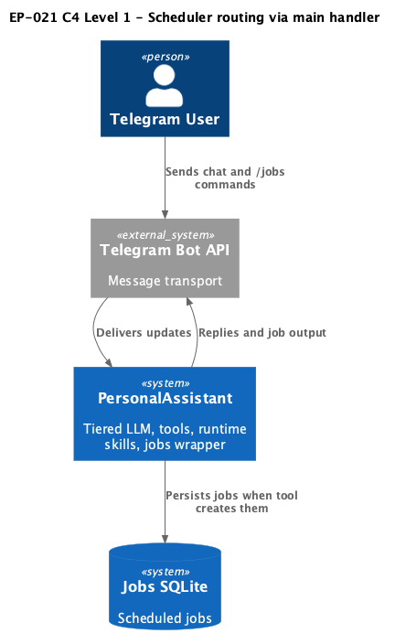
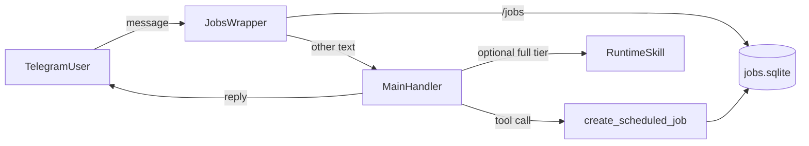

# EP-021 — Scheduler routing without a separate gate — Requirements (EARS / INCOSE)

This document defines requirements for EP-021: remove Telegram-only schedule-intent gating; route schedule creation through the **main handler** and the explicit-parameter native **`create_scheduled_job`** tool. **Runtime skills are optional:** they may improve guidance when `runtime_skills` is enabled, but correct NL schedule create **SHALL NOT** depend on loading any skill package.

> **12 requirements** · 9 FR · 3 NFR · 4 theme groups

**Contents**

- [Introduction](#introduction)
- [Glossary](#glossary)
- [C4 C1 — System Context](#c4-c1--system-context)
- [Flow](#flow)
- [EARS patterns used](#ears-patterns-used)
- [Requirement index](#requirement-index)
- [Requirements](#requirements)

---

## Introduction

EP-021 refines EP-020 by removing the `jobsCommandHandler` paths that detected schedule intent in free text and forced a dedicated LLM fallback prompt. Authorized users rely on the same **intent tier** and **tool merge** as other assistant turns, plus the native `create_scheduled_job` tool definition. **Optional** runtime skills (EP-013) may add playbook text on **`full`** tier when enabled; they are not part of the minimum viable create path.

---

## Glossary

| Term | Definition |
|------|------------|
| **Jobs Telegram wrapper** | The `jobsCommandHandler` in `cmd/pa` that wraps the core message handler when `jobs_db_path` is configured. |
| **Main conversation handler** | The core component that classifies intent tier, assembles prompts, merges tools, runs the LLM, and executes tool calls. |
| **Runtime scheduling skill (optional)** | A `SKILL.md` package under `paths.skills_dir` whose playbook may describe daily scheduled jobs and reference `create_scheduled_job`; used only when `runtime_skills.enabled` and the package is vector-selected on **`full`** tier. |
| **Explicit create parameters** | `instruction`, `hour`, `minute`, and optional `timezone` / ids supplied as structured tool arguments, not parsed from a single prose blob by regex inside the tool. |

## C4 C1 — System Context

**Source:** [c4-context.puml](diagrams/c4-context.puml). Regenerate: `plantuml -tpng diagrams/c4-context.puml` (from `ai-sdlc-artefacts/epics/EP-021/`).

### Flow

## EARS patterns used

- **Ubiquitous:** THE PersonalAssistant System SHALL …
- **Event-driven:** WHEN … THE … SHALL …
- **State-driven:** WHILE … THE … SHALL …
- **Unwanted event:** IF … THEN THE … SHALL …

## Requirement index

| Id | Type | Section | Summary |
|----|------|---------|---------|
| REQ-21.001 | FR | Wrapper | Serve `/jobs` management through the wrapper |
| REQ-21.002 | FR | Wrapper | Delegate non-command chat to the main handler with create context |
| REQ-21.003 | FR | Wrapper | Omit legacy NL manager path and LLM create fallback from the wrapper |
| REQ-21.004 | FR | Tool | Expose explicit create parameters on `create_scheduled_job` |
| REQ-21.005 | FR | Tool | Persist jobs from tool using manager create spec |
| REQ-21.006 | NFR | Static prompt | Preserve system static head unchanged |
| REQ-21.007 | FR | Runtime skill | Ship an **optional** documented scheduling skill template |
| REQ-21.008 | NFR | Configuration | Allow skill frontmatter to reference native tool when jobs enabled |
| REQ-21.009 | NFR | Observability | Keep audit fields for successful creates from the tool |
| REQ-21.010 | FR | Validation | Return user-visible validation text without infrastructure error for bad tool args |
| REQ-21.011 | FR | Regression | Keep `/jobs list` and management behaviour |
| REQ-21.012 | FR | Testing | Automated tests trace acceptance criteria |

## Requirements

### Telegram wrapper

### REQ-21.001 — Serve `/jobs` management through the wrapper
WHILE `jobs_db_path` is configured and the scheduler runtime is ready, THE Jobs Telegram wrapper SHALL accept `/jobs` management commands and return the same class of responses as the job `Manager` for those commands.

### REQ-21.002 — Delegate non-command chat to the main handler with create context
WHEN an incoming Telegram message is not a `/jobs` management command, THE Jobs Telegram wrapper SHALL call the main conversation handler with the original user text and a context enriched by `WithCreateContext`.

### REQ-21.003 — Omit legacy NL manager path and LLM create fallback from the wrapper
THE Jobs Telegram wrapper SHALL omit calls to `HandleNaturalLanguageCreate`, regex schedule-intent detection for routing, and `runLLMCreateFallback` from the message handling path.

### Native create tool

### REQ-21.004 — Expose explicit create parameters on `create_scheduled_job`
THE `create_scheduled_job` native tool SHALL declare required parameters `instruction` (string), `hour` (number), and `minute` (number), and optional parameters for timezone and actor or delivery overrides consistent with existing create context behaviour.

### REQ-21.005 — Persist jobs from tool using manager create spec
WHEN the tool receives valid parameters and an initialized job manager, THE PersonalAssistant System SHALL persist one daily scheduled job and return the deterministic creation confirmation format used by `CreateScheduledJobFromSpec`.

### REQ-21.010 — Return user-visible validation text without infrastructure error for bad tool args
IF required numeric fields are outside the daily clock range or `instruction` is empty after trim, THEN THE `create_scheduled_job` tool SHALL return a concise English error message string and SHALL return a nil Go error to the tool runner for that validation outcome.

### Static prompt and skills

### REQ-21.006 — Preserve system static head unchanged
THE PersonalAssistant System SHALL preserve the existing `systemStaticHead` implementation and the same TrustPolicy, MarkerSupplement, date line, and base personality prose as before this epic (no edits to those strings or their assembly order).

### REQ-21.007 — Ship an **optional** documented scheduling skill template
THE PersonalAssistant repository SHALL include an **optional** runtime skill template under `config.examples/skills/` that operators may copy when `runtime_skills` is enabled; the template SHALL document daily scheduled jobs, instruct use of `create_scheduled_job` with explicit clock fields, and list `create_scheduled_job` in YAML `tools` frontmatter. **A deployment with `runtime_skills` disabled SHALL still support successful schedule creation from chat** when `jobs_db_path` is set and the main model calls `create_scheduled_job`.

### REQ-21.008 — Allow skill frontmatter to reference native tool when jobs enabled
WHILE `runtime_skills.enabled` is true and `paths.skills_dir` contains a package that lists `create_scheduled_job`, THE configuration loader SHALL accept that tool reference when `jobs_db_path` is non-empty.

### Observability, regression, tests

### REQ-21.009 — Keep audit fields for successful creates from the tool
WHEN a job is created through the native tool with explicit parameters, THE audit logger SHALL record a successful `create_nl` (or equivalent agreed operation tag) outcome including `creation_path` distinguishing native explicit tool use from removed parser paths.

### REQ-21.011 — Keep `/jobs list` and management behaviour
THE Job Store and `Manager` SHALL continue to support list, show, pause, resume, run-now, and delete flows for jobs created through the tool.

### REQ-21.012 — Automated tests trace acceptance criteria
THE PersonalAssistant automated tests SHALL declare traceability comments for acceptance criteria AC-21.001 through AC-21.008 in the agreed validate format.
