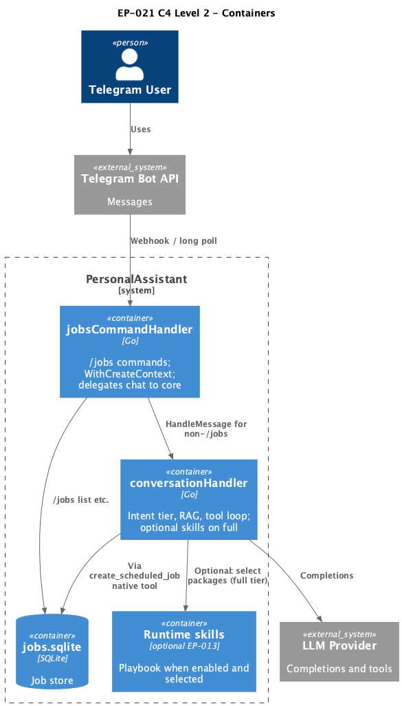

# EP-021 — System design

## Contents

- [Overview](#overview)
- [Architecture](#architecture)
- [Components and interfaces](#components-and-interfaces)
- [Data models](#data-models)
- [Error handling](#error-handling)
- [Testing strategy](#testing-strategy)

## Overview

EP-021 removes Telegram-wrapper schedule-intent branching and relies on the main handler ([REQ-21.002](ep-requirements.md#requirements), [REQ-21.003](ep-requirements.md#requirements)) plus an explicit-parameter native tool ([REQ-21.004](ep-requirements.md#requirements), [REQ-21.005](ep-requirements.md#requirements)). **Runtime skills are optional:** the example template ([REQ-21.007](ep-requirements.md#requirements)) helps operators who use EP-013; multilingual NL create is expected to work from **tool schema and description alone**. Static system text stays unchanged ([REQ-21.006](ep-requirements.md#requirements)).

## Architecture

**Source:** [c4-container.puml](diagrams/c4-container.puml). Regenerate: `plantuml -tpng diagrams/c4-container.puml` (from `ai-sdlc-artefacts/epics/EP-021/`).

**Module boundaries:** `cmd/pa` owns the Telegram adapter and `jobsCommandHandler`. `internal/jobs` owns the store, manager, runtime, and `CreateScheduledJobTool`. `internal/core` owns tiering, prompt assembly, and tool execution. `internal/runtimeskills` and `internal/config` own skill loading and native allowlist policy.

## Components and interfaces

| Component | Responsibility | Key interface |
|-----------|----------------|---------------|
| `jobsCommandHandler` | `/jobs` routing, readiness messages, `WithCreateContext`, delegate chat to core | `core.MessageHandler.HandleMessage` | [REQ-21.001](ep-requirements.md#requirements) [REQ-21.002](ep-requirements.md#requirements) [REQ-21.003](ep-requirements.md#requirements) |
| `conversationHandler` | Tier, tool merge, optional skills on `full`, LLM, tool loop | `llm.Provider`, tool registry | [REQ-21.002](ep-requirements.md#requirements) |
| `CreateScheduledJobTool` | Validate JSON params, call `CreateScheduledJobFromSpec` | `tools.Tool` | [REQ-21.004](ep-requirements.md#requirements) [REQ-21.005](ep-requirements.md#requirements) [REQ-21.010](ep-requirements.md#requirements) |
| `Manager` | Job CRUD, create spec validation, audit | `HandleCommand`, `CreateScheduledJobFromSpec` | [REQ-21.005](ep-requirements.md#requirements) [REQ-21.009](ep-requirements.md#requirements) [REQ-21.011](ep-requirements.md#requirements) |
| Runtime skill `scheduled-jobs` (optional) | Playbook + tool hint when EP-013 enabled and package selected | `SKILL.md` under `config.examples/skills/` | [REQ-21.007](ep-requirements.md#requirements) |
| `AllowedNativeToolIDs` | Permit `create_scheduled_job` in skill YAML when jobs configured | `config.AllowedNativeToolIDs` | [REQ-21.008](ep-requirements.md#requirements) |

## Data models

No new persistent entities: existing `Job` rows and cron expression `minute hour * * *` from [EP-019](../EP-019/ep-scope.md). `creation_path` audit string distinguishes `native_tool_explicit` from removed parser paths ([REQ-21.009](ep-requirements.md#requirements)).

## Error handling

- Tool parameter schema violations: return wrapped errors from `ValidateParams` (LLM correction path).
- Out-of-range clock or empty instruction after trim: return English message and `nil` error ([REQ-21.010](ep-requirements.md#requirements)).
- Store errors from `CreateScheduledJobFromSpec`: propagate as tool errors.

## Testing strategy

Unit tests in `cmd/pa` for wrapper routing; unit tests in `internal/jobs` for the tool; `internal/runtimeskills` test copies the example skill into a temp dir and validates refs ([REQ-21.012](ep-requirements.md#requirements)). Run `make check` and `./bin/validate EP-021`.
