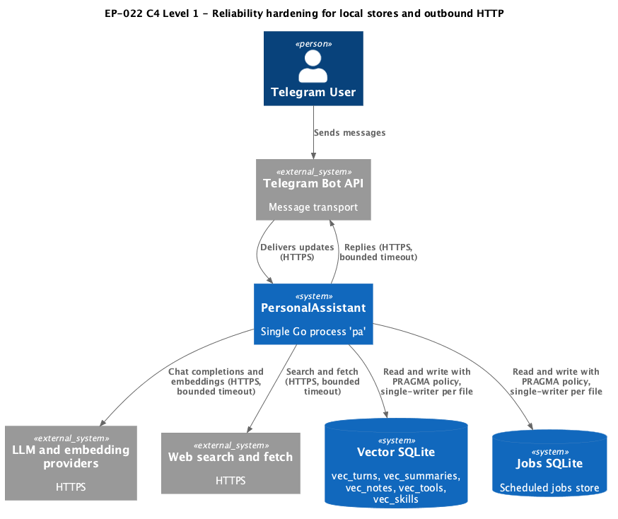
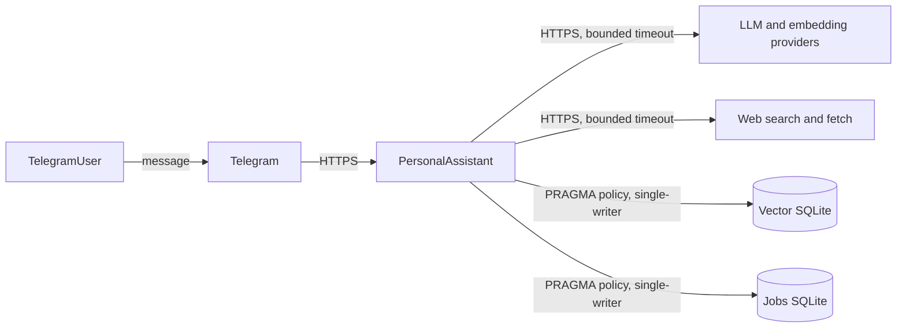

# EP-022 — Reliability hardening for local SQLite stores and outbound HTTP timeouts — Requirements (EARS / INCOSE)

This document defines requirements for EP-022: apply an explicit SQLite PRAGMA policy to every local SQLite file opened by the process, make every outbound HTTP client carry an operator-configurable bounded timeout, document the single-writer expectation per SQLite file, and verify concurrent-write safety under race detection.

> **14 requirements** · 10 FR · 4 NFR · 4 theme groups

**Contents**

- [Introduction](#introduction)
- [Glossary](#glossary)
- [C4 C1 — System Context](#c4-c1--system-context)
- [Flow](#flow)
- [EARS patterns used](#ears-patterns-used)
- [Requirement index](#requirement-index)
- [Requirements](#requirements)

---

## Introduction

EP-022 closes three reliability gaps identified in [pa-architecture-review.md](../../pa-architecture-review.md) §10.7 and risks R6 and R7:

- Local SQLite stores are opened with no explicit PRAGMA policy (`internal/vector/sqlite`) or with only `PRAGMA foreign_keys = ON` (`internal/jobs`), leaving `journal_mode`, `busy_timeout`, and `synchronous` implicit.
- Outbound HTTP clients for the chat LLM, embedding provider, and web tools carry hard-coded or unbounded timeouts (web tools open a client with `Timeout: 0`), which is not operator-configurable and not aligned with the explicit-configuration principle.
- The single-writer expectation per SQLite file is not captured in operator documentation.

Scope is bounded to configuration, the two sqlite open paths, the outbound HTTP client construction points, operator docs, and a concurrent-write test. No public API changes; no changes to the SSH transport or to the Telegram long-poll library.

---

## Glossary

| Term | Definition |
|------|------------|
| **Local SQLite store** | A SQLite database file opened by the process at startup: the vector database (used by `internal/vector/sqlite` for `vec_turns`, `vec_summaries`, `vec_notes`, `vec_tools`, `vec_skills`) and the jobs database (used by `internal/jobs`). |
| **PRAGMA policy** | The set of SQLite `PRAGMA` statements applied on every connection open: `journal_mode`, `busy_timeout`, `synchronous`, and `foreign_keys`. |
| **Outbound HTTP client** | Any `*http.Client` built inside the process for traffic to Telegram, LLM providers, embedding providers, or web tools. |
| **Bounded timeout** | A non-zero duration applied to an outbound HTTP client covering the whole request lifecycle, set from operator configuration with fail-fast validation. |
| **Single-writer expectation** | The operational contract that exactly one process at a time writes to a given SQLite file. |
| **Concurrent-write test** | An integration test that exercises the background summarization worker, the foreground conversation handler, and the background tool vector index build concurrently under the Go race detector. |

---

## C4 C1 — System Context

**Source:** [c4-context.puml](diagrams/c4-context.puml) (C4-PlantUML). To regenerate PNG: `plantuml -tpng diagrams/c4-context.puml` from this directory.

### Flow

---

## EARS patterns used

- **Ubiquitous:** THE PersonalAssistant System SHALL …
- **Event-driven:** WHEN … THE … SHALL …
- **State-driven:** WHILE … THE … SHALL …
- **Unwanted event:** IF … THEN THE … SHALL …

---

## Requirement index

| Id | Type | Section | Summary |
|----|------|---------|---------|
| REQ-22.001 | FR | Database reliability | Apply PRAGMA policy on every Local SQLite Store open |
| REQ-22.002 | FR | Database reliability | Set journal_mode to WAL on every Local SQLite Store open |
| REQ-22.003 | FR | Database reliability | Set busy_timeout from configuration |
| REQ-22.004 | FR | Database reliability | Set synchronous from configuration |
| REQ-22.005 | FR | Database reliability | Keep foreign_keys enabled on the jobs store |
| REQ-22.006 | FR | Outbound HTTP | LLM provider client uses configured Bounded Timeout |
| REQ-22.007 | FR | Outbound HTTP | Embedding provider client uses configured Bounded Timeout |
| REQ-22.008 | FR | Outbound HTTP | Web tools client uses configured Bounded Timeout |
| REQ-22.009 | NFR | Outbound HTTP | Fail-fast configuration validation for every HTTP timeout |
| REQ-22.010 | FR | Outbound HTTP | Reject Timeout of zero for any Outbound HTTP Client |
| REQ-22.011 | NFR | Operator documentation | Document PRAGMA policy and Single-writer expectation |
| REQ-22.012 | NFR | Operator documentation | Document Bounded Timeout defaults and override paths |
| REQ-22.013 | FR | Testing | Provide a Concurrent-Write Test under the race detector |
| REQ-22.014 | NFR | Testing | Quality gate passes on the change set |

---

## Requirements

### Database reliability

*REQ-22.001, REQ-22.002, REQ-22.003, REQ-22.004, REQ-22.005*

**REQ-22.001** (Ubiquitous)  
THE PersonalAssistant System SHALL apply the PRAGMA Policy on every connection open to every Local SQLite Store.

**REQ-22.002** (Ubiquitous)  
THE PersonalAssistant System SHALL set `journal_mode=WAL` on every Local SQLite Store open.

**REQ-22.003** (State-driven)  
WHILE a Local SQLite Store is open, THE PersonalAssistant System SHALL set `busy_timeout` to the value declared for that store in configuration.

**REQ-22.004** (State-driven)  
WHILE a Local SQLite Store is open, THE PersonalAssistant System SHALL set `synchronous` to the value declared for that store in configuration.

**REQ-22.005** (Ubiquitous)  
THE PersonalAssistant System SHALL keep `foreign_keys=ON` on the jobs store.

### Outbound HTTP timeouts

*REQ-22.006, REQ-22.007, REQ-22.008, REQ-22.009, REQ-22.010*

**REQ-22.006** (Ubiquitous)  
THE PersonalAssistant System SHALL build every LLM provider Outbound HTTP Client with a Bounded Timeout supplied from configuration.

**REQ-22.007** (Ubiquitous)  
THE PersonalAssistant System SHALL build every embedding provider Outbound HTTP Client with a Bounded Timeout supplied from configuration.

**REQ-22.008** (Ubiquitous)  
THE PersonalAssistant System SHALL build the web tools Outbound HTTP Client with a Bounded Timeout supplied from configuration.

**REQ-22.009** (Event-driven)  
WHEN the configuration loader reads the HTTP timeout value for any Outbound HTTP Client, THE configuration loader SHALL accept only a positive `time.Duration` value parsed from a string such as `"60s"`, and SHALL fail startup with an explicit error naming the field and the rejected value for any other input.

**REQ-22.010** (Unwanted event)  
IF the effective Bounded Timeout for any Outbound HTTP Client is zero, THEN THE PersonalAssistant System SHALL fail startup with an explicit error that names the offending client role.

### Operator documentation

*REQ-22.011, REQ-22.012*

**REQ-22.011** (Ubiquitous)  
THE operator documentation under `docs/` SHALL describe the PRAGMA Policy applied to each Local SQLite Store and the Single-Writer Expectation per SQLite file.

**REQ-22.012** (Ubiquitous)  
THE operator documentation under `docs/` SHALL list the Bounded Timeout configuration fields for the LLM provider, embedding provider, and web tools Outbound HTTP Clients together with their default values.

### Testing

*REQ-22.013, REQ-22.014*

**REQ-22.013** (Event-driven)  
WHEN the Concurrent-Write Test runs under the Go race detector, THE test SHALL drive the background summarization worker path, the foreground conversation handler path, and the background tool vector index build path so that each writes to its respective Local SQLite Store, and SHALL finish with no `SQLITE_BUSY` outcome and no data race report.

**REQ-22.014** (Ubiquitous)  
THE PersonalAssistant quality gate (`make check`) SHALL pass on the change set for EP-022.
