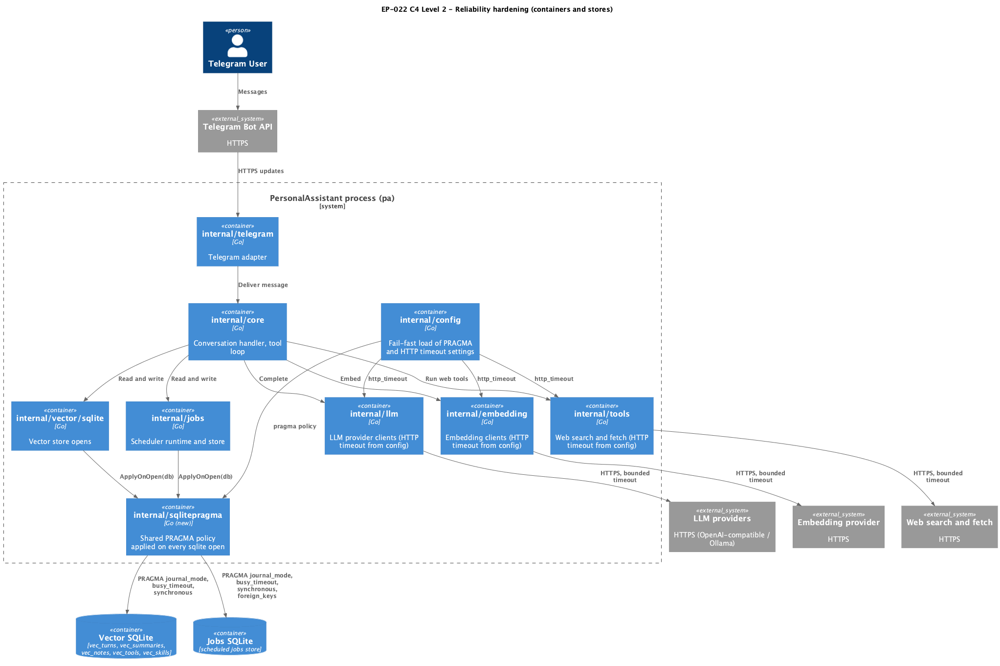

# EP-022 — System design

**Contents**

- [Overview](#overview)
- [Architecture](#architecture)
- [Components and interfaces](#components-and-interfaces)
- [Data models](#data-models)
- [Error handling](#error-handling)
- [Testing strategy](#testing-strategy)
- [Risks and trade-offs](#risks-and-trade-offs)
- [Design decisions](#design-decisions)
- [Requirement traceability](#requirement-traceability)

---

## Overview

EP-022 closes reliability gaps in two narrow areas without changing business behaviour:

- Every Local SQLite Store is opened with a PRAGMA Policy that is applied **on every new connection** the pool hands out ([REQ-22.001](ep-requirements.md#database-reliability), [REQ-22.002](ep-requirements.md#database-reliability), [REQ-22.003](ep-requirements.md#database-reliability), [REQ-22.004](ep-requirements.md#database-reliability), [REQ-22.005](ep-requirements.md#database-reliability)).
- Every Outbound HTTP Client carries a Bounded Timeout supplied from configuration ([REQ-22.006](ep-requirements.md#outbound-http-timeouts), [REQ-22.007](ep-requirements.md#outbound-http-timeouts), [REQ-22.008](ep-requirements.md#outbound-http-timeouts)).
- Configuration validation rejects bad or zero timeouts at startup ([REQ-22.009](ep-requirements.md#outbound-http-timeouts), [REQ-22.010](ep-requirements.md#outbound-http-timeouts)).
- Operator docs describe the PRAGMA Policy, Single-Writer Expectation, and HTTP timeout fields ([REQ-22.011](ep-requirements.md#operator-documentation), [REQ-22.012](ep-requirements.md#operator-documentation)).
- A Concurrent-Write Test guards the combined behaviour under the race detector ([REQ-22.013](ep-requirements.md#testing)); `make check` passes ([REQ-22.014](ep-requirements.md#testing)).

Scope is intentionally narrow: no new binaries, no public API shape changes, no schema migrations.

---

## Architecture

<p align="center"></p>

**Source:** [c4-container.puml](diagrams/c4-container.puml). Regenerate: `plantuml -tpng diagrams/c4-container.puml` (from `ai-sdlc-artefacts/epics/EP-022/`).

Two seams are introduced (or reinforced):

1. **`internal/sqlitepragma`** — a new small package that owns the PRAGMA Policy contract for every Local SQLite Store. It exposes:
   - `type Policy struct { JournalMode string; BusyTimeout time.Duration; Synchronous string; ForeignKeys bool }` (explicit, no hidden defaults).
   - `func BuildDSN(path string, p Policy) (string, error)` — produces a `mattn/go-sqlite3` DSN of the form `file:<path>?_journal_mode=WAL&_busy_timeout=5000&_synchronous=NORMAL&_foreign_keys=on` which the driver applies **on every new connection** it opens. This is how per-connection settings (`busy_timeout`, `synchronous`, `foreign_keys`) are made sticky under Go's `database/sql` pool.
   - `func VerifyOnOpen(ctx context.Context, db *sql.DB, p Policy) error` — opens a fresh connection via `db.Conn(ctx)`, asserts each PRAGMA reflects the expected value, and closes the connection. Serves as a fail-fast self-check after `sql.Open`, and underpins [AC-22.001](ep-acceptance-criteria.md#ac-22001), [AC-22.002](ep-acceptance-criteria.md#ac-22002), [AC-22.003](ep-acceptance-criteria.md#ac-22003).

   Consumed by `internal/vector/sqlite.NewWithTable` and `internal/jobs.Open`. Both callers stop calling `sql.Open(..., path)` directly; they call `sql.Open("sqlite3", sqlitepragma.BuildDSN(path, p))` and then `VerifyOnOpen`. Serves [REQ-22.001](ep-requirements.md#database-reliability), [REQ-22.002](ep-requirements.md#database-reliability), [REQ-22.003](ep-requirements.md#database-reliability), [REQ-22.004](ep-requirements.md#database-reliability), [REQ-22.005](ep-requirements.md#database-reliability).

2. **Explicit HTTP timeout fields in configuration** — new required fields, fail-fast validated. Field naming is unified: every client uses `http_timeout` as the key for the overall `*http.Client.Timeout`.
   - `llm_providers[i].http_timeout` (string duration, e.g. `"60s"`).
   - `embedding.http_timeout`.
   - `web_tools.http_timeout` (distinct from the pre-existing per-operation `search.timeout_seconds` / `fetch.timeout_seconds`, which keep their meaning and stay context-based).

   Used to construct `*http.Client{Timeout: …}` at composition-root time. Serves [REQ-22.006](ep-requirements.md#outbound-http-timeouts), [REQ-22.007](ep-requirements.md#outbound-http-timeouts), [REQ-22.008](ep-requirements.md#outbound-http-timeouts), [REQ-22.009](ep-requirements.md#outbound-http-timeouts), [REQ-22.010](ep-requirements.md#outbound-http-timeouts).

No changes to the Telegram long-poll path (handled by `go-telegram/bot` library; declared out of scope in docs) and no changes to SSH transport.

### Module boundaries

- `internal/sqlitepragma` imports only `database/sql`, `context`, `net/url`, `time`, and the standard library; no dependency on `internal/config`. Callers pass a `Policy` value. Keeps it reusable and trivial to fake.
- `internal/config` owns loading and validation; it exposes typed fields (`time.Duration` after parse) and a per-store `sqlitepragma.Policy` so downstream callers never re-parse.
- Composition root in `cmd/pa/main.go` continues to construct HTTP clients; it reads typed durations from config and passes them to provider constructors.

---

## Components and interfaces

| Component | Responsibility | Key interface / contract |
|-----------|----------------|--------------------------|
| `internal/sqlitepragma` | Own the per-connection PRAGMA mechanism and self-check | `BuildDSN(path string, p Policy) (string, error)` — injects PRAGMAs as DSN query params; `VerifyOnOpen(ctx, db, p) error` — reads back PRAGMAs on a fresh `db.Conn` and fails fast on mismatch. |
| `internal/vector/sqlite` | Open vector tables and serve reads/writes | Signature of `NewWithTable` gains a `sqlitepragma.Policy` parameter; internally uses `BuildDSN` + `VerifyOnOpen`; `ForeignKeys` is ignored for this store and MUST be `false` in its config block (fail-fast otherwise). |
| `internal/jobs` | Open jobs DB and expose scheduler storage | `Open(path string, p Policy) (*Store, error)`; removes the one-shot `PRAGMA foreign_keys = ON` from `initSchema` because the DSN now carries `_foreign_keys=on` and the policy requires it. |
| `internal/config` | Parse and validate `http_timeout` fields and PRAGMA fields; produce typed values | New typed fields `HTTPTimeout time.Duration` on `LLMProviderConfig`, `EmbeddingConfig`, `WebToolsConfig`; new `SQLiteReliability` struct with typed `BusyTimeout time.Duration`; fail-fast validation covers empty, zero, and unparseable values, and rejects `foreign_keys=true` for the vector store block. |
| `internal/llm` | Build LLM provider clients | Constructor takes `httpTimeout time.Duration`; returns an error when zero; builds `&http.Client{Timeout: httpTimeout}`. Removes the hard-coded `defaultTimeout`. |
| `internal/embedding` | Build embedding provider clients | Same pattern as `internal/llm`; zero timeout is a construction error. |
| `cmd/pa/main.go` (composition root) | Wire everything; pass typed values to constructors | `registerWebToolsIfEnabled` uses `web_tools.http_timeout` for the shared `*http.Client`; LLM and embedding constructions use their respective `HTTPTimeout` from config. |
| `docs/` | Operator documentation | Adds the PRAGMA Policy section (per-file), the Single-Writer Expectation, HTTP timeout fields with defaults, and a note that changing large `busy_timeout` delays failure surfacing. |
| `tests/integration` or `internal/reliability` test package | Concurrent-Write Test under the race detector | Integration test that opens a real vector store and a real jobs store at temp paths, spawns writer goroutines per §Testing strategy table, asserts no busy / race. |

---

## Data models

No persistent schema changes. Typed additions to the in-memory config model (comments state the validation rule, not a hidden default):

```go
type SQLiteStoreReliability struct {
    JournalMode  string        // required; operator docs recommend "WAL"
    BusyTimeout  time.Duration // required; must be > 0; parsed from string "5s" etc.
    Synchronous  string        // required; operator docs recommend "NORMAL"
    ForeignKeys  bool          // required; must be true for jobs store, false for vector store
}

type LLMProviderConfig struct {
    // existing fields…
    HTTPTimeout time.Duration // required; parsed from "http_timeout"; zero rejected
}

type EmbeddingConfig struct {
    // existing fields…
    HTTPTimeout time.Duration // required; parsed from "http_timeout"
}

type WebToolsConfig struct {
    // existing fields…
    HTTPTimeout time.Duration // required; parsed from "http_timeout" (client-level, distinct from per-op search/fetch timeouts)
}
```

---

## Error handling

- **Config load:** If any new `http_timeout` field is missing, unparseable, or resolves to zero, `config.Load` returns an error that names the field path and the rejected value. Same for PRAGMA fields. Serves [REQ-22.009](ep-requirements.md#outbound-http-timeouts), [REQ-22.010](ep-requirements.md#outbound-http-timeouts), [AC-22.007](ep-acceptance-criteria.md#ac-22007), [AC-22.008](ep-acceptance-criteria.md#ac-22008).
- **SQLite open:** If `BuildDSN` fails or `VerifyOnOpen` detects a mismatched PRAGMA, the calling store's constructor returns the error wrapped with its package prefix (e.g. `vector/sqlite: verify pragma: %w`) and closes the already-opened `*sql.DB`. No retry, no hidden fallback.
- **HTTP client construction:** Provider constructors return `errors.New("<role>: http timeout must be positive")` when the passed timeout is zero; the composition root propagates that error at startup and aborts.

---

## Testing strategy

- **Unit tests:**
  - `internal/sqlitepragma`: table-driven tests for `BuildDSN` (good/bad policies) and `VerifyOnOpen` (mismatch / success) on a temp sqlite file. Serves [AC-22.001](ep-acceptance-criteria.md#ac-22001), [AC-22.002](ep-acceptance-criteria.md#ac-22002), [AC-22.003](ep-acceptance-criteria.md#ac-22003).
  - `internal/llm`, `internal/embedding`: tests assert the constructed `*http.Client.Timeout` and that zero timeout is a construction error. Serves [AC-22.004](ep-acceptance-criteria.md#ac-22004), [AC-22.005](ep-acceptance-criteria.md#ac-22005).
  - `internal/config`: parse and validation tests for good, unparseable, empty, and zero timeout inputs; also rejection of `foreign_keys=true` on the vector store block. Serves [AC-22.007](ep-acceptance-criteria.md#ac-22007), [AC-22.008](ep-acceptance-criteria.md#ac-22008).
  - `cmd/pa`: test that `registerWebToolsIfEnabled` builds a client with the configured `http_timeout`. Serves [AC-22.006](ep-acceptance-criteria.md#ac-22006).

- **Integration test under `-race`:** serves [AC-22.010](ep-acceptance-criteria.md#ac-22010), [REQ-22.013](ep-requirements.md#testing). Single test, bounded wall-clock budget **≤ 5 s**; runs on both SQLite files at temp paths.

  | Goroutine | Writer path | SQLite file | Workload per iteration | External doubles |
  |-----------|-------------|-------------|------------------------|------------------|
  | `g-summary` | summarization worker | vector DB (`vec_summaries`) | `Store.Add` with pre-computed embedding | embedding: fake returning fixed vector |
  | `g-handler` | conversation handler turn indexing | vector DB (`vec_turns`) | `Store.Add` with pre-computed embedding | LLM: not invoked; only the indexing side |
  | `g-toolindex` | tool vector index build | vector DB (`vec_tools`) | `Store.Add` batch rebuild from a static in-memory catalog | none |
  | `g-jobs` | jobs runtime bookkeeping | jobs DB | `Store.Create` / `UpdateStatus` on a synthetic job | none |

  Assertions: no `database is locked` / `SQLITE_BUSY` returned from any goroutine; `go test -race` reports no data race.

- **Quality gate:** `make check` on the epic branch must return zero ([AC-22.011](ep-acceptance-criteria.md#ac-22011), [REQ-22.014](ep-requirements.md#testing)). Strategy alignment: see [strategy.md](../../strategy.md).

---

## Risks and trade-offs

- **Large `busy_timeout` delays failure surfacing.** Operators can set a generous value that masks genuine write contention. Mitigation: document a ceiling (e.g. "≤ 30 s") in operator docs; the Concurrent-Write Test uses a small value so regressions fail fast.
- **WAL sidecar files (`-wal`, `-shm`) appear next to each store.** Backups and snapshot scripts must include them, and naive directory copy during writes is no longer safe. Mitigation: operator docs call this out explicitly.
- **Per-connection PRAGMAs via DSN depend on driver behaviour.** `mattn/go-sqlite3` supports the `_journal_mode`, `_busy_timeout`, `_synchronous`, `_foreign_keys` query parameters; if the driver is ever swapped, `BuildDSN` must be revisited. Mitigation: `VerifyOnOpen` is a fail-fast guard that detects a silent driver regression at startup.
- **Signature changes ripple through call sites.** `NewWithTable` gains a `Policy` parameter, and `jobs.Open` signature changes. Mitigation: KISS — both call sites are owned inside the repo; no external consumers.
- **`go-telegram/bot` and SSH transport remain out of scope.** Residual hang risk on Telegram long-poll if the upstream library's defaults regress; documented, not addressed by EP-022.

---

## Design decisions

- **DSN query parameters over `SetMaxOpenConns(1)`.** `mattn/go-sqlite3` honours `_journal_mode`, `_busy_timeout`, `_synchronous`, `_foreign_keys` on every pooled connection open, which directly satisfies REQ-22.001. Restricting the pool to one connection would also satisfy correctness but hurts read throughput on the vector store and changes the concurrency model — heavier and not KISS-aligned.
- **`VerifyOnOpen` as a fail-fast self-check.** Cheap (one extra `Conn` + four `PRAGMA` reads at startup) and guards against driver regressions, typos in the DSN builder, and operator-set values that the driver silently rejects.
- **Unified config key name `http_timeout`.** Applies to LLM providers, embedding, and web tools — same concept, same key. Web tools keep their pre-existing per-operation `search.timeout_seconds` / `fetch.timeout_seconds` untouched.
- **Explicit duration strings (`"60s"`).** Consistent with existing patterns in the repo (`intent.Timeout = "5s"`); matches operator intuition.
- **No loader-side defaults.** Values must be present in `config.json`; the loader rejects empty/zero. Matches the repository principle "explicit JSON configuration, no hidden defaults at load".
- **`ForeignKeys` lives on the shared policy, but is required per store.** Jobs store MUST set it to `true`; vector store MUST set it to `false`. The loader rejects other combinations. This keeps the shared policy struct honest and makes the operator decision explicit in config.

---

## Requirement traceability

| REQ | Primary components | Primary tests / AC |
|-----|--------------------|---------------------|
| [REQ-22.001](ep-requirements.md#database-reliability) | `internal/sqlitepragma.BuildDSN`, `VerifyOnOpen`; callers `internal/vector/sqlite`, `internal/jobs` | [AC-22.001](ep-acceptance-criteria.md#ac-22001), [AC-22.002](ep-acceptance-criteria.md#ac-22002) |
| [REQ-22.002](ep-requirements.md#database-reliability) | same as REQ-22.001 | [AC-22.001](ep-acceptance-criteria.md#ac-22001), [AC-22.002](ep-acceptance-criteria.md#ac-22002) |
| [REQ-22.003](ep-requirements.md#database-reliability) | `internal/config` (parse `BusyTimeout`); `internal/sqlitepragma.BuildDSN` | [AC-22.002](ep-acceptance-criteria.md#ac-22002), [AC-22.003](ep-acceptance-criteria.md#ac-22003) |
| [REQ-22.004](ep-requirements.md#database-reliability) | `internal/config`; `internal/sqlitepragma.BuildDSN` | [AC-22.002](ep-acceptance-criteria.md#ac-22002), [AC-22.003](ep-acceptance-criteria.md#ac-22003) |
| [REQ-22.005](ep-requirements.md#database-reliability) | `internal/config` (jobs-store rule); `internal/sqlitepragma.BuildDSN`; `internal/jobs.Open` (drops one-shot PRAGMA) | [AC-22.002](ep-acceptance-criteria.md#ac-22002) |
| [REQ-22.006](ep-requirements.md#outbound-http-timeouts) | `internal/llm` constructor; `cmd/pa/main.go` | [AC-22.004](ep-acceptance-criteria.md#ac-22004) |
| [REQ-22.007](ep-requirements.md#outbound-http-timeouts) | `internal/embedding` constructor; `cmd/pa/main.go` | [AC-22.005](ep-acceptance-criteria.md#ac-22005) |
| [REQ-22.008](ep-requirements.md#outbound-http-timeouts) | `cmd/pa/main.go::registerWebToolsIfEnabled`; `internal/config/webtools` | [AC-22.006](ep-acceptance-criteria.md#ac-22006) |
| [REQ-22.009](ep-requirements.md#outbound-http-timeouts) | `internal/config` parse and validation | [AC-22.007](ep-acceptance-criteria.md#ac-22007) |
| [REQ-22.010](ep-requirements.md#outbound-http-timeouts) | `internal/config` validation; provider constructors | [AC-22.008](ep-acceptance-criteria.md#ac-22008) |
| [REQ-22.011](ep-requirements.md#operator-documentation) | `docs/` | [AC-22.009](ep-acceptance-criteria.md#ac-22009) |
| [REQ-22.012](ep-requirements.md#operator-documentation) | `docs/` | [AC-22.009](ep-acceptance-criteria.md#ac-22009) |
| [REQ-22.013](ep-requirements.md#testing) | `tests/integration` or `internal/reliability` test package | [AC-22.010](ep-acceptance-criteria.md#ac-22010) |
| [REQ-22.014](ep-requirements.md#testing) | `make check` | [AC-22.011](ep-acceptance-criteria.md#ac-22011) |
