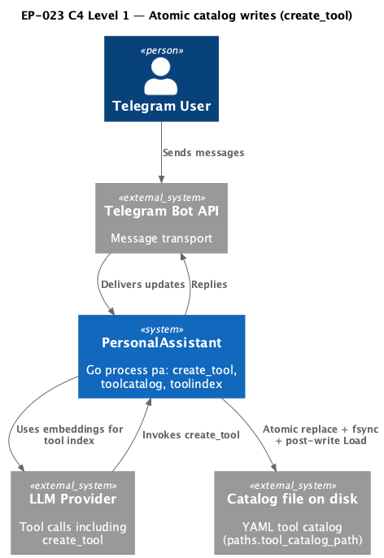
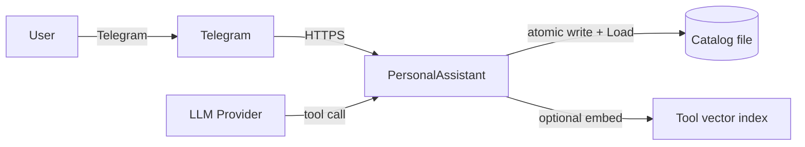

# EP-023 — Atomic catalog writes for create_tool — Requirements (EARS / INCOSE)

This document defines requirements for EP-023: harden the native `create_tool` catalog persistence path with durable atomic replace, post-write validation using the same loader as startup, ordered updates to the in-memory catalog and tool vector index, and deterministic tests for failure paths.

> **11 requirements** · 8 FR · 3 NFR · 3 theme groups

**Contents**

- [Introduction](#introduction)
- [Glossary](#glossary)
- [C4 C1 — System Context](#c4-c1--system-context)
- [Flow](#flow)
- [EARS patterns used](#ears-patterns-used)
- [Requirement index](#requirement-index)
- [Requirements](#requirements)
  - [Catalog file durability](#catalog-file-durability)
  - [Runtime catalog and tool index consistency](#runtime-catalog-and-tool-index-consistency)
  - [Verification and operator documentation](#verification-and-operator-documentation)

---

## Introduction

EP-023 narrows scope to the **catalog file write path** used when the LLM invokes **`create_tool`**: the process must not expose a half-written YAML file, must re-validate persisted bytes with the same **`toolcatalog.Load`** entry point used at startup, and must only advance the **in-memory catalog** and **tool vector index** after that validation succeeds. Failure injection tests prove rollback behaviour for partial writes, rename failure, and invalid post-replace content.

**In scope**

- Same-directory temporary file, data sync, directory sync where applicable, atomic rename over the catalog path.
- Post-rename load using `toolcatalog.Load`; on failure restore the previous file bytes and surface an error without mutating the in-memory catalog for the new tool.
- Update the tool vector index only after the validated on-disk catalog includes the new tool; if embedding upsert fails when an embedder is configured, roll back the file and in-memory state for that create attempt.
- Operator-facing documentation of the durability contract.
- Automated tests for simulated short write, rename failure, and invalid post-write bytes.

**Out of scope**

- Changing the YAML schema, template whitelist rules, or secret-pattern behaviour from EP-009.
- Distributed multi-writer catalog semantics beyond the existing single-process mutex.

---

## Glossary

| Term | Definition |
|------|------------|
| **Atomic replace** | Writing a complete new catalog file body to a temporary file in the same directory as the target, syncing file and directory metadata as required by this epic, then renaming the temporary path over the catalog path on the same filesystem. |
| **Catalog file** | The YAML file at `paths.tool_catalog_path` holding the `tools:` list read at startup and updated by `create_tool`. |
| **create_tool** | The native tool implementation that appends one validated tool to the catalog file and updates runtime structures. |
| **In-memory catalog** | The `*toolcatalog.Catalog` held by the running process after config load and updated on successful `create_tool`. |
| **PersonalAssistant System** | The single Go `pa` process described in project scope. |
| **Post-write validation** | Invoking `toolcatalog.Load` on the catalog file path after a successful atomic replace to ensure the persisted bytes match startup rules. |
| **Tool vector index** | The searchable embedding store for catalog tools (for example `vec_tools`) updated through `toolindex.UpsertToolEmbedding`. |

---

## C4 C1 — System Context

**Source:** [c4-context.puml](diagrams/c4-context.puml) (C4-PlantUML). To regenerate PNG: `plantuml -tpng diagrams/c4-context.puml` from this directory.

### Flow

High-level context: the operator deploys a catalog file; at runtime the LLM may call `create_tool`; the PersonalAssistant System persists through **toolcatalog** with atomic replace and re-load, then refreshes the tool vector index when embedding is configured.

---

## EARS patterns used

- **Ubiquitous:** THE PersonalAssistant System SHALL …
- **Event-driven:** WHEN … THE PersonalAssistant System SHALL …
- **Unwanted event:** IF … THEN THE PersonalAssistant System SHALL …

---

## Requirement index

| Id | Type | Section | Summary |
|----|------|---------|--------|
| REQ-23.001 | FR | Catalog file durability | Persist catalog updates with same-directory atomic replace |
| REQ-23.002 | FR | Catalog file durability | Sync catalog file data and directory metadata before relying on the replace |
| REQ-23.003 | FR | Catalog file durability | Run post-write validation with toolcatalog.Load |
| REQ-23.004 | FR | Catalog file durability | Restore prior catalog bytes when post-write validation fails |
| REQ-23.005 | FR | Runtime catalog and tool index consistency | Advance in-memory catalog only after successful post-write validation |
| REQ-23.006 | FR | Runtime catalog and tool index consistency | Update tool vector index only after in-memory catalog includes the new tool from a successful persist |
| REQ-23.007 | FR | Runtime catalog and tool index consistency | On embedding upsert failure with embedder configured, roll back catalog file and in-memory addition |
| REQ-23.008 | FR | Verification and operator documentation | Deterministic tests for short write, rename failure, invalid post-write |
| REQ-23.009 | NFR | Verification and operator documentation | Operator documentation describes atomic replace and sync contract |
| REQ-23.010 | NFR | Verification and operator documentation | Fail fast on unexpected persistence state in tests |
| REQ-23.011 | NFR | Verification and operator documentation | Quality gate passes on the change set |

---

## Requirements

### Catalog file durability

*REQ-23.001, REQ-23.002, REQ-23.003, REQ-23.004*

### REQ-23.001 — Persist catalog updates with same-directory atomic replace
THE PersonalAssistant System SHALL persist `create_tool` catalog updates by writing a complete replacement body to a temporary file in the same directory as the Catalog file and SHALL replace the Catalog file with that body using a single rename onto the existing catalog path.

### REQ-23.002 — Sync catalog file data and directory metadata before relying on the replace
THE PersonalAssistant System SHALL synchronize catalog file data and the parent directory metadata to stable storage as part of the `create_tool` catalog persistence sequence before treating the replace as durable for the purposes of this epic.

### REQ-23.003 — Run post-write validation with toolcatalog.Load
WHEN the atomic replace of the Catalog file completes successfully, THE PersonalAssistant System SHALL run Post-write validation by calling `toolcatalog.Load` with the catalog path.

### REQ-23.004 — Restore prior catalog bytes when post-write validation fails
IF Post-write validation returns an error, THEN THE PersonalAssistant System SHALL restore the Catalog file bytes from the snapshot taken immediately before the attempted update and SHALL return an error to the `create_tool` caller without adding the new tool to the In-memory catalog.

---

### Runtime catalog and tool index consistency

*REQ-23.005, REQ-23.006, REQ-23.007*

### REQ-23.005 — Advance in-memory catalog only after successful post-write validation
THE PersonalAssistant System SHALL add the new tool to the In-memory catalog only after Post-write validation succeeds for the persisted Catalog file.

### REQ-23.006 — Update tool vector index only after in-memory catalog includes the new tool from a successful persist
THE PersonalAssistant System SHALL invoke tool vector index upsert for the new tool only after the In-memory catalog contains that tool following a successful persist.

### REQ-23.007 — On embedding upsert failure with embedder configured, roll back catalog file and in-memory addition
IF an embedder and tool index are configured for `create_tool` and embedding upsert returns an error, THEN THE PersonalAssistant System SHALL remove the new tool from the In-memory catalog, SHALL restore the Catalog file bytes from the snapshot taken before the attempted update, and SHALL return an error to the caller.

---

### Verification and operator documentation

*REQ-23.008, REQ-23.009, REQ-23.010, REQ-23.011*

### REQ-23.008 — Deterministic tests for short write, rename failure, invalid post-write
THE PersonalAssistant System SHALL ship automated tests that deterministically cover simulated short catalog write, rename failure during replace, and invalid bytes after replace triggering restore behaviour.

### REQ-23.009 — Operator documentation describes atomic replace and sync contract
THE PersonalAssistant System SHALL document for operators the atomic replace sequence, the role of file and directory sync, and the post-write validation step in the repository operator documentation linked from the project README.

### REQ-23.010 — Fail fast on unexpected persistence state in tests
THE PersonalAssistant System SHALL fail tests immediately when assertions about catalog bytes, parse success, or index state are not met for the scenarios in REQ-23.008.

### REQ-23.011 — Quality gate passes on the change set
THE PersonalAssistant System SHALL pass the repository quality gate (`make check`) for the epic change set.
