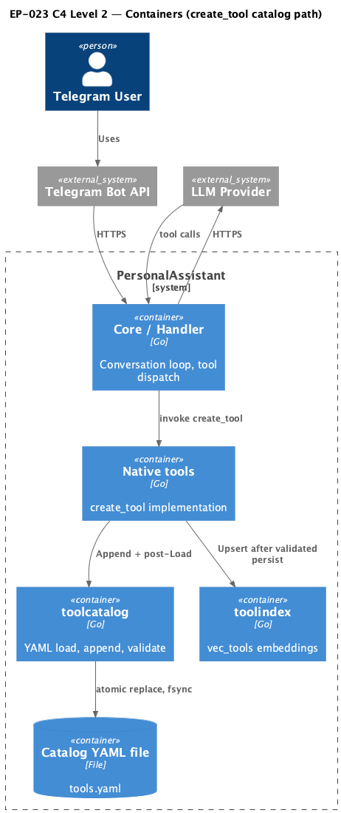

# EP-023 — System design

**Contents**

- [Overview](#overview)
- [Architecture](#architecture)
- [Components and interfaces](#components-and-interfaces)
- [Data models](#data-models)
- [Error handling](#error-handling)
- [Testing strategy](#testing-strategy)
- [Risks and trade-offs](#risks-and-trade-offs)
- [Requirement traceability](#requirement-traceability)

---

## Overview

EP-023 hardens **`create_tool`** so catalog persistence matches [ep-scope.md](ep-scope.md): **atomic replace** with explicit **`Sync`**, **post-rename validation** via [`toolcatalog.Load`](ep-requirements.md#catalog-file-durability) (same entry point as startup as invoked from config load in the `pa` codebase), strict ordering for the **In-memory catalog** and **tool vector index**, and rollback when validation or embedding fails. Primary packages: `internal/toolcatalog` (file IO and validation), `internal/tools` (`CreateToolTool`), `internal/toolindex` (embedding upsert).

---

## Architecture

**Source:** [c4-container.puml](diagrams/c4-container.puml) (C4-PlantUML). To regenerate PNG: `plantuml -tpng diagrams/c4-container.puml` from this directory.

### Module boundaries

| Layer | Responsibility |
|-------|----------------|
| `internal/toolcatalog` | Read snapshot, marshal updated YAML, atomic persist helper (`Sync` file, `rename`, `Sync` parent directory), `Load` validation, optional restore snapshot helper used from `internal/tools`. |
| `internal/tools` | Serialize `create_tool` under mutex; call catalog append; mutate `Catalog` only after success; call `UpsertToolEmbedding` last; on embed error restore file via `toolcatalog` and delete map entry. |
| `internal/toolindex` | Unchanged contract; invoked only after memory contains the tool. |

---

## Components and interfaces

| Component | Responsibility | Key interface / contract |
|-----------|----------------|--------------------------|
| `toolcatalog.AppendToolToCatalogFile` | Append one tool with durable replace + post-`Load` + restore on failure | [REQ-23.001](ep-requirements.md#catalog-file-durability)–[REQ-23.004](ep-requirements.md#catalog-file-durability) |
| `toolcatalog` sync helpers | `Sync` temp file; `Sync` catalog directory after rename | [REQ-23.002](ep-requirements.md#catalog-file-durability), [AC-23.002](ep-acceptance-criteria.md#ac-23-002) |
| `toolcatalog.Load` | Startup-equivalent parse and schema validation | [REQ-23.003](ep-requirements.md#catalog-file-durability) |
| `tools.CreateToolTool.lockedCreate` | Order: persist → memory → embed; snapshot read for rollback on embed failure | [REQ-23.005](ep-requirements.md#runtime-catalog-and-tool-index-consistency)–[REQ-23.007](ep-requirements.md#runtime-catalog-and-tool-index-consistency) |
| `toolindex.UpsertToolEmbedding` | Called with non-nil embedder and index only after memory update; `internal/toolindex` upsert contract unchanged | [REQ-23.006](ep-requirements.md#runtime-catalog-and-tool-index-consistency) |

---

## Data models

- **Catalog file (`rawCatalog`)** — unchanged YAML list under `tools:` in `internal/toolcatalog`.
- **Snapshot** — `[]byte` of the entire catalog file immediately before an append attempt; used to restore disk on validation or embed failure ([REQ-23.004](ep-requirements.md#catalog-file-durability), [REQ-23.007](ep-requirements.md#runtime-catalog-and-tool-index-consistency)).

---

## Error handling

| Failure | Behaviour |
|---------|-----------|
| Temp write / `Sync` / `rename` error | Return error; catalog file remains previous content (rename not committed or temp removed). |
| Post-rename `Load` error | Restore snapshot bytes with the same atomic writer; return wrapped error; do not add tool to memory ([REQ-23.004](ep-requirements.md#catalog-file-durability)). |
| `UpsertToolEmbedding` error with embedder configured | Delete new id from memory; restore snapshot; return error ([REQ-23.007](ep-requirements.md#runtime-catalog-and-tool-index-consistency)). |
| `Upsert` with nil embedder or nil index | Unchanged: no-op upsert, success path unchanged in `internal/toolindex`. |

---

## Testing strategy

- **Unit (`internal/toolcatalog`)** — injectable hooks for corrupt post-marshal body, rename failure, and short writes; assert byte equality to snapshot and `Load` success after good path ([REQ-23.008](ep-requirements.md#verification-and-operator-documentation), [AC-23.008](ep-acceptance-criteria.md#ac-23-008)).
- **Unit (`internal/tools`)** — fake embedder returning error; assert snapshot bytes and absent map key ([AC-23.007](ep-acceptance-criteria.md#ac-23-007)).
- **Hooks for sync** — optional test-only counters or callbacks to satisfy [AC-23.002](ep-acceptance-criteria.md#ac-23-002).
- **Project gate** — `make check`, `./bin/validate EP-023` ([AC-23.010](ep-acceptance-criteria.md#ac-23-010)).
- **Fail fast** — Tests for this epic use direct `bytes.Equal`, `Load`, and map lookups with `t.Fatal` / `require`-style checks on first mismatch; no retry loops that could mask inconsistent file or memory state ([REQ-23.010](ep-requirements.md#verification-and-operator-documentation)).

---

## Risks and trade-offs

| Risk / trade-off | Mitigation |
|------------------|------------|
| **Crash window** — A crash between `rename` and directory `Sync` could leave the catalog updated without a persisted directory entry on some filesystems; single-process recovery re-reads the file on next start. | Accept for this epic; same-filesystem atomic rename remains the primary contract ([ep-scope.md](ep-scope.md)). |
| **Single writer** — Concurrent `create_tool` calls rely on the existing mutex; atomic replace does not add multi-host locking. | Document unchanged single-writer assumption ([REQ-23.001](ep-requirements.md#catalog-file-durability)). |
| **Restore failure** — If snapshot restore after a failed validation fails, the operator may need to repair the catalog from backup. | Return a wrapped error including restore failure; keep restore logic minimal and tested ([REQ-23.004](ep-requirements.md#catalog-file-durability)). |
| **Embedding provider outage** — With embedder configured, a failing upsert blocks the create and rolls back the file; the tool is not partially advertised in the index. | Aligns with [REQ-23.007](ep-requirements.md#runtime-catalog-and-tool-index-consistency). |

---

## Requirement traceability

| REQ | Design location |
|-----|-----------------|
| [REQ-23.001](ep-requirements.md#catalog-file-durability) | Architecture, `AppendToolToCatalogFile` / atomic writer |
| [REQ-23.002](ep-requirements.md#catalog-file-durability) | `toolcatalog` sync helpers, testing hooks |
| [REQ-23.003](ep-requirements.md#catalog-file-durability) | Post-rename `Load` in append path |
| [REQ-23.004](ep-requirements.md#catalog-file-durability) | Restore snapshot on `Load` error |
| [REQ-23.005](ep-requirements.md#runtime-catalog-and-tool-index-consistency) | `lockedCreate` ordering |
| [REQ-23.006](ep-requirements.md#runtime-catalog-and-tool-index-consistency) | Upsert after `c.catalog.Tools[id] = newTool` |
| [REQ-23.007](ep-requirements.md#runtime-catalog-and-tool-index-consistency) | Rollback on embed failure in `lockedCreate` |
| [REQ-23.008](ep-requirements.md#verification-and-operator-documentation) | `internal/toolcatalog` / `internal/tools` tests |
| [REQ-23.009](ep-requirements.md#verification-and-operator-documentation) | Repository root `README.md` — subsection **Tool catalog durability (create_tool)** listing: (1) same-directory temp + rename, (2) `Sync` on catalog data and parent directory in the persistence sequence, (3) post-replace `toolcatalog.Load` before committing runtime state ([AC-23.009](ep-acceptance-criteria.md#ac-23-009)) |
| [REQ-23.010](ep-requirements.md#verification-and-operator-documentation) | Test assertions (fail fast) |
| [REQ-23.011](ep-requirements.md#verification-and-operator-documentation) | Project gate: `make check` and `./bin/validate EP-023` ([AC-23.010](ep-acceptance-criteria.md#ac-23-010)) |
