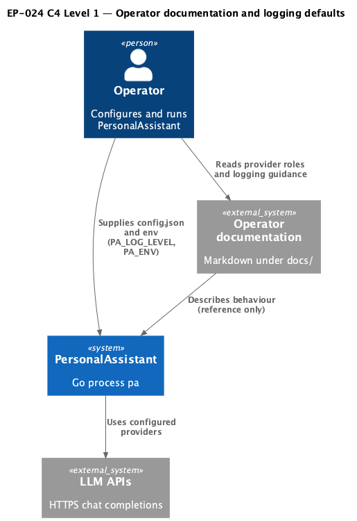
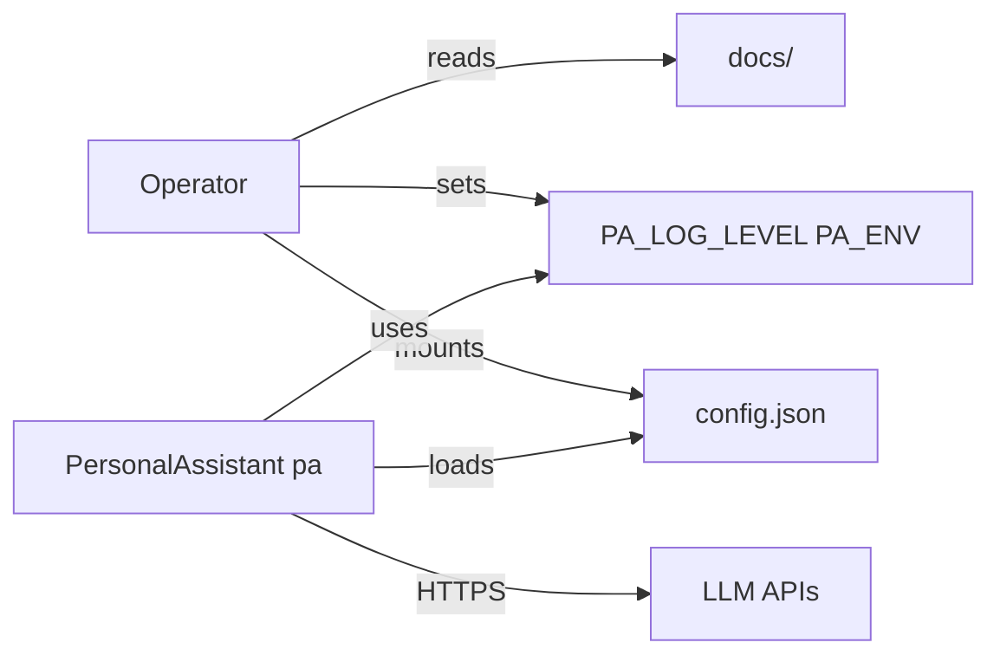

# EP-024 — Operator documentation for provider roles and safe logging defaults — Requirements (EARS / INCOSE)

This document defines requirements for EP-024: operator-facing documentation that explains how the ordered `llm_providers` pool maps to runtime roles (main conversation with optional escalation and transport fallback, summarization, and the optional intent classifier), plus production-safe defaults and startup guidance for diagnostic log levels that expose full LLM payloads.

> **10 requirements** · 7 FR · 3 NFR · 4 theme groups

**Contents**

- [Introduction](#introduction)
- [Glossary](#glossary)
- [C4 C1 — System Context](#c4-c1--system-context)
- [Flow](#flow)
- [EARS patterns used](#ears-patterns-used)
- [Requirement index](#requirement-index)
- [Requirements](#requirements)

---

## Introduction

EP-024 closes operator-visible gaps identified in [ep-scope.md](ep-scope.md): the relationship between the configured LLM provider list and the roles served at runtime is not spelled out in one place, and production-oriented container defaults should make `info` logging explicit while keeping `debug` (full LLM request/response in application logs) clearly diagnostic.

**Scope in brief**

- Operator markdown describing pool indices, baseline selection, escalation, summarization adapter behaviour, and the separate intent classifier model stage.
- Explicit `PA_LOG_LEVEL=info` in the production `Dockerfile` and in Compose `environment` examples.
- Startup warning when the effective application log level is `debug` and `PA_ENV` is not `development`, plus documentation of `PA_ENV`.

---

## Glossary

| Term | Definition |
|------|------------|
| **PersonalAssistant System** | The `pa` Go process built from `cmd/pa`. |
| **Provider pool** | The ordered `llm_providers` array in `config.json`; index `0` is the first entry. |
| **Baseline index** | `tools.llm_escalation.baseline_index` when escalation is enabled; otherwise the active pool index for a new turn is `0`. |
| **Transport fallback** | Advancing to the next pool index on certain retryable completion errors (see router policy). |
| **Summarization adapter** | The `llm.Provider` used by memory summarization jobs, constructed with `SummarizeRouterConfig` from the same pool. |
| **Intent classifier model stage** | Optional `intent_classifier.model_stage` configuration; when enabled, builds a dedicated LLM client from that block, not from `llm_providers` indices. |
| **Effective application log level** | The `slog` level derived from `PA_LOG_LEVEL` at process start (`info` when unset or invalid). |
| **Production-oriented Docker artefact files** | The repository `Dockerfile` at the repository root and `docker-compose.yml` (including files included from it via Compose `include:`). |
| **Operator documentation tree** | Markdown files under `docs/` in the product repository. |

---

## C4 C1 — System Context

**Source:** [c4-context.puml](diagrams/c4-context.puml) (C4-PlantUML). To regenerate PNG: `plantuml -tpng diagrams/c4-context.puml` from this directory.

### Flow

---

## EARS patterns used

- **Ubiquitous:** THE \<system\> SHALL \<response\>
- **Event-driven:** WHEN \<trigger\>, THE \<system\> SHALL \<response\>
- **State-driven:** WHILE \<condition\>, THE \<system\> SHALL \<response\>

In the following, *System* means **PersonalAssistant System** unless a different subject is stated.

---

## Requirement index

| Id | Type | Section | Summary |
|----|------|---------|---------|
| REQ-24.001 | FR | Operator documentation | Document ordered provider pool and index semantics |
| REQ-24.002 | FR | Operator documentation | Document main conversation baseline and escalation |
| REQ-24.003 | FR | Operator documentation | Document summarization adapter pool usage |
| REQ-24.004 | FR | Operator documentation | Document intent classifier model stage separation |
| REQ-24.005 | FR | Operator documentation | Document minimal configuration examples |
| REQ-24.006 | NFR | Docker defaults | Dockerfile sets explicit PA_LOG_LEVEL=info |
| REQ-24.007 | NFR | Docker defaults | Compose examples set PA_LOG_LEVEL=info |
| REQ-24.008 | FR | Startup policy | Warn on debug logging without development acknowledgement |
| REQ-24.009 | FR | Operator documentation | Document PA_ENV=development for diagnostics |
| REQ-24.010 | NFR | Verification | Quality gate passes on the change set |

---

## Requirements

### Operator documentation

*REQ-24.001, REQ-24.002, REQ-24.003, REQ-24.004, REQ-24.005, REQ-24.009*

### REQ-24.001 — Document ordered provider pool and index semantics
THE Operator documentation tree SHALL describe the Provider Pool as the ordered `llm_providers` list and SHALL state that indices are zero-based and stable for the lifetime of a configuration snapshot.

### REQ-24.002 — Document main conversation baseline and escalation
THE Operator documentation tree SHALL describe how the main conversation path selects the starting Provider Pool index for each new user turn, including the use of Baseline Index when `tools.llm_escalation.enabled` is true, and the fact that transport fallback may advance to higher indices on qualifying errors.

### REQ-24.003 — Document summarization adapter pool usage
THE Operator documentation tree SHALL describe that the Summarization Adapter is built from the same Provider Pool entries and labels, and that its router configuration follows `SummarizeRouterConfig` (baseline index when escalation is enabled, otherwise index zero).

### REQ-24.004 — Document intent classifier model stage separation
THE Operator documentation tree SHALL state that the Intent Classifier Model Stage, when enabled, uses the `intent_classifier.model_stage` fields to construct a dedicated LLM client, and SHALL state that this path does not select a model by index into `llm_providers`.

### REQ-24.005 — Document minimal configuration examples
THE Operator documentation tree SHALL include at least three concise configuration sketches: a single-provider pool, a multi-provider pool with escalation enabled, and a setup reference that mentions optional `intent_classifier` with model stage enabled (fields by name, without prescribing vendor values).

### REQ-24.009 — Document PA_ENV=development for diagnostics
THE Operator documentation tree SHALL document `PA_ENV=development` (case-insensitive) as the operator-set acknowledgement that intentionally enables diagnostic application logging sessions on non-production hosts.

---

### Docker defaults

*REQ-24.006, REQ-24.007*

### REQ-24.006 — Dockerfile sets explicit PA_LOG_LEVEL=info
THE Production-oriented Docker artefact files SHALL include `ENV PA_LOG_LEVEL=info` in the runtime stage of the root `Dockerfile` for the `pa` image.

### REQ-24.007 — Compose examples set PA_LOG_LEVEL=info
THE `docker-compose.yml` service definition for `pa` SHALL declare `PA_LOG_LEVEL` in the `environment` list so that the container uses `info` when the operator does not override it (for example `PA_LOG_LEVEL=${PA_LOG_LEVEL:-info}`), alongside the existing path-related variables.

---

### Startup policy

*REQ-24.008*

### REQ-24.008 — Warn on debug logging without development acknowledgement
WHEN the process starts AND the Effective application log level is `debug` AND (`PA_ENV` is unset OR `PA_ENV` is set to a value that differs from `development` under ASCII case-folding), THE PersonalAssistant System SHALL emit exactly one `WARN` level log record during that startup that states full LLM request and response text may appear in application logs and that the stream is sensitive.

---

### Verification

*REQ-24.010*

### REQ-24.010 — Quality gate passes on the change set
THE PersonalAssistant System change set for EP-024 SHALL pass the repository quality gate command `make check`.

---

## NFR section

Security and observability for this epic are documentation- and defaulting-focused: production images and examples must not steer operators toward `debug` application logging ([REQ-24.006](ep-requirements.md#docker-defaults), [REQ-24.007](ep-requirements.md#docker-defaults)); diagnostic use is explicit via [REQ-24.008](ep-requirements.md#startup-policy) and [REQ-24.009](ep-requirements.md#operator-documentation).

Deployability: Compose remains compatible with optional `.env` overrides; explicit `info` in the committed compose service preserves a safe baseline when `.env` is absent.
