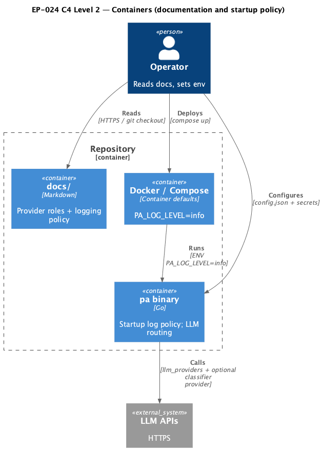

# EP-024 — System design

**Contents**

- [Overview](#overview)
- [Architecture](#architecture)
- [Module boundaries](#module-boundaries)
- [Components and interfaces](#components-and-interfaces)
- [Data models](#data-models)
- [Error handling](#error-handling)
- [Testing strategy](#testing-strategy)
- [Risks and trade-offs](#risks-and-trade-offs)
- [Requirement traceability](#requirement-traceability)

---

## Overview

Operator intent and glossary for this epic are in [ep-scope.md](ep-scope.md). EP-024 delivers operator-facing documentation under the repository `docs/` tree and small product changes in `cmd/pa` plus container defaults so operators understand how [REQ-24.001](ep-requirements.md#operator-documentation)–[REQ-24.005](ep-requirements.md#operator-documentation) map to runtime wiring (`internal/llmrouter`, `cmd/pa` summarization adapter, optional `internal/intent`), and so production images default to `info` logging ([REQ-24.006](ep-requirements.md#docker-defaults), [REQ-24.007](ep-requirements.md#docker-defaults)) with an explicit startup warning for sensitive diagnostic logging ([REQ-24.008](ep-requirements.md#startup-policy), [REQ-24.009](ep-requirements.md#operator-documentation)). [REQ-24.010](ep-requirements.md#verification) is satisfied by automated tests plus the repository `make check` gate and `./bin/validate EP-024` referenced from the implementation plan.

---

## Architecture

The epic touches three bounded areas: the **documentation tree** (new consolidated page `docs/llm-provider-roles-and-logging.md` linked from `docs/configuration.md`), **container defaults** (root `Dockerfile`, `docker-compose.yml`), and **startup policy** in `cmd/pa` immediately after the root `slog` logger is constructed from `PA_LOG_LEVEL` ([AC-24.009](ep-acceptance-criteria.md#ac-24-009)).

**Compose `include:` note:** `docker-compose.arm64.yml` and `docker-compose.amd64.yml` only set `build.platforms` for the `pa` service and include the base file. They do **not** redefine `environment`. The base `docker-compose.yml` sets `PA_LOG_LEVEL=${PA_LOG_LEVEL:-info}` so the default is `info` while an operator-supplied value from `.env` can still raise the level for trusted diagnostics. Validating the base file satisfies [REQ-24.007](ep-requirements.md#docker-defaults) for the overlay workflow; no extra `PA_LOG_LEVEL` keys appear in overlay files.

**Source:** [c4-container.puml](diagrams/c4-container.puml) (C4-PlantUML). To regenerate PNG: `plantuml -tpng diagrams/c4-container.puml` from this directory.

---

## Module boundaries

| Layer | Responsibility | Allowed dependencies |
|-------|----------------|------------------------|
| `docs/` | Operator prose, examples, links to JSON keys | None on Go packages; links into `config.examples/` only as paths. |
| `Dockerfile` / `docker-compose.yml` | Pin safe env defaults for images and compose | No Go imports. |
| `cmd/pa` | Startup sequencing, log level from env, one-shot sensitive logging advisory | `log/slog`, `os`, `strings`; must stay side-effect free beyond logging. |
| `internal/llmrouter` / `internal/intent` | Runtime behaviour (unchanged in this epic) | Referenced from documentation only. |

Verification: documentation must not contradict code paths for `buildAppLLM`, `SummarizeRouterConfig`, `buildIntentClassifier`, and `llmrouter.New` / `NewState` as implemented on the branch.

---

## Components and interfaces

| Component | Responsibility | Key interface / contract | REQ trace |
|-----------|----------------|---------------------------|-----------|
| **docs/llm-provider-roles-and-logging.md** | Single entry point for pool roles, examples, `PA_ENV` guidance | Markdown sections anchored for human navigation | [REQ-24.001](ep-requirements.md#operator-documentation)–[REQ-24.005](ep-requirements.md#operator-documentation), [REQ-24.009](ep-requirements.md#operator-documentation) |
| **`docs/configuration.md`** (product path) | Link into the new page from environment and `llm_providers` overview | Relative markdown link in repo | [REQ-24.001](ep-requirements.md#operator-documentation) |
| **Dockerfile runtime stage** | `ENV PA_LOG_LEVEL=info` | OCI env directive | [REQ-24.006](ep-requirements.md#docker-defaults) |
| **docker-compose `pa` service** | `PA_LOG_LEVEL=info` in `environment` | Compose schema | [REQ-24.007](ep-requirements.md#docker-defaults) |
| **`warnSensitiveLLMLogging` (cmd/pa)** | Emit single WARN on `debug` without `PA_ENV=development` | Callable immediately after logger construction | [REQ-24.008](ep-requirements.md#startup-policy) |
| **Repository checks** | `make check`, `./bin/validate EP-024` | Makefile + validate CLI | [REQ-24.010](ep-requirements.md#verification) |

---

## Data models

No new persisted entities. Environment variables:

| Variable | Meaning |
|----------|---------|
| `PA_LOG_LEVEL` | `slog` level text; `debug` enables verbose LLM payload logging in conversation paths. |
| `PA_ENV` | When set to `development` (case-insensitive), suppresses the sensitive-logging startup warning for `debug`. |

Configuration JSON fields referenced in prose only: `llm_providers`, `tools.llm_escalation`, `intent_classifier` (see [ep-requirements.md](ep-requirements.md)).

---

## Error handling

Invalid `PA_LOG_LEVEL` values continue to fall back to `info` per existing `logLevelFromEnv` behaviour; the new warning runs **after** the effective level is chosen, using the same `slog.Level` value passed to the handler options ([REQ-24.008](ep-requirements.md#startup-policy)).

---

## Testing strategy

- **Unit / small integration tests** in `cmd/pa` assert: (1) Dockerfile and compose files contain `PA_LOG_LEVEL=info` and do not assign `debug` ([AC-24.007](ep-acceptance-criteria.md#ac-24-007), [AC-24.008](ep-acceptance-criteria.md#ac-24-008)); (2) the provider-roles markdown file contains required phrases for [AC-24.001](ep-acceptance-criteria.md#ac-24-001)–[AC-24.006](ep-acceptance-criteria.md#ac-24-006); (3) the sensitive-logging helper emits exactly one WARN when the effective level is `debug` and `PA_ENV` is unset **or** set to a value other than `development` under ASCII case-folding (including values such as `staging` and `Production`), and emits **no** such WARN when `PA_ENV` is `development` or `DEVELOPMENT`, or when the level is `info` ([AC-24.009](ep-acceptance-criteria.md#ac-24-009), [REQ-24.008](ep-requirements.md#startup-policy)).
- **Supporting** evidence for [AC-24.010](ep-acceptance-criteria.md#ac-24-010) is recorded via the same test files carrying `Supporting AC-24.010` bound to tests that are part of the default `go test` suite executed inside `make check`, matching the EP-023 pattern for the quality-gate AC.
- Run `make check` and `./bin/validate EP-024` before merge ([REQ-24.010](ep-requirements.md#verification)).

---

## Risks and trade-offs

| Risk | Mitigation |
|------|------------|
| Documentation drift when router rules change | Link requirements to code filenames; keep examples minimal and tied to JSON key names. |
| Operators override compose `environment` with `.env` | Document that explicit compose defaults are a baseline; `.env` remains optional. |
| False sense of safety: `info` does not remove dedicated LLM JSONL audit logs | Documentation states the warning applies to **application** `slog` output at `debug`, distinct from `paths.llm_log_dir` JSONL behaviour. |

---

## Requirement traceability

| REQ | Design sections |
|-----|-------------------|
| [REQ-24.001](ep-requirements.md#operator-documentation) | Overview; Components — docs page; Testing — phrase checks |
| [REQ-24.002](ep-requirements.md#operator-documentation) | docs page main conversation section; Module boundaries |
| [REQ-24.003](ep-requirements.md#operator-documentation) | docs summarization section |
| [REQ-24.004](ep-requirements.md#operator-documentation) | docs intent classifier section |
| [REQ-24.005](ep-requirements.md#operator-documentation) | docs examples sketches |
| [REQ-24.006](ep-requirements.md#docker-defaults) | Components — Dockerfile; Tests |
| [REQ-24.007](ep-requirements.md#docker-defaults) | Components — compose; Tests |
| [REQ-24.008](ep-requirements.md#startup-policy) | Components — warn helper; Data models; Error handling |
| [REQ-24.009](ep-requirements.md#operator-documentation) | docs `PA_ENV` guidance |
| [REQ-24.010](ep-requirements.md#verification) | Overview; Testing strategy; Components (`make check`, `./bin/validate EP-024`) |
