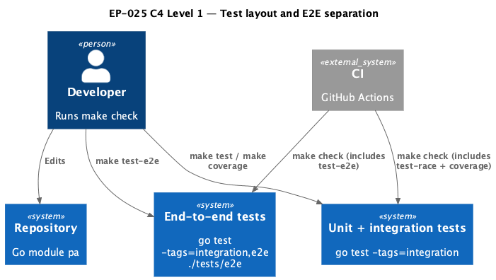
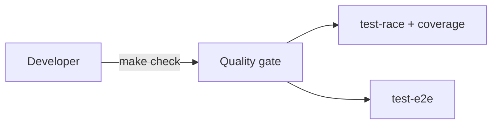

# EP-025 — Test layout cleanup: E2E separation — Requirements (EARS / INCOSE)

This document defines requirements for EP-025: relocate long-running job end-to-end tests out of `cmd/pa`, gate them with the `e2e` build tag, expose dedicated `make` targets for e2e execution and coverage, keep default coverage on integration-tagged packages only, and extract the scheduled-job delivery runner into `internal/jobs` for reuse.

> **8 requirements** · 6 FR · 2 NFR · 3 theme groups

**Contents**

- [Introduction](#introduction)
- [Glossary](#glossary)
- [C4 C1 — System Context](#c4-c1--system-context)
- [Flow](#flow)
- [EARS patterns used](#ears-patterns-used)
- [Requirement index](#requirement-index)
- [Requirements](#requirements)

---

## Introduction

EP-025 improves the test pyramid alignment described in [ep-scope.md](ep-scope.md): end-to-end job scenarios that previously lived in `package main` move to `tests/e2e`, compile only with `-tags=e2e`, and ship with Makefile / CI affordances so operators and developers can distinguish unit+integration runs from e2e runs.

---

## Glossary

| Term | Definition |
|------|------------|
| **PersonalAssistant build** | Any `go test` or `go vet` invocation against this module. |
| **Default unit+integration run** | `go test -tags=integration ./...` without the `e2e` build tag. |
| **E2E build tag** | The Go build tag `e2e` selecting files under `tests/e2e` that exercise multi-step job flows. |
| **DeliveryRunner** | The `internal/jobs` type implementing the package `Runner` interface for scheduled-job delivery. |

---

## C4 C1 — System Context

**Source:** [c4-context.puml](diagrams/c4-context.puml). Regenerate: `plantuml -tpng diagrams/c4-context.puml` from this directory.

### Flow

---

## EARS patterns used

- **Ubiquitous:** THE \<system\> SHALL \<response\>
- **Event-driven:** WHEN \<trigger\>, THE \<system\> SHALL \<response\>

---

## Requirement index

| Id | Type | Section | Summary |
|----|------|---------|---------|
| REQ-25.001 | FR | Test layout | Relocate job E2E tests under tests/e2e with e2e tag |
| REQ-25.002 | FR | Test layout | Keep non-e2e placeholder so default builds include the package |
| REQ-25.003 | FR | Make targets | Declare test-e2e target |
| REQ-25.004 | FR | Make targets | Declare coverage-e2e target |
| REQ-25.005 | NFR | CI | CI summary distinguishes coverage layers |
| REQ-25.006 | FR | Coverage | Default coverage recipe omits e2e tag |
| REQ-25.007 | FR | Refactor | DeliveryRunner lives in internal/jobs |
| REQ-25.008 | NFR | Verification | Quality gate passes |

---

## Requirements

### Test layout

*REQ-25.001, REQ-25.002*

**REQ-25.001** (Ubiquitous)  
THE PersonalAssistant build SHALL store previously `cmd/pa` end-to-end job lifecycle tests under `tests/e2e` behind the E2E build tag so Default unit+integration run does not compile those files.

**REQ-25.002** (Ubiquitous)  
THE `tests/e2e` package SHALL include at least one Go test file built when the E2E build tag is absent so `go list ./tests/e2e` remains a valid package for Default unit+integration run.

---

### Make targets

*REQ-25.003, REQ-25.004*

**REQ-25.003** (Ubiquitous)  
THE repository Makefile SHALL define a `test-e2e` target that runs `go test` with both `integration` and `e2e` tags against `./tests/e2e/...`.

**REQ-25.004** (Ubiquitous)  
THE repository Makefile SHALL define a `coverage-e2e` target that writes a coverage profile distinct from the default `coverage.out` filename.

---

### CI

*REQ-25.005*

**REQ-25.005** (Ubiquitous)  
THE GitHub Actions workflow that runs `make check` SHALL document in its step summary that end-to-end coverage is tracked separately from the default `coverage.out` profile.

---

### Coverage

*REQ-25.006*

**REQ-25.006** (Ubiquitous)  
THE default `coverage` Makefile target SHALL invoke `go test` with the `integration` tag only (without `e2e`) for the repository-wide coverage profile.

---

### Refactor

*REQ-25.007*

**REQ-25.007** (Ubiquitous)  
THE scheduled job delivery runner previously defined in `cmd/pa` SHALL be implemented as `DeliveryRunner` inside `internal/jobs` and wired from `cmd/pa` using `NewDeliveryRunner`.

---

### Verification

*REQ-25.008*

**REQ-25.008** (Ubiquitous)  
THE change set SHALL pass `make check` from the repository root.

---

## NFR section

Reliability: separating e2e reduces accidental coupling between binary-only tests and default developer loops ([REQ-25.001](ep-requirements.md#test-layout)). CI clarity supports operators triaging failures ([REQ-25.005](ep-requirements.md#ci)).
