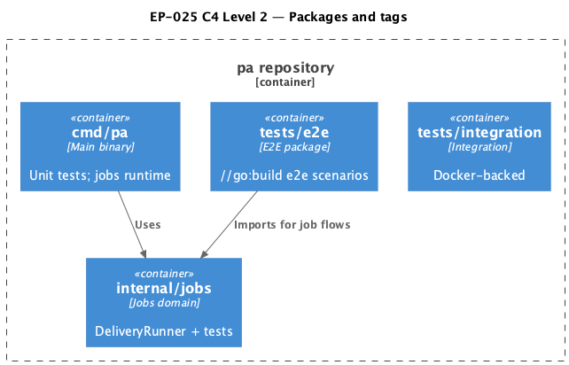

# EP-025 — System design

**Contents**

- [Overview](#overview)
- [Architecture](#architecture)
- [Module boundaries](#module-boundaries)
- [Components and interfaces](#components-and-interfaces)
- [Data models](#data-models)
- [Error handling](#error-handling)
- [Testing strategy](#testing-strategy)
- [Risks and trade-offs](#risks-and-trade-offs)
- [Requirement traceability](#requirement-traceability)

---

## Overview

Epic intent and glossary are in [ep-scope.md](ep-scope.md). EP-025 moves long-running scheduled-job end-to-end tests from `package main` under `cmd/pa` into `tests/e2e`, gates those files with the `e2e` build tag, adds Makefile targets so default runs stay on integration-tagged packages only, and updates CI messaging so operators see unit vs e2e coverage layers. The scheduled-job delivery path is extracted as `DeliveryRunner` in `internal/jobs` ([REQ-25.007](ep-requirements.md#refactor)) and wired from `cmd/pa` so e2e and unit tests can import the same behaviour without compiling the full binary in the e2e package ([REQ-25.001](ep-requirements.md#test-layout)).

---

## Architecture

**Layers:** `cmd/pa` (runtime wiring only for jobs), `internal/jobs` (`DeliveryRunner`, `Runner`, job store), `tests/e2e` (e2e-tagged job flows + policy tests for Makefile/CI). Default `go test -tags=integration ./...` compiles `tests/e2e` via a `!e2e` placeholder file ([REQ-25.002](ep-requirements.md#test-layout)). Full job scenarios compile with `-tags=integration,e2e` ([REQ-25.001](ep-requirements.md#test-layout), [AC-25.001](ep-acceptance-criteria.md#ac-25-001)).

**Source:** [c4-container.puml](diagrams/c4-container.puml). Regenerate: `plantuml -tpng diagrams/c4-container.puml` from this directory.

---

## Module boundaries

| Layer | Responsibility | Allowed dependencies |
|-------|----------------|----------------------|
| `cmd/pa` | Wire `jobs.NewDeliveryRunner` into async jobs runtime | `internal/jobs`, `internal/core`, adapters |
| `internal/jobs` | Job persistence, `Runner` implementations including `DeliveryRunner` | `internal/core`, stdlib |
| `tests/e2e` | E2E job flows (e2e tag); Makefile/CI policy checks (`!e2e`) | `internal/jobs`, test doubles implementing `core.MessageHandler` |

Verification: e2e-tagged files must not import `cmd/pa` as `main`; they exercise `DeliveryRunner` in isolation per [REQ-25.001](ep-requirements.md#test-layout).

---

## Components and interfaces

| Component | Responsibility | Key interface / contract | REQ trace |
|-----------|----------------|---------------------------|-----------|
| **`DeliveryRunner`** (`internal/jobs`) | Run `core.MessageHandler` for a `Job`, notify `JobChatSender` on success/failure | Implements the package `Runner` interface; `NewDeliveryRunner(handler, sender, logger)` | [REQ-25.007](ep-requirements.md#refactor) |
| **`JobChatSender`** | Send result text to chat | `SendMessageToChat(ctx, chatID, text) error` | [REQ-25.007](ep-requirements.md#refactor) |
| **`tests/e2e/jobs_e2e_test.go`** | Former EP019/EP020 job flows under `//go:build e2e` | `go test -tags=integration,e2e ./tests/e2e/...` | [REQ-25.001](ep-requirements.md#test-layout) |
| **`tests/e2e/placeholder_test.go`** | Non-e2e build keeps package valid | `//go:build !e2e` | [REQ-25.002](ep-requirements.md#test-layout) |
| **`tests/e2e/ep025_policy_test.go`** | Assert Makefile and CI strings for targets and coverage split | `//go:build !e2e` | [REQ-25.003](ep-requirements.md#make-targets)–[REQ-25.006](ep-requirements.md#coverage) |
| **Makefile** | `test-e2e`, `coverage-e2e`, `check` includes e2e; default `coverage` without `e2e` | POSIX make recipes | [REQ-25.003](ep-requirements.md#make-targets)–[REQ-25.004](ep-requirements.md#make-targets), [REQ-25.006](ep-requirements.md#coverage), [REQ-25.008](ep-requirements.md#verification) |
| **`.github/workflows/ci.yml`** | Summary text distinguishes default coverage vs e2e | Workflow YAML | [REQ-25.005](ep-requirements.md#ci) |
| **Quality gate** | `make check`, `./bin/validate EP-025` | Repo scripts | [REQ-25.008](ep-requirements.md#verification) |

---

## Data models

No new persisted entities. Reuses existing `jobs.Job` (`ID`, `DeliveryChatID`, `Instruction`, etc.) consumed by `DeliveryRunner.Run` ([REQ-25.007](ep-requirements.md#refactor)).

---

## Error handling

`DeliveryRunner` returns an error when the handler fails; it still attempts chat notification with a classified reason (`timeout` vs `execution_error`) and logs send failures ([REQ-25.007](ep-requirements.md#refactor)). Nil handler fails fast with a wrapped error at `Run` entry.

---

## Testing strategy

- **Unit:** `internal/jobs` tests for `DeliveryRunner` success and failure paths ([AC-25.007](ep-acceptance-criteria.md#ac-25-007)); comments `Covers AC-25.007` / `Supporting AC-25.008`.
- **E2E (tagged):** `jobs_e2e_test.go` under `e2e` tag; run via `make test-e2e` or `go test -tags=integration,e2e ./tests/e2e/...` ([AC-25.001](ep-acceptance-criteria.md#ac-25-001)).
- **Policy:** `ep025_policy_test.go` validates Makefile and CI file contents ([AC-25.003](ep-acceptance-criteria.md#ac-25-003)–[AC-25.006](ep-acceptance-criteria.md#ac-25-006)).
- **Gate:** `make check` ([AC-25.008](ep-acceptance-criteria.md#ac-25-008)); `./bin/validate EP-025` for AC↔test binding ([REQ-25.008](ep-requirements.md#verification)).

`vet`, `vuln`, and `lint` use `-tags=integration,e2e` so e2e-tagged sources are type-checked in CI ([REQ-25.008](ep-requirements.md#verification)).

---

## Risks and trade-offs

| Risk | Mitigation |
|------|------------|
| E2E tests drift from production wiring in `cmd/pa` | Keep `DeliveryRunner` behaviour identical to the former in-binary runner; document that e2e validates runner contract, not full `main` wiring. |
| `make check` duration increases | Acceptable trade for catching e2e regressions in CI; `test-e2e` is bounded to `./tests/e2e/...`. |
| Build-tag confusion | Clear `//go:build e2e` / `!e2e` file pairing and policy tests for Makefile lines. |

---

## Requirement traceability

| REQ | Design sections |
|-----|-----------------|
| [REQ-25.001](ep-requirements.md#test-layout) | Overview; Architecture; Components (`jobs_e2e_test.go`); Module boundaries |
| [REQ-25.002](ep-requirements.md#test-layout) | Architecture; Components (`placeholder_test.go`); Testing strategy |
| [REQ-25.003](ep-requirements.md#make-targets) | Components (Makefile); Testing strategy |
| [REQ-25.004](ep-requirements.md#make-targets) | Components (Makefile `coverage-e2e`); Testing strategy |
| [REQ-25.005](ep-requirements.md#ci) | Components (ci.yml); Testing strategy |
| [REQ-25.006](ep-requirements.md#coverage) | Components (Makefile `coverage`); Testing strategy |
| [REQ-25.007](ep-requirements.md#refactor) | Overview; Components (`DeliveryRunner`); Module boundaries; Error handling; Testing strategy |
| [REQ-25.008](ep-requirements.md#verification) | Components (Makefile, quality gate); Testing strategy |
